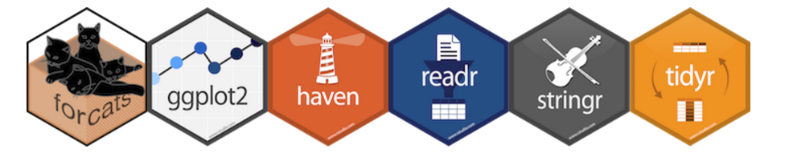

```{r options, include=FALSE, purl=FALSE}
options(width = 108)
```


Most of the packages used in this course are part of the so-called "tidyverse". __Packages in the tidyverse are packages that share a common philosophy of data management and that are designed to work well together.__ (source: www.tidyverse.org) 





Please check out the manifesto for further details on the philosophy underlining tidyiverse:  [the tidy tools manifesto](https://cran.r-project.org/web/packages/tidyverse/vignettes/manifesto.html). 

The whole tidyverse can be installed with a single (but long runnning!) line command:

```{r tidyverse, message=FALSE, eval = FALSE}
install.packages("tidyverse")
```

In order to start working with the tidyverse, you need to load it:

```{r}
require(tidyverse)
```

The above command loads the core packages (as listed) that are a set of packages used in basically any analysis. 

Among the core packages installed, in this course you will use the following:

* dplyr, for data manipulation
* tidyr, for tidying data
* readr, for importing flat files
* tibble, for tibbles creation and coercion


`dplyr` is a modern `R` package which provides functions to manage data in a more intuitive and efficient way than base `R`.  
The starting point for more information about `dplyr` is the official website providing documentation: [dplyr: A Grammar of Data Manipulation](https://cran.r-project.org/web/packages/dplyr/index.html).  

`tidyr` is a modern `R` package which provides a standard way to organise data values within a dataset.  
The starting point for more information about `tidyr` is the official website providing documentation: [tidyr: Easily Tidy Data with 'spread()' and 'gather()' Functions](https://cran.r-project.org/web/packages/tidyr/index.html).  

`readr` allows you to import flat data files into R and it is well harmonized with the rest of the tidyverse.  
The starting point for more information about `readr` is the official website providing documentation: [readr: Read tabular data](https://cran.r-project.org/web/packages/readr/index.html)

`tibble` provides a `tbl_df` class that offers better checking and printing capabilities than traditional data frames.  
The starting point for more information about `tibble` is the official website providing documentation: [tibble: Simple data frames](https://cran.r-project.org/web/packages/tibble/index.html)

In addition to the core packages, `tidyverse` installs other tidyverse packages some of which will be used in this course and some will not. For instance, there are packages useful for working with non-numeric variables (such as `stringr` and `forcats`), or for importing data from external sources (such as `haven`). For more details about packages in the tidyverse please check out the following link https://github.com/tidyverse/tidyverse. 

In order to list all packages in tidyverse you can use the following command:


```{r}
tidyverse_packages()
```


If you want to load packages that are not in the tidyverse core, you have to load them explicitely.

Tidyverse as well as the packages that compose it are fairly new, thus we should expect the composition of tidyverse to change as well as the releases of the packages that compose it. You can check that all tidyverse packages are up-to-date with the following line command:

```{r tidyverse_update, eval = FALSE}
tidyverse_update()
```
