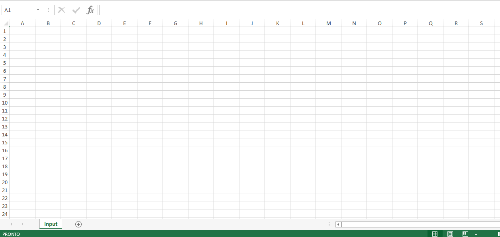
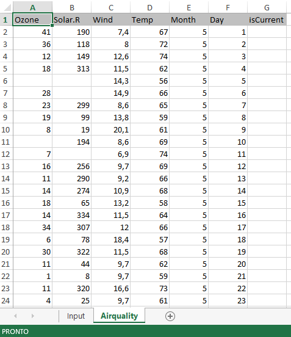
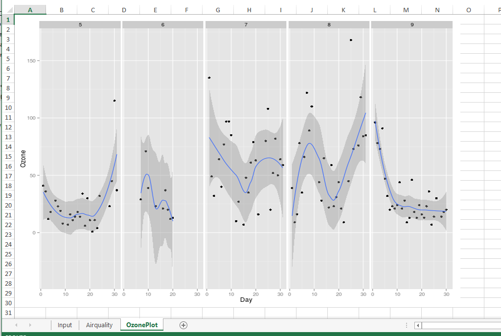

```{r, options, echo=FALSE, results='hide', message=FALSE, warning=FALSE, purl=FALSE}
options(width = 108)
require(knitr)
opts_knit$set(root.dir = "./../data")
```

```{r g, echo=FALSE, purl=FALSE}
include_graphics("images/import-excel-2.png", dpi=150)
```


## XLConnect

The R package `XLConnect` permits to create a formatted spreadsheet usable as a dynamic report of the R analisys and it allows one to read existing xlsx files and to modify them from R.  
Let us see how `XLConnect` works.

```{r require_XLConnect, message=FALSE}
require(XLConnect)
```


### Create a new file xlsx 
To create a new empty file xlsx with one empty sheet named *Input* the syntax is:

```{r outDir_set_up}
# Set up output directory and output file name  
outDir <- "./xlsx" 
```
```{r}
# File path string
file_xls <- paste(outDir,"newFile.xlsx",sep='/')
# Delete file_xls if it already exists 
unlink(file_xls, recursive = FALSE, force = FALSE)
```

```{r new_xlsx, comment=FALSE}
exc <- loadWorkbook(filename = file_xls, create = TRUE)
createSheet(object = exc, name = 'Input')
saveWorkbook(exc)
```

`loadWorkbook()` function creates an R workbook object in the path and with the name specified by  `filename` argument. It creates it ex-novo, as `create` argument is set as `TRUE`. An R workbook object represents a Microsoft Excel workbook. 

The function `createSheet()` creates the worksheet *Input* in R object and `saveWorkbook()` function fisically save the R object in a file xlsx. Remember to call this function every time you modified the R object in order to save the changes also in xlsx file. 


```{r g1, echo=FALSE, fig.width=6, purl=FALSE}

```

### Populate a sheet

To add something to an empty sheet use `writeWorkbook` function:

```{r add_input, comment=FALSE}
df <- data.frame('inputType'=c('Day','Month'),'inputValue'=c(1,3))
writeWorksheet(object = exc, data = df, sheet = "Input", startRow = 1, startCol = 2)
saveWorkbook(exc)
```

The `df` data frame with 2 rows and 2 column is created and `writeWorkbook()` function write the content of this data frame in the sheet *Input* starting from the cell (1,2).

```{r g2, echo=FALSE, fig.width=3, purl=FALSE}
include_graphics("images/excel-inputSheet.png")
```

### Create multiple sheets

To add other sheets to an R object workbook, use `createSheet()` function:

```{r add_airquality, comment=FALSE}
# Add a sheet named Airquality to exc object
createSheet(exc,'Airquality')
saveWorkbook(exc)
```

Suppose we want to add a dataset to the sheet just created.  
We want to add `airquality` dataset available in `datasets` package, which reports daily air quality measurements in New York, from May to September 1973.  

```{r add_airquality_2}
# Add an empty column to airquality dataset before add it to 'Airquality' sheet
airquality$isCurrent<-NA
# Add airquality dataset to the sheet Airquality
createName(exc, name='Airquality',formula='Airquality!$A$1')
writeNamedRegion(exc, airquality, name = 'Airquality', header = TRUE)
saveWorkbook(exc)
```

In particular, `createName()` function creates a named region 'Airquality' starting from the cell $A$1 of sheet *Airquality*. In Excel, a named region/range represents cells, a range of cells, a constant value, or a formula with a defined name which make easier to work. It is useful for navigation, to quickly select the named range, for reusing it when referencing it in such things as charts and formulas, ...   
`writeNamedRegion()` function writes `airquality` data frame with headers `(header=TRUE)` in the named region *Airquality*. 

```{r g3, echo=FALSE, fig.width=3, purl=FALSE}

```

### Add a formula
Use `setCellFormula()` function to set cell formulas for specific cells in a workbook.  
The empty column *isCurrent* in *Airquality* sheet could be populate with a formula that lies *Input* sheet with *Airquality* sheet.

```{r add_formula, comment=FALSE}
# Define the column index of the cell to edit
col_index <- which(names(airquality) == 'isCurrent')
# Define the excel letter for the column 'Day' and 'Month' needed by the formula 
letter_day <- idx2col(which(names(airquality) == 'Day'))
letter_month <- idx2col(which(names(airquality) == 'Month'))
```

The function `idx2col()` returns the correspondig excel letter for the index column. With the syntax:

```{r idx2col1 ,results='markup'}
letter_day <- idx2col(which(names(airquality) == 'Day'))
```

the variable `letter_day` contains the excel letter for the column *Day*

```{r idx2col2, echo=FALSE,results='markup'}
cat('letter_day=',letter_day)
```


```{r apply_formula}
# Define the formula to apply to the cell
formula_xls <- paste('IF(AND(',
                    letter_month,
                    2:(nrow(airquality)+1),
                    '=Input!C3,',
                    letter_day,
                    2:(nrow(airquality)+1),
                    '=Input!C2)',
                    ',1,0)',sep='')
setCellFormula(exc, sheet='Airquality', row = 2:(nrow(airquality)+1), col = col_index, formula = formula_xls)
saveWorkbook(exc)
```

The function `setCellFormula()` apply the formula specified by the argument `formula` to the rows specified by the `row` argument of the column specified by the `col` argument of the sheet of the R object specified by the `sheet` argument.


```{r g4, echo=FALSE, fig.width=4, purl=FALSE}
include_graphics("images/excel-addFormula.png")
```


### Read an existing xlsx file

To read an existing excel file, the syntax is:

```{r excel_file_name}
# Excel file (with path) to be loaded into R
file_xls <- "./xlsx/newFile.xlsx"
```

```{r load_xlsx}
exc2 <- loadWorkbook(file_xls)
dt_air <- readWorksheet(exc2, sheet = 'Airquality')
head(dt_air)
```

`loadWorkbook()` function loads a Microsoft Excel workbook, in this case "newFile.xlsx", into R creating a R workbook object, `exc2`.  
`readWorksheet()` function reads data from *Airquality* sheet of `exc2` object (the workbook that has been previously loaded). 

### Modify an existing xlsx file

Suppose we want to create another sheet named *OzonePlot*, with a named region *OzonePlot*:

```{r modify_xlsx} 
createSheet(exc2, name = "OzonePlot")
createName(exc2, name='OzonePlot',formula='OzonePlot!$A$1')
saveWorkbook(exc2)
```

`createSheet()` function adds the new sheet *OzonePlot* to `exc2` object and `createName()` function creates a new named region *OzonePlot* starting from *OzonePlot!$A$1* cell. `saveWorkbook()` function fisically save the change done to R object also in the corresponding xlsx file, in this case "newFile.xlsx".


### Adding a plot (image)

After creating a new sheet it is possible to put in this sheet a picture of a graph created in R with the function `addImage()`:

```{r add_plot, comment=FALSE,warning=FALSE, message=FALSE}
require(ggplot2)
# Generate a graph and save it in png format
fileGraph <- paste(outDir,'graph.png',sep='/')
png(filename = fileGraph, width = 800, height = 600)
ozone_plot <- ggplot(dt_air, aes(x=Day, y=Ozone)) + 
geom_point() + 
geom_smooth()+
facet_wrap(~Month, nrow=1)
print(ozone_plot)
invisible(dev.off())
# Add image file created to 'OzonePlot' named region with its original size 
addImage(exc2, filename =  fileGraph, name = 'OzonePlot', originalSize = TRUE)
saveWorkbook(exc2)
# Remove the graph file created 
file.remove(fileGraph)
```

```{r g5, echo=FALSE, fig.width=6, purl=FALSE}

```

## readxl

Another R package for importing excel files into R is `readxl`.
Let us see how `readxl` works.

```{r require_readxl, message=FALSE}
require(readxl)
```

### Read an existing xlsx file

To read an existing excel file, the syntax is:

```{r excel_file_name_readxl}
# Excel file (with path) to be loaded into R
file_xls <- "./xlsx/newFile.xlsx"
```

```{r load_xlsx_readxl}
ds <-read_excel(path = file_xls, sheet = 'Airquality', col_names = TRUE)
head(ds)
```

`read_excel()` function allows us to read xls and xlsx files, specified in `path` argument. `sheet` argument specifies the sheet to read and `col_names` indicates if the first row has to be used as column names (set as `TRUE`).

