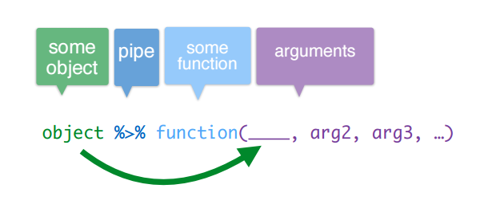

```{r options, include=FALSE, purl=FALSE}
options(width = 108)
```


The `dplyr` package for `R` is very powerful for data management since:

* it simplifies how you can think about common data manipulation tasks;
* it provides simple "verbs", functions that correspond to the most common data manipulation tasks;
* it uses efficient data storage backends, so you spend less time waiting for the computer.

```{r message=FALSE}
require(dplyr)
```

The examples of these chapter will refer to `bank` data set which contains information about a direct marketing campaigns of a Portuguese banking institution based on phone calls. 

```{r bank_tbl_df, message=FALSE}
require(qdata)
data(bank) 
bank
```

In the following chapters, we will explore the innovations introduced by `dplyr` to make our lifes easier when dealing with dataframes manipulation tasks.     
In particular:

* pipe operator (`%>%`) 
* `tbl_df` data frame class
* dplyr verbs for data manipulation 
* dplyr verbs for combining data

In the following two paragraph we will explore pipe operator (`%>%`) and `tbl_df` data frame class

## Pipe operator (`%>%`)

`dplyr` pipe operator (`%>%`) allows us to pipe the output from one function to the input of another function. The idea of piping is to read the functions from left to right. It is particularly useful with nested functions (reading from the inside to the outside) or with multiple operations.



Pipes can work with nearly any functions (`dplyr` and not-`dplyr` functions), let us see an example.

Suppose we want to visualize the first rows of `bank` dataframe, by using `head()` function.   

Usually we write:

```{r pipe1}
head(bank)
```

By using `%>%`, the code becomes:

```{r pipe2}
bank %>% head()
```

Pipe takes the argument on the left (`bank`) and passes it to the function on the right (`head()`). So you don't need to write the first argument of the function. 

Other arguments of the function must be added to the function itself, as usually done. By default `head()` prints the first 6 rows of the dataframe. Suppose we want to print 10 rows, by setting `n` argument to 10:

```{r pipe3}
bank %>% head(n=10)
```


### `tbl_df`: the `dplyr` Data Frame Class

Sometimes data frames have large dimensions. `dplyr` package provide `tbl_df`, which is a wrapper around a data frame that will not accidentally print a lot of data to the screen; indeed tbl objects only print a few rows and all the columns that fit on one screen, describing the rest of it as text.

When the class of data object is not tbl, `tbl_df()` function should be used.  
Let us consider `mtcars`, a dataset included in `datasets` package (automatically loaded at the start of an R session): 

```{r tbl_df, message=FALSE}
# Example of data frame
data("mtcars")
class(mtcars)

# If we do not convert it as a tbl_df, all mtcars rows and columns will be printed when calling mtcars 
dim(mtcars)
mtcars

# dplyr version of the same data frame (tbl_df conversion)
mtcars_tbl <- tbl_df(mtcars)
class(mtcars_tbl)
mtcars_tbl
```

<!--
cambiare mtcars -> rivedere perchè non va
-->