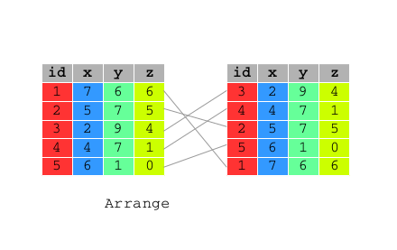

```{r options, include=FALSE, purl=FALSE}
options(width = 108)
```


```{r first, message=FALSE}
require(dplyr)
require(qdata)
```

`dplyr` aims to provide a function for each basic verb of data manipulating.

All these functions are very similar:

* the first argument is a data frame;
* the subsequent arguments describe what to do with it, and you can refer to columns in the data frame directly without using $. Note that the column names must be unquoted;
* the result is a new data frame.

Together these properties make it easy to chain together multiple simple steps to achieve a complex result.

These five functions provide the basis of a language of data manipulation. At the most basic level, you can only alter a tidy data frame in five useful ways: 

1. select variables of interest: `select()`;
2. filter records of interest: `filter()`;
3. reorder the rows: `arrange()`;
4. add new variables that are functions of existing variables: `mutate()`;
5. collapse many values to a summary: `summarise()`. 


In the following examples we will refer to `bank` data set which contains information about a direct marketing campaigns of a Portuguese banking institution based on phone calls. 

```{r bank_tbl_df}
data(bank) 
```

# `select()`

Often you work with large datasets with many columns where only a few are actually of interest to you. 

`select()` allows you to rapidly zoom in on a useful subset of columns.  


 

The first argument is the name of the data frame, and the second and subsequent are the name of column/s of that data frame you want to select:

```{r select}
# Select columns: year, month and day of bank data frame
select(bank, year, month, day)
# Select columns: year, month and day of bank data frame
bank %>% select(year:day)
# Select all columns of bank data frame apart from: year, month and day
bank %>% select(-(year:day))
```


You can rename variables with `select()` by using named arguments:

```{r select_rename}
# Rename id variable as ID
bank %>% select(ID = id)
```


# `filter()`

`filter()` allows you to select a subset of the rows of a data frame.

 

The first argument is the name of the data frame, and the second and subsequent are filtering expressions evaluated in the context of that data frame.

For example, you can select all calls made to students whit balance above 20,000:


```{r filter1}
filter(bank, job == "student", balance > 20000)
```


`filter()` allows you to give it any number of filtering conditions which are joined together with `&` and/or the other operators.  

```{r filter2}
# Select all calls made to student of 18 years 
bank %>% filter(age == 18 & job == "student")
```

```{r filter3}
# Select all calls made to people of 18 or 95 years
bank %>% filter(age == 18 | age == 95)
```

`filter()` can be used also with `%in%` to establish conditions under which filter: 

```{r filter4}
# Select all calls made to people of 18 or 95 years
bank %>% filter(age %in% c(18,95))
```

An other example is:

```{r filter5}
# Select all calls made to people whose job is admin. or technician 
bank %>% filter(job %in% c("admin.","technician"))
# Select all calls made to people whose job is admin. or technician 
bank %>% filter(job == "admin." | job == "technician")
```


# `arrange()`

Function `arrange()` reorders a data frame by one or more variables. If you provide more than one column name, each additional column will be used to break ties in the values of preceding columns:



The first argument is the name of the data frame, and the second and subsequent are the name of columns of that data frame you want to order by.  
You may want to order the `bank` data frame by the balance of the account in ascending order:

```{r arrange1}
arrange(bank, balance)
```

or in descending order by using function `desc()` within `arrange()`: 

```{r arrange2}
bank %>% arrange(desc(balance))
```

You can order a data frame by one or more than one variables.

Ordering data frame bank by `age` first and descending `balance` afterward requires:


```{r arrange3}
bank %>% arrange(age, desc(balance))
```


# `mutate()`

As well as selecting from the set of existing columns, it’s often useful to add new columns that are functions of existing columns. This is the job of `mutate()`:

 


The first argument is the name of the data frame, and the second and subsequent are expressions for creating new columns to add to that data frame or for modifying the existing ones: 


```{r mutate_1}
df <- data.frame(x = 1:3, y = 3:1)

mutate(df, x1 = x+1)

mutate(df, x = x+1)

mutate(df, x = x+1, y = x+1)

mutate(df, x1 = x+1, y1 = x1+1)

mutate(df, y1 = x+1, x1 = x+1)

mutate(df, xx = x)
```


```{r mutate_2}
# generate a variable indicating the total number of times each person has been contacted 
# during this campaign and during the previous ones 
mutate(bank, contacts_n = campaign + previous)
```

`mutate()` allows you to refer to columns that you just created:

```{r mutate_col_just_created}
# generate two variable: one indicating the year of birth and one the year of birth without century 
bank %>% mutate(year_of_birth = year - age, year_of_birth_no_century = year_of_birth - 1900)
```


# `summarise()`

The last verb is `summarise()`, which collapses a data frame to a single row.

The first argument is the name of the data frame, and the second and subsequent are summarising expressions.

```{r summarise}
# Compute the mean of balance variable of bank data frame
bank %>% summarise(mean_balance = mean(balance, na.rm = TRUE))
# Compute the minimum and the maximum value of balance of bank data frame
bank %>% summarise(max_balance = max(balance, na.rm = TRUE), min_balance = min(balance, na.rm = TRUE))
```


