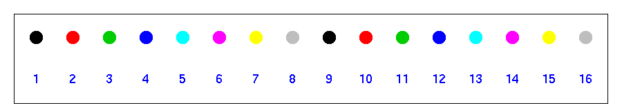
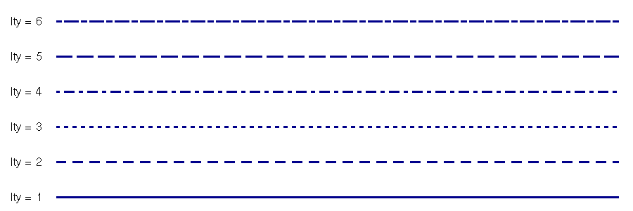

```{r first, options, echo=FALSE, results='hide', message=FALSE, warning=FALSE, purl=FALSE}
require(knitr)
opts_chunk$set(fig.width=4.5, fig.height=4)
```


```{r require, message=FALSE}
require(lattice)
require(mnormt)
require(qdata)
```


## The Graphic Environment

R comes with a wide variety of graphical functions. The R default `graphics` package provide standard R graphics. This chapter is about classical R graphics. 

The graphical functions in the base R system, can be divided into two groups:

 - **High level plot functions**. These functions produce "complete" graphics and will erase existing plots if not specified otherwise.
 - **Low level plot functions**. These functions are used to add graphical objects like lines, points and texts to existing plots.

Generally, high level graphic functions are named according to the corresponding graphics. Simple examples are: `barplot()`, `boxplot()`, `pie()`. A special case is the `plot()` function. This function is a generic function and perform differently according to its arguments or, more precisely, according to the class of the objects passed as arguments.

As a results:

```{r plot, fig.width=8, fig.height=8}
f <- factor(c("M", "M", "M", "M", "M", "F", "F","F"))
y <- rnorm(8)
x <- c(0, 2, 4, 8, 16, 32, 64, 128)
par(mfrow = c(2, 2))
plot(y)
plot(f)
plot(x, y)
plot(f, x)
```


## Scatterplot

The scatterplot (or scattergraph) is the main tool for the study of bivariate numerical distributions. $(x_1, y_1), \dots, (x_n, y_n)$ indicate the sets of data obtained from the X, Y numeric variables. The scatter plot is a graph where the points $P_1 = (x_1, y_1), \dots, P_n = (x_n, y_n)$ are defined in a Cartesian coordinate system. The features of the point cloud, such as location, internal cohesion, direction, and presence of isolated points, enable the deduction of the distribution statistical characteristics (position, dispersion, correlation, anomalous data).

Generally, the `plot()` function is called to produce simple scatterplot:

```{r scatterplot1}
data(states)
str(states)
with(states, plot (x = Income, y = Murder))
```

An alternative and more elegant way of calling the `plot()` function consist in specifying the `x` and `y` arguments by mean of a formula. Note that this method allows the data argument to be specified as an argument of the plot function.

```{r formula}
plot(Murder ~ Income, data = states)
```


### Type

When calling the `plot()` function, the argument type is set to its default: `type = "p"`. As a results graphics coordinates are represented by points (empty circles). Different graphical representations are given by: `"l"` for lines, `"o"` for overplotted points and lines, `"b"` for both points and lines, `"c"` for the lines parte alone of `"b"`, `"s"` and `"S"` for stair steps and `"h"` for histogram-like vertical lines. `type = "n"` is particularly important. In this case an empty plot with axes is created. The plot can be later customized in an extremely sophisticated way using more advanced graphic functions.

```{r type, fig.width=8, fig.height=8}
y <- c (1 , 2, 5 , 8, 9, 9, 7 , 5, 3, 1)
x <- 1:10

par(mfrow = c (4 ,2))
par(mar = c (3 , 3, 3 , 1))

plot(x, y, type = "p", xlab = "", ylab = "", main="type = p") # points (empty circles)
plot(x, y, type = "l", xlab = "", ylab = "", main="type = l") # lines
plot(x, y, type = "o", xlab = "", ylab = "", main="type = o") # overplotted points and lines
plot(x, y, type = "b", xlab = "", ylab = "", main="type = b") # both points and lines
plot(x, y, type = "c", xlab = "", ylab = "", main="type = c") # lines parte alone of "b"
plot(x, y, type = "s", xlab = "", ylab = "", main="type = s") # stair steps
plot(x, y, type = "h", xlab = "", ylab = "", main="type = h") # histogram-like vertical lines
plot(x, y, type = "n", xlab = "", ylab = "", main="type = n") # empty plot
```


### Symbols

During the creation of the plot, the shape and the dimensions of the symbols can be customized with the `pch` and `cex` parameters respectively. An example of the implementation of these parameters inside `plot()` and the output graph are shown below.

```{r symbols}
plot(Murder ~ Income, data = states, pch = 16, cex = 2.5)
```

There are 25 symbols in R. Figure below shows these symbols and the reference values to be associated with the `pch` parameter.

```{r, echo = F, fig=T, purl=FALSE}
 # Make an empty chart
 plot(1, 1, xlim = c(1, 5.5), ylim=c(0.5, 5.5), type = "n", axes = FALSE, ann = FALSE, frame.plot = TRUE)
 # Plot symbols 0-4 with increasing size
 points(1:5, rep(5, 5), cex = 2, pch = 0:4)
 text((1:5) + 0.4, rep(5, 5), cex = 1, (0:4))
 # Plot symbols 5-9 with labels
 points(1:5, rep(4, 5), cex = 2, pch = (5:9))
 text((1:5) + 0.4, rep(4, 5), cex = 1, (5:9))
 # Plot symbols 10-14 with labels
 points(1:5, rep(3, 5), cex = 2, pch = (10:14))
 text((1:5) + 0.4, rep(3, 5), cex = 1, (10:14))
 # Plot symbols 15-19 with labels
 points(1:5, rep(2, 5), cex = 2, pch = (15:19))
 text((1:5) + 0.4, rep(2, 5), cex = 1, (15:19))
 # Plot symbols 20-25 with labels
 points((1:6) * 0.8 + 0.2, rep(1, 6), cex = 2, pch = (20:25))
 text((1:6) * 0.8 + 0.5, rep(1, 6), cex = 1, (20:25))
```


If you want to use a symbol which is not one of the standard 25, you can write it explicitly in the `pch` parameter. It needs to have only one character.

```{r custom}
plot(Murder ~ Income, data = states, pch = "R", cex = 2.5)
```

The `cex` parameter increases the dimension of the symbols as much as the parameter value. 


### Colours

In R the `col` parameter manages the colours of the symbols inside the plots. `col` can be defined in different ways. Some of these methods are as follows:

 1. Specification of a number comprised between 1 and 8. In the graph above it is clear that these eight colours are repeated whenever there are multiples of eight. \newline
  
 2. Specification of the name of the colour in English: red, blue, etc. There are 657 colours which can be defined in this way in R.  For a complete list of available colours digit the `colors()` function, without arguments.
 3. Use of the default colour sequence.  These sequences are available thanks to some functions in which the input parameter specifies the number of colours to be extracted from the colour space. The above-mentioned functions are `rainbow()`, `heat.colors()`, `terrain.colors()`, `topo.colors()` and `cm.colors()`. \newline
    
 4. Specification of the colour in the hexadecimal format: \#000000, \#ffffff ecc.

The following three lines of code produce the same result:

```{r colour_spec, eval=FALSE}
plot(Murder ~ Income, data = states, col = "red")
plot(Murder ~ Income, data = states, col = "#ff0000")
plot(Murder ~ Income, data = states, col = 2)
```

```{r colour, echo=FALSE}
plot(Murder ~ Income, data = states, col = "red")
```


### Titles

The `main` parameter of the `plot()` function enables the definition of the main title of the plot. This title will be displayed in the top centre of the plot. The `sub` parameter creates a subtitle which is displayed in the bottom centre of the plot. A title on two or more rows can be defined by inserting the special character "`\n`" in the title string.  Finally, the `xlab` and `ylab` parameters change the titles of the x and y axes respectively.

```{r titles}
plot(Murder ~ Income, data = states, 
     pch = 16, 
     col = "blue", cex = 2.5, 
     main = "Murder vs Income", 
     sub="USA (1976)", 
     xlab = "Per capita income",
     ylab = "Murder per 100,000 population")
```


### Axes

The `xlim` parameter sets a range for the x-axis. The `ylim` parameter sets a range for the y-axis. 
```{r axes}
plot(Murder ~ Income, data = states, pch = 16, col = "blue",
  cex = 2.5, main = "Murder vs Income", sub="USA (1976)",
  xlab = "Per capita income",
  ylab = "Murder per 100,000 population",
  xlim = c(3000, 7000), ylim = c(1, 16))
```


## Low-level Functions

So far the main parameters of the `plot()` functions have been dealt with. However, there are low-level functions which add information to top-level functions. Low-level functions only exist in association with a top-level function, which, in this case, is the `plot()` function. In the following paragraph it will be shown how some low-level functions can be used to improve the appearance of the graph and the information contained in the scatterplot.


### Text
A text can be inserted inside a scatter plot by specifying the coordinates. `text()` is a low-level function which introduces some text inside a graph. The input parameters of the `text()` function are:

 - a vector with x coordinates $(x_1, \dots ,x_n)$,
 - a vector with y coordinates $(y_1, \dots ,y_n)$,
 - a vector with the text to be inserted.

Clearly, the three above-mentioned vectors need to have the same length. Therefore, the text in the $i$-th position will be inserted in the Cartesian coordinate system in $(xi, yi)$. 

```{r text}
plot(Illiteracy ~ Murder, data = states, type = "n")
text(Illiteracy ~ Murder, data = states,
  labels = states$states.region.abb, col = "royalblue", cex = 0.8)
```

If the instructions in code above are analysed, it becomes clear that the `type = "n"` parameter creates an empty plot, but later on the `text()` function adds the text of the `states.region.abb` variable according to the coordinates provided by the `Murder` and `Illiteracy` variables. Some parameters of the `text()` function have been used to customise the output text. The `col` parameter defines the colour, whereas the `cex` parameter manages the size of the text. The `text()` function inserts generic text inside the plot. The coordinates defined in the `text()` function might have no links with those defined in the `plot()` function. An example is provided below.

```{r adj}
plot(Illiteracy ~ Murder, data = states, type = "n")
text(Illiteracy ~ Murder, data = states, labels = states$states.region.abb,
  col = "green", cex = 0.8)
text(2, 2.5, labels = "By Quantide", adj = c(0, 1), col = "blue", cex = 2)
```

In the code below one of the arguments of the `text()` function is the `adj` parameter. The attribute of the `adj` parameter is a vector with two elements comprised between zero and one. These values indicate the horizontal and vertical alignment of the text (specified by `labels`) with its x and y coordinates.  Some examples of alignment are reported below:

 - `adj = c(0,0)` indicates an alignment on the bottom left. 
 - `adj = c(0.5,0.5)` indicates a central position compared with the x and y axes.
 - `adj = c(1,1)` indicates an alignment on the top right. 


### Points

The `points()` function enables a better control over the symbols used in the scatter plot. The scatter plot below can be created with the instructions of one of codes below.

```{r points0, eval=FALSE}
plot(Murder  Income, data = states, pch = 16, cex = 2.5, col = "red")
```

```{r points}
plot(Murder ~ Income, data = states, type = "n")
points(Murder ~ Income, data = states, pch = 16, cex = 2.5, col = "red")
```

The difference between the methods lies in the points not being immediately created by the `plot()` function but being added later thanks to the `points()` low-level function.

The `points()` function enables the management of the symbols in terms of a third variable. The instructions contained in code below provide an example of that kind of use. 

```{r threevariables}
my_col <- as.character(factor(states$states.region.abb, labels = rainbow(4)))
plot(Murder ~ Income, data = states, type = "n")
points(Murder ~ Income, data = states, pch = 16, cex = 2.5, col = my_col)
```

The `my_col` variable is defined as a character vector with the same length as `states.region.abb`. The elements of `my_col` are the hexadecimal values of the four colours created by the `rainbow(4)` function.  In the `points()` function, the `my_col` vector is used to define the colour of each point in terms of the chosen variable.

The `cex` parameter of the `points()` function introduces the information coming from another variable into the plot. As a matter of fact, it is possible to change not only the colour in relation to a variable, but also the dimensions of the points. 

```{r fourvariables}
my_col <- as.character(factor(states$states.region.abb, labels = rainbow(4)))
my_cex <- 3 * states$Illiteracy/max(states$Illiteracy)
plot(Murder ~ Income, data = states, type = "n")
points(Murder ~ Income, data = states, pch = 16, cex = my_cex, col = my_col)
```


### Lines

In a generic plot, lines can be added with the `abline()` and `lines()` functions. With sufficient parameters the `abline()` function draws a straight line in the graph. Horizontal and vertical straight lines are drawn with the `abline()` function by specifying the `h` and `v` parameters respectively. For example, `h = 4` draws on the Cartesian coordinate system a straight horizontal line with the equation $y = 4$. On the other hand, `v = 7` draws on the Cartesian coordinate system a straight vertical line with the equation $x = 7$. Oblique lines are created by the `abline()` function with the `a` and `b` parameters which respectively indicate the slope and the intercept of the desired line. For example, if `a = 2` and `b = 5` the straight line on the Cartesian coordinate system will have the equation $y = 2x + 5$.

The `reg` parameter of the `abline()` function accepts any regression object with a `coefficients` method and uses the coefficients to draw the line.

The `lines()` function joins a set of x and y coordinates using lines. This function is essentially identical to the `points()` function but its default value is `type = "l"`, instead of `type = "p"`. 
The `lty`, `lwd` and `col` parameters determine the line type, width and colour in both the `abline()` and `lines()` functions. Figure below shows six types of lines created by the `lty` parameter.



The following code contains an example of the use of `ablines()` function.

```{r lines}
plot(Life.Exp ~ Illiteracy, data = states, type = "n")
abline(h = mean(states$Life.Exp), v = mean(states$Illiteracy),
  col = "gray80", lwd = 2)
abline(lsfit(states$Illiteracy, states$Life.Exp), col = "red", lwd = 2)
points(Life.Exp ~ Illiteracy, data = states, pch = 16, col = "darkblue")
grid()
```

In the example, the `abline()` function is used to express the `h` and `v` parameters. In the second use of the function the `lsfit` argument has been specified. By default, the `grid()` function draws a grid which aligns with the tick marks on the axes. A smaller or larger grid can be obtained specifying the `nx` and `ny` parameters which determine the number of vertical and horizontal lines respectively. The grid can be better controlled with the explicit use of `abline()`. The `points()` function has been used at the end of the code to prevent points from being hidden by a line drawn in the plot.


### Legend

When symbols with different colours, dimensions and shapes are used in a plot, a legend is needed. In R the `legend()` function inserts a legend which can be highly customized. The input parameters of the `legend()` function are `x` and `y`. They determine the coordinates where the box with the legend will be inserted. More specifically, the coordinates define the position of the top-left corner of the box. The location of the legend is usually specified by the `x` parameter only, using the following values:

 | |
----------- | ----------- | -----------
`"topleft"` | `"top"` | `"topright"` 
`"left"` | `"center"` | `"right"`
`"bottomleft"`| `"bottom"` | `"bottomright"`  


The `inset` parameter, as a fraction of the plot region, defines the distance of the legend from the plot margins. A single value refers to the margin of the x-axis. Two values, on the other hand, are referred to the margins of the x and y axes. The `legend` parameter defines the legend text. The `ncol` parameter sets the number of columns of the legend; if it is not specified the legend will have only one column. The width and the line type of the legend box can be set using the `box.lwd` and `box.lty` parameters. The`bty = "n"` parameter eliminates the margins of the legend. 
The `title` parameter inserts a title for the legend. As it can be seen, there are no limits as to how many legends can be inserted in a plot. 

```{r legend}
my_col <- as.character(factor(states$states.region.abb,
  labels = rainbow(4, start = 0.3, end = 0.8)))
my_cex <- 4*states$Income/max(states$Income)
plot(Murder ~ Illiteracy, data = states, type = "n") 
grid(col = "gray80", lwd = 1, lty = 3)
abline(reg = lsfit(states$Illiteracy, states$Murder),
  col = "red", lwd = 2)
points(Murder ~ Illiteracy, data = states, pch = 16,
  cex = my_cex, col = my_col)
legend(x = "bottomright", legend = levels(states$states.region.abb),
  col = rainbow(4, start = 0.3, end = 0.8), pch = 16, ncol = 4,
  title = "State Region", inset = c(0.02, 0.02), bg = "white")
```


### Titles

`title()` is a low-level function which inserts the title in a plot. There are four different positions for a title in a graph:  

 1. top-centre
 2. bottom-centre
 3. as label for the x-axis
 4. as label for the y-axis

If the `outer` parameter is set on `TRUE`, the title will be placed in the outer margin of the plot. The `cex` parameter controls the size of the title. The function is usually used to define main titles, whereas axes labels are managed with the `xlab` and `ylab` parameters of the `plot()` function or the `label` parameter of the `axis()` function. The "`\n`" symbol inside the string of the main title splits the title over two lines.

```{r title}
my_col <- as.character(factor(states$states.region.abb, labels = rainbow(4, start = 0.3, end = 0.8)))
my_cex <- 4*states$Income/max(states$Income)
plot(Murder ~ Illiteracy, data = states, type = "n") 
grid(col = "gray80", lwd = 1, lty = 3)
abline(reg = lsfit(states$Illiteracy, states$Murder), col = "red", lwd = 2)
points(Murder ~ Illiteracy, data = states, pch = 16, cex = my_cex, col = my_col)
legend(x = "bottomright", legend = levels(states$states.region.abb), col = rainbow(4, start = 0.3, end = 0.8), pch = 16, ncol = 4, title = "State Region", inset = c(0.02, 0.02), bg = "white")
title(main = "Murder vs Illiteracy \n Usa (1974)", cex = 1.2)
title(sub = "Bouble size proportional to Income level", cex = 1)
```

### Axes

The `axis()` function adds one or more axes to the plot. With the `axis()` function it is possible to specify location, density and labels. There are also numerous other functions. In particular, the `side` option determines the position of the axis: `1` = below, `2` = left, `3` = above and `4` = right. This parameter is obviously mandatory. An example of the application of the `axis()` function is provided in Code below. It is also shown how to create the grid in reference to the range defined by the new axes. Beside the `side` parameter, other fundamental arguments of the `axis()` function are `at` and `labels`. The `at` parameter defines the new location of the axes labels. The `labels` arguments indicates the character to be printed in each position. Clearly, the two vectors associated with the `at` and `labels` parameters need to have the same length.

```{r axes2}
plot(Population ~ Area, data = states, log = "x", pch = "+", cex = 1.5,
  xaxt = "n", xlab = "Area: Square Miles /1000", col = "red")
atx_mg = c(1, 2, 5, 10, 20, 50, 100, 200, 500) * 1000
label_mg = c(1, 2, 5, 10, 20, 50, 100, 200, 500)
label_km = round(label_mg * 1.61^2, 0)
aty = seq(0, 20, by = 2.5) * 1000
axis(1, at = atx_mg, labels = label_mg)
axis(3, at = atx_mg, labels = label_km)
abline(h = aty, v = atx_mg, col = "gray80", lty = 3)
mtext("Area: Square Km / 1000", 3, line = 3)
```

The parameters of the `axis()` function are used to modify the axes default settings, such as order, colour and dimensions. Code below produces the same basic plot as Code above, but different styles have been applied to the axes. In particular, the label orientation has been modified using the `las` parameter and the colours of labels and axes have been changed with the `col` and `col.axis` parameters respectively. The already-discussed `lty`, `cex` and `lwd` parameters do not define the features of lines and points inside the plot, but are used to manage the characteristics of lines and labels created by the axes.

```{r axis3, fig.width=7}
plot(Population ~ Area, data = states, log = "x", pch = "+",
  cex = 1.5, xaxt = "n", yaxt = "n",
  xlab = "Area: Square Miles /1000", ylab = "", col = "red")
axis(1, at = atx_mg, labels = label_mg)
axis(2, col = "red", lty = 2, las = 2)
axis(3, at = atx_mg, labels = label_km, las = 2, col ="blue")
axis(4, col = "violet", col.axis = "dark violet", lwd = 2)
```


## Histograms, Barplot and Boxplot


### Histograms
A histogram is a representation of a frequency distribution by means of rectangles whose widths represent class intervals and whose areas are proportional to the corresponding frequencies. 

When the `freq` argument of `hist()` is set to `FALSE` probability densities are plotted so that the histogram has a total area of one. 

```{r hist}
op = par(mfrow = c(1, 2))
with (cars, {
  hist(speed, main = "Frequency Histogram")
  hist(speed, freq = F, main = "Density Histogram")
})
```

The number of breaks/classes is automatically determined but can be defined if required by specifying either the numbers of classes or the break points: 

```{r nclass, fig.width=8}
par(mfrow = c(1, 2))
with (cars, {
  hist(dist, nclass = 12,
    main = "Specifying Number of Classes", col = "gray")
  hist(dist, nclass = seq(0, 120, by = 20), freq = F,
    main = "Specifying Break Points", col = "lightgray")
})
```


### Barplot

A bar plot displays the frequencies (or relative frequencies) for categorical variables. Generally, a grouping function such as `table()` is applied to data prior to draw barplots.


```{r barplot}
data(bwt)
with (bwt , {
  tb = table (smoke)
  barplot(tb, col = c("orange", "darkgreen"))
})
```

When introducing two or more variables, barplots can be constructed in stacked or beside mode. A simple legend may added to the plot by setting to `TRUE` the `legend` argument.

```{r barplotlegend, fig.width=8}
with (bwt , {
  tb = table (smoke, low)
  par(mfrow = c(1,2))
  barplot(tb, col = c("pink", "gray"), main = "Stacked bars",
    legend = T)
  barplot(tb, col = c("darkgreen", "brown"), main = "Beside bars",
    beside = T, legend = T)
})
```


### Boxplot

"Box and whiskers" plots, often called boxplots, are a way of summarizing and comparing data distributions.

The "box" in a boxplot shows the median as a line and the first (25th percentile) and third quartile (75th percentile) of the distribution as the lower and upper parts of the box.

The "whiskers" shown above and below the boxes technically represent the largest and smallest observed data that are less than 1.5 box lengths from the end of the box. In practice, these data are about the lowest and highest values one is likely to observe. Data above or below whiskers are shown as open circles "o" or stars. 

In comparing the boxplots across groups, a simple summary is to say that the "box" area for one group is higher or lower than that for another group. 

```{r boxplot}
data(carseat)
boxplot(Strength ~ Operator, data = carseat)
```

Formula method seems to be the only alternative unless reshaping data in wide format before drawing the boxplot.

