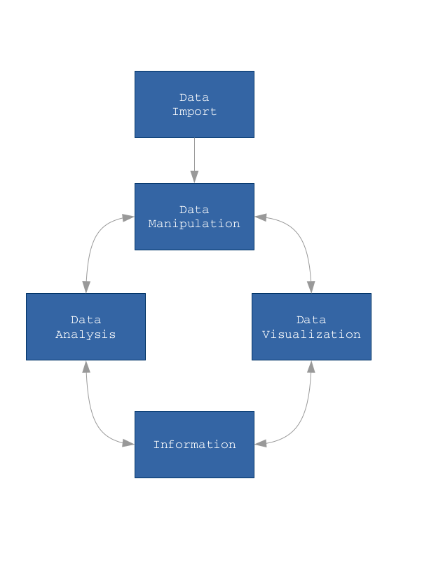

 

This course offers the basics of R, and get an overview on methods for data import, data manipulation, data visualization and data analysis.

It is divided in six sections:

* _Introduction to R_, which talks about R history and online resources, along with R and R-Studio installation and configuration. It shows also how to become familiar with R session  
* _R Objects_, which deepen the features and the functionalities of R data objects  
* _Data Import and Export_, which explains how dealing with the data import and export phases from different sources, among which: text files, MS Excel files, databases and RData files  
* _Data Manipulation_, which explores the power of R as a data manipulation tool, introducing `dplyr` package  
* _Data Visualization_, which describes how visualizing data by using R standand graphic system and by using `ggplot2` grammar of graphics  
* _Data Analysis_, which provides the basics of statistical modelling    

