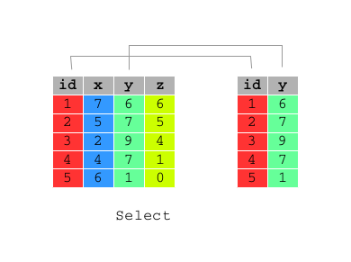

```{r options, include=FALSE, purl=FALSE}
require(knitr)
options(width = 108)
```

# Introduction to dplyr

```{r g0, echo=FALSE, purl=FALSE}
include_graphics("images/flow-dtman.png", dpi=170)
```


This chapter provides an overview of data management with `R` through the `dplyr` package.

The `dplyr` package for `R` is very powerful for data management since:

* it simplifies how you can think about common data manipulation tasks;
* it provides simple "verbs", functions that correspond to the most common data manipulation tasks;
* it uses efficient data storage backends, so you spend less time waiting for the computer.

```{r message=FALSE}
require(dplyr)
```

In the following chapters, we will explore the innovations introduced by `dplyr` to make our lifes easier when dealing with dataframes manipulation tasks.     
In particular:

* pipe operator (`%>%`) 
* `tbl_df` data frame class
* `dplyr` verbs for data manipulation 
* `dplyr` verbs for combining data
* `dplyr` with backend databases

In the following two paragraphs we will explore two important `dplyr` innovations: pipe operator (`%>%`) and `tbl_df` data frame class

<!--
aggiungere qualcosa a questa frase: dire magari che sono le innovazioni base
-->


## Pipe operator  

`dplyr` pipe operator (`%>%`) allows us to pipe the output from one function to the input of another function. The idea of piping is to read the functions from left to right. It is particularly useful with nested functions (reading from the inside to the outside) or with multiple operations.


Pipes can work with nearly any functions (`dplyr` and not-`dplyr` functions), let us see an example.

Let us consider `bank` data set, included in `qdata` package, which contains information about a direct marketing campaigns of a Portuguese banking institution based on phone calls. 

```{r bank_tbl_df_1}
require(qdata)
data(bank) 
```

Suppose we want to visualize the first rows of `bank` dataframe, by using `head()` function.   

Usually we write:

```{r pipe1}
head(bank)
```

By using `%>%`, the code becomes:

```{r pipe2}
bank %>% head()
```

Pipe takes the argument on the left (`bank`) and passes it to the function on the right (`head()`). So you don't need to write the first argument of the function. 

Other arguments of the function must be added to the function itself, as usually done. By default `head()` prints the first 6 rows of the dataframe. Suppose we want to print 10 rows, by setting `n` argument to 10:

```{r pipe3}
bank %>% head(n=10)
```


### `tbl_df`: the `dplyr` Data Frame Class

Sometimes data frames have large dimensions. `dplyr` package provide `tbl_df`, which is a wrapper around a data frame that will not accidentally print a lot of data to the screen; indeed tbl objects only print a few rows and all the columns that fit on one screen, describing the rest of it as text.

When the class of data object is not tbl, `tbl_df()` function should be used.  
Let us consider `mtcars`, a dataset included in `datasets` package (automatically loaded at the start of an R session): 

```{r tbl_df, message=FALSE}
# Example of data frame
class(mtcars)

# If we do not convert it as a tbl_df, all mtcars rows and columns will be printed when calling mtcars 
dim(mtcars)
mtcars

# dplyr version of the same data frame (tbl_df conversion)
mtcars_tbl <- tbl_df(mtcars)
class(mtcars_tbl)
mtcars_tbl
```

<!--
cambiare mtcars -> rivedere perchè non va
-->

## Verb Functions

```{r first, message=FALSE}
require(dplyr)
require(qdata)
```

`dplyr` aims to provide a function for each basic verb of data manipulating.

All these functions are very similar:

* the first argument is a data frame;
* the subsequent arguments describe what to do with it, and you can refer to columns in the data frame directly without using $. Note that the column names must be unquoted;
* the result is a new data frame.

Together these properties make it easy to chain together multiple simple steps to achieve a complex result.

These five functions provide the basis of a language of data manipulation. At the most basic level, you can only alter a tidy data frame in five useful ways: 

1. select variables of interest: `select()`;
2. filter records of interest: `filter()`;
3. reorder the rows: `arrange()`;
4. add new variables that are functions of existing variables: `mutate()`;
5. collapse many values to a summary: `summarise()`. 


In the following examples we will refer to `bank` data set which contains information about a direct marketing campaigns of a Portuguese banking institution based on phone calls. 

```{r bank_tbl_df_2}
data(bank) 
```

\clearpage

### `select()`

Often you work with large datasets with many columns where only a few are actually of interest to you. 

`select()` allows you to rapidly zoom in on a useful subset of columns.  


 

The first argument is the name of the data frame, and the second and subsequent are the name of column/s of that data frame you want to select:

```{r select}
# Select columns: year, month and day of bank data frame
select(bank, year, month, day)
# Select columns: year, month and day of bank data frame
bank %>% select(year:day)
# Select all columns of bank data frame apart from: year, month and day
bank %>% select(-(year:day))
```


You can rename variables with `select()` by using named arguments:

```{r select_rename}
# Rename id variable as ID
bank %>% select(ID = id)
```

\clearpage

### `filter()`

`filter()` allows you to select a subset of the rows of a data frame.

 

The first argument is the name of the data frame, and the second and subsequent are filtering expressions evaluated in the context of that data frame.

For example, you can select all calls made to students whit balance above 20,000:


```{r filter1}
filter(bank, job == "student", balance > 20000)
```


`filter()` allows you to give it any number of filtering conditions which are joined together with `&` and/or the other operators.  

```{r filter2}
# Select all calls made to student of 18 years 
bank %>% filter(age == 18 & job == "student")
```

```{r filter3}
# Select all calls made to people of 18 or 95 years
bank %>% filter(age == 18 | age == 95)
```

`filter()` can be used also with `%in%` to establish conditions under which filter: 

```{r filter4}
# Select all calls made to people of 18 or 95 years
bank %>% filter(age %in% c(18,95))
```

An other example is:

```{r filter5}
# Select all calls made to people whose job is admin. or technician 
bank %>% filter(job %in% c("admin.","technician"))
# Select all calls made to people whose job is admin. or technician 
bank %>% filter(job == "admin." | job == "technician")
```

\clearpage

### `arrange()`

Function `arrange()` reorders a data frame by one or more variables. If you provide more than one column name, each additional column will be used to break ties in the values of preceding columns:


The first argument is the name of the data frame, and the second and subsequent are the name of columns of that data frame you want to order by.  
You may want to order the `bank` data frame by the balance of the account in ascending order:

```{r arrange1}
arrange(bank, balance)
```

or in descending order by using function `desc()` within `arrange()`: 

```{r arrange2}
bank %>% arrange(desc(balance))
```

You can order a data frame by one or more than one variables.

Ordering data frame bank by `age` first and descending `balance` afterward requires:


```{r arrange3}
bank %>% arrange(age, desc(balance))
```

\clearpage

### `mutate()`

As well as selecting from the set of existing columns, it’s often useful to add new columns that are functions of existing columns. This is the job of `mutate()`:

 


The first argument is the name of the data frame, and the second and subsequent are expressions for creating new columns to add to that data frame or for modifying the existing ones: 


```{r mutate_1}
df <- data.frame(x = 1:3, y = 3:1)

mutate(df, x1 = x+1)

mutate(df, x = x+1)

mutate(df, x = x+1, y = x+1)

mutate(df, x1 = x+1, y1 = x1+1)

mutate(df, y1 = x+1, x1 = x+1)

mutate(df, xx = x)
```


```{r mutate_2}
# generate a variable indicating the total number of times each person has been contacted 
# during this campaign and during the previous ones 
mutate(bank, contacts_n = campaign + previous)
```

`mutate()` allows you to refer to columns that you just created:

```{r mutate_col_just_created}
# generate two variable: one indicating the year of birth and one the year of birth without century 
bank %>% mutate(year_of_birth = year - age, year_of_birth_no_century = year_of_birth - 1900)
```

\clearpage

### `summarise()`

The last verb is `summarise()`, which collapses a data frame to a single row.

The first argument is the name of the data frame, and the second and subsequent are summarising expressions.

```{r summarise}
# Compute the mean of balance variable of bank data frame
bank %>% summarise(mean_balance = mean(balance, na.rm = TRUE))
# Compute the minimum and the maximum value of balance of bank data frame
bank %>% summarise(max_balance = max(balance, na.rm = TRUE), min_balance = min(balance, na.rm = TRUE))
```

\clearpage

## Group Data and Chain Verbs

```{r first1, message=FALSE}
require(dplyr)
require(qdata)
data(bank)
```


### `group_by()`

The verb functions are useful, but they become really powerful when you combine them with the idea of "group by", repeating the operation individually on groups of observations within the dataset.
In `dplyr`, you use the `group_by()` function to describe how to break a dataset down into groups of rows. You can then use the resulting object in the verbs functions; they’ll automatically work "by group" when the input is a grouped. Let us see some examples (pay attention to objects class).

```{r grouped_df_class}
# Example data frame
df <- data.frame(x = 1:6, f = rep(1:2, each = 3))

# Grouped data frame
dff <- group_by(df, f)
dff
class(dff)

# Use dff (grouped data frame) as .data argument value in mutate() 
dffn <- mutate(.data = dff, n = n())
dffn
class(dffn)


# Use dff (grouped data frame) as .data argument value in arrange()
dffa <- arrange(.data = dff, desc(x))
dffa
class(dffa)


# Use dff (grouped data frame) as data argument value in summarise()
dfg <- summarise(.data = dff, x_avg = mean(x))
dfg
class(dfg)
```

In the following example, you split the complete dataset into years and then summarise each year by counting the number of phone calls (`count = n()`) and computing the average duration call (`dist = mean(duration, na.rm = TRUE)`) and balance (`delay = mean(balance, na.rm = TRUE)`):

```{r group_by_1}
# Split the complete dataset (bank) into years (group the df) 
by_year <- group_by(bank, year)
# Summarise each year applying summarise() verb to the grouped df (by_year)
summarise(by_year,
          count = n(),
          mean_duration = mean(duration, na.rm = TRUE),
          mean_balance = mean(balance, na.rm = TRUE))
```

Then, you search for the number of days covered per year. You report also the number of phone calls per year:

```{r}
summarise(by_year,
          days = n_distinct(date),
          count = n())
```

When you group by multiple variables, each summary peels off one level of the grouping. That makes it easy to progressively roll up a dataset:

```{r}
daily <- group_by(bank, year, month, day)
groups(daily)

per_day <- summarise(daily, calls = n())
groups(per_day)

per_month <- summarise(per_day, calls = sum(calls))
groups(per_month)

per_year <- summarise(per_month, calls = sum(calls))
groups(per_year)
```

```{r}
df <- data.frame(year = rep(c(2010, 2011, 2012), each = 3), 
                 month = rep(1:3, each = 3), 
                 day = rep(20:22, 3), 
                 x = 1:9)

df

df1 <- df %>% group_by(year, month, day) 

groups(df1)

df2 <-  df1 %>% 
  summarise(x_avg = mean(x), n = n())

df2

groups(df2)

summarise(df2, n())

ungroup(df2) %>% summarise(n())
```


### Chain Together Multiple Operations

The `dplyr` API (Application Program Interface) is functional in the sense that function calls don't have side-effects, and you must always save their results. This doesn't lead to particularly elegant code if you want to do many operations at once. You either have to do it step-by-step:

```{r chain1}
a1 <- group_by(bank, date)
a2 <- select(a1, age, balance)
a3 <- summarise(a2,
                mean_age = mean(age, na.rm = TRUE),
                mean_balance = mean(balance, na.rm = TRUE)
                )
(a4 <- filter(a3, mean_age < 40 & mean_balance > 5000))
```

Or if you don’t want to save the intermediate results, you need to wrap the function calls inside each other:

```{r chain2}
filter(
  summarise(
    select(
      group_by(bank, date), age, balance
    ),
    mean_age = mean(age, na.rm = TRUE),
    mean_balance = mean(balance, na.rm = TRUE)
  ),
  mean_age < 40 & mean_balance > 5000
)
```

This is difficult to read because the order of the operations is from inside to out, and the arguments are a long way away from the function. To get around this problem, use the `%>%` operator.

```{r chain3}
bank %>%
  group_by(date) %>%
  select(age, balance) %>%
  summarise(
    mean_age = mean(age, na.rm = TRUE),
    mean_balance = mean(balance, na.rm = TRUE)
  ) %>%
  filter(mean_age < 40 & mean_balance > 5000)
```

\clearpage

## dplyr verbs for combining data: join

```{r first2, message=FALSE}
require(dplyr)
```

Very often you will have to deal with many tables that contribute to the analysis you are performing and you need flexible tools to combine them. Supposing that the two tables are already in a tidy form: the rows are observations and the columns are variables, `dplyr` provides  __mutating joins__, which add new variables to one table from matching rows in another.

There are four types of mutating join, which differ in their behaviour when a match is not found. 

* `inner_join(x, y)`
* `left_join(x, y)`
* `right_join(x, y)`
* `outer_join(x, y)`

All these verbs work similarly: 

* the first two arguments, `x` and `y`, provide the tables to combine
* the output is always a new table with the same type as `x`

For the next examples we will consider these two small data frames:

```{r}
df1 <- data.frame(id = 1:4, x1 = letters[1:4])
df1
df2 <- data.frame(id = 3:5, x2 = letters[3:5])
df2
```

### `inner_join(x, y)`

```{r g2, echo=FALSE, purl=FALSE}
include_graphics("images/inner_join.png", dpi=150)
```

`inner_join(x, y)` only includes observations that match in both x and y:

```{r}
inner_join(df1, df2)
```

### `left_join(x, y)`

```{r g3, echo=FALSE, purl=FALSE}
include_graphics("images/left_join.png", dpi=150)
```


`left_join(x, y)` includes all observations in `x`, regardless of whether they match or not. This is the most commonly used join because it ensures that you don't lose observations from your primary table:

```{r}
left_join(df1, df2)
```

### `right_join(x, y)`

```{r g4, echo=FALSE, purl=FALSE}
include_graphics("images/right_join.png", dpi=150)
```

`right_join(x, y)` includes all observations in `y`. It’s equivalent to `left_join(y, x)`, but the columns will be ordered differently:

```{r}
right_join(df1, df2)
left_join(df2, df1)
```


### `full_join()`

```{r g5, echo=FALSE, purl=FALSE}
include_graphics("images/full_join.png", dpi=150)
```


`full_join()` includes all observations from `x` and `y`:

```{r}
full_join(df1, df2)
```

The left, right and full joins are collectively know as outer joins. When a row doesn't match in an outer join, the new variables are filled in with missing values.

\clearpage

## dplyr with backend databases

```{r first3, include=TRUE, purl=TRUE, message=FALSE}
require(dplyr)
require(ggplot2)
require(DBI)
require(RSQLite)
```


### Getting Started with Large Data 

To experimement with large files you may want to use data from http://stat-computing.org/dataexpo/2009/the-data.html.

The data consists of flight arrival and departure details for all commercial flights within the USA, from October 1987 to April 2008. This is a large dataset: there are nearly 120 million records in total, and takes up 1.6 gigabytes of space compressed and 12Gb when uncompressed. Only four of these files will be considered in the next example for a 29 millions records data frame.

This is clearly a case for SQLite: let us load the `RSQLite` package.

```{r message=FALSE}
require(RSQLite)
```

As these files might have different encodings you may need to define a simple function that returns the encoding of the file. Note that this function uses unix system commands and may not work under windows based computers.

```{r eval=FALSE}
charset <- function (file){
  info <- system(paste("file -i" ,file ), intern = TRUE)
  info_split <- strsplit(info, split = "charset=")[[1]][2]
  info_split
}
```

You then create an empty SQLite database with a little trick that ensures the database is removed in case it already exists:

```{r eval=FALSE}
path <- "./"
db <- "ontime.sqlite"
path_db <- paste(path, db, sep = "/")
db_exists <- list.files(path, pattern = db)
if(length(db_exists) != 0) system(paste("rm", path_db))
con <- dbConnect(RSQLite::SQLite(), path_db)
```

Now it's time to get the list of files you want to load:

```{r eval=FALSE}
files <- list.files("./../data", pattern = ".csv", full.names = TRUE)
```

and by using a for loop you can load all the files into the newly created data base:

```{r eval=FALSE}
for (i in 1:length(files)){
  head <- ifelse (i == 1, TRUE, FALSE)
  skip <- ifelse (i == 1, 0, 1)
  append <- ifelse (i == 1, FALSE, TRUE)
  this_file <- files[i]
  encoding <- charset(this_file)
  df <- read.table(this_file, sep = ",", head = head, encoding = encoding, skip = skip, nrows = 100)
  dbWriteTable(conn = con, name = "ontime", value = df ,append = append)
  cat(date() , this_file, "loaded", "\n")
  rm(df)
}  
```

finally disconnect from the database:

```{r eval=FALSE}
dbDisconnect(con)
```

You can now start using the data base with dplyr interface:

```{r eval=FALSE}
con_dplyr <- src_sqlite(path_db)
ontime <- tbl(con_dplyr, "ontime")
class(ontime)
dim(ontime)
```

When working with databases, `dplyr` tries to be as lazy as possible. It’s lazy in two ways:

* It never pulls data back to `R` unless you explicitly ask for it;
* It delays doing any work until the last possible minute, collecting together everything you want to do then sending that to the database in one step.

For example, take the following code:

```{r eval=FALSE}
ontime_stat <- ontime %>% group_by(Year, Month) %>% 
   summarise(avg = mean(DepDelay), min = min(DepDelay), max = max(DepDelay)) 
```

Suprisingly, this sequence of operations never actually touches the database. It’s not until you ask for the data (e.g. by printing `ontime_stat`) that `dplyr` generates the SQL and requests the results from the database, and even then it only pulls down 10 rows:

```{r eval=FALSE}
ontime_stat
class(ontime_stat)
```

To pull down all the results use `collect()`, which returns a `tbl` class object:

```{r eval=FALSE}
ontime_dep_delay <- ontime %>%
  select(year = Year, dep_delay = DepDelay, arr_delay = ArrDelay) %>%
  filter(dep_delay > 0) %>%
  collect()
```

Once data are collected you can use it within `R`:

```{r eval=FALSE}
pl <- ggplot(ontime_dep_delay , aes(dep_delay, arr_delay))
pl <- pl + stat_binhex(bins = 30) + facet_wrap(~year, ncol = 2)
print(pl)
```


