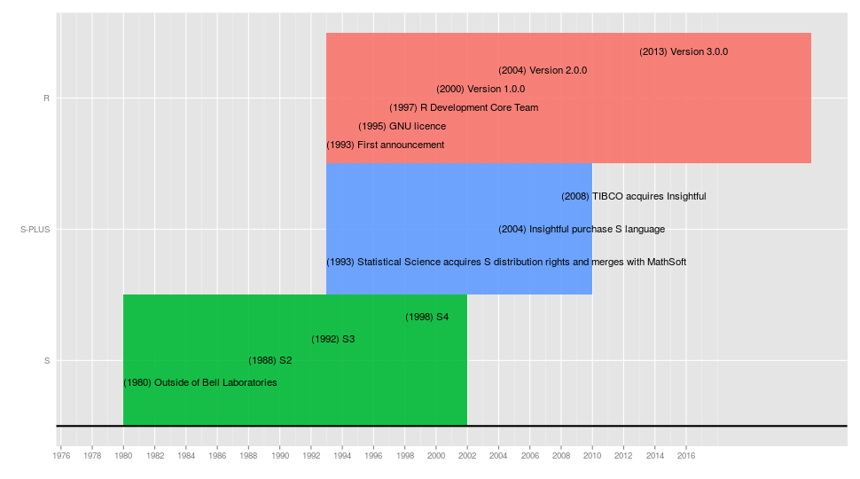
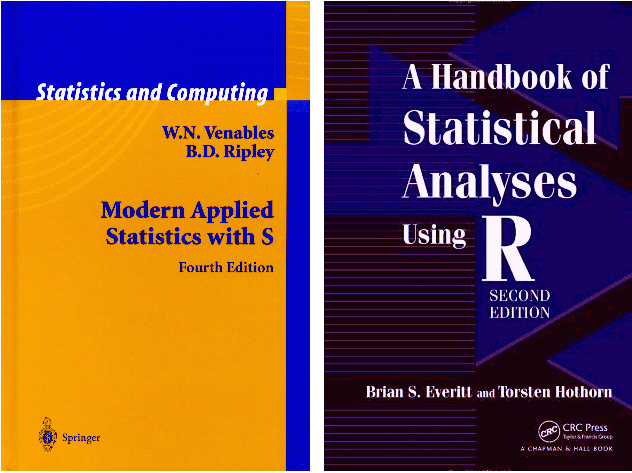
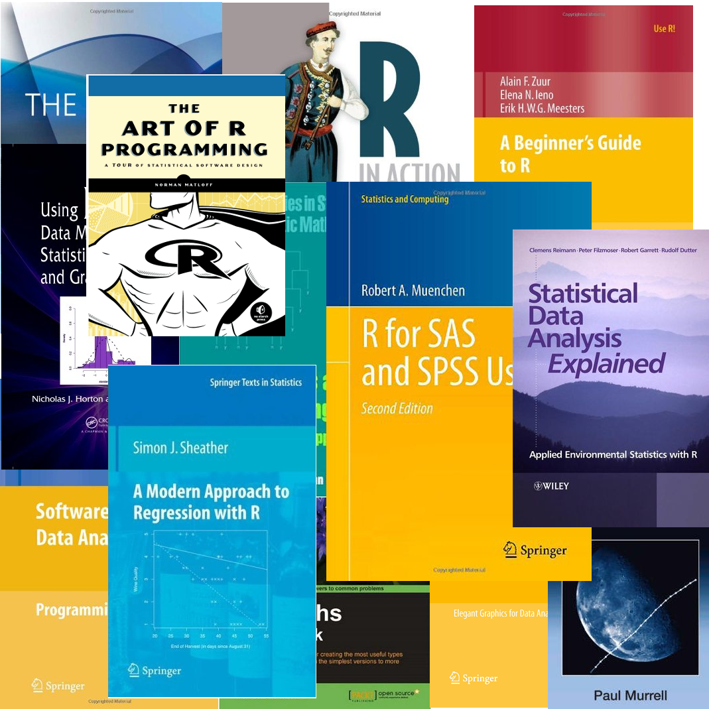

## R History

R is a programming environment for data analysis, graphics and statistical computing.  The R language is widely used among statisticians for developing statistical software and data analysis.

R was initially developed in early 90s by Robert Gentleman and Ross Ihaka at the Department of Statistics of the University of Auckland as a dialect of the S language.

The R name is partly based on the (first) names of the first two R authors (Robert Gentleman and Ross Ihaka), and partly a play on the name of S.

### What is S and a bit of history

S is a statistical programming language developed by John Chambers and others in Bell Laboratories.

A bit of history:

 - 1976: the first version of S is developed  as an internal statistical analysis environment. It is originally implemented as Fortran libraries.
 - 1980: the first version of S is distributed outside of Bell Laboratories. In 1981, source version is made available.
 - 1984: Richard A. Becker and John M. Chambers, "S. An Interactive Environment for Data Analysis and Graphics". (Brown Book). Historical interest only.
 - 1988: Richard A. Becker, John M. Chambers and Allan R. Wilks, "The New S Language". London: Chapman & Hall. (Blue Book). It introduces what is now known as S version 2. The system is rewritten in C and begins to resemble the system that we have today.
 - 1992: John M. Chambers and Trevor J. Hastie, "Statistical Models in S". (White Book). It introduces S version 3, often abbreviated S3, which adds structures to facilitate statistical modeling in S.
 - 1998: John M. Chambers, "Programming with Data". (Green Book). It introduces S version 4, often abbreviated S4, which provides advanced object-oriented features. S4 classes differ markedly from S3 classes.

The S language itself has not changed dramatically since 1998.

### What is S-PLUS and a bit of history

S-PLUS is a commercial implementation of the S programming language.

S-PLUS provides a number of fancy features (GUIs, mostly) on top of it, hence the "PLUS".

A bit of history:

 - 1993: Statistical Sciences, Inc. acquires the exclusive license to distribute S and merges with MathSoft.
 - 2001: MathSoft sells its Cambridge-based Engineering and Education Products Division (EEPD). It changes name to Insightful Corporation.
 - 2004: Insightful purchases the S language from Lucent Technologies for $2 million.
 - 2008: TIBCO acquires Insightful Corporation.

### R: a bit of history

 - 1993: First announcement of R to the public.
 - 1995: Martin Maechler convinces Ross Ihaka and Robert Gentleman to use the GNU General Public License to make R free software.
 - 1997: The R Development Core Team is formed. The team controls the source code for R.
 - 2000: R version 1.0.0 released. Developers consider R stable enough for production use.
 - 2004: R version 2.0.0 released. Introduced lazy loading, which enables fast loading of data with minimal expense of system memory.
 - 2013: R version 3.0.0 released. Introduced long vectors.

In April 2016, R is in 18th place of TIOBE Programming Community Index, that is an indicator of the popularity of programming languages. R is above SAS that is in 23th place.

## The R-project and R Licence

R is supported by a wide community of academic users, professors, companies and developers. This community composes the so-called "R-project".  The "R-project" is supported by the "R Foundation". The R Foundation is a not for profit organisation.

R is an official part of the Free Software Foundation's GNU project. The R Foundation has similar goals to other open source software foundations like the Apache Foundation or the GNOME Foundation. R is free and open source software. It is released under the GPL (version 2) licence.

R is free:

 - you can have R without paying for it (freeware);
 - you can copy and re-use the software (free software);
 - you can access source code and modify it (open source).

### R Commercial Support

#### RStudio Inc.
RStudio, Inc. [(www.rstudio.com)](http://www.rstudio.com/) is a company that develops free and open tools for the R community, inspired by the innovations of R users in science, education, and industry. These include the RStudio development environment as well as the `shiny`, `ggvis`, and `dplyr` packages (among many others).

RStudio has a mission to provide the most widely used open source and enterprise-ready professional software for the R statistical computing environment. These tools will further the cause of expanding the use of R and the field of data science. It also offers open source and enterprise ready tools for the R computing environment. The flagship product of the RStudio team is an Integrated Development Environment (IDE) which makes it easy for analysts, scientists, data scientists and quants to perform their analyses. It also offer Shiny: a platform that allows you to take those analyses and share them with your team/organization by creating interactive web applications. 

<!--
#### Revolution R
Revolution Analytics [(www.revolutionanalytics.com)](http://www.revolutionanalytics.com/) was founded in 2007 to provide commercial support for Revolution R. Revolution R is the distribution of R developed by Revolution Analytics which also includes components developed by the company.

Revolution R Enterprise includes all of R's advanced data analysis and graphics capabilities, plus additional components. Major additional components include: ParallelR (for parallel computing), the R Productivity Environment IDE, RevoScaleR (for big data analysis), RevoDeployR (web services framework and the ability for reading and writing data in the SAS file format).
-->

### What R does?

R provides a suite of software facilities for:

 - matrix algebra;
 - hash tables and regular expressions;
 - reading and manipulating data;
 - computation;
 - programming language: loops, subroutines, functions, etc.;
 - conducting statistical analyses;
 - graphics and tables;
 - displaying the results.

On the contrary, R:

 - it is not a database, but it connects to databases;
 - it does not provide a graphical interface, but it uses Java, TclTk and, under Windows, COM to provide graphical interfaces;
 - it is not a spreadsheet, but it connects to spreadsheets;
 - it does not provide commercial support. Revolution R is a commercially supported distribution of R.

In conclusion, R is an interpreted computer language. R provides a platform for the development and implementation of new algorithms and technology transfer. Most user-visible functions are written in R itself, calling upon a smaller set of internal primitives. It is possible to interface procedures written in C, C+, or FORTRAN languages for efficiency, and to write additional primitives. System commands can be called from within R.

#### R Advantages and Disadvantages

Main R advantages are:
  
 - Fast and free.
 - State of the art: Statistical researchers provide their methods as R packages. SPSS and SAS are years behind R!
 - Excellent for graphics.
 - Mx, WinBugs, and other programs use or will use R.
 - Active user community.
 - Excellent for simulation, programming, computer intensive analyses, etc.
 - Forces you to think about your analysis.
 - Interfaces with database storage software (SQL).

Main R disadvantages are:

 - Not user friendly at start: steep learning curve, minimal GUI.
 - Sometimes, figuring out correct methods or how to use a function on your own can be frustrating.
 - Easy to make mistakes and not know. 
 - Working with large datasets is limited by RAM.
 - Data preparation and cleaning can be messier and more mistake prone in R vs SPSS or SAS.

### R Resources

#### R-project Website

The R-project website  [(www.r-project.org)](http://www.r-project.org/) is the starting point for R materials.

The website contains:

 - the software and packages;
 - the search engine interface (the same queries can be submitted with the RSiteSearch ('query') function within R);
 - the on-line documentation both in HTML and in PDF format. The HTML version can be accessed with the `help.start()` function within R;
 - the R Journal. The R Journal is the open access, refereed journal of the R project. It features short to medium length articles covering topics that might be of interest to users or developers of R;
 - the interface to the mailing list;
 - the wiki, suggested books and many others.

The on-line documentation includes the following manuals. These manuals have been written by the R Development Core Team itself and contain precious information.

 - _An Introduction to R_ gives an introduction to the language and how to use R for doing statistical analysis and graphics.
 - *Writing R Extensions* covers how to create your own packages, write R help files, and the foreign language (C, C++, Fortran, ...) interfaces.
 - *R Data Import/Export* describes the import and export facilities available either in R itself or via packages which are available from CRAN.
 - *R Installation and Administration*.

Other manuals and tutorials provided by R users can be downloaded from the R-project website [(cran.r-project.org/other-docs.html)](http://cran.r-project.org/other-docs.html).

Mailing lists is the most important tool to contact the R community. Mailing lists can be accessed from the R-project website [(www.r-project.org/mail.html)](http://www.r-project.org/mail.html).

There are four general mailing lists devoted to R:

 - _R-announce_:
   This list is for major announcements about the development of R and the availability of new code.
 - _R-packages_:
   This list is for announcements as well, usually on the availability of new or enhanced contributed packages (on CRAN, typically).
 - _R-help_:
   The "main" R mailing list, for discussion about problems and solutions using R, announcements about the availability of new functionality for R and documentation of R, comparison and compatibility with S-plus, and for the posting of nice examples and benchmarks. 
 - _R-devel_:
   This list is intended for questions and discussion about code development in R.

#### Other Online Resources

It is very difficult estimate how many sites about R are on-line. However, Google returns 224.000.000 sites searching "R stat blog". Also if only the 0.1% of these sites talk about R, it means almost 220.000 sites about R.

R-bloggers [(www.r-bloggers.com)](http://www.r-bloggers.com/) is a blog aggregator of content collected from bloggers who write about R. R-bloggers contains R news and tutorials contributed by hundreds of R bloggers.

Other useful websites about R are:

 - Quick-R [(www.statmethods.net)](http://www.statmethods.net/) is a useful on-line guide to R. It provides many examples and useful tips.
 - R seek [(rseek.org)](http://rseek.org/) uses Google to search in a selected list of websites about R.
 - Graphiques avec R [(zoonek2.free.fr/UNIX/48\_R\_2004/04.html)](http://zoonek2.free.fr/UNIX/48_R_2004/04.html) provides also a gallery of R-made graphics.

#### Books

A partially annotated list of books that are related to S or R may be found in the R-project website [(www.r-project.org/doc/bib/R-books.html)](http://www.r-project.org/doc/bib/R-books.html).

The following book may be considered the milestone book about R:
 - William N. Venables and Brian D. Ripley. Modern Applied Statistics with S. Fourth Edition. Springer, New York, 2002. ISBN 0-387-95457-0.

Other suggested books are:

 - Everitt and Hothorn (2009). _A handbook of statistical analyses using R_. Chapman & Hall/CRC.
 - Chambers (2008). _Software for Data Analysis_, Springer.
 - Chambers (1998). _Programming with Data_, Springer.
 - Murrell (2005). _R Graphics_, Chapman & Hall/CRC Press.
 - Dalgard (2002). _Introductory Statistics with R_. Springer.
 - Kabakoff (2011). _R in Action_. Manning.
 - Braun and Murdoch (2007). _A First Course in Statistical Programming with R_. Cambridge University Press.

Springer is developing a series of books called _Use R!_.

<!--

## Summary
> In this chapter, we introduced R with a bit of history. We focused to some of the strengths that make R an attractive option for students, researchers, statisticians, and data analysts. We talked about the commercial support for R, presenting Revolution R. Because R can be a complex program, we spent some time looking at how to access the extensive resources that are available. Also, some useful books were presented. In the next chapter we'll install R and we'll introduce R graphical interfaces.

-->
