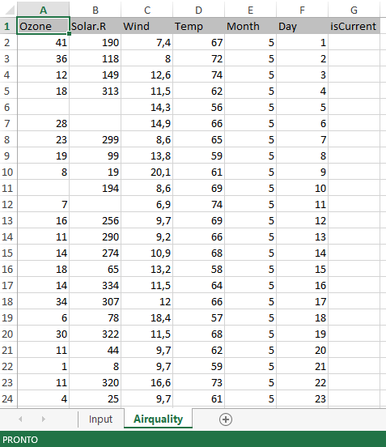
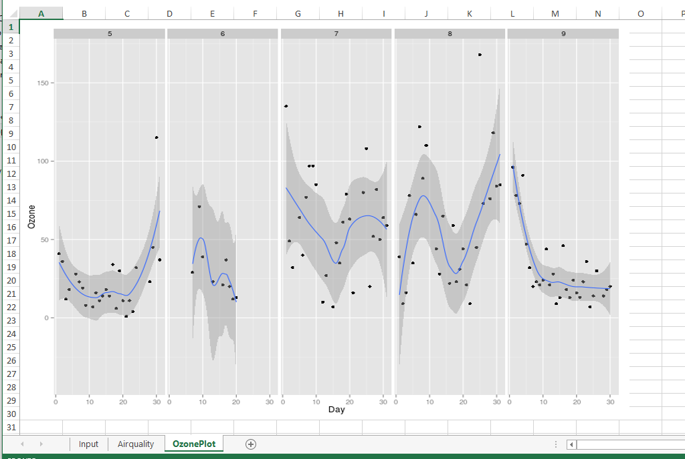

```{r, options, echo=FALSE, results='hide', message=FALSE, warning=FALSE, purl=FALSE}
options(width = 108)
require(knitr)
opts_knit$set(root.dir = "./../data")
outDir <- "."
```


## Text Files

### Data Import 

The `read.table()` function imports a text file (ASCII) with a table structure where each row represents a case.

A full path can be provided, but it must be modified by each user, otherwise it fails:
```{r read.table, error=TRUE}
df <- read.table("C:/Users/UserName/Documents/dati/tennis.txt", header = TRUE, sep = "", dec = ".")
```

The path uses the slash ("`/`") as delimiting character, in the UNIX-like style. Under Windows, can be used both a slash character or a doubled backslash character ("`\\`").

Relative paths starts from the current working directory. The current working directory can be viewed with `getwd()`.

```{r, getwd}
getwd() 
```

It is strongly suggested to set the working directory to the directory containing the data. This can be done using the `setwd()` function:    
`> setwd(path)` where `path` is a string containing the path to directory containing the `data` folder, e.g. `"C:/Users/UserName/Documents/dati"`, under Windows.

```{r, setwd, eval=FALSE}
setwd("C:/Users/UserName/Documents/dati") 
```

```{r, read.table2}
df <- read.table("tennis.txt", header = TRUE)
```

```{r, head}
head(df)
```

The `header = TRUE` option tells R that the first row of the file contains column headings and it is used to assign the name of variables. If the first row contains the first case the `header = FALSE` ought to be used and the names of the variables are automatically assigned. R assumes a default value for the `header` parameter according to the file format, which is why specifying the correct option is advisable.  Alternatively, the names of the columns can be specified using the `col.names` parameter. This parameter requires a character vector with the same length as the number of the data frame columns.

The `sep` argument specifies the separator between different cases. The default value for the `read.table()` function is `sep = ""` which takes into consideration the fields delimited by a white space, be it one or more spaces or tabulations.

The `dec` argument specifies the decimal separator. The argument usually assumes the `dec = "."`  (default) or `dec = ","` values.

The `nrows` argument specifies the maximum number of rows to read in.

```{r, nrows1}
read.table("tennis.txt", header = TRUE, sep = "", dec = ".", nrows = 3)
```

The `skip` argument specifies the number of lines of the data file to skip before beginning to read data. If the first line contains the header and it is ignored, than `header = FALSE` should be set.

```{r, nrows2}
read.table("tennis.txt", header = FALSE, sep = "", dec = ".", skip = 2)
```

The `nrows` and `skip` arguments can be mixed. The following example read the second and the third rows of the data frame.

```{r, nrows3}
read.table("tennis.txt", header = FALSE, sep = "", dec = ".", nrows = 2, skip = 2)
```

Variables containing text are set as character variables with the `stringsAsFactors = FALSE` option, whereas by default they are set as factors. This setting can be modified with the "global" option for it to be applied until the end of the work session. This can be done with the `options(stringsAsFactors = FALSE)` instruction.

```{r, stringsAsFactors}
df <- read.table("tennis.txt", header = TRUE, sep = "", dec = ".", stringsAsFactors = FALSE)
head(df)
```

When there are missing values the `na.strings` can be used to indicate which string is referred to them. The `na.string` argument can be a character vector. R indicates missing values with the `NA` (Not Available) symbol.

```{r, na.strings}
# Data frame imported without na.strings parameter 
df <- read.table("tennis.NA.txt", header = TRUE, sep = "", dec = ".", stringsAsFactors = FALSE)
head(df)
# Data frame imported considering also na.strings parameter
df <- read.table("tennis.NA.txt", header = TRUE, sep = "", dec = ".", na.strings = c("MC", "ND"), stringsAsFactors = FALSE)
head(df)
```

### Data Export 

To save a data frame in a text file in R use the `write.table()` function.

```{r, write.table, eval = FALSE}
# It creates a df_write.txt file in the current directory containing df data frame
df <- data.frame(a1 = rnorm(10), a2 = rnorm(10), a3 = rnorm(10))
write.table(df, file = "df_write.txt")
```

## Microsoft Excel Files

The R package `XLConnect` permits to create a formatted spreadsheet usable as a dynamic report of the R analisys and it allows one to read existing xlsx files and to modify them from R.  
Let us see how `XLConnect` works.

```{r use.text, message=FALSE}
require(XLConnect)
```


### Create a new file xlsx 
To create a new empty file xlsx with one empty sheet named *Input* the syntax is:

```{r outDir_set_up, eval=FALSE}
# Set up output directory and output file name  
outDir <- "~/Desktop/xlsx" 
```
```{r}
# File path string
file_xls <- paste(outDir,"newFile.xlsx",sep='/')
# Delete file_xls if it already exists 
unlink(file_xls, recursive = FALSE, force = FALSE)
```

```{r new.xlsx, comment=FALSE}
exc <- loadWorkbook(filename = file_xls, create = TRUE)
createSheet(object = exc, name = 'Input')
saveWorkbook(exc)
```

`loadWorkbook()` function creates an R workbook object in the path and with the name specified by  `filename` argument. It creates it ex-novo, as `create` argument is set as `TRUE`. An R workbook object represents a Microsoft Excel workbook. 

The function `createSheet()` creates the worksheet *Input* in R object and `saveWorkbook()` function fisically save the R object in a file xlsx. Remember to call this function every time you modified the R object in order to save the changes also in xlsx file. 


```{r g1, echo=FALSE, fig.width=6}

```

### Populate a sheet

To add something to an empty sheet use `writeWorkbook` function:

```{r add.input, comment=FALSE}
df <- data.frame('inputType'=c('Day','Month'),'inputValue'=c(1,3))
writeWorksheet(object = exc, data = df, sheet = "Input", startRow = 1, startCol = 2)
saveWorkbook(exc)
```

The `df` data frame with 2 rows and 2 column is created and `writeWorkbook()` function write the content of this data frame in the sheet *Input* starting from the cell (1,2).

```{r g2, echo=FALSE, fig.width=3}
include_graphics("images/excel-inputSheet.png")
```

### Create multiple sheets

To add other sheets to an R object workbook, use `createSheet()` function:

```{r add.airquality, comment=FALSE}
# Add a sheet named Airquality to exc object
createSheet(exc,'Airquality')
saveWorkbook(exc)
```

Suppose we want to add a dataset to the sheet just created.  
We want to add `airquality` dataset available in `datasets` package, which reports daily air quality measurements in New York, from May to September 1973.  

```{r}
# Add an empty column to airquality dataset before add it to 'Airquality' sheet
airquality$isCurrent<-NA
# Add airquality dataset to the sheet Airquality
createName(exc, name='Airquality',formula='Airquality!$A$1')
writeNamedRegion(exc, airquality, name = 'Airquality', header = TRUE)
saveWorkbook(exc)
```

In particular, `createName()` function creates a named region 'Airquality' starting from the cell $A$1 of sheet *Airquality*. In Excel, a named region/range represents cells, a range of cells, a constant value, or a formula with a defined name which make easier to work. It is useful for navigation, to quickly select the named range, for reusing it when referencing it in such things as charts and formulas, ...   
`writeNamedRegion()` function writes `airquality` data frame with headers `(header=TRUE)` in the named region *Airquality*. 

```{r g3, echo=FALSE, fig.width=3}

```

### Add a formula
Use `setCellFormula()` function to set cell formulas for specific cells in a workbook.  
The empty column *isCurrent* in *Airquality* sheet could be populate with a formula that lies *Input* sheet with *Airquality* sheet.

```{r add.formula, comment=FALSE}
# Define the column index of the cell to edit
col_index <- which(names(airquality) == 'isCurrent')
# Define the excel letter for the column 'Day' and 'Month' needed by the formula 
letter_day <- idx2col(which(names(airquality) == 'Day'))
letter_month <- idx2col(which(names(airquality) == 'Month'))
```

The function `idx2col()` returns the correspondig excel letter for the index column. With the syntax:

```{r idx2col1 ,results='markup'}
letter_day <- idx2col(which(names(airquality) == 'Day'))
```

the variable `letter_day` contains the excel letter for the column *Day*

```{r idx2col2, echo=FALSE,results='markup'}
cat('letter_day=',letter_day)
```


```{r apply_formula}
# Define the formula to apply to the cell
formula_xls <- paste('IF(AND(',
                    letter_month,
                    2:(nrow(airquality)+1),
                    '=Input!C3,',
                    letter_day,
                    2:(nrow(airquality)+1),
                    '=Input!C2)',
                    ',1,0)',sep='')
setCellFormula(exc, sheet='Airquality', row = 2:(nrow(airquality)+1), col = col_index, formula = formula_xls)
saveWorkbook(exc)
```

The function `setCellFormula()` apply the formula specified by the argument `formula` to the rows specified by the `row` argument of the column specified by the `col` argument of the sheet of the R object specified by the `sheet` argument.


```{r g4, echo=FALSE, fig.width=4}

```


### Read an existing xlsx file

To read an existing excel file, the syntax is:

```{r excel_file_name, eval=FALSE}
# Excel file (with path) to be loaded into R
file_xls <- "~/Desktop/xlsx/newFile.xlsx"
```

```{r load.xlsx}
exc2 <- loadWorkbook(file_xls)
dt_air <- readWorksheet(exc2, sheet = 'Airquality')
head(dt_air)
```

`loadWorkbook()` function loads a Microsoft Excel workbook, in this case "newFile.xlsx", into R creating a R workbook object, `exc2`.  
`readWorksheet()` function reads data from *Airquality* sheet of `exc2` object (the workbook that has been previously loaded). 

### Modify an existing xlsx file

Suppose we want to create another sheet named *OzonePlot*, with a named region *OzonePlot*:

```{r} 
createSheet(exc2, name = "OzonePlot")
createName(exc2, name='OzonePlot',formula='OzonePlot!$A$1')
saveWorkbook(exc2)
```

`createSheet()` function adds the new sheet *OzonePlot* to `exc2` object and `createName()` function creates a new named region *OzonePlot* starting from *OzonePlot!$A$1* cell. `saveWorkbook()` function fisically save the change done to R object also in the corresponding xlsx file, in this case "newFile.xlsx".


### Adding a plot (image)

After creating a new sheet it is possible to put in this sheet a picture of a graph created in R with the function `addImage()`:

```{r add.plot, comment=FALSE,warning=FALSE, message=FALSE}
require(ggplot2)
# Generate a graph and save it in png format
fileGraph <- paste(outDir,'graph.png',sep='/')
png(filename = fileGraph, width = 800, height = 600)
ozone_plot <- ggplot(dt_air, aes(x=Day, y=Ozone)) + 
geom_point() + 
geom_smooth()+
facet_wrap(~Month, nrow=1)
print(ozone_plot)
invisible(dev.off())
# Add image file created to 'OzonePlot' named region with its original size 
addImage(exc2, filename =  fileGraph, name = 'OzonePlot', originalSize = TRUE)
saveWorkbook(exc2)
# Remove the graph file created 
file.remove(fileGraph)
```

```{r g5, echo=FALSE, fig.width=6}

```

## Database

### ODBC

Open Database Connectivity (ODBC) is a standard programming language interface for accessing database management systems (DBMS). ODBC is independent from database systems and operating systems. An application can use ODBC to query data from a DBMS, regardless of the operating system or DBMS it uses. ODBC accomplishes DBMS independence by using an ODBC driver as a translation layer between the application and the DBMS.

With the `RODBC` package R enables the use of ODBC for interacting with databases. This solution is particularly useful when data occupies much space, is frequently updated or shared by two or more users. In this case, data is kept in the database. With R it is possible to make a query in the database, load data in the R workspace and carry out analyses.

The following code shows some examples of how to use ODBC in a MySQL database. For the following examples to work, it is necessary to modify the following functions with the parameters related to the available MySQL database.

The `odbcConnect()` function establishes the connection to the MySQL database. Its main arguments are: `dsn`, a string containing the name of the data source, `uid` and `pwd`, i.e. the user name and the password for the login.\

The `sqlQuery()` function performs queries to the MySQL database. The use of single and double quotation marks require attention. In the following example the query is contained in a string and is delimited by double quotation marks. The strings belonging to the query are delimited by single quotation marks.

Finally, the `odbcClose()` function closes the connection to the database.

```{r, RODBCsqlQuery, eval=FALSE}
# RODBC driver ought be configured to work properly
require(RODBC)
conn = odbcConnect(dsn = "test", uid = "user", pwd = "pass")
sqlQuery(conn, "select * from tbl where gender = 'F'") 
odbcClose(conn)
```


### SQLlite 

`RSQLite` package embeds the SQLite database engine in R, providing a DBI-compliant interface. SQLite is a public-domain, single-user, very light-weight database engine that implements a decent subset of the SQL 92 standard, including the core table creation, updating, insertion, and selection operations, plus transaction management.  

```{r require_pkg, message=FALSE}
require(RSQLite)
```

The function `dbConnect` connect to a SQLite database, or creates it if it doesn't exist, as in this case:

```{r connect_to_db}
con <- dbConnect(RSQLite::SQLite(), "mtcars.sqlite")
```

To write a local data frame to the database, `dbWriteTable` is required:

```{r write_in_db}
dbWriteTable(con, "mtcars", mtcars)
```

`dbDisconnect` disconnects from the database:

```{r disconnect_to_db}
dbDisconnect(con)
```

Now `mtcars.sqlite` exists and `dbConnect` connects us to it:

```{r}
con <- dbConnect(RSQLite::SQLite(), "mtcars.sqlite")
```

To see a list of available SQLite tables:

```{r available_tables}
dbListTables(con)
```

or a list of fields in specified table:

```{r table_fields}
dbListFields(con, "mtcars")
```

The next function mimic their R/S-Plus counterpart get, assign, exists, remove, and objects,
except that they generate code that gets remotely executed in a database engine:

```{r}
dbReadTable(con, "mtcars")
```

The function `dbGetQuery` send query, retrieve results and then clear result set:

```{r query}
dbGetQuery(con, "SELECT * FROM mtcars WHERE cyl = 4")
```


And finally disconnect from the database:

```{r disconnect_to_db_2}
dbDisconnect(con)
```

```{r rm_mtcars.sqlite, echo=FALSE, purl=FALSE, message=FALSE, results='hide'}
file.remove("mtcars.sqlite")
```


## R Data Files

### Save R Data Files 

Statistical packages often provide the opportunity to save the working environment with all the objects it contains in their own formats. Even if rarely used, this function is available in R as well. The format used by R is called `Rdata` (or `Rda`).

In this way, different objects can be saved in a single file. Moreover, all the features of a data frame which cannot be saved in a text file, such as the levels of a factor, can be kept in the file. 

To save an object of the R workspace in a file use the `save()` function. The first argument of the function is the object to be saved, whereas the file name is defined in the `file` argument. If the position is not specified, R saves the file in the current directory.

```{r, save1, eval=FALSE}
# It creates a mtcars.Rda file in the current directory
save(mtcars, file = "mtcars.Rda")
```

To save more than one object list their names.

```{r, save2, eval=FALSE}
# It creates a datasets.Rda file in the current directory
save(mtcars, iris, file = "datasets.Rda")
```

An alternative method to save more than one object is provided by the `list` argument. The names of the objects to be saved in a vector can be inserted with the `list` argument. This method is advisable when the list of the files to be saved is contained in a vector.

```{r, save3, eval=FALSE}
# It creates a datasets.Rda file in the current directory
datalist = c("mtcars", "iris")
save(list = datalist, file = "datasets.Rda")
```

### Load R Data Files

To upload `Rda` files in R use the `load()` function.

```{r, load, eval=FALSE}
# It reads the datasets.Rda file previously created in the current directory
load("datasets.Rda")
```

