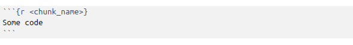

```{r, echo=FALSE, message=FALSE}  
if(! "rmarkdown" %in% installed.packages()) {install.packages("rmarkdown")}
show_chunk <- function(x){
  cat(x)
}
```  


## Introduction

R Markdown is an authoring format that enables easy creation of dynamic documents, presentations, and reports from R. It combines the core syntax of markdown (an easy-to-write plain text format) with embedded R code parts, named chunks, that are run so their output can be included in the final document. R Markdown documents are fully reproducible (they can be automatically regenerated whenever underlying R code or data changes).

We will talk about R Markdown v2, a next generation implementation of R Markdown based on knitr and pandoc. This implementation brings many enhancements to R Markdown, including:

* Many available output formats including HTML, PDF, and MS Word.
* Support for creating Beamer, ioslides, and Slidy presentations.
* New markdown syntax including expanded support for tables and bibliographies.
* Hooks for customizing HTML and PDF output (include CSS, headers, and footers).
* Include raw LaTeX within markdown for advanced customization of PDF output.
* Compile HTML, PDF, or MS Word notebooks from R scripts.
* Extensiblity: create custom templates and even entirely new output formats.
* Create interactive R Markdown documents using Shiny.

Note that PDF output (including Beamer slides) requires an installation of TeX.


## Installation

You can install the R Markdown package from CRAN as follows:

```{r, eval=FALSE}
install.packages("rmarkdown")
```

## Markdown Basics

Markdown is a simple formatting language designed to make authoring content easy for everyone. Rather than writing complex markup code (e.g. HTML or LaTeX), Markdown enables the use of a syntax much more like plain-text email. For example the file on the left shows basic Markdown and the resulting output on the right:


### Basic usage

This section provides quick references to the most commonly used R Markdown syntax.

#### Emphasis

If you want to write words in bold or italic, you have to follow the syntax:

`*italic*`  `**bold**`

*italic*   **bold**

`_italic_`   `__bold__ `

_italic_   __bold__  

#### Headers

To indicate titles of sections according to their hierarchy:

`# Header 1`      

# Header

`## Header 2`     

## Header

`### Header 3`    

### Header


#### Lists

To create a list of items:

* Unordered List:
  
`* Item 1`  
`* Item 2`  
    `+ Item 2a`  
    `+ Item 2b`    
  
  
* Item 1
* Item 2
    + Item 2a
    + Item 2b  
  
      
* Ordered List:

`1. Item 1`  
`2. Item 2`  
`3. Item 3`  
    `+ Item 3a`  
    `+ Item 3b`  

1. Item 1
2. Item 2
3. Item 3
    + Item 3a
    + Item 3b    

#### Links

To add an http address or a link to a phrase:

`http://example.com`  
http://example.com  

`[linked phrase](http://example.com)`  
[linked phrase](http://example.com)  

#### Images

To add an images on the web or local files in the same directory:

``

``

`[alt text]` specifies the text to be inserted if the image is not displayed.

#### Blockquotes

A friend once said:

`> It's always better to give`  
`> than to receive.`

> It's always better to give
> than to receive.

#### Plain Code Blocks

Plain code blocks are displayed in a fixed-width font but not evaulated:
```{r echo=FALSE,comment=""}
show_chunk(
"```
This text is displayed verbatim / preformatted
```"
  )
```


```
This text is displayed verbatim / preformatted
```
#### Inline Code

To include code out of the chunk, you have to enclose it in back-ticks:  

We defined the \` add \` function to  compute the sum of two numbers.  

We defined the ` add ` function to  compute the sum of two numbers. 

#### Horizontal Rule / Page Break

To create an horizontal rule or a page break, you have to insert three or more asterisks or dashes:
 
  
`------`  


---------------------------  


`******` 

***


#### Tables
If you want to create a table, you have to follow the the syntax:

`First Header  | Second Header`    
`------------- | -------------`    
`Content Cell  | Content Cell`    
`Content Cell  | Content Cell`    
    

First Header  | Second Header  
------------- | -------------  
Content Cell  | Content Cell  
Content Cell  | Content Cell


#### Links
If you want to refer to a link or to an image within the same document, you have to label it and subsequently specify the label in [].    

`A [linked phrase][id]`

At the bottom of the document:

`[id]: http://example.com/ "Title"`

Image:  

`![alt text][id]`

At the bottom of the document:

`[id1]: figures/img.png "Title"`


#### Manual Line Breaks

To create a line breaks, you have to end a line with two or more spaces:

Roses are red,  
Violets are blue.

#### Miscellaneous

Other syntax options are:  
                       
`superscript^2^` `~~strikethrough~~`      
superscript^2^ ~~strikethrough~~      

## R Code Chunks
Within an R Markdown file, R Code Chunks can be embedded using the native Markdown syntax for fenced code regions: 



In the above example, `<chunk_name>` is the name of the chunk itself.

For example, the following code chunk computes a data summary and renders a plot as a PNG image:


### Basic Usage

R code chunks can be used as a means render R output into documents or to simply display code for illustration. Here is a simple R code chunk that will result in both the code and it’s output being included:

```{r echo=FALSE,comment=""}
show_chunk(
"```{r}
summary(cars)
```"
  )
```
```{r echo=FALSE ,comment=""}
summary(cars)
```

There are various options that can be applied to the chunk:  

* To display the output of a code chunk but not the underlying R code, you specify the `echo=FALSE` option:

    ```{r echo=FALSE,comment=""}
show_chunk(
"```{r, echo=FALSE}
summary(cars)
```"
  )
    ```
    
    ```{r echo=FALSE ,comment=""}
summary(cars)
    ```

    Note that R code chunks can also be used to render plots. To display a plot while omitting the code used to       generate the plot you’d do this:


    ```{r echo=FALSE, comment=""}
show_chunk(
"```{r, echo=FALSE}
plot(cars)
```"
  )
    ```
    
    
    ```{r echo=FALSE}
plot(cars)
    ```
    
* To display R code without evaluating it, you specify the `eval=FALSE` chunk option:

    ```{r echo=FALSE,comment=""}
show_chunk(
"```{r, eval=FALSE}
summary(cars)
```"
  )
    ```
    
    ```{r eval=FALSE ,comment=""}
summary(cars)
    ```
* To not display warnings, you specify the `warning=FALSE` chunk option:

    For example, this chunk shows both the output and warning:
    ```{r comment=""}
b <- c(1,2,3,4,5)
c <- c(2,3,4)
a <- b/c
a
    ```

    If you specify the `warning=FALSE` chunk option, it shows only the output:

    ```{r echo=FALSE,comment=""}
show_chunk(
"```{r, warning=FALSE}
b <- c(1,2,3,4,5)
c <- c(2,3,4)
a <- b/c
a
```"
  )
    ```
    
    ```{r, warning=FALSE, echo=FALSE, comment=""}
b <- c(1,2,3,4,5)
c <- c(2,3,4)
a <- b/c
a
    ```

* To display errors, you need to specify the `error=TRUE` chunk option:


    ```{r echo=FALSE,comment=""}
show_chunk(
"```{r, error=TRUE}
b <- 4/\"a\"
```"
  )
    ```
    
    ```{r , echo=FALSE, error=TRUE, comment=""}
b <- 4/"a"
    ```

* To not display messages, you specify the `message=FALSE` chunk option;

* To reformat code in a tidy way when displaying it, you specify `tidy=FALSE` chunk option;

* To cache results for future renders, you specify `cache=FALSE` chunk option;

* To set width in inches for plots created in a chunk, you specify a value for`fig.width` chunk option, instead to set height in inches, you specify a value for `fig.height=` chunk option;

* Finally, if you want to comment character to preface results with a symbol like ##, you specify `comment=##` chunk option.


### Table Output

By default data frames and matrixes are output as they would be in the R terminal (in a monospaced font). However, if you prefer that data be displayed with additional formatting you can use the `knitr::kable function`. For example:

```{r echo=FALSE,comment=""}
show_chunk(
"```{r, results='asis'}
knitr::kable(mtcars)
```"
  )
```
Note the use of the `results='asis'` chunk option. This is required to ensure that the raw table output isn’t processed furthur by knitr. The kable function includes several options to control the maximum number of digits for numeric columns, alignment, etc (refer to the knitr package documentation for additional details).


### Caching

If document rendering becomes time consuming due to long computations or plots that are expensive to generate you can use knitr caching to improve performance. The documentation knitr chunk and package options describe how caching works and the cache examples provide additional details.

If you want to enable caching globally for a document you can include a code chunk like this at the top of the document:

```{r echo=FALSE,comment=""}
show_chunk(
"```{r, include=FALSE}
knitr::opts_chunk$set(cache=TRUE)
```"
  )
```
If you run into problems with cached output you can always clear the knitr cache by removing the folder named with a `_cache` suffix within your document’s directory.


## Inline R Code

You can also evaluate R expressions inline by enclosing the expression within a single back-tick qualified with `r`. For example, the following code:  
```{r echo=FALSE,comment=""}
show_chunk(
"I counted`r 1+1`red trucks on the highway." )
```

Results in this output: 

I counted `r 1+1` red trucks on the highway.


## Embedding Equations

You can embed LaTeX or MathML equations in R Markdown files using the following syntax:

* `$equation$` for inline equations (note there must not be white space adjacent to the $ delimiters);
* `$$ equation $$` for display equations;
* `<math ...> </math>` for MathML equations.


## Rendering Output

There are two ways to render an R Markdown document into it’s final output format. If you are using RStudio, then the “Knit” command (Ctrl+Shift+K) will render the document and display a preview of it.

If you are not using RStudio then you simply need to call the `rmarkdown::render` function, for example:

```{r error=FALSE, eval=FALSE}
rmarkdown::render("input.Rmd")
```

Note that in the case using the “Knit” button in RStudio the basic mechanism is the same (RStudio calls the `rmarkdown::render` function under the hood).

## Output Options

R Markdown documents can contain a metadata section that includes both title, author, and date information as well as options for customizing output. For example, this metadata included at the top of an Rmd file adds a table of contents and chooses a different HTML theme:

```{r echo=FALSE,comment=""}
show_chunk("
---
title: \"Sample Document\"
output:
  html_document:
    toc: true
    theme: united
---
  ")
```

R Markdown has built in support for several output formats (HTML, PDF, and MS Word documents as well as Beamer presentations). These formats can also be specified in metadata, for example:


```{r echo=FALSE,comment=""}
show_chunk("
---
title: \"Sample Document\"
output:
  pdf_document:
    toc: true
    highlight: zenburn
---
  ")
```
If you aren’t specifying format options you can also just use a simple format name:

```{r echo=FALSE,comment=""}
show_chunk("
---
title: \"Sample Document\"
output: pdf_document
---"
  )
```


Multiple formats can be specified in metadata:

```{r echo=FALSE,comment=""}
show_chunk("
---
title: \"Sample Document\"
output:
  html_document:
    toc: true
    theme: united
  pdf_document:
    toc: true
    highlight: zenburn
---"
  )
```


If you are using `rmarkdown::render` then you can pass a format name to render to select from the available formats. For example:

```{r, eval=FALSE}
render("input.Rmd", "pdf_document")
```

You can also render all formats defined in an input file with:
```{r, eval=FALSE}
render("input.Rmd", "all")
```
