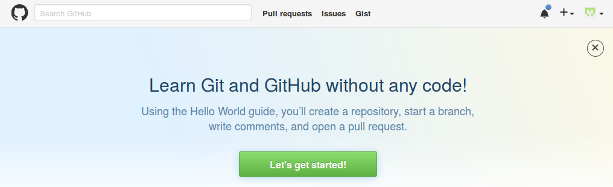
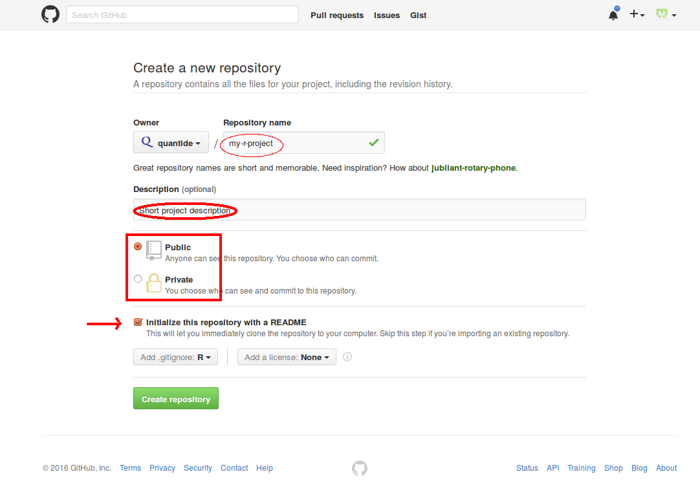
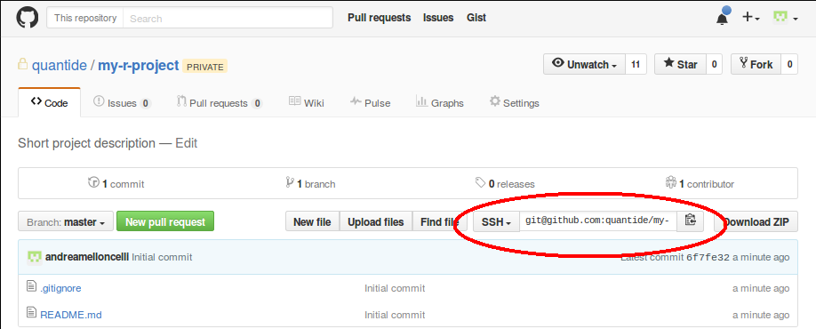

## What a versioning system do

Writing code, but also in general writing, we have the following needs:

1. Backup our code. 
2. Version our code. It means to have a saved copy of our code for
   each phase of the development.
3. Team work. It means develop simultaneously different improvements
   of the code.

## Git and github.com

We are going to present you two tools: git and github.com. Git is a
computational tool to version the code; github.com is an online
repository which takes care to save your code and leaving your team to
access it.

Versioning code means essentially to save every version you decide to
keep. Versions are labeled by an hash (a unique sequence of number and
letters) and saved in a folder named `.git`. Now you can synchronize
this folder with a remote repository, we use github.com for this
purpose.

## Simple Workflow

### Repository Creation

First of all you need to create a git repository, you can do it
locally or remotely as you prefer. We will create the repository
directly on github.com:

1. go in `https://github.com`, and press the '+' (plus sign) on the
   top-right to create a *new repository* (you need an account and to
   be logged in).

   

2. fill in the necessary fields in the form:

   

   * the name of the repository 
   * a short description
   * the choice public or private repository is up to you, but only
      public ones are free.
   * initialize the repository with a readme file.

3. get the repository address from the following screen:

	

	NB: if you don't have an ssh-key in github.com or if you don't
    know what it is, select `https` protocol in place
    of `SSH`.

Now the *remote repository* is operative.

### *Clone* the Repository

Now we need to clone locally this repository in our pc: it means to download the entire
repository and the information to synchronize with it. 
Open the terminal and type:

	$ git clone the-repo-address-got-above

Example:

	$ git clone git@github.com:quantide/my-r-project.git

or (if you chose `https` protocol)

	$ git clone https://github.com/quantide/my-r-project.git

In this way, a new directory `my-r-project` have just been
created. Enter this directory and list all files

	$ cd my-r-project
	$ ls -la

There should be only the `README.md` file and the `.git`
directory. Ignore them for now.

### *Add* new files to the repo

Now we should add some new files. Create new files or copy your
project files inside this folder. Then FOR EACH FILE we tell to git to
add them to the list of file to add or update to the repository. 

Open the terminal, position inside repository folder and type this command:

	$ git add example-file.R

Then we check the list of added file typing:

	$ git status

Finally we add these files with:

	$ git commit -m "comment of this version"

### *Push* changes on the remote repository (github.com)

We want propagate changes to the remote repository. Git retains the
remote repository link so it is enough to type, always in the terminal:

	$ git push

### *Pull* changes committed by others

When your colleague `commit` and `push` its changes, you need to
update your local files. In order to update them, type:

	$ git pull
