 
# Data Visualization with `ggplot2`

Load `ggplot2` package, supposing it is already installed.


```r
require(ggplot2)
```

## Data

### iris

Almost all the following exercises are based on the `iris` dataset, taken from the `datasets` package.  
It is a base package so it is already installed and loaded.  


```r
data("iris")
```

This dataset gives the measurements in centimeters of length and width of sepal and petal, respectively, for 50 flowers from each of 3 species of iris. The species are Iris setosa, versicolor, and virginica.   

`iris` dataset contains the following variables:

* `Sepal.Length`: length of iris sepal 
* `Sepal.Width`: width of iris sepal
* `Petal.Length`: length of iris petal
* `Petal.Width`: width of iris petal
* `Species`: species of iris


```r
dim(iris)
```

```
## [1] 150   5
```

```r
head(iris)
```

```
##   Sepal.Length Sepal.Width Petal.Length Petal.Width Species
## 1          5.1         3.5          1.4         0.2  setosa
## 2          4.9         3.0          1.4         0.2  setosa
## 3          4.7         3.2          1.3         0.2  setosa
## 4          4.6         3.1          1.5         0.2  setosa
## 5          5.0         3.6          1.4         0.2  setosa
## 6          5.4         3.9          1.7         0.4  setosa
```

```r
str(iris)
```

```
## 'data.frame':	150 obs. of  5 variables:
##  $ Sepal.Length: num  5.1 4.9 4.7 4.6 5 5.4 4.6 5 4.4 4.9 ...
##  $ Sepal.Width : num  3.5 3 3.2 3.1 3.6 3.9 3.4 3.4 2.9 3.1 ...
##  $ Petal.Length: num  1.4 1.4 1.3 1.5 1.4 1.7 1.4 1.5 1.4 1.5 ...
##  $ Petal.Width : num  0.2 0.2 0.2 0.2 0.2 0.4 0.3 0.2 0.2 0.1 ...
##  $ Species     : Factor w/ 3 levels "setosa","versicolor",..: 1 1 1 1 1 1 1 1 1 1 ...
```

### mpg

Some of the exercises are based on `mpg` dataset, taken from the `ggplot2` package.  


```r
data("mpg")
```

This dataset contains the fuel economy data from 1999 and 2008 for 38 popular models of car.  
`mpg` dataset contains the following variables:

* `manufacturer`
* `model`
* `displ`: engine displacement, in litres
* `year`
* `cyl`: number of cylinders
* `trans`: type of transmission
* `drv`: drivetrain type, f = front-wheel drive, r = rear wheel drive, 4 = 4wd
* `cty`: city miles per gallon
* `hwy`: highway miles per gallon
* `fl`:  fuel type


```r
dim(mpg)
```

```
## [1] 234  11
```

```r
head(mpg)
```

```
## # A tibble: 6 × 11
##   manufacturer model displ  year   cyl      trans   drv   cty   hwy    fl
##          <chr> <chr> <dbl> <int> <int>      <chr> <chr> <int> <int> <chr>
## 1         audi    a4   1.8  1999     4   auto(l5)     f    18    29     p
## 2         audi    a4   1.8  1999     4 manual(m5)     f    21    29     p
## 3         audi    a4   2.0  2008     4 manual(m6)     f    20    31     p
## 4         audi    a4   2.0  2008     4   auto(av)     f    21    30     p
## 5         audi    a4   2.8  1999     6   auto(l5)     f    16    26     p
## 6         audi    a4   2.8  1999     6 manual(m5)     f    18    26     p
## # ... with 1 more variables: class <chr>
```

```r
str(mpg)
```

```
## Classes 'tbl_df', 'tbl' and 'data.frame':	234 obs. of  11 variables:
##  $ manufacturer: chr  "audi" "audi" "audi" "audi" ...
##  $ model       : chr  "a4" "a4" "a4" "a4" ...
##  $ displ       : num  1.8 1.8 2 2 2.8 2.8 3.1 1.8 1.8 2 ...
##  $ year        : int  1999 1999 2008 2008 1999 1999 2008 1999 1999 2008 ...
##  $ cyl         : int  4 4 4 4 6 6 6 4 4 4 ...
##  $ trans       : chr  "auto(l5)" "manual(m5)" "manual(m6)" "auto(av)" ...
##  $ drv         : chr  "f" "f" "f" "f" ...
##  $ cty         : int  18 21 20 21 16 18 18 18 16 20 ...
##  $ hwy         : int  29 29 31 30 26 26 27 26 25 28 ...
##  $ fl          : chr  "p" "p" "p" "p" ...
##  $ class       : chr  "compact" "compact" "compact" "compact" ...
```

\clearpage

## Scatterplot

### Exercise 1

Let us consider `iris` dataset.

a. Generate a scatterplot to analyze the relationship between `Sepal.Width` and `Sepal.Length` variables.  

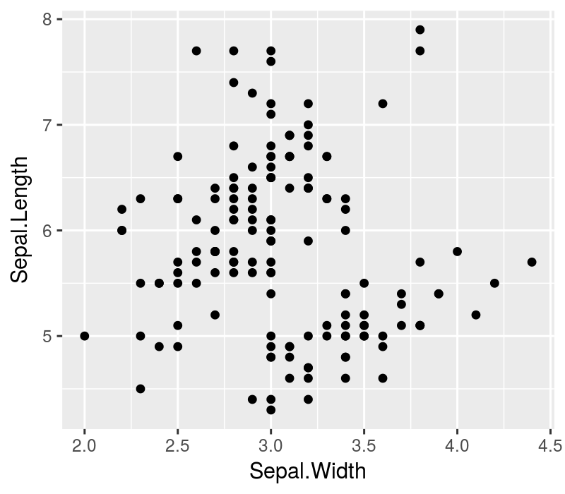

b. Map `Species` to `colour` in `aes()`.

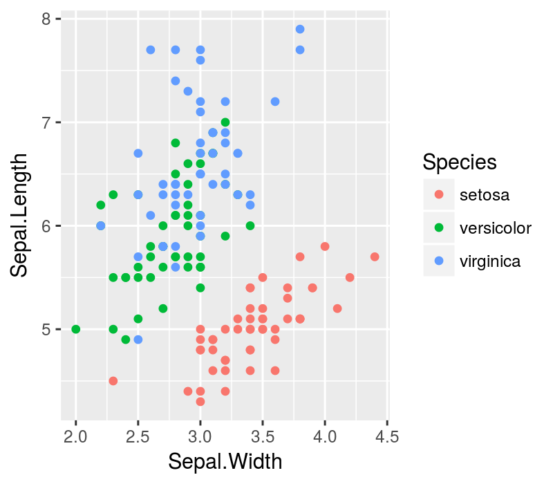

c. Add the title to the plot: `"Scatterplot of Petal.Width and Petal.Length"` (use `ggtitle()` function).

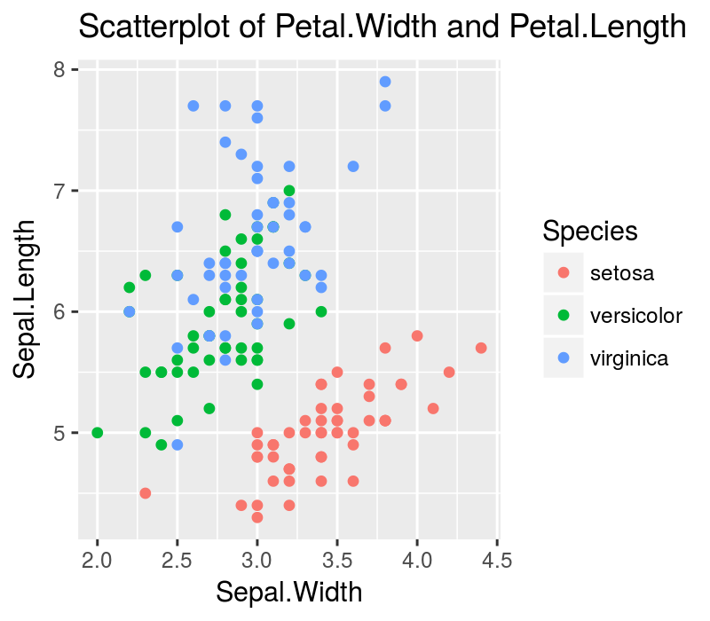

d. Customize plot title by adding `theme(plot.title = element_text())` to the plot and setting `colour` argument to `"red"`, `size` to 16 and `face` to `"bold"`.

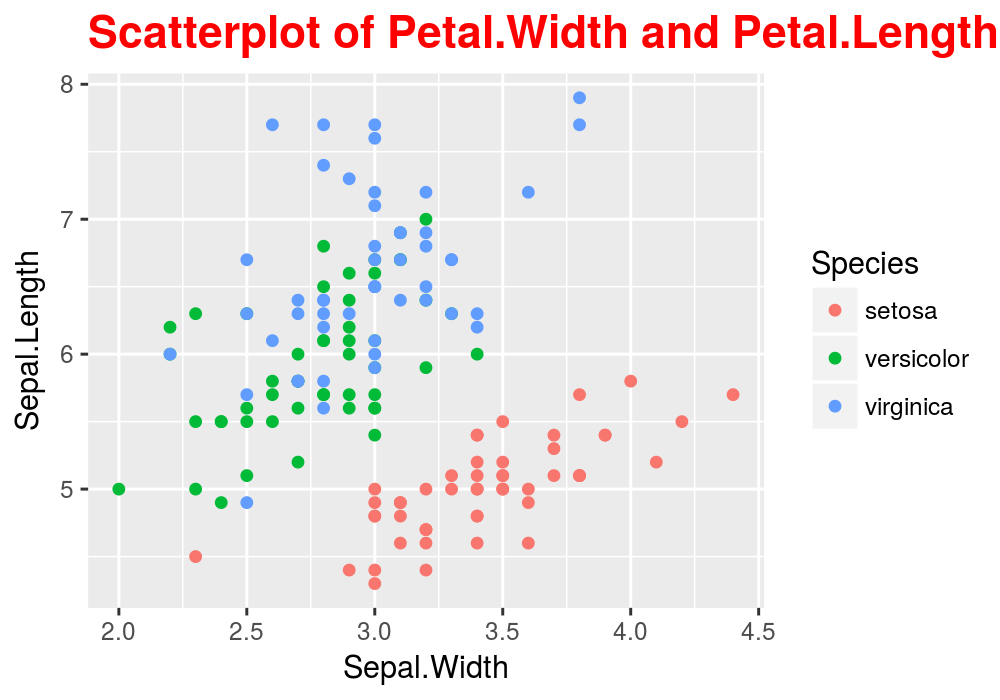


## Barplot

### Exercise 1

Let us consider `mpg` dataset.

a. Represent graphically with a barplot the number of cars for each class.

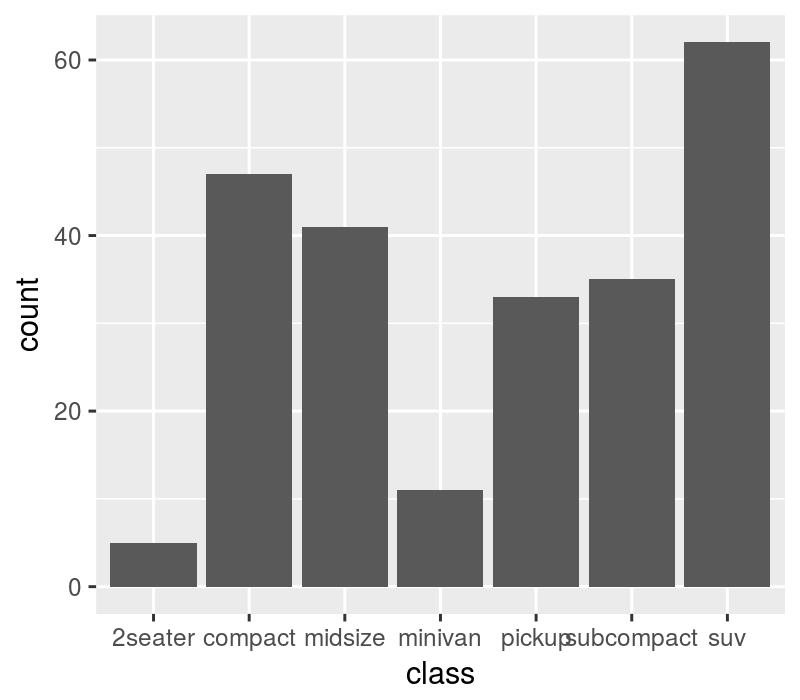

b. Represent graphically with a barplot, the distribution of manufacturer for each class (map `manufacturer` variable to `fill`). 

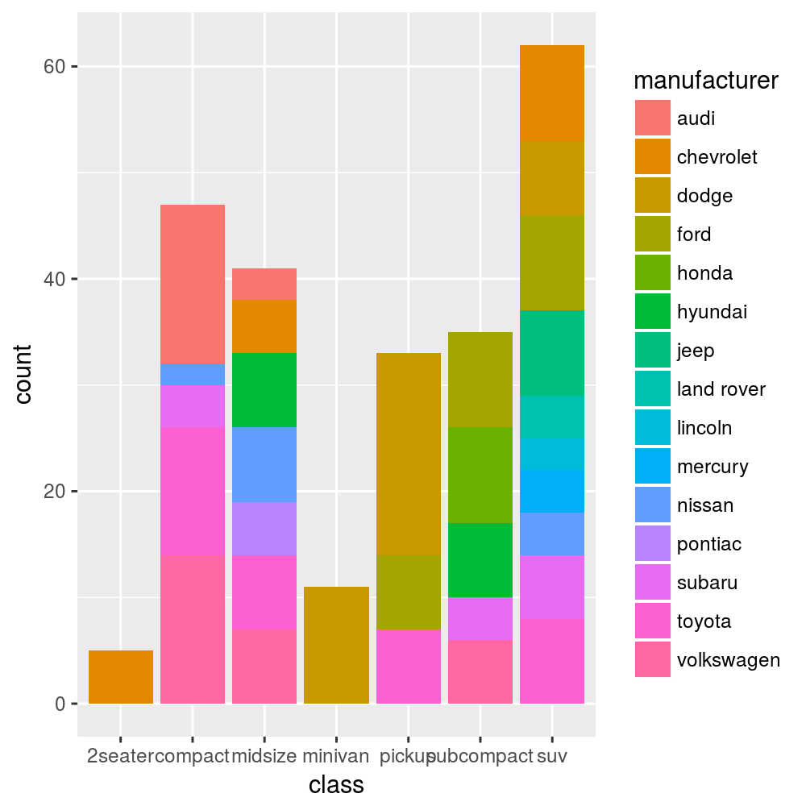


\clearpage

## Histogram

### Exercise 1

Let us consider `iris` dataset.

a. Represent the distribution of `Sepal_Length` variable with an histogram.

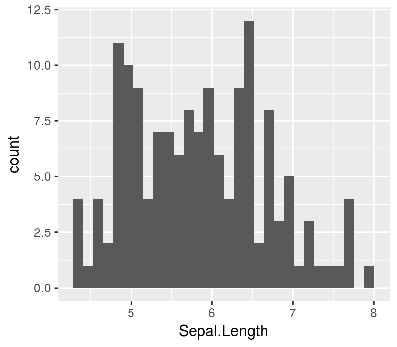

b. Represent each level of `Species` variable in a different panel. Use `facet_grid()` function.

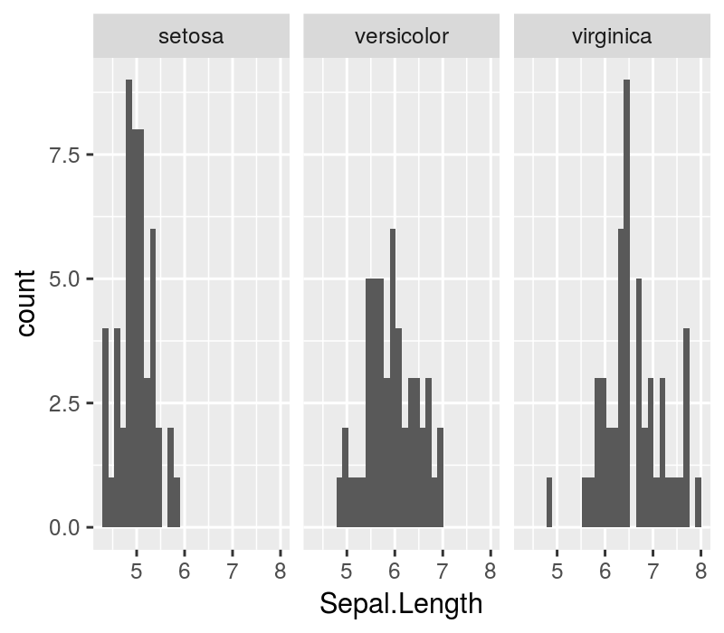

\clearpage

## Boxplot

### Exercise 1 

Let us consider `iris` dataset.

a. Build a boxplot to compare the differences of sepal width accordingly to the type of iris species.

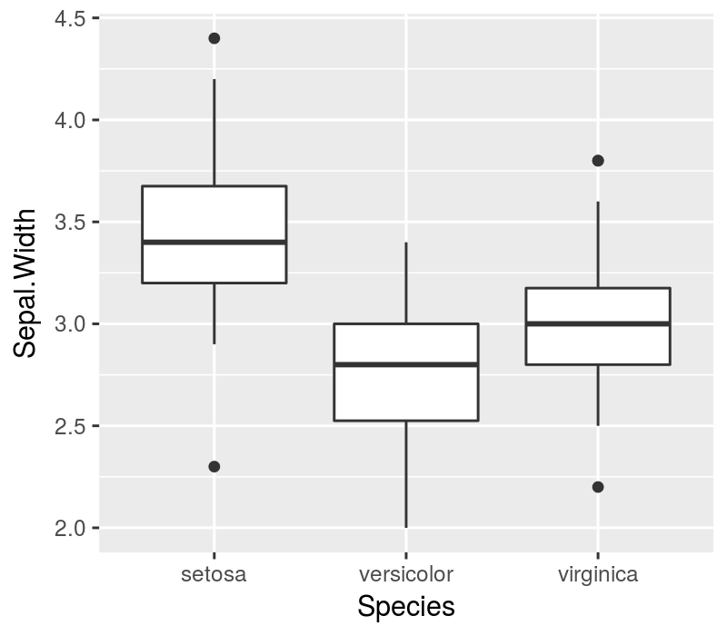

b. Set the fill colour of boxes as `"#00FFFF"`, the lines colour of boxes as `"#0000FF"` and the outliers colour as `"red"`.

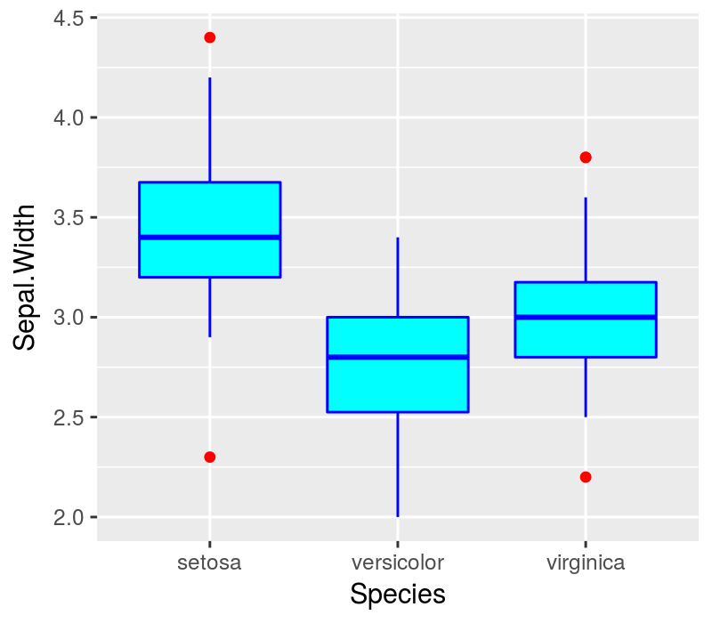

c. Add the plot title: `"Boxplot of Sepal.Width vs Species"`. 

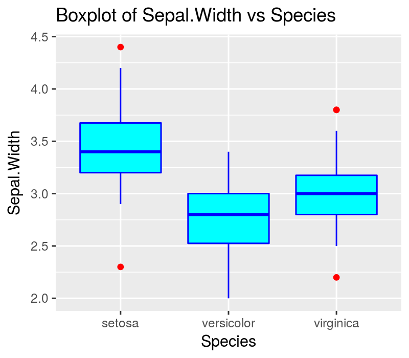

\clearpage

## Lineplot

### Exercise 1 

Let us suppose that the observations on `iris` are taken along time.  
So let us consider the following dataset, named `iris2`, in which `time` variable is added:


```r
require(dplyr)
iris2 <- iris %>% mutate(time=1:150)
```

a. Build a lineplot to visualize the measures of `Sepal.Length` variable along time.

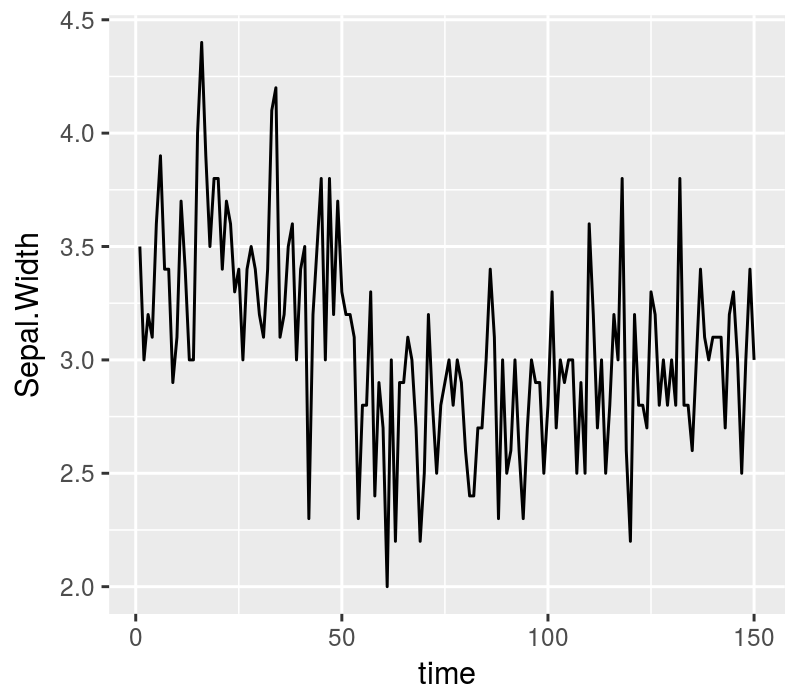

