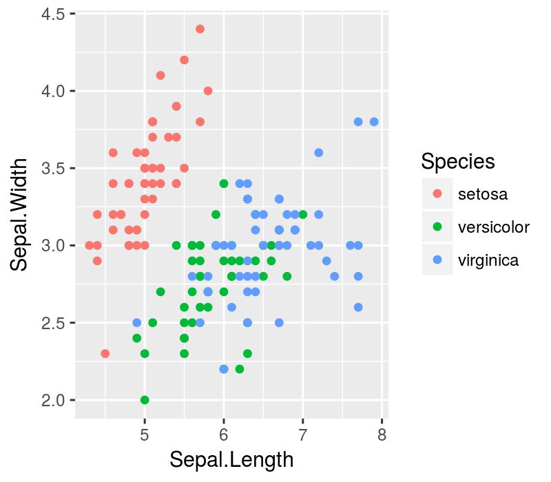

# Data Mining

Before starting the exercises, load the following libraries, supposing they are already installed.


```r
require(qdata)
require(dplyr)
require(ggplot2)
require(nnet)
```

## Neural Networks

### Exercise 1

Consider `iris` dataset.


```r
data(iris)
head(iris)
```

```
##   Sepal.Length Sepal.Width Petal.Length Petal.Width Species
## 1          5.1         3.5          1.4         0.2  setosa
## 2          4.9         3.0          1.4         0.2  setosa
## 3          4.7         3.2          1.3         0.2  setosa
## 4          4.6         3.1          1.5         0.2  setosa
## 5          5.0         3.6          1.4         0.2  setosa
## 6          5.4         3.9          1.7         0.4  setosa
```

A botanist wants to to find a prediction model to assess the probability of belonging to a specific species, for each flower, based on its sepal and petal features. 

a. Analyze the relationship between `Species` and the other variables of `iris` dataset. The following lines of code produces a scatterplot of `Sepal.Length` and `Sepal.Width` by `Species`.

    
    ```r
    ggplot(data=iris, mapping=aes (x=Sepal.Length, y=Sepal.Width, colour=Species)) +
      geom_point()
    ```
    
    
    
    Generate a scatterplot to analyze the relationship between `Petal.Length` and `Petal.Width` by `Species`.    Comment the results.
    


b. Divide the dataset in train and test dataset in this way:

    
    ```r
    set.seed(1)
    samp <- c(sample(1:50,25), sample(51:100,25), sample(101:150,25))
    train <- iris[samp,] 
    test <- iris[-samp,]  
    ```
    and estimate a Neural Network model on train sample to assess the probability of belonging to a specific species, for each flower, based on its measures of `Sepal.Length`, `Sepal.Width`, `Petal.Length`, and `Petal.Width`.  Use `nnet()` function and set the `size` (number of units in the hidden layer) to 2.


c. Use `predict()` function to gain the predictions on test sample. Add `type = "class"` argument to `predict()` function. Add the prediction estimated to `test` dataset.


d. Built a frequency table to compare the original distribution of `Species` and that predicted in `test` data. Comment the results.  


