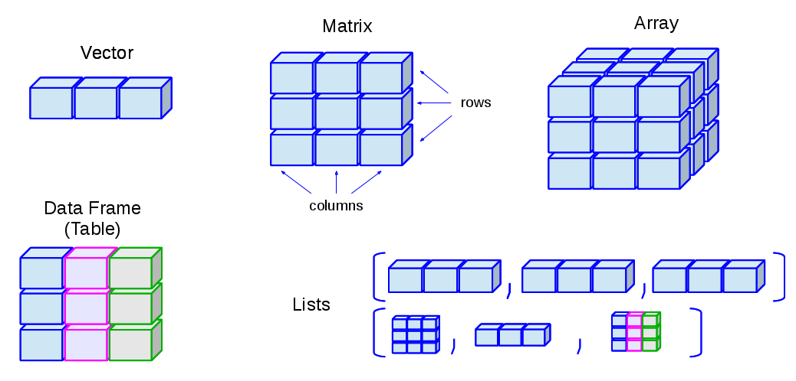

# Data Objects

```{r setup, include=FALSE, purl=FALSE, message=FALSE}
knitr::opts_chunk$set(echo = TRUE)
```


## Data frames

**Data frames** are the primary data structure in R. A data frame is a table, in which each column contains measurements on one variable, and each row contains one case. Each row may be treated as a single observation of multiple "variables". 

```{r dataframe1}
df <- data.frame(
  name = c("James", "Stevie", "Otis", "Bob", "Levon", "Patti", "Karen"), 
  height = c(180, 170, 175, 190, 168, 160, 165), 
  graduated = c(TRUE, TRUE, FALSE, FALSE, FALSE, TRUE, TRUE),
  gender = factor(c("M", "M", "M", "M", "M", "F", "F")), 
  stringsAsFactors = FALSE)
df
```

Technically, in R a data frame is a list of column vectors that can be of various types, but that have to be of the same length. A **vector** is a "primitive" data object, it is a sequence of data elements of the same basic type: 

* numeric
* character 
* logical

```{r vector}
# Numeric vector
height <- c(180, 170, 175, 190, 168, 160, 165)
height
# Character vector
name <- c("James", "Stevie", "Otis", "Bob", "Levon", "Patti", "Karen")
name
# Logical vector
graduated <- c(TRUE, TRUE, FALSE, FALSE, FALSE, TRUE, TRUE)
graduated
```

A data frame can include also **factors**, which are vector-like objects used to specify a discrete classification (grouping) of the components of other vectors of the same length. Factor variables are categorical variables that can be either numeric or string variables.

```{r factor}
# Factor variable
gender <- factor(c("M", "M", "M", "M", "M", "F", "F"))
gender
```

A data frame is generated by `data.frame()` function. The vectors composing the data frame can be defined inside the `data.frame()` function itself (as seen in the first example) or can be defined outside it. In the following example, we refer to the previously defined vectors (`name`, `height`, `graduated`) and factor (`gender`) to generate a dataframe:

```{r dataframe2}
df <- data.frame(name, height, graduated, gender, stringsAsFactors = FALSE)
df
```

The management of character vectors in R requires a detailed explanation. By default, numeric vectors become part of data frames as such, whereas character vectors are transformed into factors whose levels correspond to the vector's unique values. This behaviour is surely effective when character vectors represent categorical variables. However, this behaviour is disturbing when a character vector represents a set of strings which are not necessarily referable to a definite number of modes or to numerous and/or unique modes. This behaviour is managed by the `stringsAsFactors` logical parameter. The default setting is `stringsAsFactors = TRUE` which tells R to transform character vectors into factors inside a data frame; `stringsAsFactors = FALSE` does not change character vectors. 

Furthermore, data imported in R from external sources, such as text files, Excel files or databases, is saved in R as data frame-like objects.

### `tbl_df`: the `dplyr` Data Frame Class

Sometimes data frames have large dimensions. `dplyr` package provide `tbl_df`, which is a wrapper around a data frame that will not accidentally print a lot of data to the screen; indeed tbl objects only print a few rows and all the columns that fit on one screen, describing the rest of it as text.

When the class of data object is not tbl, `tbl_df()` function should be used.  
Let us consider `mtcars`, a dataset included in `datasets` package (automatically loaded at the start of an R session): 

```{r tbl_df, message=FALSE}
# Example of data frame
data("mtcars")
class(mtcars)

# If we do not convert it as a tbl_df, all mtcars rows 
# and columns will be printed when calling mtcars 
dim(mtcars)
mtcars

# dplyr version of the same data frame (tbl_df conversion)
require(dplyr)
mtcars_tbl <- tbl_df(mtcars)
class(mtcars_tbl)
mtcars_tbl
```

## Other Data Objects 

The structures of data objects are represented in the following figure:




We have already seen data frames, vectors and factors. Let us have a look to matrices, array and lists.

### Matrices

Matrices are generalizations of vectors. Like vectors, matrices need to contain elements of the same kind.

```{r matrix}
matrix(1:8, nrow = 2, ncol = 4)
```

### Array  

They are similar to matrices but they can be multi-dimensional (more than two dimensions)

```{r array}
z <- array(1:24, dim=c(2,3,4))
z
```

### Lists

A list is an ordered collection of objects. Each object is a component of the list. Each element of the list can have a different structure. It can be a list itself, a vector, a matrix, an array, a factor or a data frame. A list allows you to gather a variety of (possibly unrelated) objects under one name.

```{r list}
my_list <- list(vec = 1:7, mat = matrix(1:12, ncol = 3),
  lis = list(a = 1, b = letters[1:4]))
my_list
```


