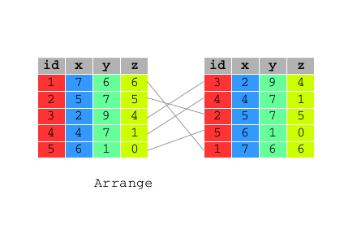
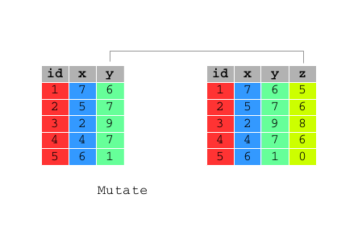

# Data Manipulation with R

```{r setup, include=FALSE, purl=FALSE, message=FALSE}
require(knitr)
opts_chunk$set(echo = TRUE)
```


```{r g1, echo=FALSE, purl=FALSE}
include_graphics("images/flow-dtman.png", dpi=150)
```

The `dplyr` package for `R` is very powerful for data management since:

* it simplifies how you can think about common data manipulation tasks
* it provides simple "verbs", functions that correspond to the most common data manipulation tasks
* it uses efficient data storage backends, so you spend less time waiting for the computer

```{r require_dplyr, message=FALSE}
require(dplyr)
```

The examples of this chapter will refer to `bank` data set which contains information about a direct marketing campaigns of a Portuguese banking institution based on phone calls. 

```{r bank_tbl_df, message=FALSE}
require(qdata)
data(bank) 
bank
```

In the following paragraphs, we will explore the innovations introduced by `dplyr` to make our lifes easier when dealing with dataframes manipulation tasks.     
In particular:

* pipe operator (`%>%`) 
* dplyr verbs for data manipulation 
* dplyr verbs for combining data


## Pipe operator (`%>%`)

`dplyr` pipe operator (`%>%`) allows us to pipe the output from one function to the input of another function. The idea of piping is to read the functions from left to right. It is particularly useful with nested functions (reading from the inside to the outside) or with multiple operations.

\clearpage

```{r g2, echo=FALSE, purl=FALSE, fig.cap="Source: www.datacamp.com"}
include_graphics("images/pipe.png", dpi=150)
```

Pipes can work with nearly any functions (`dplyr` and not-`dplyr` functions), let us see an example.

Suppose we want to visualize the first rows of `bank` dataframe, by using `head()` function.   

Usually we write:

```{r pipe1}
head(bank)
```

By using `%>%`, the code becomes:

```{r pipe2}
bank %>% head()
```

Pipe takes the argument on the left (`bank`) and passes it to the function on the right (`head()`). So you don't need to write the first argument of the function. 

Other arguments of the function must be added to the function itself, as usually done. By default `head()` prints the first 6 rows of the dataframe. Suppose we want to print 10 rows, by setting `n` argument to 10:

```{r pipe3}
bank %>% head(n=10)
```

\clearpage

## dplyr verbs for data manipulation

`dplyr` aims to provide a function for each basic verb of data manipulation and data discovery.

All these functions are very similar:

* the first argument is a data frame;
* the subsequent arguments describe what to do with it, and you can refer to columns in the data frame directly without using $. Note that the column names must be unquoted;
* the result is a new data frame.

Let us have a look to `dplyr` verbs for data manipulation:

* `select()`: select variables of interest 
* `filter()`: filter records of interest
* `arrange()`: reorder the rows 
* `mutate()`: add new variables that are functions of existing ones

###  `select()`

Often you work with large datasets with many columns where only a few are actually of interest to you. 

`select()` allows you to rapidly zoom in on a useful subset of columns.  

 


```{r select}
# Select columns: year, month and day of bank data frame
select(bank, year, month, day)
# Select columns: year, month and day of bank data frame
bank %>% select(year:day)
# Select all columns of bank data frame apart from: year, month and day
bank %>% select(-(year:day))
```

You can rename variables with `select()` by using named arguments:

```{r select_rename}
# Rename id variable as ID
bank %>% select(ID = id)
```


### `filter()`

`filter()` allows you to select a subset of the rows of a data frame.

 


```{r filter1}
# filter all calls made to students with balance above 20,000 in bank data frame
filter(bank, job == "student", balance > 20000)
```

`filter()` allows you to give it any number of filtering conditions which are joined together with `&` and/or the other operators.  

```{r filter2}
# Filter all calls made to student of 18 years in bank data frame
bank %>% filter(age == 18 & job == "student")
```

```{r filter3}
# Filter all calls made to people of 18 or 95 years in bank data frame
bank %>% filter(age == 18 | age == 95)
```

`filter()` can be used also with `%in%` to establish conditions under which filter: 

```{r filter4}
# Filter all calls made to people of 18 or 95 years in bank data frame
bank %>% filter(age %in% c(18,95))
# Filter all calls made to people whose job is admin. or technician in bank data frame
bank %>% filter(job %in% c("admin.","technician"))
# Filter all calls made to people whose job is admin. or technician in bank data frame
bank %>% filter(job == "admin." | job == "technician")
```


### `arrange()`

Function `arrange()` reorders a data frame by one or more variables. If you provide more than one column name, each additional column will be used to break ties in the values of preceding columns:




```{r arrange1}
# Order `bank` data frame by the balance of the account in ascending order
arrange(bank, balance)
```


```{r arrange2}
# Order `bank` data frame by the balance of the account in descending order
bank %>% arrange(desc(balance))
```


```{r arrange3}
# Order `bank` data frame by age of the client and by the balance of the account in descending order
bank %>% arrange(age, desc(balance))
```


\clearpage

### `mutate()`

As well as selecting from the set of existing columns, it’s often useful to add new columns that are functions of existing ones. This is the job of `mutate()`:

 

```{r mutate}
# generate a variable indicating the total number of times each person has been contacted 
# during this campaign and during the previous ones 
mutate(bank, contacts_n = campaign + previous)
```

`mutate()` allows you to refer to columns that you just created:

```{r mutate_col_just_created}
# generate two variable: one indicating the year of birth and one the year of birth without century 
bank %>% mutate(year_of_birth = year - age, year_of_birth_no_century = year_of_birth - 1900)
```

<!--
elaborazioni non assegnate. modificare?
-->


## dplyr verbs for combining data

Very often you will have to deal with many tables that contribute to the analysis you are performing and you need flexible tools to combine them. Supposing that the two tables are already in a tidy form: the rows are observations and the columns are variables, `dplyr` provides  __mutating joins__, which add new variables to one table from matching rows in another.

There are four types of mutating join, which differ in their behaviour when a match is not found. 

* `inner_join(x, y)`
* `left_join(x, y)`
* `right_join(x, y)`
* `outer_join(x, y)`

All these verbs work similarly: 

* the first two arguments, `x` and `y`, provide the tables to combine
* the output is always a new table with the same type as `x`

<!--
While mutating joins are primarily used to add new variables, they can also generate new observations. If a match is not unique, a join will add all possible combinations (the Cartesian product) of the matching observations.
-->

For the next examples we will consider these two small data frames:

```{r}
df1 <- data.frame(id = 1:4, x1 = letters[1:4])
df1
df2 <- data.frame(id = 3:5, x2 = letters[3:5])
df2
```

### `inner_join(x, y)`

```{r g3, echo=FALSE, purl=FALSE}
include_graphics("images/inner_join.png", dpi=200)
```

`inner_join(x, y)` only includes observations that match in both x and y:

```{r}
inner_join(df1, df2)
```

### `left_join(x, y)`

```{r g4, echo=FALSE, purl=FALSE}
include_graphics("images/left_join.png", dpi=200)
```

`left_join(x, y)` includes all observations in `x`, regardless of whether they match or not. This is the most commonly used join because it ensures that you don't lose observations from your primary table:

```{r}
left_join(df1, df2)
```

### `right_join(x, y)`

```{r g5, echo=FALSE, purl=FALSE}
include_graphics("images/right_join.png", dpi=200)
```

`right_join(x, y)` includes all observations in `y`. It’s equivalent to `left_join(y, x)`, but the columns will be ordered differently:

```{r}
right_join(df1, df2)
left_join(df2, df1)
```


### `full_join()`

```{r g6, echo=FALSE, purl=FALSE}
include_graphics("images/full_join.png", dpi=200)
```

`full_join()` includes all observations from `x` and `y`:

```{r}
full_join(df1, df2)
```

The left, right and full joins are collectively know as outer joins. When a row doesn't match in an outer join, the new variables are filled in with missing values.


