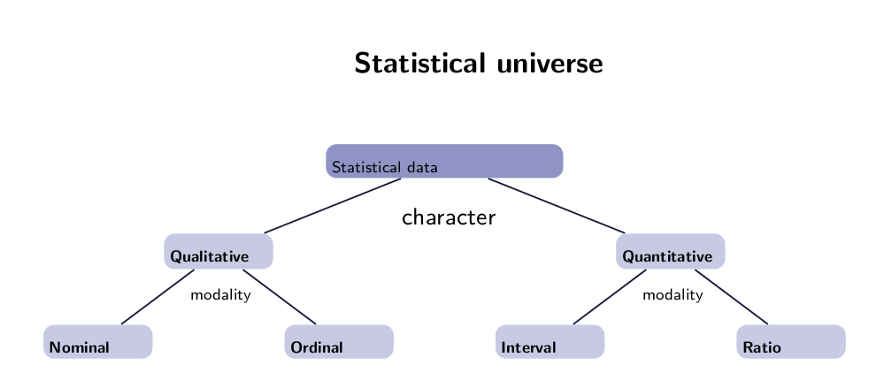
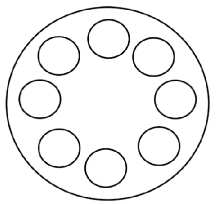

```{r setup, include=FALSE, purl=FALSE}
require(knitr)
# La directory di lavoro va definita all'inizio in questo modo per non doverla ripetere in
# ogni chunk! (con echo=F si eseguono i comandi del chunk senza mostrarli)
opts_chunk$set(list(dev = 'png',fig.cap='',fig.show='hold',dpi=100,fig.width=7, fig.height=7,fig.pos='H!',fig.path="images/oth-"))
options(width = 120)
```

## Scale Types



## Statistical Indices

Types of statistical indices which can be calculated for data description are three:

* centrality indices
* variability indices
* "association" indices

### Centrality Indices

Measures of central tendency or measures of position provide the value around which data are distributed. 
The central tendency measurement is one of the most appropriate indices to summarize a data series.
The measure of central tendency is the first and more intuitive index about data distribution.  
The most important indices are mainly three: 

* mean
* median 
* quantiles

<!--
The choice of the measure of central tendency depends from distribution features and from scale type.
-->

#### Mean

The (simple) arithmetic mean is the most commonly used measure of central tendency.

It is defined as the sum of values of all observations divided by the total count of observations.

Given a sample of $n$ units $\underline{X} = X_1, X_2, \dots, X_i, \dots, X_{n-1}, X_n \;$ the (sample) arithmetic mean is defined via the equation: $$ \overline{X}=\frac{\sum_{i=1}^n{X_i}}{n} $$

__Example__

The following vector contains the daily sales (expressed in euros) of a shop for the last 10 days. 

```{r}
sales <- c(1000, 1200, 1500, 2000, 1100, 1900, 2300, 1200, 1200, 2000)
```

Calculate the mean sales of `sales` vector:

```{r}
mean(sales)
```

`mean()` function computes the arithmetic mean of a vector of values.


#### Median

The median is the numeric value separating the higher half of a sample from the lower half. It can be found by arranging all the observations from lowest value to highest value and picking the middle one. 
In particular, if $n$ is odd then the median is the middle observation, i.e. the observation in the position $\frac{n+1}{2}$; if $n$ is even then the median can be calculated as the average between the observations in positions $\frac{n}{2}$ and $\frac{n}{2}+1$.

__Example__

Calculate the median sales of `sales` vector:

```{r}
median(sales)
```

`median()` function computes the median of a vector of values.

#### Quantiles

q-Quantiles (or Percentiles) are cutpoints dividing the observations in a sample (arranged from lowest value to highest value) into q subsets of (nearly) equal sizes.

For example, the 37-th quantiles ($P_{37}$) is the value that cuts off lowest 37% of data.
The $P_{100}$ is the value that cuts off the 100% (more or less) of data.

Common quantiles have special names. In particular, quartiles are the three cut points that will divide a dataset into four equal-size groups.

The quartiles of a data series can be defined as follow:

* Q1 = the median of the first half of the ordered series, i.e. it cuts off lowest 25% of data, or highest 75%.
* Q2 = the median.
* Q3 = the median of the second half of the ordered series, i.e. it cuts off lowest 75% of data, or highest 25%.

__Example__

Calculate the quartiles of `sales` vector:

```{r}
# To get a specific quartiles
quantile(x = sales, prob = 0.25)
quantile(x = sales, prob = 0.50)
quantile(x = sales, prob = 0.55)
# To get all quartiles
quantile(x = sales)
```

`quantile()` function computes the quantiles of a vector of values. If you specify `prob` argument as the quantile you want to compute (value between [0,1]), it returns the value corresponding the specified quantile, otherwise it computes all quartiles.

### Variability Indices

The second important feature of a data distribution is the dispersion or variability.
The dispersion defines if values are more or less concentrated around the central tendency.

The most important indices are:

* variance
* standard deviation
* standard error


#### Variance

Variance is a measurement of the spread between numbers in a data set. The variance measures how far each number in the set is from the mean. 

Variance of the population, which is indicated with $\sigma^2$, is calculated by taking the deviance (or sum of squares), that is the squares of the differences between each number in the set and the mean, and dividing it by the number of values in the set.

$$V_x = \sigma^2 = \frac{\sum_{i=1}^N{\left(x_i-\mu\right)^2}}{N}$$ 

  where $\mu$ is the "true" population mean and $N$ is the count of all population units.

Sample variance, which is indicated with $s^2$, is obtained dividing the deviance by $n−1$,

$$\hat{V}_x = s_x^2 = \frac{\sum_{i=1}^n{\left(x_i-\overline{x}\right)^2}}{n-1}$$

  where $\overline{x}$ is the sample mean and $n$ is the sample size.

The sample variance is always used when sample data are used to know the population characteristics, i.e. when inferential statistics is used.  

__Example__

Calculate the sample variance of `sales` vector:

```{r}
var(sales)
```

`var()` function computes the sample variance of a vector of values.

#### Standard Deviation

The standard deviation is the square root of the variance. It is indicated with $\sigma$ when considering the population standard deviation and with $s$ when considering the sample standard deviation.   
The standard deviation for a sample can be calculated, from the data series, as:

$$s_x = \sqrt{\hat{V}_x} = \sqrt{\frac{\sum_{i=1}^n{\left(x_i-\overline{x}\right)^2}}{n-1}}$$

__Example__

Calculate the sample standard deviation of `sales` vector:

```{r}
sd(sales)
```

`sd()` function computes the sample standard deviation of a vector of values.

#### Standard error

The standard error is a measure of the dispersion of the sample mean around the true mean.  
It can be calculated as:  

$$se_x = \overline{s}_x = \frac{s_x}{\sqrt{n}}$$

  where $s_x$ is the sample standard deviation of the sample $x$ and $n$ represents the sample size. 
  
  
__Example__

Calculate the standard error of `sales` vector:

```{r}
sd(sales)/sqrt(length(sales))
```

### "Association" Indices

Association indices analyze the type and the intensity of the relationship between variables (two or more). 

The most important association indices are two:

* covariance
* correlation

#### Covariance

When a linear relationship between two variables ($x$ and $y$) exists, then the index that highlights this relationship is the covariance index.  
It can be calculated as: 

  $$Cov_{xy} = \frac{\sum_{i=1}^n{\left( x_i-\overline{x}\right)\left( y_i-\overline{y}\right)}}{n-1}$$

where $\overline{x}$ is the sample mean of $x$ variable, $\overline{y}$ is the sample mean of $y$ variable and $n$ is the sample size. 

The covariance can assume:

* positive values, when an increasing linear relationship exists between the two variables;
* negative values, when a decreasing linear relationship exists between the two variables;
* close to zero values, when a linear relationship doesn’t exist between the two variables.

#### Correlation

The correlation index may be used as a standardized covariance:

$$Cor_{xy} = \frac{Cov_{xy}}{s_xs_y}$$

where $s_x$ is the sample standard deviation of $x$ variable and $s_y$ is the sample standard deviation of $y$ variable.

The correlation index may only assume values between -1 and 1.

__Example__

Let us consider data of the mean diameter of the caps produced by a forging machine. 

```{r, message=FALSE}
require(qdata)
data(bottlecap)
head(bottlecap)
```

Scheme of the mould of caps:




We want to check if the caps diameter measures are correlated, so that it is
possible to non measure all caps produced by the same machine in quality control phase.


Correlation between caps diameter measures can be investigated numerically and graphically by correlation matrix (which contains correlation indices between variables) and graphically by correlation plot (a matrix of scatterplots).


```{r, comment='', message=FALSE}
cor(bottlecap)
require(GGally)
ggp <- ggpairs(bottlecap)
print(ggp)
```


`cor()` function computes the correlation between `bottlecap` columns. If you want to compute only covariance use `cov()` function.  
`ggpairs()` function of `GGally` package produces a matrix of scatterplots between `bottlecap` columns.   

Looking at the outputs produced, we see that many of the measures have a high correlation value (> .7). In particular, the measures of Cavity.1 and Cavity.2, Cavity.2 and Cavity.3, Cavity.6 and Cavity.7 have a correlation value greater than .845.
Therefore the value of Cavity.2 instead of Cavity.1, or instead of Cavity.3 could be used.  

<!--
Interesting note: The correlations are not transitive: the correlation between Cavity.1 and Cavity.3 is .65, the correlation between Cavity.3 and Cavity.6 is .401; the correlation between Cavity.1 and Cavity.6 is negative!
-->