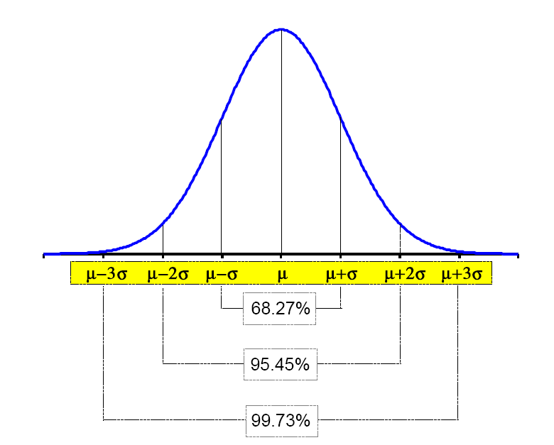
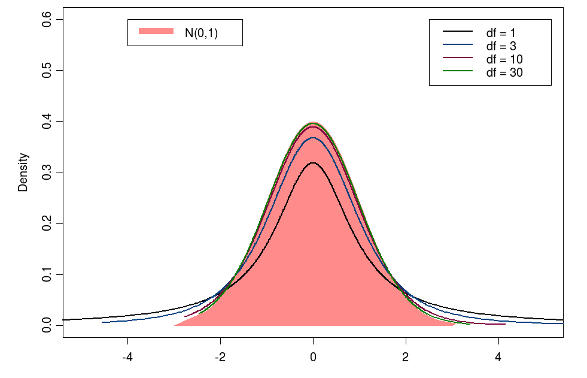

```{r setup, include=FALSE, purl=FALSE}
require(knitr)

opts_chunk$set(list(dev = 'png',fig.cap='',fig.show='hold',dpi=100,fig.width=5, fig.height=5,fig.pos='H!',fig.path="images/oth-"))
```

<!--
Manca il concetto di probabilità
-->

In statistics the aim is to associate the examined sample with a model.
The examined sample presents a random phenomenon if it has uncertain individual outcomes, but there is nonetheless a regular distribution of outcomes in a large number of repetitions. 

The probability of any outcome of a random phenomenon can be defined as the proportion of times the outcome would occur in a very long series of repetitions. For example, let us consider the coin toss. The result of any single coin toss is random. But the result over many tosses is predictable, we would expect 50% times to see H and 50% to see T.

Numerical outcomes for a random phenomenon can be described by mathematical instruments called random variables.
Random variables are "mathematical models" which gives probability values to possible numerical values.  

A random variable has a probability distribution. A probability distribution is a formula or a table used to assign probabilities to each possible value of a random variable.
A probability distributions can be of two kinds: 

* discrete 
* continuous

A discrete distribution means that the random variable can assume one of a countable (usually finite) number of values. The argument values are the natural numbers: $0, 1, 2, . . . , n$. 

A continuous distribution means that the random variable can assume one of an infinite (uncountable) number of different values.

<!--
In the discrete random variables, the argument values are the natural numbers: $0, 1, 2, . . . , n$. They are necessary to calculate the probability of
events that have a discrete number (finite or infinite) of recurrences.

A random variable is continuous when its distribution is continuous. With this continuous variable, the probabilities are calculated only for intervals values. For specific values, they are always zero.
-->

## Discrete distributions

Among the discrete distribution, two are really important:

* $Binomial$
* $Poisson$

Both the distributions explain phenomena related to the behavior of binary phenomena: error - success, goes - does not goes,
defective - not defective. In particular, they define the number of successes that can be verified in $N$
trials, given a certain probability of success of each trial.

The two functions are different because:

* the $Binomial$ deals with medium-high probability events and has a maximum number of successes (equal to the number of trials)
* the $Poisson$ deals with very low probability events and has not a maximum number of successes

### Binomial Distribution

The $Binomial$ is a discrete and finite theoretical distribution, for independent events classified with a binary variable and it is defined by the following
density function:

$$ p(x;n,p) = \frac{n!}{x!(n-x)!} \, p^x(1-p)^{n-x} $$

where:
    
* $x$ = number of successes 
* $n$ = number of trials
* $p$ = probability of success of a single trial 

The probability distribution of the $Binomial$ depends on two parameters: $p$ and $n$.  
<!--
If $p$ and $q = 1−p$ are equal to 0.5 the distribution is always symmetric, independently of $n$. 
If $p$ is highly greater or less than $q$, the distribution is asymmetric. This asymmetry tends to decrease when $n$ increases.
-->
The mean of the distribution is $E(x) = n \cdot p$ and the variance is $V(x) = n \cdot p \cdot (1-p)$

#### Example

Hospital records show that of patients suffering from a certain disease, 75% die of it.   
What is the probability that of 6 randomly selected patients, 4 will survive?

<!--
The distribution is binomial as there are only 2 outcomes (the patient dies, or does not).
-->

```{r}
dbinom(x = 4, size = 6, prob = 0.25)
```

`dbinom()` function computes the density function of a binomial distribution. The argument `x` represents the number of successes, in this case is the number of patients that will survive; the argument `size` represents the number of trials, the sample of randomly selected patients, and the argument `prob` is the probability of success on each trial, in this case the probability of survive. 

### Poisson

The $Poisson$ is a discrete theoretical distribution and it is totally defined by only one parameter, the mean $\mu$.  
Its density function is:

$$p(x; \mu) =\frac{\mu^x}{x!}\, e^{-\mu}$$

where:
    
* $x$ = number of successes per interval 
* $\mu$ =  average number of successes per interval 

The mean and the variance of the distribution is $E(x) = V(x) = \mu$.
The mean is indicated also with $\lambda$, instead of $\mu$.

<!--
The Poisson distribution has a very asymmetric shape and the most frequent and probable class is zero, when $\mu$ is less than 1. It is still
asymmetric for values of $\mu$ less than 3.
A mean equal to 6-7 establishes a symmetric distribution of probabilities and it is well approximated by the normal (or Gaussian) distribution.
-->

The $Poisson$ distribution is used to model events that happen both in space and time intervals.  

<!--
The Poisson distribution law is also called law of rare events, because the probability that the event happens is really low and it 
can be used instead of the binomial distribution, for $p$ less than 0.05 and n greater than 100.
Indeed, when the number of data $n$ is really high 
and the probability $p$ is really small, the binomial distribution has some practice disadvantages. 
For $n$ that tends to infinite and $p$ that tends to 0, in a way that $n·p$ is constant, Poisson demonstrated that:
$$p(x;n,p) = \frac{n!}{x!(n-x)!} \, p^x(1-p)^{n-x}  \rightarrow  p(x;\mu) = \frac{\mu^x}{x!}\, e^{-\mu}$$
if: $n\rightarrow \infty$, $p\rightarrow 0$, $n \cdot p = \mu$
So even in the Poisson distribution, the expected mean $\mu$ is given by $E(x) = n \cdot p$, and the variance is equal to $V(x) = n\cdot p \cdot (1-p)$
-->

#### Example

The average number of homes sold by an estate agency is 1 home per day. 
What is the probability that 2 homes will be sold tomorrow?

```{r}
dpois(x = 2, lambda = 1)
```

`dpois()` function computes the density function of a poisson distribution. The argument `x` represents the number of successes, in this case is 2 homes sold, and the argument `lambda` represents the mean of the poisson distribution or the average number of successes, in this case is 1, the average number of house sold per day. 


## Continuous Distributions

Among them, the distribution most frequently used and the most useful one for the experimental research, which is the basis of the parametric
statistics, is the $Normal$ or $Gaussian$ distribution.

Other continuous distributions are:

* $Gamma$
* $Chi-squared$
* $Student’s$ $t$
* $F$


### Normal distribution

The most important continuous distribution is the normal curve. The name normal curve comes from the convinction (not always correct) that a great number of phenomena, both the biological ones and the physical one, are usually distributed according the Gaussian curve.  

<!--
Its name curve of accidental errors, mainly spread in the phisical subjects, comes from the experimental observations where the distribution
of errors, committed when the same size is measured many times, results to be well approximated by this curve.
-->

The normal distribution is defined by two parameters:

* $\mu$, location parameter, that establishes the position of the distribution;
* $\sigma$, scale parameter, that establishes the size of the distribution.

A normal random variable is defined from $-\infty$ to $+\infty$, and, as it is a probability distribution, its integral from $-\infty$ to $+\infty$ is equal to 1.
At the extremes, it asymptotically tends to zero, and in the tails over the value $6\sigma$, the area underlying is so limited that, with a good
approximation, can be considered cut off.

From the theoretical point of view, the normal distribution well represents observational errors, the noise and other phenomena using a
mathematical model.  

The probability that the variable has a value between two specific values, corresponds to the measure of the area underlying the curve included
between the two values (the area represented in the following picture). The probability that the variable as a precise value is equal to zero, as the area (integral) included between the value and itself is null (the segment
represented in the picture).


The expression of the probability density function of the normal distribution is the following one:

 $$ f(x;\mu,\sigma) = N(\mu,\sigma) = \frac{1}{\sigma \sqrt{2\pi}}\, e^{-\frac{1}{2} \left( \frac{x-\mu}{\sigma} \right) ^2} $$

<!--
From the mathematical point of view, the Gaussian distribution can be considered as the limit of the binomial distribution:
for $n$ that tends to infinite; while both $p$ and $q$, that is  $(1-p)$, don’t tend to 0 (this condition distringuishes the Gaussian distribution from the Poisson one).

If $n$ tends to infinite and $p$ stays constant, the mean ($n \cdot p$) is approximated to infinite and makes the distribution without any practice applications.
On the contrary, the considered variable, that with few data was qualified by discrete unities, can be expressed by always smaller unities. It will
become acceptable to define it as a continuous quantity.

The Gaussian distribution can be considered also the limit of the Poisson distribution, when $x$ e $\mu$ become really high.
-->


The most important characteristics of the normal distribution are: 

* a relatively higher frequencies of the central values and a gradually lower frequencies towards the extremes
* the density function is symmetric compared to/around the mean: it increases from $-\infty$ to the mean and then it decreases up to $+\infty$
* it has two inflection points: the first one, rising, in the point $\mu -\sigma$; the second one, descending, in the point $\mu + \sigma$
* if the distribution is normal, in order to know its distribution, it is enough to know two parameters of a series of data, the mean $\mu$ and the variance $\sigma^2$
* The infinite positions (on x-axis) and shapes of the normal distribution can be determined by the combination of the differences of the mean and the variance, respectively. 


* In the statistics practice, the most useful characteristics of the normal distribution are not the ratio between x-axis and y-axis, explained before, but
the relations between the distance from the mean and the probability density represented by the curve. In an easiest way, it is possible to define how many data are included between the mean and a specific value. This is obtained by measuring the distance from the $\mu$ mean in $\sigma$ standard deviations unities.  
  The fraction of the cases included:

    * between  $\mu + \sigma$ and  $\mu - \sigma$ is equal to 68.27%;
    * between $\mu + 2\sigma$ and $\mu - 2\sigma$ is equal to 95.45%;
    * between $\mu + 3\sigma$ and $\mu - 3\sigma$ is equal to 99.73%. In pratice, in the normal curve, almost all the data are included around the mean whose wideness is $3\sigma$.




#### Standard Normal distribution

The infinite shapes of the normal distribution, determined by the combination of the differences of the mean and the variance, can be all
connected to the same shape.

The $standard$ $normal$ $distribution$, or reduced normal, is obtained by the transformation of the variable given by:

$$ Z = \frac{X-\mu} {\sigma} $$


The standardizing is a transformation that consists in: 

* making the mean equal to zero ($\mu=0$), because the mean is subtracted to every value;
* taking the standard deviation ($\sigma$) as unit of measurement ($\sigma = 1$) of the new variable.

After the change of the variable, in the reduced normal, the probability density is given by:

$$y = f(z) = N(0,1) = \frac{1}{\sqrt{2\pi}}\,e^{-\frac{1}{2}z^2} $$

This formula highlights how the distribution’s shape does not depend either on the mean or on the variance of the original distribution.

#### Example

A light bulb lasts in average 300 days with a standard deviation of 50 days. Assuming that bulb life is normally distributed.
What is the probability that a light bulb will last 365 days?

```{r}
dnorm(x = 365, mean = 300, sd = 50)
```

`dnorm()` function computes the density function of a normal distribution. The argument `x` represents the number of days the light bulb will last and the arguments `mean` and `sd` represents the mean and the standard deviation of the bulb life distribution.

<!--
b) What is the probability that an light bulb will last at most 365 days?

```{r}
pnorm(q = 365, mean = 300, sd = 50)
```
-->

### Gamma distribution

Another continuous distribution for positive values is the $Gamma$ distribution.

The random variable $X$ with probability density function

$$f(x;\theta,k)= Ga(\theta,k) = \frac{x^{k-1} \cdot e^{- \frac{x}{\theta}}}{\theta^{k} \cdot \Gamma(k)},    \quad x>0$$   

is a $Gamma$ random variable with parameters $\theta > 0$ and $k > 0$.

$\theta$ is the scale parameter as it most influences the spread.    
$k$ is the shape parameter as it most influences the peaked-ness of the distribution.  
$\Gamma(k)$ is a  a constant dependent on $k$ and its value is: 

$$\Gamma(k) = \int_{0}^{+ \infty} x^{k-1} e^{-x} dx,     \quad k>0$$ 

and this is a finite integral.

A $Gamma$ random variable has mean $E(x) = k \cdot \theta$ and variance $V(x) = k  \cdot \theta^{2}$

This is a graphical representation of a Gamma distribution for different scale and shape values:


### Chi-squared distribution

Given $n$ independent random variables $Z_1,\;Z_2,\;  \dots,\; Z_n$, normally distributed with $\mu = 0$ and $\sigma = 1$, the $\chi_\nu^2$, where $\nu = n$, is a random variable obtained by the sum of their squares.
The density function of the $\chi^2$ is obtained only from the parameter $\nu$, the number of degrees of freedom ($df$).
The distribution is defined between $0$ and $+\infty$, and when the number of degrees of freedom increases, it tends to have a shape similar to that of the normal.

Graphical representation of the distribution $\chi^2$ for different values of $df$:
  


### Student's t distribution

The Student’s $t$-distribution takes into consideration the relations among the mean and the variance estimations, in little size samples, when the sample variance is used.  
The choice between the use of the normal distribution and the Student’s $t$-distribution in the comparison among means comes from the knowledge
of the $\sigma^2$ variance of the population or from the fact that it is unknown. In this last case, it is necessary to use the $s^2$ sample variance.
The Student’s $t$ random variable is defined as the ratio between a standard normal random variable and the square root of a $\chi^2$ divided by its degrees
of freedom:

$$t_\nu = \frac{Z}{\sqrt{\chi^2_\nu/\nu}}$$

If a series of $n$ observations ($X_1, \cdots , X_n$) is drawn by a normal distribution, it is possible to show that the ratio

  $$t_{n-1}=\frac{\overline{X}-\mu}{s/\sqrt{n}}$$

is distributed as a Student's $t$ with $n - 1$ degrees of freedom.  
The corresponding curve is defined between $-\infty$ and $+\infty$, symmetric, little lowly that the normal and with higher frequencies in the extremes, when the number of df ($\nu$) is really small.

Starting from a number of degrees of freedom around 30, the Student's $t$-distribution tends to a normal distribution.

This is a graphical representation of a Student’s $t$-distribution:



### F-distribution
  
Another interesting distribution, from which it is founded the inference of a big part of the parametric statistics, is the $F$-distribution.
It corresponds to the distribution of the ratio of 2 $\chi^2$ indipendent random variables ($A$ e $B$), divided by its corresponding degrees of freedom ($m$ e $n$).

This ratio $F$ is defined between 0 and $+\infty$.

The $F$ distribution represents a generalization of the $t$ distribution.
The $t$ and $\chi^2$ distribution have only one parameter, the $F$ has two parameters: the number of degrees of freedom both of the numerator and of the denominator.
The square of a random variable $t$ of Student with $n$ degrees of freedom is equal to a $F$ of Fisher distribution with degrees of freedom $1$ and $n$.

This is the graphical representation of a $F$-distribution


