```{r setup, include=FALSE, purl=FALSE}
require(knitr)

opts_chunk$set(list(dev = 'png',fig.cap='',fig.show='hold',dpi=100,fig.width=5, fig.height=5,fig.pos='H!',fig.path="images/oth-"))
options(width=120)
```

```{r, message=FALSE}
require(dplyr)
require(ggplot2)
require(BSDA)
require(tidyr)
require(qdata)
```


The problem of inferential statistics rises when data refer not to the whole population as subject of the study, but
they refer only to a part of it. However, the aim of the research is to draw conclusions on the whole population.  
Inferential statistics techniques provide the guidelines and the formulas to obtain these kinds of information.

These techniques are divided into three fundamental subgroups:

* Techniques for the point estimation;
* Confidence intervals valuation;
* Statistical hypothesis test.

In the following paragraph we will analyze the most important statistical hypothesis tests and their features.

## Z-test 

### Confidence interval for the mean of a normal distribution

It is supposed to analyse a population in order to obtain information about a characteristic (X) known to be normally distributed with unknown mean $\mu$ and known $\sigma$ standard deviation. That is:
    $$ X \sim N(\mu,\; \sigma) $$
It is of interest to know the value of the unknown parameter $\mu$. In order to have this information, all the population requests should be measured and then averaged out.
Depending on the size and on the kind of population, this aim could become complex and hard to achieve, or almost impossible.

An alternative could be drawing a sample of $n$ elements of the population and then calculating the sample mean ($\overline{x}$). Afterwards, this value will be used as the best estimation or the polite choice as regards the value of $\mu$.
If we repeat the same process, the second time we will almost certainly obtain a different value of $\overline{x}$.
If we repeat the process $k$ times, we will obtain a $\overline{x}_1,\;\overline{x}_2,\;\dots,\;\overline{x}_k$ series of $k$ samples means. All of them will almost certainly be different and probably near to the true value of the unknown parameter ($\mu$).

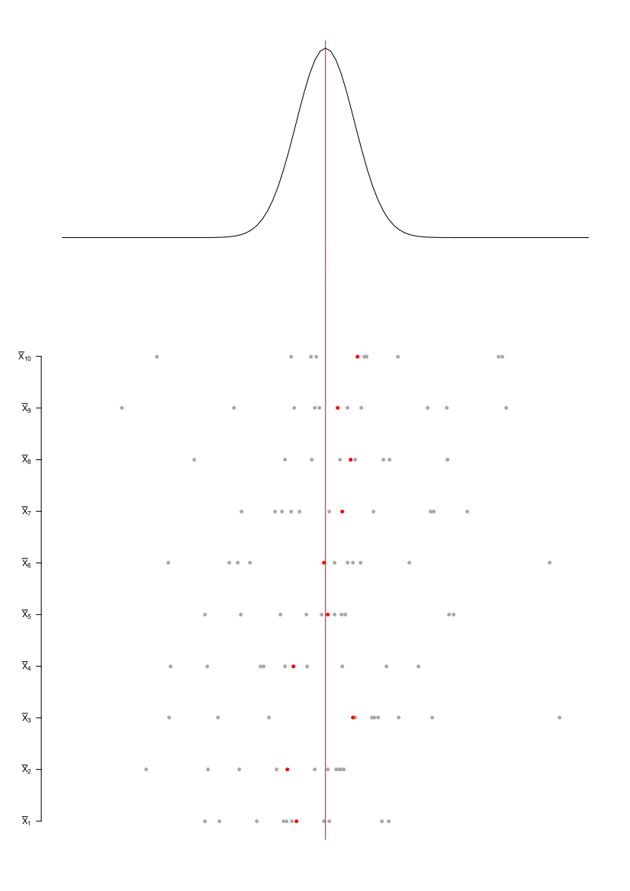

To $k \rightarrow \infty$ it is possible to obtain, in addition, the distribution of the random variable of the sample mean of a sample with size ${n}$. But $k \rightarrow \infty$ \ is still equivalent to measure the whole population.
Fortunately it is possible to prove that, if  $X_i$ is a generic value of our population and if $X_i \sim N(\mu,\; \sigma)$, then, drawing a sample $X_1, X_2,\dots, X_i,\dots, X_n$ of sample size $n$:
  $$ \overline{X} \sim N\left(\mu,\; \frac{\sigma}{\sqrt{n}}\right) $$

In other words the sample mean random variable, calculated on a sample of size $n$ drawn from a population normally distributed with mean $\mu$ and standard deviation $\sigma$, is also normally distributed with the same mean and with standard deviation $\sqrt{n}$ times smaller than the standard deviation of the population.  
As consequence, if this is right, it is also possible to calculate an interval in which it will be included the 95$\%$ of the possible requests for the same sample mean random variable
  $$ P \left\{ \mu - \frac{\sigma}{\sqrt{n}} \cdot z_{0.975} \leq \overline{X} \leq \mu + \frac{\sigma}{\sqrt{n}} \cdot z_{0.975} \right\} = 0.95 $$
Whose result is:
  $$ P \left\{ \overline{X} - \frac{\sigma}{\sqrt{n}} \cdot z_{0.975} \leq \mu \leq \overline{X} + \frac{\sigma}{\sqrt{n}} \cdot z_{0.975} \right\} = 0.95 $$
Where $z_{0.975}$ represents the quantiles that leaves at its left the 97,5$\%$ in a $N(0 ,1)$.
Therefore, instead of providing a single value for the estimation of $\mu$, once that the realization of $\overline{X}$ (called $\overline{x}$) is known, one can provide an interval of possible values for $\mu$. This result is provided with a certain confidence level (in this case, the 95$\%$).

As the normal distribution is symmetrical, then $z_{0.975} = - z_{0.025}$. For this reason the previous formula can be rewritten as:
  $$ P \left\{ \overline{X} + \frac{\sigma}{\sqrt{n}} \cdot z_{0.025} \leq \mu \leq \overline{X} + \frac{\sigma}{\sqrt{n}} \cdot z_{0.975} \right\} = 0.95 $$

The meaning of the confidence interval has to be understood like follows.
If we draw out an infinity of samples of the population, and every time we calculate the corresponding 95$\%$ confidence intervals, then the 95$\%$ of these confidence intervals will contain the true value of the population mean $\mu$. 
In other words, the 5$\%$ of the intervals should not contain the true value of the population mean.     
The 95$\%$ is not the only confidence interval that can be taken in consideration. An interval could be considered, for example, 90$\%$, or 99$\%$ or even 99.9$\%$.
<!--
A 99$\%$ interval would have the unquestionable advantage of containing the true value of the mean ($\mu$) in the 99$\%$ of cases, but this interval will be wider of the corresponding 95$\%$ interval of a little less smaller quantity of $2 \sigma / \sqrt{n}$. 
A way to reduce the wideness of the interval, with all confidence levels being equal, consists in increasing the sample size $n$.
This case has a limit because there is a square root in the denominator. As consequence, for each of the added sample unit, the advantage will be smaller and smaller.
In other words, an optimal confidence interval does not exist. Each confidence interval represents a compromise between the interval wideness, the confidence level and the number of samples unities.
-->

### Hypothesis test

As before, it is supposed a normally distributed population, with unknown mean $\mu$ and known variance $\sigma^2$ that is:
  $$ X \sim N(\mu,\; \sigma) $$
It is supposed to check the hypothesis that the population mean is equal to a certain value ($\mu_0$). In this case, a null hypothesis ($H_0$) is assumed:
  $$ H_0:\; \mu = \mu_0 $$
This hypothesis is in contrast to an alternative hypothesis ($H_A$):
  $$ H_A:\; \mu \neq \mu_0 $$

<!--
The alternative hypothesis is rarely shown as $H_A: \; \mu = \mu_A$, with $\mu_A \neq \mu_0$.
-->

It has to be found a criterion that allows us to choose one alternative between the following two alternatives:

* to accept $H_0$ and to refuse $H_A$;
* to refuse $H_0$ and to accept $H_A$.

Knowing that:

* the distribution of $X$ is known: $X\sim N(\mu,\; \sigma)$;
* $\sigma$ is supposed to be known and constant;
* $\mu$ \ is unknown and constant.

If a sample of $n$ elements from the population has to be extracted and the analysed dimension $X$ has to be measured, it is possible to affirm that: the random variable $\overline{X}$, given from the sample mean of the observations, will be normally distributed around $\mu$ with standard deviation equal to $\frac{\sigma}{\sqrt{n}}$:
  $$ \overline{X}\sim N\left(\mu,\; \frac{\sigma}{\sqrt{n}}\right) $$

The random variable (statistics test) $Z$ is defined as :
  $$ Z=\frac{\overline{X}-\mu_0}{\frac{\sigma}{\sqrt{n}}} $$

If $H_0$ is true, prior to the extraction of the sample, $Z$ will be:
  $$ Z \sim N(0,1) $$
After the experiment, the $z$ value  (the realization of $Z$) will be then, presumably, "close to zero" and included with probability of 95$\%$ in the interval  $\pm 1.96$.

If $H_0$ is not true (but $H_A$ is true), prior to the extraction of the sample, $Z$ will be:
  $$ Z\sim N \left( \frac{\mu_A-\mu_0}{\sigma / \sqrt{n}}, \; 1 \right) $$
After the experiment, the $z$ value (the realization of $Z$) will be then, presumably, "far from zero" and external from the interval $\pm 1.96$.

The  $z$ value resulting from the experiment, will be called $z_0$.
The null hypothesis is accepted if, after the test, the $z_0$ value is included in the interval $\pm 1.96$.

The curve represents the $Z$ distribution if $H_0$ is true. The null hypothesis $H_0$ is accepted.

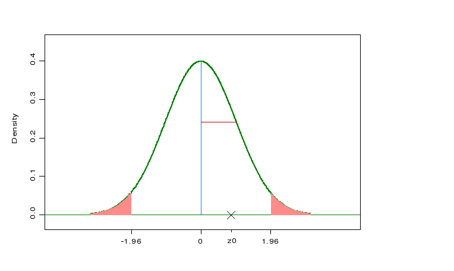 


Alternatively, the null hypothesis is rejected in favour of the alternative hypothesis if $z_0$ is not included in the interval $\pm 1.96$.

The curve represents the $Z$ distribution if $H_0$ is true. The null hypothesis $H_0$ is refused. 
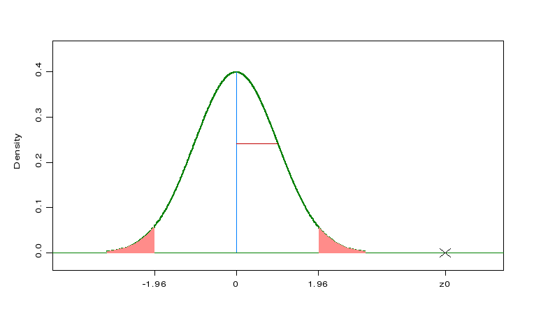 

An alternative graphic representation consists in bending the left half in its right side. It consists then in considering the refusal area of the hypothesis like it was just on the right side of the curve.
In this case the $z$ value has to be considered in absolute value.

The curve represents the $Z'$ distribution, the $Z$ absolute value, if $H_0$ is true. The null hypothesis  $H_0$ is accepted.


The choice of the value 1.96 in the previous formulas is not unjustified, even though it is, in a certain way, arbitrary.
If the null hypothesis ($H_0$) is valid, with the value 1.96, it is possible to have a 0.05 (5$\%$) probability to commit an error and to refuse this hypothesis.
This probability is usually shown with the symbol $\alpha$, its corresponding error is called Type I error (or error of the first kind).
In the statistical hypothesis tests, the Type I error is the only kind of error which is directly verifiable by the reasearcher. Indeed, in the case taken into consideration, when $\alpha$ increases or decrease, also the "cut off" value (1.96) increases or decreases.
When $\alpha$ is fixed and, as consequence, the cut-off value is fixed too, the test is called "of level $\alpha$".

The value 1.96 leaves at its right area a 5$\%$ probability.
If the null hypothesis is accepted, or rather if the $z_0$ absolute value is at the left of the value 1.96, then the area on the right of the $z_0$ absolute value must be greater than 5$\%$.

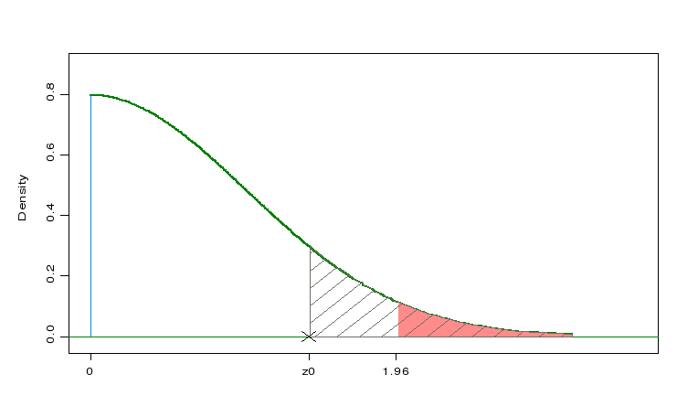

Thence, another similar criterion to check the null hypothesis consists in measuring the area on the right of the $z_0$ value. This measure has to be taken on the distribution that we would have if the null hypothesis is true.

If $P \left\{ Z' > z_0 \lvert H_0 \right\} \geq 0.05$ $\Rightarrow$ we accept $H_0$

If $P  \left\{ Z' > z_0 \lvert H_0 \right\} < 0.05$ $\Rightarrow$ we refuse $H_0$

The $z_0$ of this formula, that refers to the $Z'$, distribution, are the $z_0$ absolute values (previously seen), referred to the $Z$ distribution.

The quantity $P \left\{ Z'>z_0 \lvert H_0 \right\}$ is called p-value.
This criterion has the advantage of being release from the specific value 1.96. In the same way, it is also release from any other value that isolates, on its right, an area of probability $\alpha$ different from 5$\%$.

### Example: Cereal boxes

A process of filling cereal boxes needs that each box contains on average 365 grams of cereals. We want to check if the current process actually follows this constraint.

```{r}
data(cerealbx)
head(cerealbx)
```

Firstly, we summarise numerically and graphically the data.

```{r}
summary_stat <- cerealbx %>% 
  summarise(n=n(),
    min=min(BoxWeigh),
    first_qu=quantile(BoxWeigh, 0.25),
    mean=mean(BoxWeigh),
    median=median(BoxWeigh),
    third_qu=quantile(BoxWeigh, 0.75),
    max=max(BoxWeigh),
    sd=sd(BoxWeigh))

print(summary_stat)

ggp <- ggplot(data = cerealbx, mapping = aes(x="0", y=BoxWeigh)) +
  geom_boxplot(fill="darkgoldenrod1") + xlab("") + 
  theme(axis.text.x= element_blank(), axis.ticks.x = element_blank()) 

print(ggp)
```

Let us try to check the hypothesis that the mean is 365 in the case that the standard deviation shall be 2.4.  
As standard deviation is known we should use $Z$-test.

```{r}
z.test(x = cerealbx$BoxWeigh, mu = 365, sigma.x = 2.4)
```

`z.test()` is a function of `BSDA` package which computes $Z$-test. `x` argument is the vector of values for which the test has to be calculated, `mu` represents the value of mean specified by the null hypothesis and `sigma.x` represents the population standard deviation of `x` vector.  

According to $Z$-test there is no evidence that the current process does not respect the parameters expected.

##  Student’s t-test

<!--
In the experimental research, the use of an inference test through the sample mean $\overline{x}$ with $\sigma$ (the population standard deviation) known  it is a case in a class by itself.
-->
Usually, when the population mean $\mu$ is unknown, also the standard deviation $\sigma$ is unknown. As consequence, it is necessary to use a substitute of the variance of the population, the sample variance $s^2$ represents its most logic and most reliable estimation.

The statistic test, in this case, is called $t$, and it is defined as follow:
  $$ t = \frac{\overline{x} - \mu_0}{\frac{s}{\sqrt{n}}} $$

With unknown $\sigma$ and the use of $s$ as its replacement, the statistic test prior to sample extraction does not follow the normal distribution $Z$, previously seen, but the so called Student's $t$-distribution.

<!--
For a better comprehension of the fundamental concepts and a proper application of the derived tests, it is important to highlight the specific characteristics that distinguish this distribution to the Gaussian:

* the normal distribution considers the $\overline{X}$ mean sample variation;
* the Student's t distribution also takes into consideration the sample variability of the standard deviation estimation ($s$).
-->

So to perform inference on the population mean, starting from sample data, it is necessary to consider at the same time:

* the variability of $\overline{x}$ as estimation of $\mu$;
* the variability of $s$ as estimation of $\sigma$.

With the increase of the sample size $n$, $s$ proves to be an always better estimation of $\sigma$.
When $n$ is enough great (in theory infinite, in practice over 120-150), $s$ and $\sigma$ are almost equivalents.
The $t$-distribution's mean  is 0 (the quantity at the numerator is the difference between the sample mean random variable and its expected value) and the variation that depends on its degrees of freedom (equal to the dimension of the sample minus 1).                                                                                                                                                                                                                 
As consequence, it could be affirmed that when $n$ increases, the result is the convergence of the Student's $t$-distribution towards the $Z$ standard normal distribution.
The form of the Student's $t$-distribution is symmetric and bell shaped as the normal distribution, but with a larger dispersion (variability).

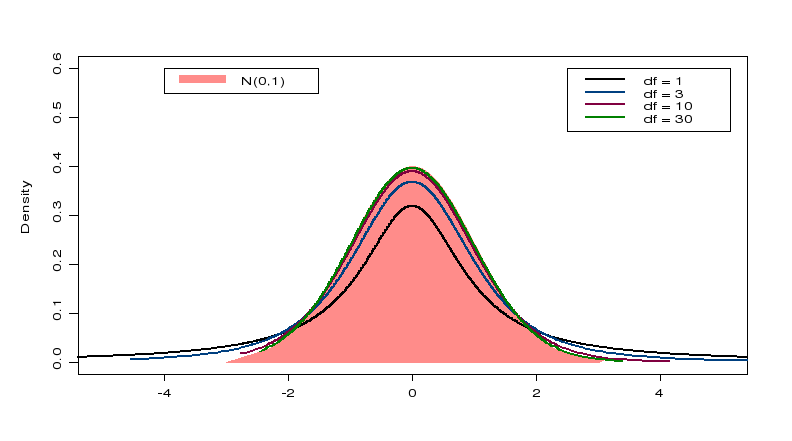

With little samples the difference between the Student's $t$ statistics value and the correspondent $Z$ statistics value at the same probability $\alpha$ is relevant. 


<!--
On the contrary, over some tens of observations, it is unimportant.
In the experimental practice, the methods which use the $t$ test usually refer to little samples, the observations are often ten or less and they rarely reach some tens.
It exists a whole family of $t$-distributions, one for each value of the degrees of freedom (df) parameter.

For an infinite value of df, in practice for a number of data little greater than an hundred, the $$t$$ distribution curve and the $Z$ distribution curve coincide.
From the mathematic aspect, this means that the normal distribution represents the limit of the $$t$$ distribution, when the number of df tends to infinite.
-->


### Confidence interval with unknown $\sigma$

From the formula $t_{(n-1)}=\frac{\overline{X}-\mu}{\frac{s}{\sqrt{n}}}$, with $\mu$ which, in this case, represents the true and unknown population mean from which the sample is extracted, it is possible to derive the confidence interval at the level $(1-\alpha)\%$, for the true mean $\mu$, with unknown $\sigma$.

Once that $\overline{x}$ and $s$, are calculated, the confidence interval with its extremes becomes

$$ \overline{x}- t_{\frac{\alpha}{2};n-1}\cdot \frac{s}{\sqrt{n}} \leq \mu \leq \overline{x}+ t_{\frac{\alpha}{2};n-1}\cdot \frac{s}{\sqrt{n}} $$

where $t_{\frac{\alpha}{2};n-1}$ indicates the $t$-distribution value with  $n-1$ degrees of freedom that "leaves at its right" a $\frac{\alpha}{2}$ probability.


### Hypothesis tests

<!--
The applicability conditions to obtain the Student's t distribution, and therefore, for its use in the tests and in the confidence intervals are:

* the distribution of the single sample units (X) is normal
* the observations are independently collected

T-tests are robust. This means that their distribution is approximately valid also for data distribution markedly drawn away from the normality.
This is valid especially if the sample size is large (see Central Limit Theorem).


In general, a test is defined robust as regards the applicability condition, when its results can be accepted even though the applicability condition is not rigorously verified.
-->

In the applied statistics, there are three versions of $t$-test used to check means:

* _One sample $t$-test_: it checks if the true mean of values of a population is equal to an hypothesize or expected value (comparison between the observed mean and the hypothesized mean);
* _Two samples $t$-test_: it checks if the difference between the true means of values of two independent populations is equal to an hypothesized value (comparison between independent samples);
* _Paired $t$-test_: it checks if the difference between the true means of values of two dependent populations is equal to an hypothesized value (comparison between dependent samples).

#### One sample t-test

In a bilateral test, in order to specify the hypothesis about the $\mu$ population mean as regards the expected mean, it will be used the previously seen symbols:

* The null hypothesis $H_0$ shown as:  $H_0: \; \mu \; = \; \mu_0$
* The alternative hypothesis $H_A$ shown as: $H_A: \; \mu \; \ne \; \mu_0$

Where:

* $\mu$ is the value (true and unknown) of the population mean from which the sample is extracted and from which will be calculated the sample mean;
* $\mu_0$  is the hypothesized value of the mean used as point of mark for the comparison.

With the same symbols it is possible to show an unilateral statistical hypothesis test that the population mean, from which the sample is extracted is equal to $\mu_0$ like follows. This is against the alternative that it is smaller than $\mu_0$ will be:

* Null hypothesis $H_0: \; \mu \; =\; \mu_0$
* Alternative hypothesis $H_A: \; \mu \; <\; \mu_0$

Unilateralism and bilateralism of a test do not depend on the null hypothesis but on the alternative hypothesis. As a matter of fact, the complete formulation is: test with bilateral and unilateral alternatives. The difference between the bilateral and unilateral tests is not only applied to $t$-test but also to $Z$-test and to all the tests that can make this difference.

After having defined the quantity 
  $$ t=\frac{\overline{X}-\mu_0}{\frac{s}{\sqrt{n}}} $$
Then under the hypothesis in which $H_0$ is true, the $t$ quantity will be able, prior to extract the sample, to assume a random value that comes from the Student's $t$ distribution with $n-1$ degrees of freedom.

So, before the experimentation, it is expected that the $t$ value will be "concentrated around zero".

In the hypothesis that $H_0$ is not true ($H_A$ is true), we will have:
  $$ t = \frac{\overline{X}-\mu_0}{\frac{s}{\sqrt{n}}} = \frac{(\overline{X}-\mu)}{\frac{s}{\sqrt{n}}}+\frac{(\mu-\mu_0)}{\frac{s}{\sqrt{n}}}\sim \left[t_{n-1}+\frac{(\mu-\mu_0)}{\frac{s}{\sqrt{n}}}\right] $$
Before the experimentation, it is expected that the $t$ value will be approximately far from zero.

The $t$ value resulting from the experimentation is called $t_0$ or rather the $t$ random variable realization.

According to the formulated alternative hypothesis (unilateral or bilateral), there are two alternatives that respond to the test.

Bilateral hypothesis:

* $H_0$ is accepted with an error level of $\alpha = 0.05$ when the $t_0$ value is between the interval $\pm t_{n-1;0.025}$. Where $\pm t_{n-1;0.025}$ is the value of the distribution $t_{n-1}$ that leaves at its right the 2.5$\%$ of its overall area.
* Alternatively, the null hypothesis is refused in favour of the alternative hypothesis.

Unilateral hypothesis:

* The null hypothesis is accepted with an error level of $\alpha = 0.05$ if $t_0 \geq t_{n-1;(1-0.05)}$ This happens, as in the example, because the alternative hypothesis ($H_A$) establishes that  $\mu < \mu_0$.
* Alternatively, if $t_0 < t_{n-1;(1-0.05)}$, the null hypothesis is refused in favour of the alternative hypothesis.

A test is unilateral or a one-sided test, when the researcher asks himself if a mean is larger than the other, excluding that it could be smaller.

A test is bilateral or a two-sided one, when the researcher asks himself if a significant difference between the two means exists. In this case he does not have information about which one is the larger or the smaller. 

In the case of the one-sided test, the refusing area will be in only a part of the distribution (at the left when the sign is negative, at the right when it is positive). 

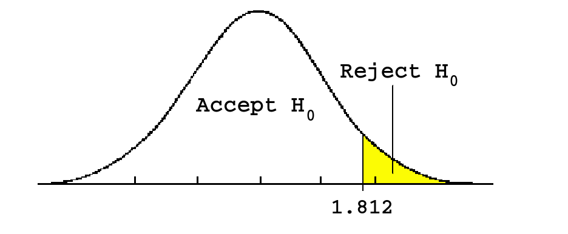

The unilateral test for a probability associated to a level of statistical significance of 5$\%$ with 10 df.

In the case of the two-sided test, the refusing area will be symmetrically distributed in the two parts.

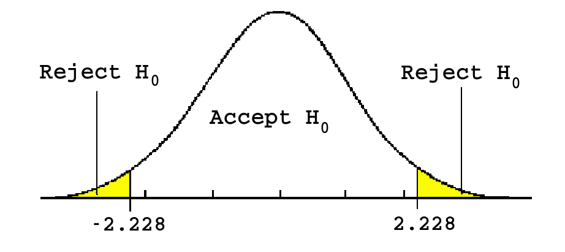

The bilateral test for a probability associated to a level of statistical significance of 5$\%$ with 10 df.

<!--
If the test is unilateral it is possible, with the same data, to refuse the null hypothesis. On the contrary, if the test is bilateral, this is not possible.
-->

It is possible to use the p-value standard to accept or refuse the null hypothesis both for the $t$ test and for the $Z$ test and all the other statistics tests. 
In this case, the distribution area has to be measured in the case in which the null hypothesis is valid, for values of the statistics tests that go beyond the value that has been found for the same test. For example, with an alternative unilateral hypothesis like $H_A: \mu < \mu_0$, and a result $t_0$ of the statistics test, then:

If $P \left\{ t_{n-1} > t_0 \lvert H_0 \right\} \geq 0.05$ $\Rightarrow$ we accept $H_0$

We $P \left\{ t_{n-1} > t_0 \lvert H_0 \right\} < 0.05$ $\Rightarrow$ we refuse $H_0$

If the p-value results to be greater than 0.05, then the null hypothesis is accepted. Otherwise, the null hypothesis is rejected.


#### Example: Cereal boxes 

Let us consider Cereal boxes data. 

```{r}
data(cerealbx)
head(cerealbx)
```

Let us check the hypothesis that the mean is 365 assuming that the standard deviation is unknown.

```{r}
t.test(x = cerealbx$BoxWeigh, mu=365)
```

`t.test()` function performs one and two sample $t$-test. In this case we use it to perform one sample $t$-test and we specify the vector for which the test has to be performed, `x`, and the value of mean specified by the null hypothesis, `mu`.

According to tests t there is no evidence that the current process does not respect the parameters expected.

#### Two sample t-test

Student's $t$ test can be also used to compare the means of two samples. The comparison between two means can be done:

* with two independent samples
* with two dependent samples

It is important to distinguish the two situations which depend on the way the two compared measurements are obtained.
The two tests have differences:

* In the $t$ test application procedures;
* In the way the subjects variability effects are measured.

In a great amount of cases, the only possible strategy for the analysis of data is to compare two independent samples and two samples formed by different individuals.

In a  bilateral or a two-sided test, the null hypothesis $H_0$ is that the difference between the two populations (A and B) is equal to $\delta_0$. Quite always $\delta_0$ is equal to 0 in the practice use.

The null hypothesis can be written as:
  $$ H_0: \; \mu_A \; - \; \mu_B \; = \delta_0  \quad \; H_0: \; \mu_A \; = \delta_0 + \mu_B \; $$
and its bilateral alternative hypothesis $H_A$ can be written as:
  $$ H_A: \; \mu_A \; - \; \mu_B \; \neq \delta_0 \quad \; H_A: \; \mu_A\; \neq \delta_0 +\mu_B \; $$ 

An example of  one-sided or unilateral test is:
  $$ H_0: \; \mu_A \; - \; \mu_B \; \leq \delta_0 \quad \; H_0: \; \mu_A \; \leq \delta_0 + \mu_B \; $$ 
against the alternative hypothesis:
  $$ H_A: \; \mu_A \; - \; \mu_B \; > \delta_0 \quad \; H_A: \; \mu_A \; > \delta + \mu_B\; $$

In the case of two independent samples, in its easier formulation, the value of $t$ is obtain like follows:
$$ t_{(n_A+n_B-2)} = \frac{(\overline{X}_A-\overline{X}_B)-\delta_0}{\sqrt{S^2_p \cdot (\frac{1}{n_A}+\frac{1}{n_B})}} $$ 

And the degrees of freedom of $t$ are equal to $(n_A-1)+(n_B-1)=(n_A+n_B-2)$, or $(N-2)$.

* $\overline{X}_A$ and $\overline{X}_B$ are the means calculated respectively on the (sub) sample A and on the (sub) sample B;
* $\delta_0 = (\mu_A - \mu_B)$ is the hypothesized difference between the means. It is expressed in the null hypothesis;
* $n_A$ and $n_B$ are the number of observation in the (sub) samples A and B;
* $N = n_A + n_B$;
* $S^2_p$ is the (pooled) variance of the compared groups.


The pooled variance ($S^2_p$) is the result of the ratio between the sum of the two deviances and the sum of the respective df. The pooled variance assigns a proportionally higher importance to the group which has a greater number of data.

$$ S^2_p = \frac{\sum_{i=1}^{n_A}{(X_{A_i}-\overline{X}_A)^2}+\sum_{i=1}^{n_B}{(X_{B_i}-\overline{X}_B)^2}}{n_A-1+n_B-1} $$

where:

* $X_{A_i}$ and $\overline{X}_A$ are respectively the data and the sample mean of the group A;
* $X_{B_i}$ and $\overline{X}_B$ are respectively the data and the sample mean of the group B;
* $n_A$ and $n_B$ are the number of observation of samples A and B.

<!--
From the above t test formula it is possible to deduce that, in order to calculate the test it is not necessary that all the data (of the extracted selection unities) are available.

The formula can be calculated starting from the means, the standard deviations and the sample size of the two samples.
-->

#### Example: Comparison of two suppliers of plastics

A company wants to test the performance of resistance of the plastic wafer provided by two suppliers (A and B). 

```{r}
data(plastic)
head(plastic)
```

Firstly, we summarise numerically and graphically the data.

```{r}
plastic_2 <- plastic %>% gather(supplier, resistance, SupplrA, SupplrB)

summary_stat <- plastic_2 %>% 
  group_by(supplier) %>% 
  summarise(n=n(),
    min=min(resistance),
    first_qu=quantile(resistance, 0.25),
    mean=mean(resistance),
    median=median(resistance),
    third_qu=quantile(resistance, 0.75),
    max=max(resistance),
    sd=sd(resistance))

print(summary_stat)

ggp <- ggplot(data = plastic_2, mapping = aes(x=supplier, y=resistance, fill=supplier)) +
  geom_boxplot()   

print(ggp)
```

Let us check the hypothesis that the mean resistance of the two products is fundamentally the same.
We use a bilateral two sample $t$-test because `plastic` has two independent samples.

```{r}
t.test(x=plastic$SupplrA, y=plastic$SupplrB, alternative = "two.sided")
```

In this case `t.test()` function performs two sample $t$-test, inded we specified the two sample as `x` and `y` arguments. As test hypothesis are bilateral, `alternative` argument is specified as `two.sided` (default value).

Two-sample $t$-test, for the check of the hypothesis of equality of the averages, doesn’t confirm this hypothesis.

<!--
Looking at the boxplot we see that the mean of `SupplrA` is greater than that of `SupplrB`.


$H_0: \; \mu_A \; - \; \mu_B \; \leq \delta_0$  
$H_A: \; \mu_A \; - \; \mu_B \; > \delta_0$

Let us check the hypothesis specifying `greater` as `alternative` argument value.

```{r, purl=FALSE}
t.test(x=plastic$SupplrA, y=plastic$SupplrB, alternative = "less")
```

The result of the test confirms our hypothesis. Plastic wafer provided by supplier A seems to be more resistant than that provided by supplied B.   
-->

#### Paired t-test

The characteristic which distinguishes the comparison between the two dependent samples is to be able to associate each of the samples observations to just one of the observations of the other sample. The two groups have always, necessarily, the same number of data.

$t$ test for two dependent samples is required when the same unities have to be analysed in different conditions.
For example, to estimate the mean productivity of the staff (in terms of the mean time for each operation) at the beginning and at the end of the working day and to check if this mean changes or not.

The comparison between the means of the two series of observations is easy: the analysis is applied to a new series of data. This series is the result of the differences between the elements of each couple.

For the Student's $t$-test, in the case of a bilateral test the null hypothesis $H_0$ is usually that the differences mean is equal to an hypothesize value which is usually 0: 
  $$ H_0: \; \delta = \delta_0 $$

while the alternative hypothesis $H_A$ is:
  $$ H_A: \; \delta \neq \delta_0 $$

In an unilateral test, the null hypothesis $H_0$ is that the differences mean is greater than or equal to the hypothesize one (it is often 0):
  $$ H_0:\;\delta \geq \delta_0 $$
while the alternative hypothesis $H_A$ is that the difference is less than the hypothesize one (it is often 0). It can be written like follows:
  $$ H_A:\; \delta < \delta_0 $$
On the opposite case, the null hypothesis $H_0$ is that the differences mean is less than or equal to the hypothesize one (it is often 0):
  $$ H_0:\;\delta \leq \delta_0 $$
while the alternative hypothesis $H_A$ is that the difference is greater than the hypothesize one (it is often 0). It can be written like follows:
  $$ H_A:\; \delta > \delta_0 $$

In order to choose between the null hypothesis $H_0$ and the alternative hypothesis $H_A$, the statistical significance of the means of the differences is checked by the ratio
  $$t_{(n-1)}=\frac{\overline{d} - \delta_0}{\frac{s_d}{\sqrt{n}}}$$
where:

* $\overline{d}$ is the mean of the differences;
* $\delta_0$ is the hypothesize mean difference: it is often, but not necessarily, equal to 0;
* $s_d$ is the standard sample deviation calculated on the differences;
* $n$ is the number of differences.

The confidence interval of the differences mean between the two dependent samples is calculated (with the same symbols of the previous formula) by
  $$ \delta = \overline{d}\pm t_{\frac{\alpha}{2};n-1}\cdot \frac{s_d}{\sqrt{n}}$$
where $t_{\frac{\alpha}{2};n-1}$ indicates the $t$ distribution value with $n - 1$ df that leaves at its right a probability amount equal to $\alpha/ 2$.

In this formula it is included, at the level $1-\alpha$, the true mean $\delta$ of the differences.

<!--
According to various authors, in the applied field, when the number of couples of data is over 40 (others indicates 50 or even 150), the Student's $t$ distribution is adequately approximated to the standard normal distribution.

In the variance calculation formula, with a difference in the results that a great number of researchers consider unimportant, when the dimension of $n$ measures some tens, it is possible to replace the critic $t$ value with the $Z$ value associated to the prefixed probability $\alpha$. This situation happens both in the one-sided tests and in the two-sided tests.
-->

#### Example: Parking time of two different car equipments

In an experiment to investigate if an optional equipment of cars may help
to park the cars themselves, 20 drivers were asked to park the car with and 
without the equipment. The parking time (secs) for each driver and equipment
is recorded.

```{r}
data(carctl)
head(carctl)
```

Firstly, we summarise numerically and graphically data of both equipments.


```{r}
carctl2 <- carctl %>% gather(car, value, Car_A, Car_B)

summary_stat <- carctl2 %>% 
  group_by(car) %>% 
  summarise(n=n(),
    min=min(value),
    first_qu=quantile(value, 0.25),
    mean=mean(value),
    median=median(value),
    third_qu=quantile(value, 0.75),
    max=max(value),
    sd=sd(value))

print(summary_stat)

ggp <- ggplot(data = carctl2, mapping = aes(x=car, y=value, fill=car)) +
  geom_boxplot()

print(ggp)
```

```{r}
ggp <- ggplot(data = carctl, mapping = aes(x=Car_A, y=Car_B)) + 
  geom_point(col="darkblue")

print(ggp)
```


Let us check the hypothesis that the parking time of the two equipments is the same.  
Looking at the scatterplot we can see that data of two cars are clearly NOT independent!!  
Measures on `Car_A` are strongly related to measures on `Car_B`, because each driver drove either cars.

Then the correct test for such as data is:
```{r}
carctl <- carctl %>% mutate(car_diff = Car_A - Car_B)
t.test(x=carctl$car_diff, mu=0)
```
or, equivalently, a paired $t$:
```{r}
t.test(x=carctl$Car_A, y=carctl$Car_B, paired=TRUE)
```
To perform a paired $t$ test using `t.test()` function, `paired` parameter has to be set as `TRUE`. 

In either cases the results are the same: a difference statistically significant exists between mean parking times of two cars.

## ANOVA

In the experimental research the simultaneous comparison between the means of more than two groups is frequent. They are composed of subjects that are undergone to different treatments or of data that have been collected in different conditions.
In order to highlight all the possible important differences among the means, it is not correct to use Student's $t$-test to repeat the analysis as many times as the possible comparisons are in couples among every single group.

With the Student's $t$-test, the $\alpha$ probability that has been chosen in order to accept the null hypothesis, or rather the probability to commit a type I error (that means to refuse the null hypothesis when it is true), is valid only for every single comparison. If there are many comparisons, the whole probability that at least one of them is significant because of the chance, is greater.

<!--
If the $H_0$ null hypothesis is valid, the probability that none of the comparisons is, by chance, significant is:
  $$ (1-\alpha)^k $$
where $k$ is the number of the comparisons that have been done.
If, for example, we make 10 comparisons among the means of the groups drawn by chance from the same population and, for each of them $\alpha$  is equal to 0.05, the probability that none of the comparisons is significant decreases from 0.95 to around 0.60.

As consequence, the whole probability that at least one results to be significant, because of random fluctuations, moves from 0.05 to 0.40.
-->

If we do $k$ comparisons with the Student's $t$-test, each of them with $\alpha$ probability, the whole $\alpha'$ probability to commit at least one type I error (that the test refuses the null hypothesis even though it is true) becomes:
  $$ \alpha' = 1 - (1 - \alpha)^k $$

The analysis of variance, with an apparently words paradox, allows the comparison between two or more means.
It allows the simultaneous comparison among them, keeping unchanged the $\alpha$ whole set probability.

The $H_0$ null hypothesis and the $H_A$ alternative hypothesis have a more general formula, compared to the comparison between two means: 

$$ H_0: \; \mu_1= \mu_2 = \dots = \mu_p $$
$$ H_A: \, \exists \, i,j \,\mid\,\mu_i\neq\mu_j\;\;\;(i,j=1,\,\dots,\,p)$$
 
  Beyond the mathematical notation, the alternative hypothesis is that at least one of the means is different from the others.
The developed methodology to check the statistical significance of the diffences among the arithmetical means of a series of the groups, is called analysis of variance and it is marked as ANOVA. It uses the $F(p,q)$ distribution where $p$ and $q$ are needed parameters to specify it.

<!--
Example

We have an establishment with 3 parallel production lines (A, B, C) that produces silicon wafers.
It wants to be checked that the mean resistivity of each of them is the same.

This is a scheme of hypothesis:
$H_0:\;\mu_A=\mu_B=\mu_C=\mu_{TOT}$

$H_A:\;\exists\,\mu_j \ne \mu_{TOT}$
-->

In the analysis of variance, the root or the cause of the data variations is called experimental factor or treatment; it can have:

*  more quantitative levels, as long as it is possible to discretize them;
* more qualitative levels (or methods).

Every unit or observation inside the experimental observations' levels are replication o repetition.  
In order to calculate the mean and the variance, every group must be made of at least two replications.

### One way ANOVA

The easiest analysis of variance model, that can be seen as an extension of the Student's $t$-test with many independent samples, is called one criteria classification (one way), or one factor.

For the statistics analysis, in this model it is not required that the various groups have the same number $(n_j)$ of observations or replications.

The observations' presentation methodology, already encoded, implies that experimental data, that have been collected, are orderly carried according to the underlying table.

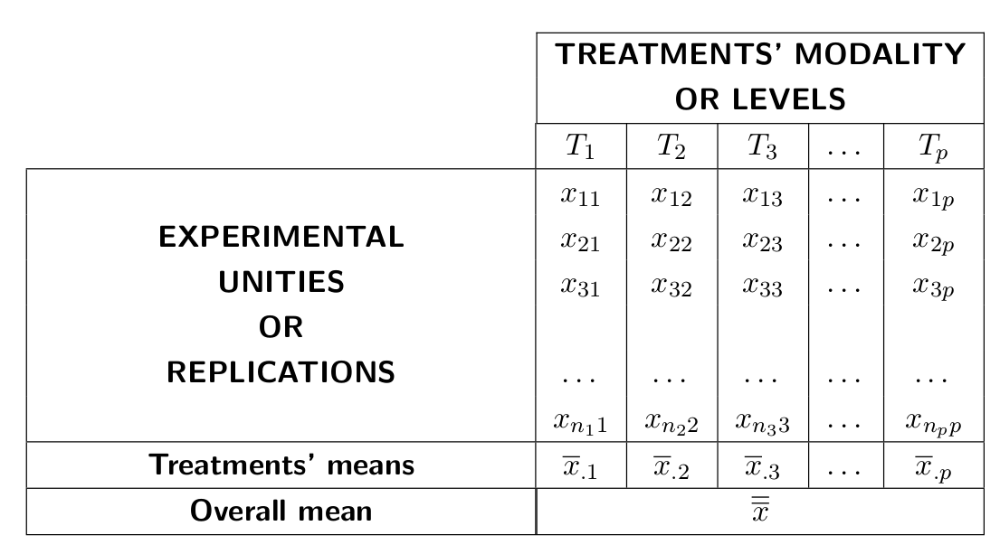

The single observation is carried with two indexes. The first one regards the position occupied inside the group. The second one regards the treatment or the group it belongs to: $x_{ij}$.
The mean of every group or single treatment is overlined, with a point instead of the first index and with the group index: $\overline{x}_{.j}$.
The overall mean of all the data is written with a double line and without indexes: $\overline{\overline{x}}$.

Starting from these three quantities, deviances (Sum of Squares) and variances (Mean of Squares), useful for the analysis, are estimated.

The total deviance or $SS_T$ (Total Sum of Squares) is the sum, over all observations, of the squared differences of each observation from the overall mean.
  $$ SS_T=\sum_{j=1}^p \sum_{i=1}^{n_j}{(X_{ij}-\overline{\overline{X}})^2} $$
The $SS_T$ defines the total variability of the sample.

The deviance between treatments or $SS_B$ (Between Sum of Squares) is the sum of squared residuals of every group's mean from the overall mean, multiplied the number of data of the correspondent group.
  $$ SS_B=\sum_{j=1}^p{n_{j}(\overline{X}_{.j}-\overline{\overline{X}})^2} $$

The $SS_B$ defines the variability among groups independently of the dispersion of the single observations inside every group.

The deviance within treatments or $SS_W$ (Within Sum of Squares), also called error, defines the sum of squared residuals of every value of the mean of its group.
  $$ SS_W = \sum_{j=1}^p \sum_{i=1}^{n_j}{(X_{ij}-\overline{X}_{.j})^2} $$
The $SS_W$ defines the variability within every single group independently of the position of the group around the sample's overall mean. 

It is possible to demonstrate that:
  $$ SS_T = SS_B + SS_W $$ 

This equation shows that a sample's total variance, whose sample units are divided in groups, can be partitioned in two components:

* a component "between", given by the variability among the groups;
* a component "within", given by the variability within the groups. 

It is possible to make a comparison with the Pythagorean theorem.

Some examples:

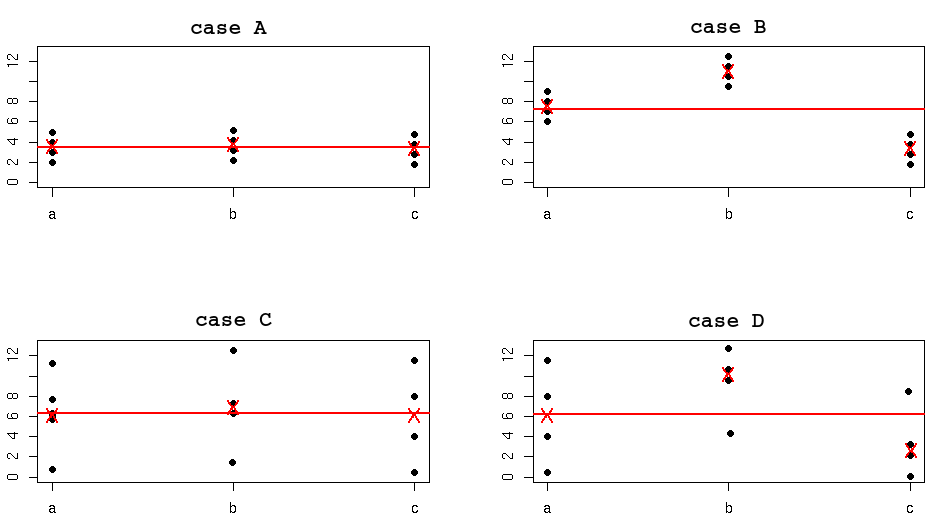 

* CASE A: $SS_W$ and $SS_B$ low 
* CASE B: $SS_W$ low but $SS_B$ high
* CASE C: $SS_W$ high but $SS_B$ low
* CASE D: $SS_W$ and $SS_B$ high


In other words, given a sample with a certain total variability, its variability components  "within" and "between" cannot change independently because their sum is bound to the total variability.

In the experimental practice, the reseacher is interested in finding a criteria that allows him to choose between the two underexposed situations can be considered true: 

A) The means, calculated within the subgroups, can be considered similar among them. As consequence, the treatments to which the sample units have been undergone did not have any effects on the answer variable.
B) The means, calculated within the subgroups, cannot be considered similar among them. As consequence, the treatments have had some effects on the answer variable.

In statistical words, the points (A) and (B) can be rewritten like follows:

A) All the sample units, independently of the subgroups, can be considered as they come from populations with the same mean.
      In other words, it is accepted that the factor does not have any effects on the dependent variable. In formal words, this is expressed as the null hypothesis:

   $$ H_0: \, \mu_1= \mu_2 = \mu_3 = \dots = \mu_k \mbox{.}$$ 


B) Not all the sample units can be considered as they come from the same population or from populations with the same mean. In formal words, this is expressed as the alternative hypothesis:
      $$ H_A: \, \mbox{It exists at least one } \mu_i \mbox{ different from the others.} $$


A possible way to distinguish the case (A) and the case (B), or rather to choose if the null hypothesis $H_0$ has to be accepted or refused, consists in comparing the $SS_B$ and $SS_W$ between them, taking into consideration the fact that $SS_T = SS_B + SS_W$.

If the sample means calculated within the subgroups are similar among them, then the quantity $SS_B$ tends to be really small. As it is true that $SS_T = SS_B + SS_W$, then the deviance within the subgroups $SS_W$ explains the great majority of the total deviance $SS_T$ and therefore $SS_W$ can be considered high compared to $SS_B$.

If, on the contrary, the sample means calculated within the subgroups are different among them, then the quantity $SS_B$ tends to be high. As it is true that $SS_T=  SS_B + SS_W$, then the variance within the subgroups $SS_B$ explain the great majority of the total deviance $SS_T$ and therefore $SS_B$ can be considered high compared to $SS_W$.

  A possible way to distinguish between the cases (A) and (B) consists in comparing, through their ratio, the two quantities $SS_B$ and $SS_W$:

A) If the ratio is small then the means, calculated within the subgroups, can be considered similar among them.
B) If the ratio is high then the means, calculated within the subgroups, can be considered different among them.

Unluckily, the measurements SS grow when the number of observations increases as they represent sum of squares' (measurements). A possible way to avoid this problem is to consider, instead of the sum of squares (SS), the mean of squares (MS, Mean of Squares). These measurements MS are obtained dividing the measurements SS for the correspondent degrees of freedom (df).  
The degrees of freedom are estimated by the number of independent sums required by the calculation of the relative deviances.

* For the sum of squares total, $SS_T$, where the sum is extended to all the $n$ data, the $df_T$ are $n-1$.

* For the sum of squares treatments, $SS_B$, where the sum is extended to $p$ groups, the $df_B$ are $p-1$.

* For all the sum of squares within the groups or error, $SS_W$, the sum is extended to all the data within each group. For this reason $df_W$ are:
      
      $$ df_W = \sum_{j=1}^p{(n_j-1)} = n-p $$
      
      where $n_j$ is the size of $j$th group, or rather the sum of the $df$ calculated within each group.

The following sum is valid also for the degrees of freedom:
  $$ df_T = df_B + df_W \mbox{.} $$
The MS measurements are calculated as:
  $$ MS_B = \frac{SS_B}{df_B} $$
  $$ MS_W = MS_E = \frac{SS_W}{df_W} $$

The measurement $MS_T$ is usually not calculated because in the analysis of variance it is not important.

From the definition of MS it comes that these measurements are (estimations of) variances.  
In particular:

*  $MS_B$ is a correct estimator of the variance "between" $\sigma^2_B$;
    or rather:
    
      $$ E \left[ MS_B \right] = \sigma^2_B \mbox{.} $$

* $MS_W$ is a correct estimator the the variance "within" $\sigma^2_W$;
    or rather:
    
      $$ E \left[ MS_W \right] = \sigma^2_W \mbox{.} $$

Similarly to what we said before as regards the SS, the ratio between $MS_B$ and $MS_W$, called F 
  $$ F = \frac{MS_B}{MS_W} $$

can be considered as an index to evaluate if it is possible to accept
  $$ H_0: \, \mu_1 = \mu_2 = \mu_3 = \dots = \mu_p $$

or if $H_0$ it has to be refused in favor of the alternative hypothesis $H_A$:
  $$ H_A: \, \exists \, i,j \,\mid\,\mu_i\neq\mu_j\;\;\;(i,j=1,\,\dots,\,p)$$

* If F is small, or rather $MS_B$ is small compared to $MS_W$, then we accept $H_0$.
* If F is high, or rather $MS_B$ is high compared to $MS_W$, then we refuse $H_0$ in favor of $H_A$.

The F value results to be always positive because it is the ratio between two measurements that are always positive. In other words, the F value is always included between zero and infinite.

If $H_0$ is true, or rather if the means of all the groups are equal, it is possible to demonstrate that both $MS_B$ (estimator of $\sigma^2_B$) and $MS_W$ (estimator of $\sigma^2_W$) are two independent estimations of the variance $\sigma^2_{\varepsilon}$.

With the $H_0$ hypothesis 
  $$ \frac{MS_B}{\sigma^2_B}=\frac{MS_B}{\sigma^2_{\varepsilon}}\sim\chi^2_{df_{B}}\quad \mbox{ and } \quad \frac{MS_W}{\sigma^2_W}=\frac{MS_W}{\sigma^2_{\varepsilon}}\sim\chi^2_{df_{W}} $$

and therefore the ratio
  $$ F = \frac{\frac{MS_B}{\sigma^2_{\varepsilon}}}{\frac{MS_W}{\sigma^2_{\varepsilon}}} = \frac{MS_B}{MS_W} $$

tends to be distributed as a F of Fisher-Snedecor with $df_B=(p-1)$ and $df_W=\sum_{j=1}^p{(n_j-1)}=(n-p)$ degrees of freedom: $F_{(p-1),(n-p)}$.
  $$ F = \frac{MS_B}{MS_W} \sim F_{{df_{B}},{df_{W}}} $$

If $H_0$ is true, then the ratio F has to be "close" to one, or "small", as it is composed by two estimations of the same quantity.

As consequence, if we choose a probability level $\alpha$  we calculate ($1-\alpha$)-th quantile of the $F$ distribution: $F_{(p-1),(n-p);(1-\alpha)}$. So that: 

We accept $H_0$ if $F\leq F_{(p-1),(n-p);(1-\alpha)}$

We refuse $H_0$ in favor of $H_A$ if $F> F_{(p-1),(n-p);(1-\alpha)}$

The quantile $F_{(p-1),(n-p);(1-\alpha)}$ leaves at its left a probability area equal to $1-\alpha$, and similarly:

We accept $H_0$ if $P(F_{(p-1),(n-p)}>F) \geq \alpha$

We refuse $H_0$ in favor of $H_A$ if $P(F_{(p-1),(n-p)}>F) < \alpha$

In general $\alpha$ = 0.05 = 5\%.

In graphic terms:

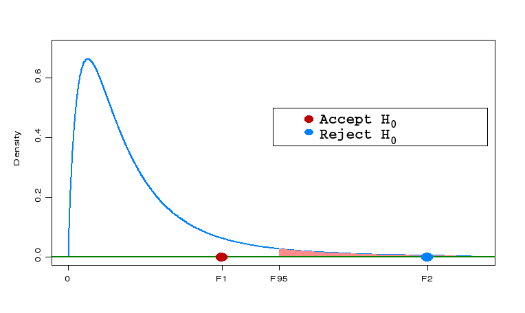

The majority of the statistics packages report the result of the analysis of variance like follows:


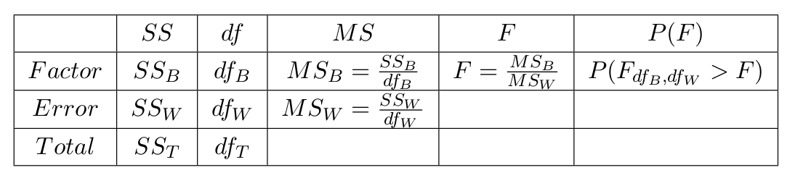

In conclusion, the value of real interest for the result of the analysis of variance is the $P(F)$. This value gives the criteria of choice between the null hypothesis and the alternative hypothesis according to a $\alpha$ value prior set.The $\alpha$ values commonly used are, as in all the tests, 0.05 and 0.01.


#### Example

We want to study the tear resistance of five different raincoats brand.
The raincoats were subjected to the same solicitation, and the time between the solicitation and the tear (in minutes and in decimal fractions of a minute) was measured.

```{r}
data(sturdy)
head(sturdy)
```

Let us analyze numerically and graphically data of each brand.

```{r}
summary_stat <- sturdy %>% 
  group_by(Group) %>%
  summarise(n=n(),
    min=min(Time),
    first_qu=quantile(Time, 0.25),
    mean=mean(Time),
    median=median(Time),
    third_qu=quantile(Time, 0.75),
    max=max(Time),
    sd=sd(Time))

print(summary_stat)

ggp <- ggplot(data = sturdy, mapping = aes(x=Group, y=Time, fill=Group)) +
  geom_boxplot()

print(ggp)
```

Let us check if there are differences between the means of the different groups.
This is a one way ANOVA analysis.

```{r}
anova <- aov(formula = Time~Group, data = sturdy)
summary(anova)
```

`aov()` function fits an analysis of variance model. The model formula has to be specified in `formula` argument and the data frame including the variables of formula has to be specified in `data` argument.
To see tho model results use `summary()` function.

F test is the ratio between MS of `Group` factor and residuals (or error). An $F$ value close to 1 means that the differences in the averages of the factors are not significant but they can be due to chance.
The ratio $F$ is distributed as a random variable $F$ with 4 and 21 degrees of freedom.

The null hypothesis asserts that the averages are all equal and the alternative hypothesis asserts that at least one of the averages is different. Considering a 5% confidence level, the null hypothesis $H_0$
is rejected as the p-value is equal to $3.47e-08$. So we conclude that at least one mean is different from the others.

<!--
Mathematical formulation

The analysis of variance is based on the additive effects of the factors that have been taken into consideration. In the easiest model, that only considers one factor at two or more levels, every single observation $X_{ij}$ can be written as
  $$ X_{ij} = \mu + \alpha_j + \varepsilon_{ij} $$

as it is determined:

* by the overall mean $\mu$ that defines the size of the experiment;
* by the factor $\alpha_j$ of the treatment $j$th;
* by a random factor  $\varepsilon_{ij}$ called residual or experimental error.

It is important to remember that error is not synonym for mistake, but it shows the effect of a variety of unknown phenomenon, not valuated or not checked in the experiment.
In this model, the effect $\alpha$ of the treatment is measured as:
  $$ \alpha_j = \mu_j - \mu $$
where $\mu_j$ is the mean of the treatment $j$ th and $\mu$ is the overall mean, and where $\varepsilon_{ij} \in \varepsilon \sim N(0,\sigma_\varepsilon)$.
In other words, the residuals of the model are distributed with null mean and constant variance, independently of the $j$ group they belong to and of the $i$ observation taken into consideration.
The normality condition of the residual of the model is the validity condition of the model itself.

In descriptive terms, a similar formulation of the analysis of variance model implies that every observation is the result:

* of the population overall mean ($\mu$),
* more an effect that comes from the treatment ($\alpha_j$),
* more a random effect independent of the treatment ($\varepsilon_{ij}$).

If the third condition is not checked, another systematic effect (not random) arises in the model beyond the treatment taken into consideration.

In other words, the difference among the means, calculated within the subgroups, is not explicable by that specific model, or rather, that model is not suitable to explain the data taken into consideration.


Going from the theoretical enunciation to the experimental data, it is possible to write that every single data $X_{ij}$ of a specific treatment is given by
  $$ X_{ij} = \overline{\overline{X}}+a_j+e_{ij} \mbox{,} $$
  with
  $$ a_j = \overline{X}_j - \overline{\overline{X}} \mbox{,} $$
  where:

* $\overline{\overline{X}}$ is the overall mean;
* $a_j$ is the effect of the treatment $j$; 
* $e_{ij}$ indicates the unknown factors.

It is clear that:

* The overall mean $\overline{\overline{X}}$, calculated on the sample, represents an estimation of the population mean $\mu$;
* the effect of the treatment $a_j$ represents an estimation of the $j$th treatment $\alpha_j$;
* the $e_{ij}$ values, in order for the model to be considered valid, have to be considered as a random sample of the population of the $\varepsilon$;

As consequence, the analysis of variance is valid if, and only if, the empirical residuals can be considered as a sample from a normal population.
Graphic tools, as the normal probability plot or statistical tests such as the Anderson Darling test to check the normality, applied to the residuals series, are compulsory for the model validation.

The assumptions of validity of the analysis of variance depend on the error $e_{ij}$ that:

* must be independent among them;
* must be normally distributed.

Moreover, the variances of the various groups must be homogeneous.

The reasons why the validation of the conditions at the basis of the model are made after the estimation of the model itself, are practice and not methodological.

The advantage of this approach will be clear when we will show models of analysis of variance with more than one factor.

-->

### Two way ANOVA

In the case of the experiment with two factors, the collected data can be represented in a two-dimensions table: 

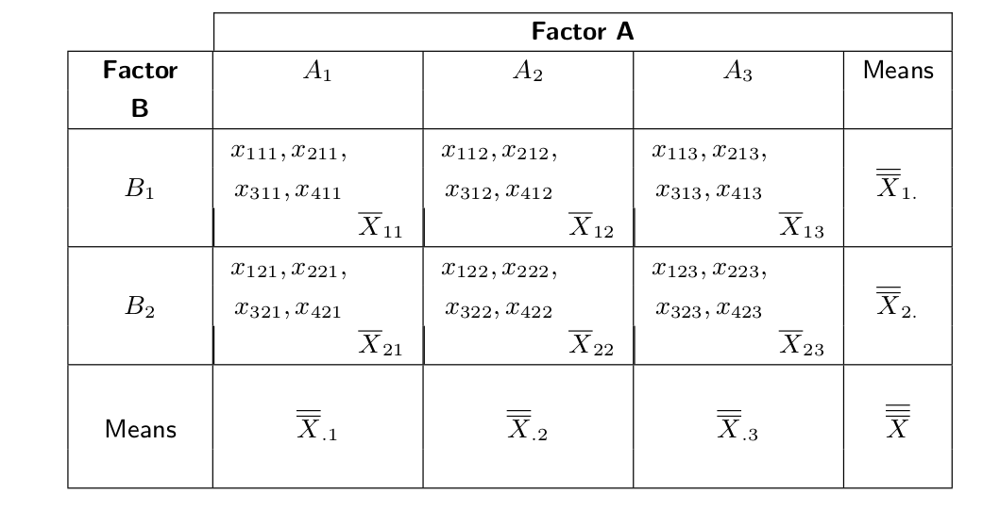

In this case there are three null hypothesis that have to be checked against as much alternative hypothesis.

The first hypothesis regards the effect of the factor (A) on the answer variable:
  $$ H_0: \,\mu_{.1} = \mu_{.2} = \dots = \mu_{.p} $$
  $$ H_A: \, \exists i,j \mid \mu_{.i} \neq \mu_{.j}\;\;\;(i,\,j=1,\,\dots,\,p) $$
where $p$ is the number of levels of the factor (A).

Or rather, the factor (A), indipendentently of the factor (B), has no effect on the answer variable.

The second hypothesis regards the effect of the factor (B) on the answer variable:
  $$ H_0:\,\mu_{1.}=\mu_{2.}=\dots=\mu_{q.} $$
  $$ H_{A}:\,\exists i,j\mid\mu_{i.}\neq\mu_{j.}\;\;\;(i,\,j=1,\,\dots,\,q) $$
where $q$ is the number of levels of the factor (B).

Or rather, the factor (B), indipendently of the factor (A), has no effect on the answer variable.

The first two hypothesis can be considered as two independent analysis of variance with a single factor.

The third hypothesis regards the combined effect of the treatments A and B on the answer variable. The combined effect is defined interaction.

<!--
Example. In a catalytic reaction there are:

* a positive effect (or rather an increase of the percentage of catalytised material) going from a temperature of $140^\circ C$ to a temperature of $180^\circ C$ using the catalyst $C_1$;
* a negative effect (or rather a decrease of the percentage of catalysed material)  going from a temperature of $140^\circ C$ to a temperature of $180^\circ C$ using the catalyst $C_2$;

As the algebra that regards the interactions is relatively more complex than the algebra of principal effects, we will avoid to delve into this topic.

It is enough to remember that, in a two or more factors analysis of variance, it exists also a component that regards the interaction.

-->

The total deviance or $SS_{Total}$ (Total Sum of Squares) defines the residual sum of squares of every value of the overall mean.
  $$ SS_{Total} = \sum_{k=1}^q \sum_{j=1}^p \sum_{i=1}^{n}{(X_{ijk}-\overline{\overline{\overline{X}}})^2} $$ 

where:

* $X_{ijk}$ is the $i$th observation that regards the $j$th level of the first factor and the $k$th level of the second factor;
* $n$ is the size (considered constant) of the corresponding group of observations at the $j$th level of the first factor and at the $k$th level of the second factor;
* $p$ is the number of levels for the first factor;
* $q$ is the number of levels for the second factor.

The $SS_{Total}$ defines the total variability of the sample.

The deviance between treatments or $SS_{\,Between}$ (Between Sum of Squares) defines the residuals sum of the squares of every group mean from the overall mean, multiplied the number of data of the corresponding group.  It exists three components "between": one for the factor A, one for the factor B and one for the interaction.
  The calculation of the component "between" is really similar to the calculation of the one-factor analysis of variance.
  
  $$ SS_A = qn \sum_{j=1}^p{(\overline{\overline{X}}_{j.}-\overline{\overline{\overline{X}}})^2}\quad \mbox{ For the factor  (A).} $$
  $$ SS_B = pn \sum_{k=1}^q{(\overline{\overline{X}}_{.k}-\overline{\overline{\overline{X}}})^2}\quad \mbox{ For the factor (B).} $$
  $$ SS_{AB} = n \sum_{j=1}^p{\sum_{k=1}^q{(\overline{X}_{jk}-\overline{\overline{X}}_{j.}-\overline{\overline{X}}_{.k}+\overline{\overline{\overline{X}}})^2}}\quad \mbox{ For the interaction (AB).} $$

The $SS_{\,Between}$ defines the variability among groups independently of the dispersion of the single observations within each group.

The deviance within treatments or $SS_{\,Within}$ (Within Sum of Squares), also called error, defines the residuals sum of squares of every value of the mean of its group.
  $$ SS_{\,Within}=\sum_{k=1}^{q} \sum_{j=1}^{p} \sum_{i=1}^{n}{(X_{ijk}-\overline{X}_{jk})^2} $$

The $SS_{\,Within}$ defines the variability within single groups independently of the position of the group compared to/around the central mean of the sample or compared to/around the mean calculated for a single factor.  As the remaining part of the variability quota does not represent only the sum of the squares within the groups but also the errors sum of squares, in the future it will be preferable to use $SS_{E}$ instead of $SS_{\,Within}$ or $SS_{W}$. Similarly, the corresponding degrees of freedom will be indicated with $df_{E}$ and the ratio between the sum of squares and the degrees of freedom with $MS_{E}$.

It is possible to demonstrate, also in this case, that
  $$ SS_{\,Total}=SS_{\,Between}+SS_{E} $$
where
  $$ SS_{\,Between}=SS_A+SS_B+SS_{AB} $$
with

* $SS_A$: sum of squares attributable to the factor (A);
* $SS_B$: sum of squares attributable to the factor (B);
* $SS_{AB}$: sum of squares attributable to the interaction between (A) and (B).


Starting from the sum of squares SS, it is possible to calculate the means of squares MS dividing by the appropriate degrees of freedom.

The calculation of the degrees of freedom still results to be quite easy.

* The degrees of freedom of each factor are equal to the number of levels of that factor minus one.
* The degrees of freedom of the interaction between the two factors are given by the product of the degrees of freedom of each factor.
* The degrees of freedom of the residuals are equal to the product of the number of groups and the number of observations within each group minus one. In other words, they are equal to the number of observations minus one and minus the sum of the degrees of freedom of each factor and the interaction.

As in the univariate case, it is valid the following relation:
  $$ df_{Total}=df_A+ df_B+df_{AB}+df_{E} \mbox{.} $$

For example, it is supposed to carry out an experiment with two factors, (A) and (B), where:

* the factor (A) has  two levels;
* the factor (B) has three levels;
* each combinations of factors' levels has four replications.

It follows that:

* the total number of observations $N$ is equal to $2 \cdot 3 \cdot 4 = 24$ from which $df_T = 23$;
* the factor (A) has two levels, from which $df_A=1$;
* the factor (B) has three levels, from which $df_B=2$;
* the interaction (AB) has degrees of freedom $df_{AB}=df_A\cdot df_B=2$;
* the residual (error) has degrees of freedom equal to 6 (groups) multiplied by 3 (number of observations within each group minus one), that is $df_E=6\cdot 3=18$.

Starting from the SS it is possible to calculate the means of squares MS:

  $$ MS_A=\frac{SS_A}{df_A} $$

  $$ MS_B=\frac{SS_B}{df_B} $$

  $$ MS_{AB}=\frac{SS_{AB}}{df_{AB}} $$

  $$ MS_E=\frac{SS_E}{df_E} $$

The $MS_A$, $MS_B$ and $MS_{AB}$ , if the null hypothesis are true, or rather if the factors (A) and (B) do not have any effects on the answer variable, they are all independent estimations of the variance of $\sigma^2_\varepsilon$ from which the sample has been extracted.

$MS_E$ is an estimation of $\sigma^2_\varepsilon$.

As consequence, if all the hypothesis $H_0$ are valid:

  $$ \frac{MS_A}{\sigma^2_A}=\frac{MS_A}{\sigma^2_\varepsilon}\sim\chi^2_{df_A} \quad \frac{MS_B}{\sigma^2_B}=\frac{MS_B}{\sigma^2_\varepsilon}\sim\chi^2_{df_B} $$

  $$ \frac{MS_{AB}}{\sigma^2_{AB}}=\frac{MS_{AB}}{\sigma^2_\varepsilon}\sim\chi^2_{df_{AB}} \quad \frac{MS_E}{\sigma^2_E}=\frac{MS_E}{\sigma^2_\varepsilon}\sim\chi^2_{df_E} $$

and, as consequence, the ratios
  $$ F_A=\frac{MS_A}{MS_E}\sim F_{df_A,df_E} \quad F_B=\frac{MS_B}{MS_E}\sim F_{df_B,df_E} $$

  $$ F_{AB}=\frac{MS_{AB}}{MS_E}\sim F_{df_{AB},df_E} $$

  tend to be distributed as a $F$ of Fisher-Snedecor with appropriate degrees of freedom.

It is then possible to build a table of the analysis of variance like follows:

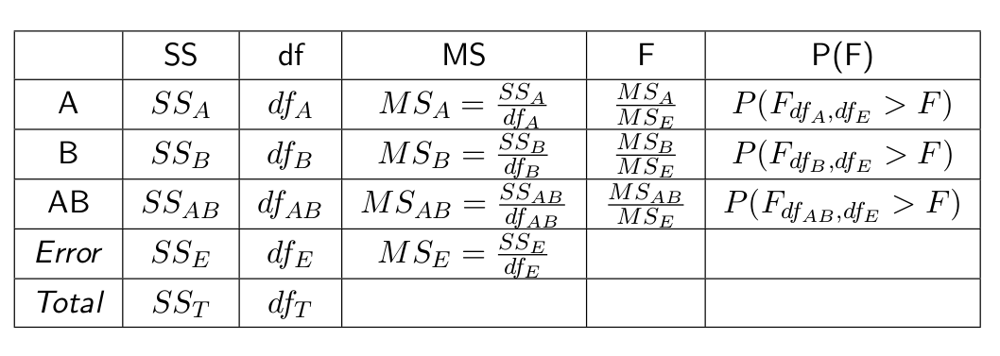

The rules to read this table are identical to those of one-factor case.

The different concept is that, in a multivariate case, there are a lot of null hypothesis that have to be checked.

<!--
For example, an experiment with three factors (A, B, C) requires the calculation of eight MS, or rather: A, B, C, AB, AC, BC, ABC, E.

Assuming, for example, that the interaction ABC is not significant, it implies that this interaction can be removed from the analysis.

But, the equation
  $$ SS_{T}=SS_A+SS_B+SS_C+SS_{AB}+SS_{AC}+SS_{BC}+SS_{ABC}+SS_E $$
must be always true.

If we leave ABC, the equation will not be true.

In practice, the equation is defined like follows:
  $$ SS_{T} = SS_A + SS_B + SS_C + SS_{AB} + SS_{AC} + SS_{BC} + SS_{E1} \mbox{,} $$
where:
  $$ SS_{E1} = SS_E + SS_{ABC} \mbox{.} $$

The degrees of freedom have to be modified too, so that:
  $$ df_{E1}=df_E+df_{ABC} \mbox{.} $$
If the SS of the error and the degrees of freedom change, it will then change also the MS of the error:
  $$ MS_{E1}=\frac{SS_{E1}}{df_{E1}} \mbox{.} $$

It follows that all the ratios F and the relative probabilities are altered.

In conclusion, in a multivariate ANOVA analysis, it is necessary to carry on with the estimation of the more parsimonious model for interactions that follows, removing one terms at a time from the analysis.

The choice of the term that has to be removed first is done according to two choice criterions:

* the degree of the term: the terms with an higher degree are removed first;
* with the same degree, the term with smaller F value or $P(F)$ higher.

This has to stay within hierarchical models.
-->

<!--
Mathematical formulation

The mathematical model formulation of the ANOVA with two or more factors result to be an easy enlargement of the univariate model, every single observation $X_{ijk}$ can be written as
  $$ X_{ijk}=\mu+\alpha_{j}+\beta_{k}+\gamma_{jk}+\varepsilon_{ijk} $$
as it is determined:

* by the overall mean $\mu$ that defines the dimension of the experiment;
* by the parameter $\alpha_{j}$ that regards the $j$th level of the factor (A);
* by the parameter $\beta_{k}$ that regards the  $k$th level of the factor (B);
* by the parameter $\gamma_{jk}$ that regards the interactions on the levels $j$th and $k$th of the factors (A) and (B);
* by a random term $\varepsilon_{ijk}$ called residual or experimental error.

In this case too:
  $$ \varepsilon_{ijk}\,\in\, \varepsilon \sim N(0,\,\sigma_{\varepsilon}) \quad \forall \quad (i,\,j,\,k) $$
In other words, the error term of the model is distributed with null mean and constant variance.

The normality condition of the error term of the model is one of the validity conditions of the model itself, together with the independence of the residuals values.

In conclusion, the residuals analysis, in the multivariate case, is identical to the univariate case.

-->

#### Example 

A scientist want to know if survival time of a sample of rats is influenced by poison and treatment administered. So we consider three types of poison and four types of treatment. Each combination poison-treatment is administered to four rats. 

```{r}
data(rats)
head(rats)
```

Let us analyze numerically and graphically data consideing poison and treatment administered.

```{r}
summary_stat <- rats %>% 
  group_by(Poison, Treatment) %>%
  summarise(n=n(),
    min=min(Time),
    first_qu=quantile(Time, 0.25),
    mean=mean(Time),
    median=median(Time),
    third_qu=quantile(Time, 0.75),
    max=max(Time),
    sd=sd(Time))

print(summary_stat)

ggp <- ggplot(data = rats, mapping = aes(x=Poison, y=Time, fill=Poison)) +
  geom_boxplot()

print(ggp)

ggp <- ggplot(data = rats, mapping = aes(x=Treatment, y=Time, fill=Treatment)) +
  geom_boxplot()

print(ggp)
```


Let us check if the two factors and their interaction influence the rats survival time.
This is a two way ANOVA analysis.

```{r}
mod <- aov(formula = Time ~ Poison * Treatment, data=rats)
summary(mod)
```

Interaction effect is not significant so we can remove it from the model.

```{r}
mod <- aov(formula = Time ~ Poison + Treatment, data=rats)
summary(mod)
```

We can conclude that rats survival time is influenced by poison and treatment administration but not by their interaction.

## Proportion test


### One proportion p-test

For qualitative type phenomenon, the interest is often in the (percentage) ratio of units which present the interesting characteristic.

For example it can be useful to know: in the case of a productive process, the percentage of the defective pieces; in a clinical reasearch, the proportion of people who positively respond to a medicine; in a bank, the proportion of insolvent customers.

All of these phenomenon can be modeled with a binomial random variable of parameters $n$ and $p$. $n$ indicates the number of proofs (trials) and $p$ indicates the probability of success in every single trial, which is supposed to be equal in each trial.

It wants to be checked the hypothesis that the true (and unknown) proportion of interest events (happened) is $p_0$ starting from sample data. This is against the alternative hypothesis which is different.

The null hypothesis is formulated:  $H_0:  p = p_0$,  
Against the alternative hypothesis:  $H_A:  p \neq p_0$.

$x$ is the number of "successes" obtained after having done $n$ trials. $\hat{p} = \frac{x}{n}$ is the proportion of "successes" in the sample.
In its easiest formulation, the $p$-test for a proportion is like follows:
  $$ \frac{\hat{p} - p_0}{\sqrt{p_0 (1-p_0) / n}} $$
That, if $H_0$  is valid and $n$ is enough large, it is distributed like a normal standard.

It is possible to build a confidence interval for the "true" proportion of successes. This is, similarly to what has been seen for the $Z$-test, the interval:
  $$ \left( \hat{p} - z_{1-\frac{\alpha}{2}} \cdot \sqrt{\frac{p_0 (1-p_0)}{n}}; \hat{p} + z_{1-\frac{\alpha}{2}} \cdot \sqrt{\frac{p_0 (1-p_0)}{n}} \right) $$

#### Example

A factory that produces DVDs wants to check the hypothesis that the proportion of defective pieces produced is 0.01 (=1$\%$), to a level of statistical significance $\alpha = 0.05$.
With this aim, it selects, by chance, 100 pieces and it tests them. The result of the test shows that there are always two defective pieces.

Let us check the null hypothesis $H_0: p = 0.01$ against the alternative hypothesis $H_A: p \neq 0.01$:

<!--
  $$ \frac{(2/100) - 0.01}{\sqrt{0.01 (1-0.01) / 100}} = 0.01 / \sqrt{0.000099} = 1.005 $$
-->

```{r}
binom.test(x = 2, n = 100, p = 0.01)
```

`binom.test()` function performs one proportion test for a Binomial experiment. It takes as arguments: the number of successes, `x`, the number of trials, `n` and the hypothesized probability of success, `p`.

It is possible to conclude that it does not exist empirical evidence that allows to refuse the null hypothesis. This conclusion is obtained looking at the p-value of the test, which is equal to $0.2642$, value greater than the fixed $\alpha$.  


### Two proportions p-test

In the case of two means coming from different samples, it has been seen how it is possible to check the hypothesis that the two populations true (and unknown) means, are equal. In the same way, in the case of two samples, it is possible to check, starting from sample data, the hypothesis that the true proportions ($p_A$ and $p_B$) of two different populations are equal.

The null hypothesis is formulated:  $H_0:  p_A = p_B$,  
Against the alternative hypothesis:  $H_A:  p_A \neq p_B$.

In its easiest formulation, the $p$-test for two proportions has the following form:
  $$ \frac{\hat{p}_A - \hat{p}_B}{\sqrt{\hat{p}_A (1 - \hat{p}_A) / n_A + \hat{p}_B (1 - \hat{p}_B) / n_B}} $$
That, if $H_0$ is true and with $n_A$ and $n_B$ enough large, it is distributed as normal standard.

The statistical hypothesis test for two proportions can also be generalized to verify that a difference equal to $\delta$ exists between the two proportions:
  $$ H_0: p_A - p_B = \delta $$

In conclusion, both for the test for one proportion and the test for two proportions, it is possible to check the null hypothesis against the unilateral alternative hypothesis. 

#### Example

It is supposed that two different machineries, A and B, have produced respectively 200 and 500 pieces within a working day. 3 of the pieces produced by the machinery A and 4 of the pieces produced by the machinery B were defective.

It wants to be checked the hypothesis that the two machineries produce the same proportion of defective pieces, against the hypothesis that the proportion is different, at a level of statistical significance  $\alpha = 0.05$

The following function computes two sample proportion test.

```{r}
two_sample_prop_test <- function(x1,x2,n1,n2){
  p1 <- x1/n1
  p2 <- x2/n2
  numerator <- p1 - p2
  denominator <- (p1*(1-p1)/n1) + (p2*(1-p2)/n2)
  prop_test = numerator / sqrt(denominator)
  return(prop_test)
}

res <-two_sample_prop_test(x1=3,x2=4,n1=200,n2=500)
res
```

Let us compute the test p-value
```{r}
p_value <- 2*(1 - pnorm(q = res))
p_value
```

It is possible to conclude that it does not exist empirical evidence that allows to refuse the null hypothesis. This conclusion comes from the fact that the obtained quantity (0.73), in absolute value, is smaller than the cut-off value of a normal standard for $\alpha = 0.05$, which is 1.96.

It is possible to reach the same conclusion observing the p-value that can be calculated as the probability to have, in a standard normal distribution, a value smaller than -0.73 or the probability to have one greater than 0.73. This probability is 0.456. Since the p-value is greater than the fixed $\alpha$ value, the null hypothesis is not refused.

### Chi-Squared test

The  $\chi^2$ (Chi-Squared) test was originally projected to try out the concordance between two distributions, one theoretic and the other observed.
This test does not formulate distributive arguments for its own applicability. It is often used to check the association between the various modalities of two or more qualitative characters.

It is supposed to note down on $n$ objects, two qualitative characteristics. The first one (Q1) composed by $r$ modalities, and the second one (Q2) composed by $c$ modalities. It is necessary to valuate if the distribution of these two characteristics is not associated within the whole population.

The hypothesis system is the following:

$H_0:$ $it$ $does$ $not$ $exist$ $a$ $link$ $between$ $Q1$ $and$ $Q2$

$H_A:$ $it$ $does$ $exist$ $a$ $link$ $between$ $Q1$ $and$ $Q2$ 

A frequencies table with this structure can be built:

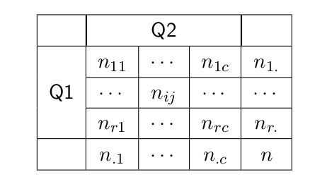

where $n_{ij}$ represents the number of objects which present the $i$th characteristic of Q1 and the $j$th of Q2.   
$n_{i.}$ represents the total for the $i$th row and $n_{.j}$ represent the total of the $j$ column.

$p_{ij}$ are the relative frequencies calculated on the columns $(p_{ij} = n_{ij}/n_{.j})$. The case of total lack of links can be expressed like: $p_{i1} = p_ {i2} = \dots = p_{ic} = p_{i.}$, $i = 1, \, \dots, \, r$, where $p_{i.} = n_{i.}/n$.  
In other words, the relative frequencies calculated on the columns (almost all of them) are equal. They are also equal to the marginal relative frequencies.

The same thing can be expressed calculating the relative frequencies on the rows: $p_{1j} = p_{2j} = \dots = p_{rj} = p_{.c}$, $j = 1, \, \dots, \, c$, where $p_{.j} = n_{.j}/n$.

As previously said, these two formulations are alternative and equivalent.

In the case of the first of the two formulations, if there are not any links between the two qualitative characteristics, the result is:

  $$ p_{ij}=p_{i.} \Longleftrightarrow n_{ij}^*/n_{.j} = n_{i.}/n  \Longleftrightarrow n_{ij}^* = (n_{i.} \cdot n_{.j})/n $$

The last equality determines the mathematic condition in order not to have any links between the studied characteristics.
With a frequency table with two entries, the formula above allows us to establish which would be the frequencies $n_{ij}^* \, ( = n_{i.} \cdot n_{.j}/n)$ expected in the case of perfect independence (that is, lack of link) between the two qualitative characteristics that are studied.
The $Chi-Squared$ test uses the formula that follows to check if the independence exists or not:
  $$ \chi^2 = \sum_{i=1}^r \sum_{j=1}^c{\frac{(n_{ij}-n_{ij}^*)^2}{n_{ij}^*}} $$

If this quantity is large, the null hypothesis is rejected. It is possible to say that it exists a link between the two qualitative characteristics that have been analysed.
In order to accept or to refuse the null hypothesis, the cut-off value is obtained by the quantiles of level $\alpha$ (usually equal to 0.05) of the distribution $\chi^2$ with $(r-1) \cdot (c-1)$ degrees of freedom.

<!--
Notes

* This result is asymptotic, this means that it is valid for large sample size ($n>100$).
* In particular, in literature it is suggested not to have expected sample sizes ($n_{ij}^*$) smaller than 5.
* Certain authors accept at maximum 2 or 3 cells with expected sample sizes smaller than 5. This happens because the calculated quantity for the test, is a weighted mean with the inverse of the expected sample sizes within the cells. The smaller are that values, the smaller will be the variations that will highly contribute to the whole result of the test.
-->

#### Example 

Let us consider travel information of Titanic passengers. 

```{r}
data(titanic)
head(titanic)
```

Let us compute the survival proportion and percentage for class of travel

```{r}
 titanic %>% count(Class, Status)
rel_prop <- titanic %>%
  group_by(Class, Status) %>%
  summarise (n = n()) %>%
  mutate(freq = n / sum(n))
rel_prop

tot_prop <- titanic %>%
  group_by(Class) %>%
  summarise (n = n())
tot_prop
```

We want to check if it does not exist a link between the survival probability and the two classes of travel, i.e. if the survival probability is equal for the two classes of travel.

```{r}
prop.test(x = c(122, 1368), n = c(325, 1876))
```

`prop.test()` performs $Chi-squared$ proportion test. It tests the null that the proportions (probabilities of success) in several groups are the same. Argument `x` refers to vector of counts of successes and argument `n` to vector of counts of trials.

The null hypothesis is rejected. The test value is equal to $156.97$, widely greater than the threshold $1.96$; also the p-value, equal to $2.2e-16$, is widely lower than $0.05$.

We conclude that the survival probability is not equal for the two classes of travel.

## Power of a statistical test

When an experiment is planned, the first question is often: "How many data do I have to collect?"

After the test, if it results not significant, it is fundamental to answer to the question: "With the collected sample, which probability do I have that the test results important according to certain hypothesis?"

The first question is also called prior power, and the second one posterior power.

The analysis of the power and the analysis of the sample size are important instruments. They are able to check the ability of a statistical hypothesis test to notice when the null hypothesis is false, and to decide which dimension of the sample is required in order to have a good probability to refuse the null hypothesis when it is false.

In a generic statistical hypothesis test, the value of an interest quantity in the distribution of a population, is typically checked specifying a null hypothesis $H_0$ that contrasts with an alternative hypothesis $H_A$.


Once that the hypothesis system has been established, the statistics procedure follows the following steps:

* BEFORE Collecting the data (the sample) of the population:

    1. To look for an appropriate statistics called test statistic. It is a function of data which sums up certain characteristics  of the sample and which gives information on the hypothesis system. The test statistic is a random value as the selection procedure is random. Moreover, as a result it can give two different sets of values, if in the reality $H_0$ or $H_A$ are true. For example, if $H_0$ is true, the statistics value should result small. On the contrary, if $H_A$ is true, the statistics value should result great;
    2. To evaluate the distribution of the test statistic when $H_0$ is true;
    3. To set a cut-off value on the possible values of the test statistic. It will be able to discriminate if $H_0$ or $H_A$ are true. The cut-off should be chosen so that it exists a little probability to refuse $H_0$ when it is correct. This is true because the test statistic represents a random value. This probability is called $\alpha$.
* AFTER Having collected the data (the sample) of the population:

    1. To calculate the statistics value on the selection data.
    2. To determine if $H_0$ or $H_A$ are true using the statistics value obtained by the data and the cut-off value.

INDEPENDENTLY of how the experimentation is conducted, it is possible to present four situations:

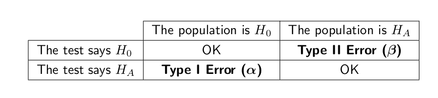

If the tests refuse $H_0$ while $H_0$ is effectively true for the population, a $Type$ $I$ $error$ is produced. The value of the probability to commit this error is called $\alpha$ and it is checked by the tester.

If the test accepts $H_0$, while $H_A$ is the "true status" for the population, a $Type$ $II$ $error$ is produced. The probability to commit this error is called $\beta$, and it is not directly verifiable when the test is on progress. The value $(1-\beta)$ is called test power and represents the probability to correctly refuse the hypothesis $H_0$ when it is false.


The fundamental parameters that result from an analysis of the power are:

* The dimension of the sample ($n$) or
* The measure of the power of the test ($1-\beta$)

And the values can be modulated one in function of the other.

These values can be estimated on the basis of the relations that exist between 5 quantities:

* the probability ${\alpha}$ to commit a $Type$ $I$ $Error$. It has to be specified also the direction of the hypothesis $H_A$, i.e. if it is unilateral or bilateral;
* the probability ${\beta}$ to say, the probability to erroneously refuse the alternative hypothesis $H_A$ (this means to accept $H_0$) when it is true;
* the dimension of the difference ${\delta}$ between the hypothesized value and the true value of the interests quantity (or the difference between the hypothesized value for the statistics and the true value of the statistics). In the case of a statistical hypothesis test on a sample mean, ${\delta}$ is equal to the difference between $\mu_0$, the hypothesized mean, and $\mu$, the true mean of the two populations. When the test is applied to two independent samples, ${\delta}$ is equal to the difference between $\mu_1$ and $\mu_2$, the two populations means.
* the variance  $\sigma^2$, if known (only in the case of the $Z$-test), or an estimation ${s^2}$ of the population variance. It is measured by a pilot study or a preliminary sample when the true variance $\sigma^2$ is unknown;
* the dimension $n$ of the sample, seen as dimension of each subgroups of the whole sample (to say, the whole sample in the $Z$-test and $t$-tests for one sample, and each of the two subsamples in the $t$-tests for two dependent and independent sample).


