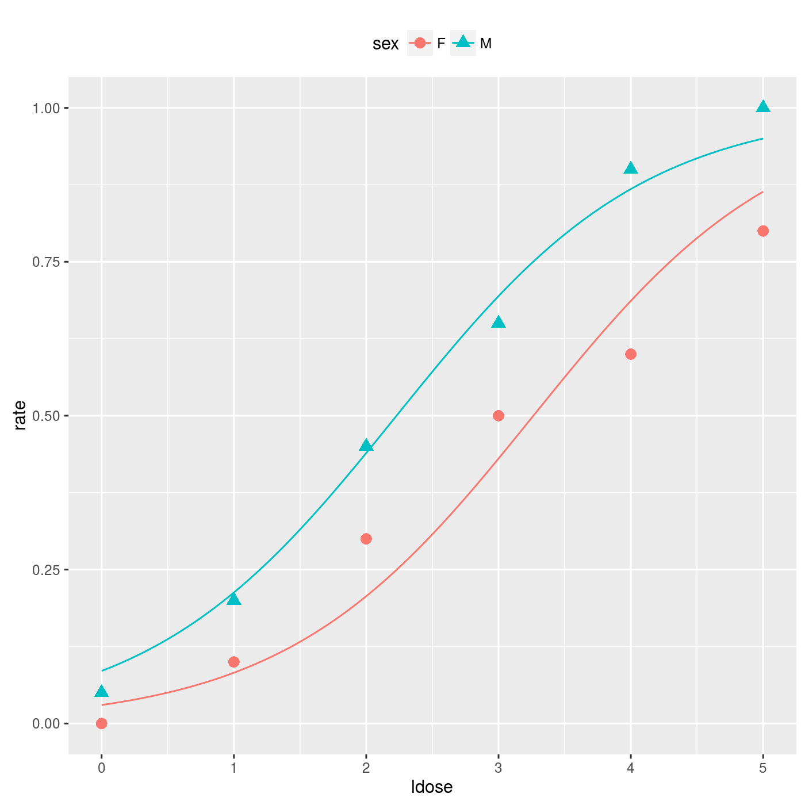

```{r setup, include=FALSE, purl=FALSE}
require(knitr)
# La directory di lavoro va definita all'inizio in questo modo per non doverla ripetere in
# ogni chunk! (con echo=F si eseguono i comandi del chunk senza mostrarli)
#root.dir = "~/Dropbox/quantide/int/corsi/corsiR/03.rModels/v01/data/allData",
opts_chunk$set(list(dev = 'png',fig.cap='',fig.show='hold',dpi=100,fig.width=7, fig.height=7,fig.pos='H!',fig.path="images/glm-"))
```

Below, a couple of examples of cases where the "classic" Linear Model does not hold are presented.  
Along with the examples, the "base logic" of GLMs is presented, to explain why and how GLMs extend the Linear Models.  

In next sections, thus, we will see several examples of General Linear Models, and we will see how Linear Models can thus be seen as a special case of General Linear Models.

## Example: Pyrethroid

Collett (1991, p. 75) reports an experiment on the toxicity to the tobacco budworm _Heliothis Virescens_ of doses of the pyrethroid trans-cypermethrin to which the moths were beginning to show resistance. 

Batches of 20 moths of each sex were exposed for three days to the pyrethroid and the number in each batch that were dead or knocked down was recorded.

The results were:

<!---
|Dose ($\mu g$) |  1  |  2   | 4  |  8   | 16  | 32 |
|:--------------|----:|-----:|---:|-----:|----:|---:|
|    Sex: Male  |  1  |  4   | 9  |  13  | 18  | 20 |
|  Sex: Female  |  0  |  2   | 6  |  10  | 12  | 16 |

<center></center>
--->
<center>
<style type="text/css">
.tg  {border-collapse:collapse;border-spacing:0;}
.tg td{font-family:Arial, sans-serif;padding:5px 5px;border-style:solid;border-width:0px;overflow:hidden;word-break:normal}
.tg th{font-family:Arial, sans-serif;font-weight:normal;padding:5px 5px;border-style:solid;border-width:0px;overflow:hidden;word-break:normal;border-top-width:2px;border-bottom-width:2px;}
.tg .tg-baqh{text-align:left;vertical-align:top}
.tg .tg-lqy6{text-align:right;vertical-align:top}
.tg .tg-yw4l{vertical-align:top}
</style>
<table class="tg">
<tr>
<th class="tg-baqh">Dose ($\mu g$)</th>
<th class="tg-yw4l">1</th>
<th class="tg-yw4l">2</th>
<th class="tg-yw4l">4</th>
<th class="tg-yw4l">8</th>
<th class="tg-yw4l">16</th>
<th class="tg-yw4l">32</th>
</tr>
<tr>
<td class="tg-baqh">Sex: Male</td>
<td class="tg-yw4l">1</td>
<td class="tg-yw4l">4</td>
<td class="tg-yw4l">9</td>
<td class="tg-yw4l">13</td>
<td class="tg-yw4l">18</td>
<td class="tg-yw4l">20</td>
</tr>
<tr>
<td class="tg-baqh">Sex: Female</td>
<td class="tg-yw4l">0</td>
<td class="tg-yw4l">2</td>
<td class="tg-yw4l">6</td>
<td class="tg-yw4l">10</td>
<td class="tg-yw4l">12</td>
<td class="tg-yw4l">16</td>
</tr>
</table>
</center>


<br/>
To analyze such a type of relation, a "classic" linear model is inadequate, because:

* Dependent variable of model is clearly non-Normal.
* The error term of model cannot be thought as homoscedastic, because if the true ratio of death of mots is close to 0.5, then the variance of dependent variable is close to 0.25; whereas, if the true ratio of death of mots is close to 0 or 1, then the variance of dependent variable may be much less than 0.25.
* The predicted values produced by a "classic" linear model may almost surely fall oustide the allowed range for the dependent variable in this case; consequently, and also, the relation between independent and dependent variables is almost surely non-linear.

To analyze such a problem, we can model the individual moth exitus by using the Binomial distribution: 
$$
Z_k \sim Bin(1,\mu_k)\,,\quad \mu_k = \frac{e^{\eta_k}}{1+e^{\eta_k}}\,,\quad k=1,\ldots,m
$$
where $Bin(a,b)$ means a Binomial distribution with parameters $a$ (sample size) and $b$ (probability of success); $Z_k$ is equal to 1 if the $k$-th worm is dead or knocked out, $Z_k=0$ otherwise; $\mu_k = Pr(Z_k = 1)$; $\eta_k$ is a linear function of independent variables (the **linear component** of model);  $m = 240$ $(2 \times 6 \times 20)$. 

When observations are grouped (in the example budworms are grouped in batches of size $n_i=20$) it is more convenient considering $Z_{ij}$, $i=1,\ldots,n$, $j=1,\ldots,n_i$, $\sum_{i=1}^n n_i = m$, and dealing with
   $$
   Y_i = \frac{1}{n_i}\sum_{j=1}^{n_i} Z_{ij} 
   $$
In the example $n_i=20$ $\forall i$ and $n=12$.
  
The deterministic (linear) component of the base model, if no interaction between `Sex` and  `Dose` is considered, may be stated as: 
$$ 
\eta_i = \beta_0 + \beta_1 x_{i1} + \beta_2 x_{i2}
$$

where $x_{i1}$ is the dose applied to the $i$-th grouped observation; $x_{i2}=1$ if the $i$-th grouped observation is a male's batch and $x_{i2}=0$ if the $i$-th grouped observation is a female's batch.

The inverse of formula which returns $\mu_i$ as a function of $\eta_i$ (in this case a logistic-type function) is called **Link function**, and in this case (as inverse of logistic function) is called **logit**: 
$$
\eta_i = g(\mu_i) = \textrm{logit}(\mu_i) = \log\left(\frac{\mu_i}{1-\mu_i}\right)\,,\quad \mu_i = E(Y_i)
$$

As a consequence: 
$$
\mu_i = g^{-1}(\eta_i) = \frac{e^{\eta_i}}{1+e^{\eta_i}} =
   \frac{\exp(\beta_0 + \beta_1 x_{i1} + \beta_2 x_{i2})}{1+\exp(\beta_0 + \beta_1 x_{i1} + \beta_2 x_{i2})}
$$
The resulting model could be graphically summarized, for this specific example, with the following graph:

<!---  --->
```{r image, out.width = "600px", echo=FALSE}

```

### How to specify response variable for binomial data in R
In the case of binomial data, in **R** response variable may be specified in three different ways:

* If the response is a numeric vector it is assumed to hold the data in ratio form, $y_i = s_i / a_i$, in which case the $a_i\text{'s}$ must be given as a vector of weights using the `weights` argument. If the $a_i\text{'s}$ are all one, the default `weights` suffices.
* If the response is a logical vector or a two-level factor it is treated as a 0/1 numeric vector and handled as previously.
* If the response is a two-column matrix it is assumed that the first column holds the number of successes, $s_i$, and the second holds the number of failures, $a_i - s_i$, for each trial. In this case, no `weights` argument is required.


## Example: Chromosomal abnormalities
An experiment recorded the counts of chromosomal abnormalities observed for various amounts and intensities of gamma radiation.
The number of cells per measurement varied.
The results contains, for each one of 27 measurements:

* The number of cells per measurement;
* The numbers of chromosomal abnormalities;
* The amount of gamma radiation;
* The intensity of gamma radiation.   

In such a case, again the "classical" linear model is inadequate, since the dependent variable is discrete, clearly non-Normal, and cannot be negative. 

In this case, a Poisson distribution may be assumed for the dependent variable. The parameter (the mean) of Poisson distribution could be a non-linear transformation of a linear combination of explicative (independent) variables. In this case, since the mean of Poisson distribution must be greater than zero, the non-linear transformation could be the Exponential one: 
$$
Y_i \sim \text{Poi}(\mu_i)\,,\quad \mu_i = E(Y_i) = e^{\eta_i}\,,\quad i=1,\ldots,n
$$
$Y_i$ is the number of chromosomal abnormalities for the $i$-th observation; $n =$ 27.  
The deterministic (linear) component of the base model could be: 
$$
\eta_i = \beta_0 + \beta_1 x_{i1} + \beta_2 x_{i2} + \beta_3 x_{i3} + \beta_4 x_{i4}
$$
where $x_{i1}$ is the number of cells, $x_{i2}$ is intensity of gamma radiation, $x_{i3}$ is the amount of gamma radiation, $x_{i4} = x_{i2}x_{i3}$.  
The link function is a **log link**: 
$$
\eta_i = g(\mu_i) = \log(\mu_i)
$$
As a consequence: 
$$
\mu_i = g^{-1}(\eta_i) = e^{\eta_i} = \exp(\beta_0 + \beta_1 x_{i1} + \beta_2 x_{i2} + \beta_3 x_{i3} + \beta_4 x_{i4})
$$


