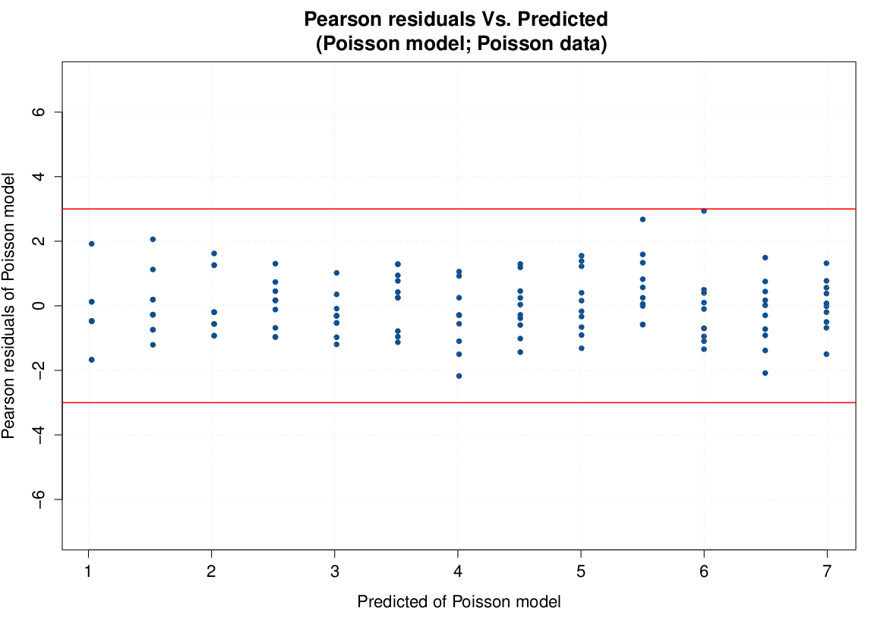
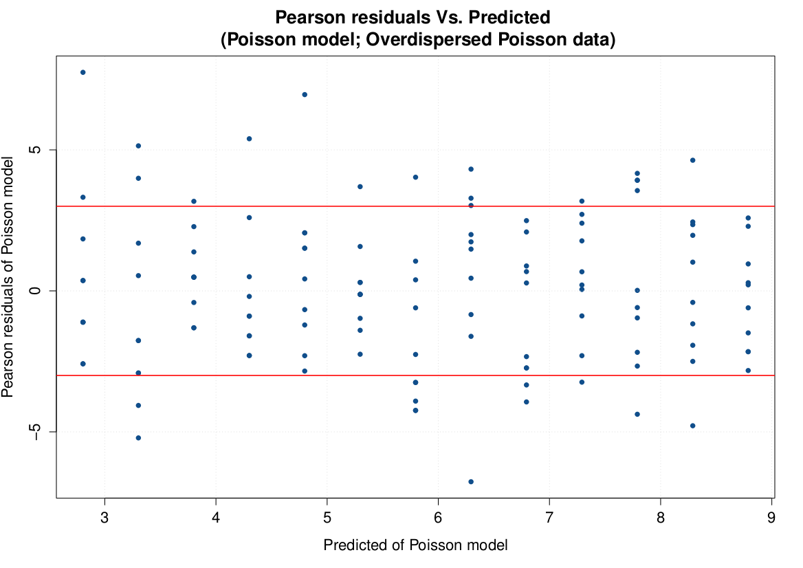
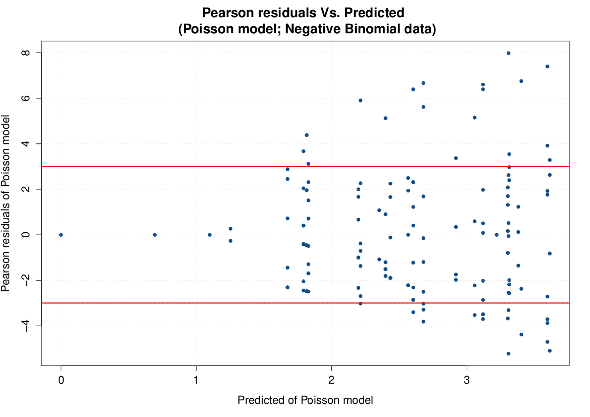

```{r setup, include=FALSE, purl=FALSE}
require(knitr)

opts_chunk$set(list(dev = 'png',fig.cap='',fig.show='hold',dpi=100,fig.width=7, fig.height=7,fig.pos='H!',fig.path="images/oth-"))
```

## Multinomial distribution models
When a categorical dependent variable with more than two mutually exclusive outcomes is analyzed, a Multinomial Logistic regression model can be used.

Suppose for example that one does an experiment of extracting $n$ balls of $k$ different categories from a bag, replacing the extracted ball after each draw. Balls from the same category are equivalent. Denote the variable which is the number of extracted balls of category $i (i = 1, ..., k)$ as $X_i$, and denote as $p_i$ the probability that a given extraction will be in category $i$.   Let there be $n$ balls extracted. The probability function of this **multinomial** distribution is:  

   $f(x_1,\cdots,x_k;n,p_1,\cdots, p_k)=Pr\{ X_1=x_1 \text{and} \cdots \text{and} X_k=x_k\}=$ \newline
   $$=\begin{cases}
     \\
    \dfrac{n!}{x_1! \cdots x_k!} p_1^{x_1} \cdots p_k^{x_k}, \text{when       } \sum_{j=1}^k x_i=n \\
     \phantom{a} \\
    0 \text{ otherwise} \\
    \end{cases}
   $$

The regression model used to fit Mutinomial data is similar to one used to analyze Binomial data.  
The model will need a class (without loss of generality, the first) of the dependent variable as "reference class", and will calculate logits for the other classes with reference to this class.

A linear model will be then calculated for each logit.

Then, given $Y_{ij}$ ($i=1,\cdots,n$, $j=1, \cdots,k$), the $n$ realizations from a Multinomial distribution, let indicate with $p_{i,j}=Pr\{Y_i=j\}$.  The following holds:  
   $\eta_{i,j}=g(p_{i,j})=\log\left(\dfrac{p_{i,j}}{p_{i,1}}\right)=\underline{x}_i^T\underline\beta_j   \phantom{sp} (j=2,\cdots, k)$

And the following properties apply  

  * $p_{i,j}=\dfrac{\exp(\eta_{i,j})}{1+\sum_{j=2}^k\exp(\eta_{i,j})} \phantom{sp} (j=2,\cdots, k)$
  * $\sum_{j=1}^k p_{i,j}=1$
  * $p_{i,1}=1-\sum_{j=2}^k p_{i,j}$

Then, a set of $k-1$ equations will be estimated:  

  $\hat\eta_{i,2}=\log\left(\dfrac{\hat{p}_{i,2}}{1-\sum_{j=2}^k \hat{p}_{i,j}}\right)=\hat\beta_{0,2}+\hat\beta_{1,2}x_{i,1}+\cdots+\hat\beta_{p,2}x_{i,p}$  

   $\cdots$  

  $\hat\eta_{i,k}=\log\left(\dfrac{\hat{p}_{i,k}}{1-\sum_{j=2}^k \hat{p}_{i,j}}\right)=\hat\beta_{0,k}+\hat\beta_{1,k}x_{i,1}+\cdots+\hat\beta_{p,k}x_{i,p}$


The "standard" estimation process tries to estimate jointly all equations parameters.  
However it is possibile (but less efficient) to estimate each equation separately.  
The only available link for multinomial models is the *Logit* (at least, in `nnet` recommended package).  
Anyway, another approach to analyze Multinomial dependent variables could be using log-linear models with Poisson dependent variable (as shown in examples).  


## Ordinal Multinomial distribution models
When the categories for a multinomial response variable can be ordered, then the distribution of that variable is referred to as **Ordinal Multinomial**.  
For example, if in a survey the responses to a question are recorded such that respondents have to choose from the pre-arranged categories "Strongly agree", "Agree", "Neither agree nor disagree", "Disagree", and "Strongly disagree", then the counts (number of respondents) that endorsed the different categories would follow an Ordinal Multinomial distribution.  
When the dependent variable follows an Ordinal Multinomial distribution, then an **Ordinal Logit Model** may be used to fit it.

Let 
    $\gamma_{i,j}=Pr\{Y_i\leqslant j\} \phantom{space} (j=1,\cdots, k-1)$  
    
Then  
    $\gamma_{i,k}=1$  
    
And let  
    $\eta_{i,j}=g(\gamma_{i,j})=\log\left(\dfrac{\gamma_{i,j}}{1-\gamma_{i,j}}\right)=\theta_j-\underline{x}^T_i\underline{\beta}$  
Then  
    $\gamma_{i,j}=\dfrac{e^{\eta_{i,j}}}{1+e^{\eta_{i,j}}}$  

Then, a set of $k-1$ equations have to be estimated:  
    $\hat\eta_{i,1}=\log\left(\dfrac{\hat\gamma_{i,1}}{1-\hat\gamma_{i,1}}\right)=\log\left(\dfrac{\widehat{Pr\{Y_i\leqslant 1\}} }{1-\widehat{Pr\{Y_i\leqslant 1\}} }\right)=$  
    $=\hat\theta_1 - \hat\beta_1 x_{i,1} - \cdots - \hat\beta_p x_{i,p}$  

  $\cdots$

  $\hat\eta_{i,k-1}=\log\left(\dfrac{\hat\gamma_{i,k-1}}{1-\hat\gamma_{i,k-1}}\right)=\log\left(\dfrac{\widehat{Pr\{Y_i\leqslant k-1\}} }{1-\widehat{Pr\{Y_i\leqslant k-1\}} }\right)=$  
  $=\hat\theta_{k-1} - \hat\beta_1 x_{i,1} - \cdots - \hat\beta_p x_{i,p}$  

Where the $\underline\beta$ vector is constant at all levels of dependent variable, and where the $\theta_j$ (intercepts) parameter values change with levels of dependent variable.

This model usually uses less parameters than the "standard" Multinomial one.  
Since only the intercept of linear equation varies with levels of dependent variable, this model is said "proportional odds" model.  

The basic interpretation of model is as a *coarsened* version of a latent variable $Z$ which has a logistic or normal or extreme-value or Cauchy distribution with scale parameter $1$ and a linear model for the mean.  
Consequently, the link functions for Ordinal Multinomial model available in **R** are `logit` (Logistic latent variable), `probit` (Normal latent variable), `cloglog` (Extreme-value latent variable) and `cauchit` (Cauchy latent variable).  

### Negative Binomial models
In above chapters, we showed some example of quasi-Poisson models.

Quasi-likelihood models hypothesize that the variance increases uniformly by a constant factor (see next two figures about Poisson distribution and overdispersed Poisson distribution):




**Negative Binomial** distribution is a discrete probability distribution of the number of failures in a sequence of Bernoulli trials before a specified (non-random) number of successes (denoted $r$) occurs.  
The formula that expresses its distribution is:  

$f(x;r,p)=Pr\{X=x\}=\dfrac{\Gamma(k+x)}{x! \Gamma(r)}(1-p)^r p^x$  
and  
$E\{X\}=\dfrac{pr}{(1-p)}$; $V\{X\}=\dfrac{pr}{(1-p)^2}$  

For GLM purposes, the Negative Binomial distribution should be reformulated by placing more highlights on mean and variance, so the following formulation is used:  
$f(x;r,p)=Pr\{X=x\}=\dfrac{\Gamma(r+x)}{x! \cdot \Gamma(r)} \left(\dfrac{r}{r+m}\right)^r \left(\dfrac{m}{r+m}\right)^x$;  
$E\{X\}=m > 0$ and $V\{X\}=m+\dfrac{m^2}{r}$

Given above results, the Negative Binomial distribution is overdispersed with respect to Poisson distribution.  
Also, when $r\rightarrow\infty \Rightarrow E\{X\}=V\{X\}$ and the Poisson distribution becomes a particular case of Negative Binomial distribution.  
Note that the Negative Binomial distribution variance increases along with the mean, but it increases "more" than the variance of Poisson distribution:



