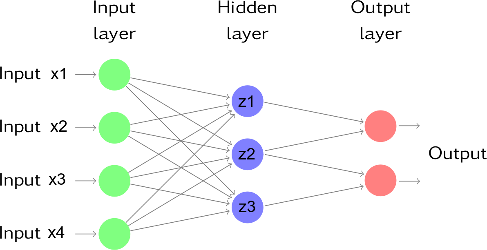

```{r setup, include=FALSE, purl=FALSE}
require(knitr)

opts_chunk$set(list(dev = 'png',fig.cap='',fig.show='hold',dpi=100,fig.width=7, fig.height=7,fig.pos='H!',fig.path="images/oth-"))
```

## Introduction

Statistical literature on prediction/modeling techniques is growing very quickly. New techniques applied to data-mining and to business intelligence projects appear every day, and new developments allow the researcher to obtain even more precise predictions.
Main aim of this chapter is to introduce very briefly some options that are (in our beliefs) the basis of more recent advancements in predictive/modeling analytics.

Three analytical options will be introduced in this chapter: 

* Neural Networks
* Classification/Regression Trees
* GAM models

A couple of examples will allow us to understand the main characteristics of each technique, and within each example a comparison between techniques will be performed.

## Analysis examples

Let us clean our workspace
```{r}
rm(list=ls())
```

and load libraries
```{r, message=FALSE}
require(qdata)
require(nnet)
require(rpart)
require(mgcv)
require(MASS)
require(ggplot2)
```


## Example: Titanic

### Data description
This example uses the true data from surviving to Titanic wreck.  
The aim of study is to find a prediction model to assess the probability of die for each passenger based on its `Age`, `Gender`, and `Class` of accomodation.

Another useful information that will be extracted is if a causal relation exists between the above explicative variables and the probability of die.


### Data loading
```{r,split=TRUE}
data(titanic)
head(titanic)
str(titanic)
```

### Descriptives
Some tables could help in describing the relations between die probability and explicative variables
```{r}
(tb1 <- table(titanic$Status,titanic$Class))
round(prop.table(tb1,margin=2)*100,2)
(tb2 <- table(titanic$Status,titanic$Gender))
round(prop.table(tb2,margin=2)*100,2)
(tb3 <- table(titanic$Status,titanic$Class,titanic$Gender))
round(prop.table(tb3,margin=c(2,3))*100,2)
```

The above tables show counts and percentages of died and survived for each combination of Sex and Class factors. Some relations appear, but its interpretation is not really simple.

The following graph shows if some relations exist between `Status` and `Age`:

```{r,fig.cap="Box-plot of Age within levels of Status"}
ggp <- ggplot(data=titanic, mapping=aes(x=Status, y=Age)) +
  geom_boxplot()+ ggtitle("Box-plot of Age within levels of Status")
```

Apparently, a slightly lower age is in survived passengers.

### Inference and models
Let us start with a **logistic model**. Since from table above all main effects and the interaction between `Class` and `Gender` appear as significant, the initial model will use these effects. Note that in this case the probability estimated from the model is the probability to survive, not the probability to die.
```{r}
fm1 <- glm(Status ~ Class+Gender+Class:Gender+Age, data = titanic, family = binomial)
summary(fm1)
```

All the effects appear significant using Wald test. Passengers in first class, female and younger passengers have a greater probability to survive. The greater probability to survive for first class passengers, is indeed reduced for male passengers. In other words, the `First` class passengers have a greater probability to survive, but the increased probability for `Male` is lesser than for `Female` passengers.  
Now we would like to test if the interaction between `Class` and `Age` may help to explain the probability to survive:

```{r}
fm2 <- glm(Status ~ Class+Gender+Class:Gender+Age+Class:Age, data = titanic, family = binomial)
summary(fm2)

anova(fm1,fm2,test="LRT")
```

Either Wald or Likelihood-ratio tests confirm that the above interaction seem to not explain the variability in survival.  Now we would like to test if the `Gender` by `Age` interaction is significant.
```{r}
fm3 <- glm(Status ~ Class+Gender+Class:Gender+Age+Gender:Age, data = titanic, family = binomial)
summary(fm3)

anova(fm1,fm3,test="LRT")
```
This interaction is not significant too.

Now the calculation of predictions through th "best" model are calculated. These predictions will be used to make comparisons with other techniques. 

```{r}
predglm <- predict(fm1,type="response")

```

### Neural networks
Neural networks can be considered a type of nonlinear regression that takes a set of 
inputs (explanatory variables), transforms and weights these within a set of hidden units
and hidden layers to produce a set of outputs or predictions (that are also transformed).

Next figure is an example of a feed forward neural network consisting of four inputs, a
hidden layer that contains three units and an output layer that contains two outputs.



The outputs of nodes in one layer are inputs to the next layer. The inputs to each node are combined using a weighted linear combination. The result is then usually modified by a nonlinear function before being output. For example, the inputs into hidden neuron $j$ in above figure are combined to give

$z_j=b_j+\sum_{i=1}^4 w_{i,j} x_i$.

In the hidden layer, this is then modified using a nonlinear function such as a sigmoid,

$\phi(z)=\dfrac{1}{1+e^{-z}}$,

to give the input for the next layer. This allows the formula to reduce the effect of extreme input values, thus making the network more robust to outliers.

The parameters $b_1$,$b_2$,$b_3$ and $w_{1,1}, \cdots ,w_{4,3}$ are "learned" from the data. 

The weights usually take random values to begin with, and are then updated using the observed data. Consequently, there is an element of randomness in the predictions produced by a neural network. Therefore, the network is usually trained several times using different random starting points, and the results are averaged.

The number of hidden layers, and the number of nodes in each hidden layer, must be specified in advance. 

The R `nnet` require gives a `nnet()` function to fit a single-hidden-layer neural network to data. `nnet()` produces in output an object of class `nnet.formula` and `nnet`.

The syntax used to build a `nnet` object is very similar to the one used for (generalized) linear models:
```{r}
nn0 <- nnet(Status ~ Class+Gender+Age,data=titanic,size=3)

prednn <- predict(nn0)
```
The `size` parameter of above `nnet()` call specifies the number of units (neurons) in hidden layer. `prednn` contains the predictions obtained using the `nn0` model.  
As you can see, there are many analogies between `(g)lm` and `nn` models specifications. 

### Regression/classification tree
```{r}
rt0 <- rpart(Status ~ Class+Gender+Age,data=titanic)

predrt <- predict(rt0)[,2]
```


Comparison among logistic model, neural network and regression tree
```{r}
titanic$predglm <- (predglm<.5) ## TRUE=Dead
titanic$prednn <- (prednn<.5)  ## TRUE=Dead
titanic$predrt <- (predrt<.5)  ## TRUE=Dead

table(titanic$Status,titanic$predglm)
table(titanic$Status,titanic$prednn)
table(titanic$Status,titanic$predrt)
```


## Example: Ozone (GAM)

```{r, echo=FALSE}
rm(list=ls())
```

### Data description

Normal data (Extending the linear model with R)  
Ozone data from Breiman and Friedman, 1985  

* `O3`: Ozone conc., ppm, at Sandbug AFB.  
* `temp`: Temperature F. (max).  
* `Ibh`: Inversion base height, feet  
* `Pres`: Daggett pressure gradient (mm Hg)  
* `Vis`: Visibility (miles)  
* `Hgt`: Vandenburg 500 millibar height (m)  
* `Hum`: Humidity, percent  
* `Ibt`: Inversion base temperature, degrees F.  
* `Wind`: Wind speed, mph  

```{r}
data(ozone)

str(ozone)
head(ozone)

ammgcv <- gam(O3 ~ s(temp)+s(ibh)+s(ibt),data=ozone)
summary(ammgcv)

op <- par(mfrow=c(1,3))
plot(ammgcv)
par(op)
```

Linear component for temp
```{r}
am1 <- gam(O3 ~ s(temp)+s(ibh), data=ozone)
am2 <- gam(O3 ~ temp+s(ibh), data=ozone)
anova(am2,am1,test="F")
```

Adding interaction
```{r}
amint <- gam(O3 ~ s(temp, ibh)+s(ibt), data=ozone)
summary(amint)

anova(ammgcv,amint,test="F")

op=par(mfrow=c(1,3))
plot(amint)
vis.gam(amint,theta=-45,color="gray")
par(op)
```


Use the simpler model to produce residuals analysis
```{r}
op=par(mfrow=c(1,2))
plot (predict (ammgcv), residuals
      (ammgcv),xlab="Predicted",ylab="Residuals")
qqnorm (residuals (ammgcv), main="")
qqline(residuals (ammgcv))
par(op)
```


Try another model using Gamma distribution
```{r}
ammgcv <- gam(O3 ~ s(temp)+s(ibh)+s(ibt),data=ozone,family=Gamma(link="identity"))
summary(ammgcv)

op=par(mfrow=c(1,2))
plot (predict (ammgcv), residuals
      (ammgcv,type="pearson"),xlab="Predicted",ylab="Residuals")
qqnorm (residuals (ammgcv,type="pearson"), main="")
qqline(residuals (ammgcv,type="pearson"))
par(op)
```

<!--

## Non linear regression example

```{r}
rm(list=ls())
```

### Data description

The stormer viscometer dataset contains measurements on the viscosity of a fluid, which
is achieved by measuring the time taken for an inner cylinder in the viscometer to perform
a fixed number of revolutions in response to some weight.
The stormer viscometer measures the viscosity of a fluid by measuring the time taken for
an inner cylinder in the mechanism to perform a fixed number of revolutions in response
to an actuating weight. The viscometer is calibrated by measuring the time taken with
varying weights while the mechanism is suspended in fluids of accurately known viscosity. The data comes from such a calibration
Viscosity: Viscosity of fluid
Wt: Actuating weight
Time: Time taken

```{r}
rm(list=ls())

str(stormer)
head(stormer)
```

theoretical considerations suggest a
non-linear relationship between time, weight and viscosity are of the form
T= beta*v/(W-theta) + epsilon
Ignoring the error term and re-arranging the above expression gives:
WT ~ beta*v+theta*T
This relation may be used to obtain an initial estimate of beta and theta parameters:
```{r}
b <- coef(lm(Wt*Time ~ Viscosity + Time - 1,stormer))
names(b) <- c("beta", "theta")
b
```

Now non-linear estimation of parameters of initial equation:
```{r}
storm.1 <- nls(Time ~ beta*Viscosity/(Wt - theta), stormer, start=b, trace=T)
summary(storm.1,correlation=TRUE)
```

-->
