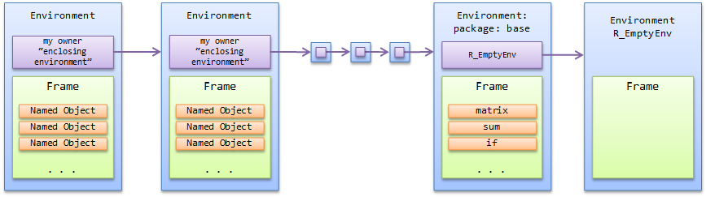

```{r options, include=FALSE, purl=FALSE}
options(width = 108)
```

## Introduction

This chapter takes into consideration a critical type of objects:  __environments__.

Within the `R` computation mechanism, environments play a crucial role as they are constantly used by `R` just behind the scene of interactive computation. 

An environment is an object that takes care of mapping variable names to values. Each mapping is called a binding.

Being able to understand and manage environments represents a key step in the `R` programming learning curve.

## Environments in `R`

The _environment_ definition is clearly stated by in _R Language Definition_ manual:

Environments can be thought of as consisting of two things. 

* A frame, consisting of a set of symbol-value pairs, 
* an enclosure, a pointer to an enclosing environment. 

Given that a frame is a set of objects each of them associated to a name, where a name is a simple character string, in practice, we can consider an environment as a self contained portion of memory containing a frame. Each environment can access one and only one other environment known as the parent environment. 

Environments in `R` are created, and eventually destroyed, under many circumstances. 

Any `R` session has an environment associated known as the _global environment_. as returned by functions `globalenv()` and `environment()`:

```{r environments-001}
globalenv()
environment()
```

When we are working with `R` in interactive mode, we are using the frame within the `globalenv` as a _container_ for our objects:

```{r environments-002}
x <- 0
ls.str(globalenv())
```

Any package has at least one environment: 

```{r environments-003}
as.environment("package:stats")
```

Almost all functions have an environment as part of their definition:

```{r environments-004}
environment(mean)
```

User defined functions have an environment too:

```{r environments-005}
f <- function() NULL
environment(f)
```

Function `environmentName()` returns the name of an environment. As a result we may query `R` for the environment of function `f()`:

```{r environments-006}
environmentName(environment(f))
```

or for the name of the environment associated to a package:

```{r environments-006A}
require("tibble", quietly = T)
environmentName(as.environment("package:tibble"))
```

Unfortunately, function `environmentName()` does not always return the expected results:

```{r environments-006B}
env <- new.env()
environmentName(env)
```

Environment names for packages and namespaces are assigned at the `C` level. Therefore, user created environments do not reveal names. Users cannot set the name of an environment in `R` even through a, possibly misleadingly named, function called `environmentName()` exists. This function is really only meant for packages and namespaces, not other environments.

## The ''environment tree structure''

The definition of environment also states that an environment is made of an enclosure: a pointer to an enclosing environment. As a consequence, any environment has a parent environment that, as an environment has a parent environment. This chain of parent environments, known as the _environment tree structure_, roots to a special environment called the _empty environment_ that, as stated by its name, contains no objects.

<div id="fig:environment-structure">


</div>


`R` has a very useful function, known as  `parent.env()`, that returns the parent of any given environment:

```{r environments-007}
parent.env(globalenv())
```

In order to visualize the environment tree structure we can easily define a function that returns this structure starting from any given environment:

```{r environments-008}
tree <- function(env){
  cat("+ ", environmentName(env), "\n")
  if(environmentName(env) != environmentName(emptyenv())){  
    env <- parent.env(env) 
    Recall(env)
  }
invisible(NULL)
}
```

The above function make use of function `Recall()` that will be examined in the chapter dedicated to functions.

We can test `tree()` starting with `globalenv()` as argument:

```{r environments-009}
tree(env = globalenv())
```

Or we may want to use the built in functions `search()` that returns similar results

```{r environments-010}
search()
```

When we attach a `list`, usually a `data.frame`, we actually insert an entry in the environment tree structure in the position given by the `pos` argument of function `attach()`. As this parameter defaults to `pos=2L`, most of the times we attach just underneath the global environment: 

```{r environments-011}
attach(data.frame(NULL))
search()
```
When loading libraries, functions `library()` or `require()` work on a similar basis and use the same parameter `pos = 2L` 

```{r environments-012}
library(MASS)
search()
```
## How `R` looks for objects

When `R` looks for any object, a symbol value pair, by default `R` looks for a matching symbol in the current environment and, if a matching symbol is found, the corresponding value is returned.  

In case we want to search starting from a different environment we are usually able to specify it directly. As an example, we may consider the well known function `get()` that has an argument `envir` specifying which environment to search, at least as a starting point.

As a result, we can create an object named `Formaldehyde` in the current environment:

```{r environments-013}
Formaldehyde <- data.frame()
```

and use `get()` to find it along with the environment where to look for:

```{r environments-014}
get("Formaldehyde", envir = globalenv())
```

Note that an object with the same name exists in the environment of `package:datasets` and we can find it by specifying the right environment:

```{r environments-015}
get("Formaldehyde", envir = as.environment("package:datasets"))
```

When `R` does not find the required symbol in the current environment, `R` looks in the parent environment and then in the parent of the parent until `R` either finds the symbol in any environment or reaches the empty environment. In the latest case, as by definition the empty environment contains no objects, `R` returns an error.

Given this search mechanism,  `R` stops searching as soon as it finds an object with the corresponding name ignoring any object with the same name in any other environment in the environment tree structure. 

This effect, known as `masking`,  may result in quite embarrassing situations. 

As a very simple example, suppose we define a simple function for computing circumference length given radius as argument:

```{r environments-016}
circumference <- function(radius) 2*pi*radius
```

and that, at any point of our working session we defined:

```{r environments-017}
pi <- 0
```
The result we would gain looks quite embarrassing:

```{r environments-018}
circumference(1)
```

In this case the object `pi` in the `globalenv()` :

```{r environments-019}
get("pi", envir = as.environment(globalenv()))
```

masks the same symbol in the `base` environment

```{r environments-020}
get("pi", envir = as.environment(baseenv()))
```

A robust method that reduce the risk of masking consists in specifying the package we are calling objects from: We could achieve this goal by using the ''`::`'' operator:

```{r environments-021}
circumference <- function(radius) 2*base::pi*radius
circumference(1)
```

Finally, any conflict is returned by:

```{r environments-022}
conflicts()  
```

## Computing with Environments

As we have seen, environments are an essential components of the `R` working mechanism. As a consequence, it should not come as a surprise if environments are defined as `R` objects themselves. 

As a consequence of being `R` objects, environments can be created:

```{r environments-023}
env <- new.env()
```

and eventually deleted:

```{r environments-023A, eval = FALSE}
rm(env)
```

The `frame` component of an environment can be used as an objects place holder almost as we do with lists. We can place objects within an environment at least in three different ways:

by using the `$` operator:

```{r environments-024}
env$zero <- 0
```

by using function `with()`:

```{r environments-025}
with(env , one <- 1)
```

by using function assign:

```{r environments-026}
assign("three", 3, envir  = env)
```

Finally, we can browse environment `env` with standard functions `ls()` or `ls.str()` to check our result:

```{r environments-027}
ls(env)
ls.str(env)
```

Suppose we want to store several objects at once into an environment, we may want to define a function `fill_envir()` that saves any series of objects within an environment:  

```{r environments-028}
fill_envir <- function(..., envir = globalenv()){
  this_list <- list(...)
  Map(function(...) assign(..., envir = envir) , names(this_list), this_list)
  invisible(NULL)
}
```

The above function takes `...` as argument and internally makes use of function `Map()` with an _anonymous function_ as first argument. All this interesting concepts will be exhaustively explained in the next chapters.


By using function `fill_env()`, we can create a new environment and, subsequently, fill it with objects:

```{r environments-029}
env1 <- new.env() 
fill_envir(one = 1, seven = 7, envir = env1)
ls.str(env1)
```

As we do with `list()`, we may also want a function `envir()` that  directly creates an environment with named objects inside:

```{r environments-030}
envir <- function(..., hash = TRUE, parent = parent.frame(), size = 29L){
  envir <- new.env(hash = hash, parent = parent, size = size)
  fill_envir(..., envir = envir)
  return(envir)
}
```

Note that, we have used the newly created function `fill_envir()` within the body of `envir()`; writing modular functions, reusable within new functions, is a key point for producing efficient `R` coding.   

Function `envir()` is now ready to be used for creating new environments:

```{r environments-031}
env2 = envir(six = 6, seven = 7)
ls.str(env2)
```

Up to now we have noticed that environments behave very similarly to lists but, at this point of this explanation, we must point out at least three differences that exists between environments and lists:

First of all, within environment all objects  must have a name while lists do not impose this restriction. In fact, we can create a list with unnamed components:

```{r environments-032}
list (0, 1)
```

but we cannot do the same with environments nor using function `envir()`: 

```{r environments-033, error=TRUE}
envir(0,1)
```

or, any other approach that attempts to create nameless objects within an environment. 

This sound quite logical as the definition of environment states that: _Environments consist of a frame, or collection of __named__ objects_.

Similarly, we may have lists with duplicated components:

```{r environments-034}
l <- list (x = 0 , x = 1)
l$x
```

This idea may look strange but it is a basic example _masking_ within `R`. 

When we try to repeat the same experiment with environments, we may observe a different behavior: 

```{r environments-035}
env <- envir(x = 0, x = 1)
ls.str(env)
```
In this case, the second argument: `x = 1` simply reassigns a different value to `x`.

Finally, as opposite to lists, within environments, the order objects were placed in does not matter. The frame is a collection of named objects and only names matter. As a consequence, objects of an environment are always displayed in alphabetical order:

```{r environments-036}
env <- envir(b = 2, a = 1)
ls.str(env)
```

The second part of the definition of environment states that an environment is made of an enclosure: a pointer to another environment.  

As a consequence of this definition, when we create a new environment, it has, by definition, a parent environment. 

Unless differently specified, the parent of the newly created environment is the environment where the environment was created. 

As a result, if we create an environment, say `env0`, within the global environment, the latest results as the parent of `env0`.

```{r environments-037}
env0 <- new.env()
parent.env(env0)
```

We can pass `env0` as an argument to the `tree()` function:

```{r environments-038}
tree(env0)
```

Note that, the name of the environment `env0` is not returned by function `environmentName()`. This happens as the name of an environment is stored into the underlying _C_ function and no assignment or replacement method exist, at the moment, for environments.


We may even create an environment, say `env1` and specifically declare its parent environment:

```{r environments-039}
env1 <- new.env(parent=baseenv())
```

Again, we can use function `tree()` to see the effects of the previous statement:

```{r environments-040}
tree(env1)
```

It should be clear at this point that the structure of the environment tree is a key element in the `R` programming mechanism. 

These concepts will be very often recalled in the chapter dedicated to  functions.

## Copy on modify

When we do an assignment, `R` reserves a portion of memory for that object. We can _display_  objects memory addresses by using a short function:


```{r environments-041}
mem_add <- function(x) substring(capture.output(.Internal(inspect(x))), 2, 17) 
```

beside its cryptic output, `mem_add()` allows us to verify that, given two different objects:   

```{r environments-042}
x <- 0
y <- 0 
```

they have different memory address:

```{r environments-043}
mem_add(x)
mem_add(y)
```

and that, given:

```{r environments-044}
x <- 0
```

if we assign

```{r environments-045}
y <- x
```

they share the same memory address:

```{r environments-046}
identical(mem_add(x), mem_add(y))
```

that is: when vector `x` is  copied into vector `y`, both objects share the same memory address.

When existing objects are modified, usually `R` objects follow a _copy on modify_ semantic; that is the object is copied into a different memory address. 


In practice,  given an object:

```{r environments-047}
x <- 1:5
```

with its address

```{r environments-048}
mem_add(x)
```

if we modify it

```{r environments-049}
x[3] <- 0L
```

`R` modify its address too 

```{r environments-050}
mem_add(x)
```

If we apply the same concept to lists, given a list 

```{r environments-051}
list0 <- list(x = 0)
```

and its copy 

```{r environments-052}
list1 <- list0
```

both list share the same address

```{r environments-053}
identical(mem_add(list0), mem_add(list1))
```

but, if we modify `list1`

```{r environments-054}
list1$x <- 1
```

`list0` and `list1` now have different addresses:

```{r environments-055}
identical(mem_add(list0), mem_add(list1))
```

This mechanism: _copy on modify_, allows to preserve the value of `list0` even if `list1` is modified. 

Prior to `R 3.1` when modifying a list the entire list was copied. With version `3.1` we had a nice change that clearly helps in keeping memory usage under control. 

Suppose we have two copied list made of more than one element:

```{r environments-055A}
list0 <- list(x = 1:100, y = rpois(100, 100))
list1 <- list0
```

and we modify only the second vector of the second list: `y`:

```{r environments-055B}
list1$y[1] <- 0L
```

We can now observe that the memory address is modified only for the second element of the list while `list0` and `list1` keep sharing the same address for the first vector: `x`


```{r environments-055C}
lapply(list0, mem_add)
lapply(list1, mem_add)
```

In conclusion, we could say that `R`, at leat in its newest versions, uses a _partial copy on modify_ semantic.

The same semantic does not apply to environments, that is _environments do not copy on modify_:

As an proof of concept, we can create an environment with some objects in it:

```{r environments-056}
env0 <- new.env()
env0$x <- 0
```

Afterward, we copy our newly created environment `env0` into a second environment, say `env1`.

```{r environments-057}
env1 <- env0
```

As `env1` is a copy of `env0`, both environments contain the same symbols with the same values associated to them.

```{r environments-058}
env0$x
env1$x
```

As environments do not copy on modify, if we now modify `x` within `env1`:

```{r environments-059}
env1$x <- 1
```

We can easily observe that the value of `x` within `env0` is modified too: 

```{r environments-060}
env0$x
```

The previous example clearly shows that any modification on `env1` also affects `env0`. This is possible as `env0` and `env1` share the same memory address even after the modification `env1$x <- 1`:

```{r environments-061}
identical(mem_add(env0), mem_add(env1))
```


