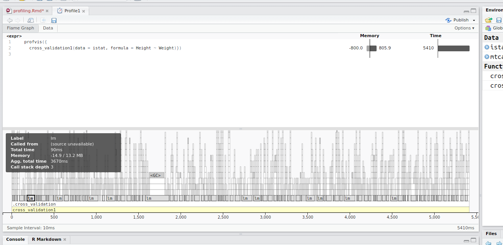
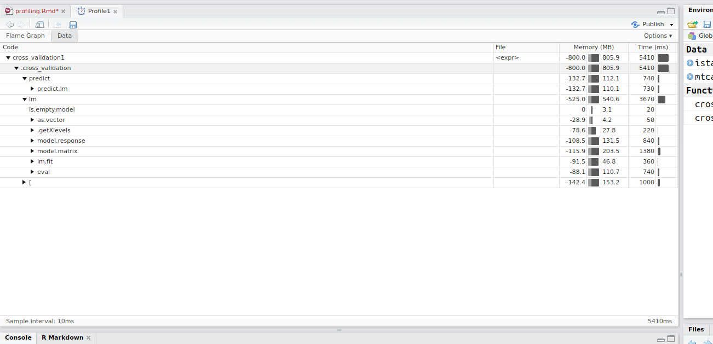

```{r options, include=FALSE, purl=FALSE}
knitr::opts_chunk$set(echo = TRUE, eval = FALSE, fig.pos = 'H', fig.width = 4, fig.height = 3)
options(width = 108)
```


## Introduction

Benchmarking `R` code is about comparing performances of different solutions to the same problem in terms of execution time.

Profiling `R` code helps to identify bottlenecks and pieces of code that needs are not efficiently implemented.

Profiling  our code is usually the last thing we do when developing functions and packages. With serious profiling, the amount of time required can be drastically reduced with very simple changes to our code.

Both techniques aim to reduce computational time.


## Benchmarking

We may want to compare different solutions to understand in order to understand if any of them may provide any real advantage over the others.

### `rbenchmark`

```{r profiling-rbenchmark}
require(rbenchmark)
```

Library `rbenchmark` is intended to facilitate benchmarking of arbitrary R code. 

The library consists of just one function, `benchmark()`, which is a simple wrapper around `system.time()`.

Given a specification of the benchmarking process: counts of replications, evaluation environment and an arbitrary number of expressions, benchmark evaluates each of the expressions in the specified environment, replicating the evaluation as many times as specified, and returning the results conveniently wrapped into a data frame.

As a first case we can compare the differece in performaces between `sapply()` and `vapply()` when applied to a simple mathematical function:

```{r profiling-0120}
s <- seq(-pi, pi, len = 1000)
f <- function(x) sin(x)/ (1-cos(x))
benchmark(vapply(s,f, FUN.VALUE = numeric(1)), sapply(s,f))
```

and observe the gain in performances of `vapply()` compared with `sapply()`

As a second example, we can consider the calculation of the 95% quantile of the distribution of the correlation coefficient between two `N(0,1)` vectors of given sizes `n=10`.


As a first case we define a function `f_loop()` by using a simple for loop over `k` iterations.

```{r profiling-012A}
f_loop <- function(n = 10, k = 1e+05){
  z = numeric(k)
  for (i in 1:k) {
    x = rnorm(n, 0, 1)
    y = rnorm(n, 0, 1)
    z[i] = cor(x, y)
  }
quantile(z, 0.95)
}
```

As a second case we develop the same function using a functional approach based on `replicate()`

```{r profiling-012B}
f_rep <- function(n = 10, k = 1e+05){
  z <- replicate(k, cor(rnorm(n), rnorm(n)))
  quantile(z, .95)
}
```

As a third case we introduce a function `matrix()` within `replicate()`:

```{r profiling-012C}
f_mat <- function(n = 10, k = 1e+05){
  z <- replicate(k, cor(matrix(rnorm(n*2), nrow = n, ncol = 2))[1,2])
  quantile(z, .95)
}
```

Once the three functions have been defined we can compare them by using `rbenchmark()`

```{r profiling-012D}
benchmark(f_loop(), f_rep(), f_mat(), replications = 10, order = "elapsed")
```

We can see that all functions, despite the different programming styles, have very similar performances.

### `microbenchmark`

In some cases we may want to benchmark two or more solutions that require a very small amount of time to perform but are very often used in our code.

As as an example, we may want to compare `[i]` and `[[i]]` when applied to atomic objects with `i` being a single integer. 

First, let's notice that `x[i]` and `x[[i]]` return the same result when `i` is a single integer:

```{r profiling-013}
x <- 1:100
i <- 66
x[i]
x[[i]]
```

In principle, in order to evaluate performances of these functions, we could use:

```{r profiling-014}
benchmark(x[i], x[[i]], replications = 1000)
```

but a better choice is represented by library `microbenchmark`:

```{r profiling-015}
library(microbenchmark)
test <- microbenchmark(x[i] , x[[i]], times = 1000)
test
```

Note that timing is reported in `nonoseconds` and that the output is made of several statistics.

Moreover, we can use the graphics facilities provided by library `ggplot2` to compare the two distributions:

```{r profiling-016}
library(ggplot2)
autoplot(test)
```


## Profiling tools in R and RStudio

Microbenchmarking code is very useful because it tells which function is faster. However, sometimes it may be interesting to look deeper into the performance of a function, bacause, for example, you do not have other functions to benchmark with. 

For example suppose you are working on your function that contains a loop, and after a long time working you manage to make the loop run 5 times faster. That sounds like a huge improvement, but if the loop only takes 2% of the total time? You may not even notice the final overall time improvement. Hence, to make slow code faster, we need accurate information about what is making our code slow.

In this situation profiling comes in handy. 


### `Rprof`

One tool for profiling `R` code is the function `Rprof()`. 

As a basic example to demonstrate `Rprof()` capabilities we consider a trivial function `f1()` written a inefficient `for()` loop fashion:   


```{r profiling-001}
f1 <- function(x, s1 = 1 , s2 = 2){
  n <- length(x)
  y <- NULL
  for ( i in 1:n){
    if (x[i] %% 2 == 0 ) tmp <- x[i]+rnorm(1, 0 , s2)
    else tmp <- x[i]+rnorm(1, 0, s1)
    y <- c(y, tmp)
  }
  sum(y)  
}  
f1(x = 1:5)
```

When running `f1()` on a large vector `x` it may require a significant amount of computing time:

```{r profiling-002}
system.time(f1(x = 1:10^5))
```

In order to understand if any bottle neck exists within `f1()` we may want to __profile__  function `f1()` by using function `Rprof()`.

Function  `Rprof()` is used to control profiling. Profiling works by recording at fixed intervals, by default every 20 msecs, which line in which `R` function is being used and records the results in a file passed as argument to `Rprof()`. Function `summaryRprof()` can then be used to summarize the activity.

```{r profiling-003}
Rprof("f1.Rprof")
f1(x = 1:10^5)
Rprof(NULL)
summaryRprof("f1.Rprof")$by.self
```

We can observe that function `c()` takes `r summaryRprof("f1.Rprof")$by.self[1,1]` seconds corresponding to `r summaryRprof("f1.Rprof")$by.self[1,2]` per cent of the total execution time. This is because of the _wrong_ usage we are making of function `c()` within `f1()` when computing `y <- c(y, tmp)`. At each iteration `R` is forced to copy vector `y` in a larger memory space to allocate the longer vector.

We can avoid this multiple copying of `y` by simply defining in advanced the length of vector `y`:

```{r profiling-004}
f2 <- function(x, s1 = 1 , s2 = 2){
  n <- length(x)
  y <- numeric(n)
  for ( i in 1:n){
    if (x[i] %% 2 == 0 ) tmp <- x[i]+rnorm(1, 0 , s2)
    else tmp <- x[i]+rnorm(1, 0, s1)
    y[i] <- tmp
  }
  sum(y)  
}  
f2(x = 1:5)
```

and, if we run `Rprof()` again:

```{r profiling-005}
Rprof("f2.Rprof")
f2(x = 1:10^5)
Rprof(NULL)
summaryRprof("f2.Rprof")$by.self
```

we can observe that the execution time is now down to `r summaryRprof("f2.Rprof")$by.self[2,3]` seconds and that `rnorm()` is taking a sensible amount or time.

In case we want to evaluate the gain in efficiency by using `lapply()` instead of a `for()` loop we could rewrite `f2()` as:

```{r profiling-006}
f3 <- function(x, s1 = 1 , s2 = 2){
  f31 <- function(x, s1 , s2){
    ifelse(x %% 2 == 0, x+rnorm(1, 0 , s2) , x+rnorm(1, 0, s1))
  }
sum(vapply(x, f31, FUN.VALUE=numeric(1), s1, s2 ))
}
f3(x = 1:5)
```

and profile this functions as usual by:

```{r profiling-007}
Rprof("f3.Rprof")
f3(x)
Rprof(NULL)
summaryRprof("f3.Rprof")$by.self
```

Note that in this case, function `f2()` takes `r summaryRprof("f2.Rprof")$sampling.time` seconds while function `f3()` requires `r summaryRprof("f3.Rprof")$sampling.time` seconds.


We can make full use of `R` vectorized capabilities and write:

```{r profiling-008}
f4 <- function(x, s1 = 1 , s2 = 2){
  n <- length(x)
  s1 <- rnorm(n, 0 , s1)
  s2 <- rnorm(n, 0 , s2)
  sum(ifelse(x %% 2 == 0, x+s1 , x+s2))
}
f4(x = 1:5)
```

We can now profile this functions as usual by:

```{r profiling-009}
Rprof("f4.Rprof")
f4(x)
Rprof(NULL)
summaryRprof("f4.Rprof")$by.self
```

We see can see no specific bottle necks and a very fast function:

```{r profiling-010}
sapply(paste("f", 1:4, ".Rprof", sep = ""), function(x) summaryRprof(x)$sampling.time)
```

Finally, as a whole, function `summaryRprof()` returns a list of four components:

```{r profiling-011}
names(summaryRprof("f2.Rprof"))
```

Table `$by.self` lists the time spent by functions alone, while the table `$by.total` lists the time spent by functions and all the functions they call. In the `f2()` simple case, function `f2()` itself just takes `r summaryRprof("f2.Rprof")$by.self[2,1]` seconds to do things like: 

* initialize its own execution environment
* filling it up with promises arguments 
* starting the execution of its body

while the same function remains active until the end of the execution: `r summaryRprof("f2.Rprof")$sampling.time` seconds. The lines marked with `.External` refer to calls to external `C` or `Fortran` code.


#### `Rprof` with `memory.profiling`

Profiling can be used to gain information about timing as well as memory. In order to gain memory usage we need to call `Rprof()` with  `memory.profiling` enabled and calling `summaryRprof()` with `memory = "both"`:


```{r profiling-012}
Rprof("f1.Rprof", memory.profiling = TRUE)
f1(x = 1:10^5)
Rprof(NULL)
summaryRprof("f1.Rprof", memory = "both")$by.self
```

In this case a column indicating the memory, expressed in `Mb`, as used by each function, is added to the previous output.

Note that `memory.profiling` requires `R` to be compiled with `--enable-memory-profiling`. This option should be enabled by default under Windows and Mac-OS but not on all Linux distributions.  


### The visual profiler: `profvis`

The `profvis` library is an RStudio tool that allows us to visually get a glimpse of the bottlenecks of our code. 

```{r, profvis}
library(profvis)
```

Suppose we are working on a function that, given a dataset:

1. deletes one row
2. estimate a model on the remaining observations
3. makes a prediction on that one observation
4. finds the residual 
5. saves it

This must be applied on all rows, meaning that each row at the time must be taken out of the dataframe.

First we build a function that does actions 1-5:

```{r}
require(microbenchmark)
.cross_validation <- function(data, i, formula) {
  training <- data[-i,]
  test <- data[i,]
  fm <- lm(formula, data = training)
  out <- predict(fm, newdata = test)
  return(out)
}

```

and then a function that does a cycle over the above function:

```{r}
cross_validation <- function(data, formula) {
  n <- nrow(data)
  cv <- numeric(n)
  for (i in 1:n) {
    cv_i <- .cross_validation(data, i, formula)
    cv[i] <- cv_i
  }
  return(cv)
}
```


Now in order to open the profiler on the `cross_validation()` function:


```{r}

profvis({
  cross_validation(data = istat, formula = Height ~ Weight)
})

```


The profiler is composed by two main tabs:

* Flame graph
* Data


#### Flame Graph

Click the `flame graph` tab. The flame graph tab is an interactive tab. As you move your mouse over the flame graph, information about each block will show in the info box. Note that white blocks represent code where profvis doesn’t have the source code – for example, in base R and in R packages, while if you move the mouse over a yellow block, the corresponding line of code will be highlighted. 

Each block in the flame graph represents a call to a function, or possibly multiple calls to the same function. The width of the block is proportional to the amount of time spent in that function. When a function calls another function, another block is added on top of it in the flame graph. 

For example, if you move your mouse on one of the times the `lm` function is called, the flame graph will show you the total time of that call, as well as the total time of all the times that function was called. Moreover, you can raphically see that this is the function that seems to be the most time consuming. You can graphically see that the `lm` function opens a number of internal additional functions, which take up a lot of time. 




#### Data

The data view provides a top-down tabular view of the profile, where one can see the time spent for each task. Results are organised into two main columns:

* Memory, that is the memory allocated or deallocated at a given stack
* Time, time spent for that task

Both fields are aggregated over all the call stacks executed.

In our example, if you expand `.cross_validation`, you see that the `lm` function is basicaly taking up most of the execution time. This means that if you want the function `cross_validation` to go faster, you would have to find a way to make `lm` faster!



