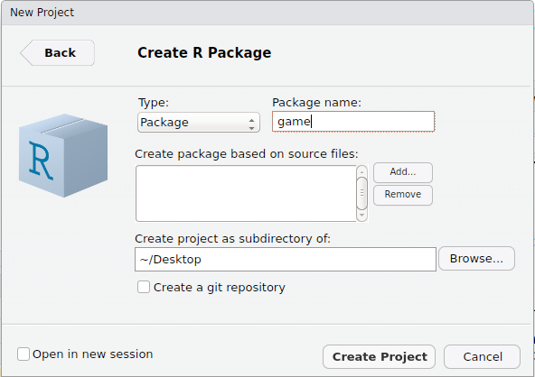
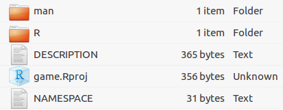
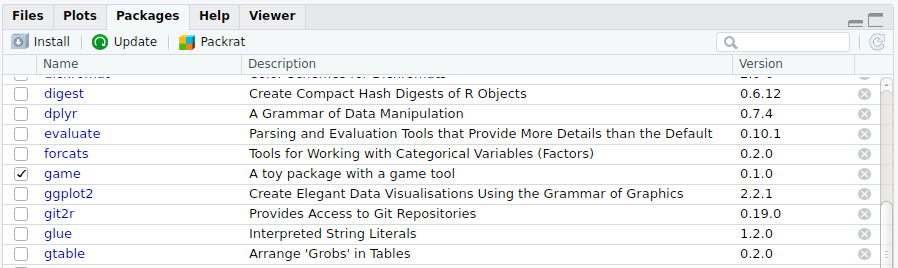
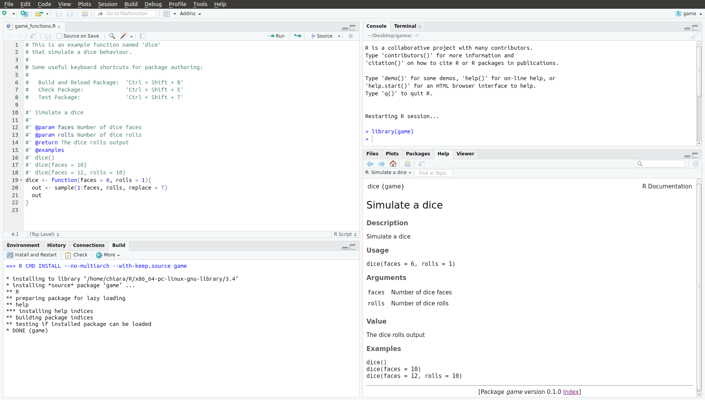

## Introduction
A wide documentation is available on the internet providing the technical instructions to build `R` packages, starting from the manual [Writing R extensions](http://cran.r-project.org/doc/manuals/r-release/R-exts.html) at the official `R` site.
 
This section provides a general overview about R packages. The following sections try to provide some insights on the mechanism used by `R` when dealing with packages.


### Why create a `R` package?

According to Rossi[^Rossi], there are at least three good reasons to create an R package.

[^Rossi]: http://www.math.ncu.edu.tw/~chenwc/R_note/reference/package/packages.pdf

1.  Creating an R package forces the user to document the code and provide test examples to insure that it actually works. It will also be much easier to use the code as documentation will only be a `?` command away and all of functions and shared libraries will be available for use. This is a good reason to create a package, also for its own use.

2.  If the goal is disseminate a research, this is an ideal way of making sure others have access to the work. It will also increase the probability that eventually the work will be correct. This is a good reason to create a package for a team (private) use.

3.  Giving back something to this amazing community of volunteers! This is a good reason to make the package available for the whole world (e.g. through CRAN).  

## The package structure behind `R`
Packages provide a mechanism for loading optional code, data and documentation as needed. 

An R package can be thought of as the software equivalent of a scientific article: articles are the _de facto_ standard to communicate scientific results, and readers expect them to be in a certain format. R packages are a comfortable way to maintain collections of R functions and data sets (Leisch, 2009)[^Leisch].

[^Leisch]: http://cran.r-project.org/doc/contrib/Leisch-CreatingPackages.pdf

The R distribution itself includes about 30 packages that can be split into three categories.

* **Base** packages: part of the R source tree, maintained by R Core.
* **Recommended** packages: part of every R installation, but not necessarily maintained by R Core.
* **Contributed** packages: all the rest. These are necessarily of lesser quality than the above. In fact, note that many contributed packages on CRAN are written and maintained by R Core members. The goal is simply to try and keep the base distribution as lean as possible and all non-essential packages are on CRAN but are not included in base R.

The `installed.packages()` function returns a matrix with several information about installed packages. The ``Priority'' column reports the category (base, reccomended or contributed) which each package belong to.

Terms about R packages are often confused. It may be helpful to clarify this a bit:

* **Package**: a collection of R functions, data, and compiled code in a well-defined format.
* **Library**: the directory where packages are installed.
* **Repository**: A website providing packages for installation.
* **Source**: The original version of a package with human-readable text and code.
* **Binary**: A compiled version of a package with computer-readable text and code, may work only on a specific platform.


## Packages Environments 

Every R package has two associated environments:

1. package environment 
2. namespace environment 

The package environment contains all functions of the package exposed to the end user.

The namespace environment contains all functions the package including those functions included in the package environment. 

The namespace environment contains all functions (including internal functions), and its parent environment is a special imports environment that contains bindings to all the functions that the package needs. Every exported function in a package is bound into the package environment, but enclosed by the namespace environment. This complicated relationship is illustrated by the following diagram:


## Get started - Roxygen2

Although you can create a package using just R, if you move to RStudio you can  benefit of a set of helping tools that makes your life much easier.

This is why here we will follow the whole procedure using the RStudio tools. The first thing that you need to do to be sure you can run them is to check your R and RStudio versions:

```{r versions, eval = F}
R.Version()$version.string
install.packages("rstudioapi")
rstudioapi::versionInfo()$version
```

Be sure to have at least the R version 3.4.1 and the RStudio version 0.99.149.

Once checked that your system is ready, it's time to install the packages that we are going to use to create and document your new package:

```{r install_needed_packages, eval = F}
 install.packages(c("devtools", "roxygen2", "testthat", "knitr"))
```

The aim of devtools is to make the life of a package developer as easy as possible by providing R functions that simplify many common tasks.

The goal of roxygen2, on the other hand, is to facilitate the package documentation. In particular, as [the roxigen2 dedicated website](https://cran.r-project.org/web/packages/roxygen2/vignettes/roxygen2.html)  emphasizes:

* It allows the adjacent collocation of code and documentation, so that it’s easy to remember to update the documentation once the code is modified.
* It dynamically inspects the objects that it’s documenting
* It abstracts over the differences in documenting S3 and S4 methods, generics and classes
* It creates the .Rd files, the NAMESPACE file, and it manages the Collate field in the DESCRIPTION file

## Package structure

A package is made of some basic components. Let's go through them:

* **Code (R/)**: the most important directory of a package is the R/ folder, where your code lives

* **Package metadata (DESCRIPTION)**: the DESCRIPTION file describes what your package does, its licence and the contact name

* **Object documentation (man/)**: the man/ folder contains all the documentation that goes with your code. If you are using roxygen2, the man/ folder is populated by roxygen2 itself, and you can write documentation and code together in the R/ folder. 

* **Vignettes (vignettes/)**: vignettes are documents that show how to use your package to solve real problems. While object documentation gives a punctual description of your functions, vignettes let new users understand why your package is useful and how to use it on the whole.

* **Testing (tests/)**: the optional tests/ folder may contain tests that verify that you package works as designed. They are particularly useful when your package is under development, and you want to be sure that it continues to work properly as you make changes to the code. 

* **Namespaces (NAMESPACE)**: the NAMESPACE file defines which functions your package makes available to other package, and which functions he requires from other packages. The NAMESPACE file is generated by roxygen2

* **Data (data/)**: if you want to use data inside your package, you should put them in the /data folder

* **Compiled code (/src)**: the src/ directory allows you to include speedy compiled C and C++ code to solve performance bottlenecks in your package

* **Installed files (inst/)**:


### Create a package

Let's start with the package creation.

To create a package, you have two easy ways: the first one is to use the devtools function `create()`, the second one is via RStudio interface. Suppose you want to create a package called _game_.

If you want to use `create()`, you have just to define the right path and choose your package name:

```{r devtools_create, eval = F}
 devtools::create("package_path/pkgname")
```

Alternatively, via RStudio interface, you have to:

1. Click File | New Project
2. Choose “New Directory”
3. Choose “R Package”
4. Give your package a name and click “Create Project”



In both cases, you will get a folder looking like this one:



This folder contains the smallest structure for a usable package:

* The R/ folder, that will contain your R code

* A basic DESCRIPTION file, containing your package metadata

* A basic NAMESPACE file

* An R project named as your package. R projects help on keeping R code isolated: the code that runs in one project does not affect any other project

* The man/ folder, that will contain the documentation produced by roxygen2


### Code (R/)

Suppose now that you have written the following function: 

```{r dice_function}
dice <- function(faces = 6, rolls = 1){
  out <- sample(1:faces, rolls, replace = T)
  out
}
```

The function simulates the dice behaviour: the faces argument controls the number of dice faces, and the rolls argument defines the number of dice rolls.

If we want to add this function to our _game_ package, we have just to save it inside the R folder.

So, let's create a game_function.R file, and write inside it the `dice()` function. 

Now we can rebuild the package using the shortcut `crtl+Shift+B` or from the interface via Bulid | Build all.


### Package metadata (DESCRIPTION)

The DESCRIPTION file stores all the important metadata for your package. The DESCRIPTION file is really important: in fact, devtools and RStudio recognize a package through the presence of a DESCRIPTION file! 

If we look at the bare-bones of the `game` package DESCRIPTION file, we will see something like:

```{r DESCRIPTION, eval = F}
Package: game
Type: Package
Title: What the Package Does (Title Case)
Version: 0.1.0
Author: Who wrote it
Maintainer: The package maintainer <yourself@somewhere.net>
Description: More about what it does (maybe more than one line)
    Use four spaces when indenting paragraphs within the Description.
License: What license is it under?
Encoding: UTF-8
LazyData: true
RoxygenNote: 6.0.1
```

DESCRIPTION uses a simple file format called DCF, the Debian control format. Each line consists of a field name and a value, separated by a colon. When values span multiple lines, they need to be indented using four spaces.

Another important duty of the DESCRIPTION file is to list the dependencies of your package, namely the external packages that you package needs to run.  


#### DESCRIPTION fields

Here there is a list of the main DESCRIPTION fields, along with their way of usage.

##### Title

Title is a one line description of the package, and is often shown in package listing


##### Description

Description is more detailed than the title. You can use multiple sentences but you are limited to one paragraph. If your description spans multiple lines (and it should!), each line must be no more than 80 characters wide. Indent subsequent lines with 4 spaces.


##### Authors@R

The author field identifies the author (or authors) name, and his contact info. This field is unusual because it contains executable R code rather than plain text.

```{r, eval = F}
Authors@R: c(
    person("Hadley", "Wickham", email = "hadley@rstudio.com", role = "cre"),
    person("Winston", "Chang", email = "winston@rstudio.com", role = "aut"))
```

The `person()` function has four arguments:

* The name

* The surname

* The email address.

* The role. There are four important roles:

    + cre: the creator or maintainer, the person you should bother if you have problems.

    + aut: authors, those who have made significant contributions to the package.

    + ctb: contributors, those who have made smaller contributions, like patches.

    + cph: copyright holder. This is used if the copyright is held by someone other than the author, typically a company (i.e. the author’s employer).
    
Every package must have at least one author (aut) and one maintainer (cre) (they might be the same person). The creator must have an email address. These fields are used to generate the basic citation for the package.

##### Imports 
Packages listed here must be present for your package to work. In fact, any time your package is installed, those packages will, if not already present, be installed on your computer. The `imports` field take a comma separated list of package names as value.

```{r, eval = F}
Imports:
    dplyr (>= 0.3.0.1),
    ggplot2
```

After the package name you can specify, in parentesis, the version (or the minimum version) that youe package requires.


##### Suggested 
Packages listed here can be useful using your package, but are not necessary. You might use suggested packages to run tests, build vignettes, or when there’s only one function that needs the package. Packages listed in Suggests are not automatically installed along with your package. The `suggested` field take a comma separated list of package names as value.

```{r, eval = F}
Suggested:
    qdata,
    ggmap
```

Also for the suggested packages you can specify a package version.


##### Licence

The License field can be either a standard abbreviation for an open source license, like GPL-2 or BSD, or a pointer to a file containing more information, file LICENSE. 


##### Version

Formally, an R package version is a sequence of at least two integers separated by either . or -. For example, 1.0 and 0.9.1-10 are valid versions


##### LazyData

LazyData makes it easier to access data in your package. Because it’s so important, it’s included in the minimal description created by devtools.


So, after some editing, our DESCRIPTION file may look like:

```{r DESCRIPTION_edited, eval = F}
Package: game
Type: Package
Title: A toy package with a game tool
Version: 0.1.0
Author: Marichiara Fortuna
Maintainer: Mariachiara Fortuna <mariachiara.fortuna@quantide.com>
Description: This package contains a basic example that we use to explain how to create
    a new package. It is a complement of the Professional R Programming course
License: MIT + file LICENSE
Encoding: UTF-8
LazyData: true
RoxygenNote: 6.0.1
```

After the editing, if we rebuild the package (`crtl+Shift+B`) we can notice that the game package will figure between our available packages:




### Object documentation (man/)

Documentation is one of the most important aspects of a good package. Without documentation, new users won't know how to use your package, and even you may have troubles understanding what you did when you were writing that portion of code.

The documentation that we are going to add right now is called object documentation, the one accessed by ? or `help()`. As Hadley Wickham highlights:

> Object documentation is a type of reference documentation. It works like a dictionary: while a dictionary is helpful if you want to know what a word means, it won’t help you find the right word for a new situation. Similarly, object documentation is helpful if you already know the name of the object, but it doesn’t help you find the object you need to solve a given problem. 

The standard way for documenting objects in an R package is by writing .Rd files in the man/ directory. These files use a LaTeX syntax, and are rendered to HTML, plain text and pdf for viewing. Instead of writing these files by hand, using roxygen2 we can add to our .R file specially formatted comments, that roxygen2 will turn into .Rd files. 

The two basics steps that we have to follow to add object documentation in our package are:

1. Add roxygen comments to our .R files.

2. Press `Ctrl/Cmd + Shift + D` in RStudio or run devtools::document() to convert roxygen comments to .Rd files. Alternatively you can press `Ctrl/Cmd + Shift + B` in RStudio: this completely rebuilds the package, including updating all the documentation, installs it in your regular library, then restarts R and reloads your package. This is slow but thorough. 

Then we can preview our documentation with ?, and rinse and repeat until the documentation looks the way we want.

The roxygen comments for our `dice()` function will look like:

```{r, eval = F}
#' Simulate a dice
#'
#' @param faces Number of dice faces
#' @param rolls Number of dice rolls
#' @return The dice rolls output
#' @examples
#' dice()
#' dice(faces = 10)
#' dice(faces = 12, rolls = 10)
dice <- function(faces = 6, rolls = 1){
  out <- sample(1:faces, rolls, replace = T)
  out
}
```

As we can see, it is sufficient to place some special comments before of each function in the .R file: then, if we rebuild the package (`crtl+Shift+B`) roxygen2 will build the help documentation for us.



If we check the man/ folder, we can see that it has a new file inside: the _dice.Rd_ file, automatically built by roxigen2 from our comments.


#### roxygen comments

Roxygen comments start with #' and come before a function. All the roxygen lines preceding a function are called a block. Each line should be wrapped in the same way as your code, normally at 80 characters.

Blocks are broken up into tags, which look like @tagName details. 

Each block includes some text before the first tag.1 This is called the introduction, and is parsed specially:

The first sentence becomes the title of the documentation. That’s what you see when you look at help(package = mypackage) and is shown at the top of each help file. It should fit on one line, be written in sentence case, and end in a full stop.

The second paragraph is the description: this comes first in the documentation and should briefly describe what the function does.

The third and subsequent paragraphs go into the details: this is a (often long) section that is shown after the argument description and should go into detail about how the function works.


##### Introduction

The introduction is the text before the first tag: it becomes the title of the documentation and is shown at the top of each help file. It should fit on one line, be written in sentence case, and end in a full stop. In our case the title is:

```{r, eval = F}
#' Simulate a dice
#'
```

You can place before the introduction the tag `@title`. 
After the title you can optionally add a description of your function, after the tag `@description`.


##### @param

`@param name description` describes the function’s inputs or parameters. 

`name` report the parameter name  

The description can contain a summary of the parameter type (e.g., string, numeric vector) and what the parameter does.
The description should start with a capital letter and end with a full stop. It can span multiple lines if necessary. All parameters must be documented.

You can document multiple arguments in one place by separating the names with commas (no spaces). For example, to document both x and y, you can write @param x,y Numeric vectors..


##### @examples

`@examples` provides executable R code showing how to use the function in practice. Example code must work without errors as it is run automatically as part of R CMD check.


##### @return

`@return` describes the function output. It is not always necessary, but it is useful if your function returns different types of output depending on the input, or if you’re returning an S3, S4 or RC object.


### Vignettes (vignettes/)

A vignette is a document that provides a general overview of your package. While the object documentation provides a punctual guide to every function, a vignette is supposed to show why the package is useful and how to coordinate multiple functions to solve problems.

Many existing packages have vignettes. You can see all the installed vignettes with `browseVignettes()`. To see the vignette for a specific package, use the argument, `browseVignettes("packagename")`. Each vignette provides three things: the original source file, a readable HTML page or PDF, and a file of R code. You can read a specific vignette with `vignette(x)`, and see its code with `edit(vignette(x))`.

You can see an example of a vignette [as part of the dplyr documentation](https://cran.r-project.org/web/packages/dplyr/vignettes/dplyr.html) 

To create a vignette for our game package, we will run:

```{r, eval = F}
devtools::use_vignette("game-vignette")
```

The `devtools::use_vignette("vignettename")` command has several effects:

1. It creates the vignettes/ folder

2. Inside the vignettes/ folder, it creates a vignettename.Rmd file, already structured for creating a vignette

3. Add the necessary dependencies to the DESCRIPTION file (it adds knitr to the Suggests and VignetteBuilder fields).

The vignette file is a usual .Rmd file with a metadata preamble that looks like this:

```{r, eval = F}
---
title: "Vignette Title"
author: "Vignette Author"
date: "`r Sys.Date()`"
output: rmarkdown::html_vignette
vignette: >
  %\VignetteIndexEntry{Vignette Title}
  %\VignetteEngine{knitr::rmarkdown}
  %\VignetteEncoding{UTF-8}
---
```

You can modify and create your vignette following the same instructions contained in the Rmarkdown chapter.

Press `Ctrl + Shift + K` (or click the `Knit` button) to knit the vignette and preview the output.


### Testing (tests/)


### Namespaces (NAMESPACE)

The NAMESPACE file makes your packages self-contained handling with the imports and the exports. 

The **imports** defines how a function in one package finds a function in another. 

The **exports** helps you avoid conflicts with other packages by specifying which functions are available outside of your package 

The NAMESPACE file is automatically written by roxygen2, once the .R file is supplied with some special comments. They look exactly as the comments that we used to produce the Object documentation - namely they start with a `#'` symbol, followed by @tagName and a description - but they are specially designed to handle imports and  exports, and they guide the self compilation of the NAMESPACE file.   


##### @export

To make a function available outside of your package, you must export it.

If we check the temporary NAMESPACE file within the package, it contains the string:

    exportPattern("^[[:alpha:]]+")

It simply exports all functions whose name begin with a character or a number (and not with a dot).

Some of the functions may not be necessary outside of your package (e.g. functions that produce intermediate results, used by other functions), and avoid to export them may reduce the chance of conflicts with external functions.

To export an object, put @export in its roxygen block.

```{r, eval = F}
#' Simulate a dice
#'
#' @param faces Number of dice faces
#' @param rolls Number of dice rolls
#' @return The dice rolls output
#' @examples
#' dice()
#' dice(faces = 10)
#' dice(faces = 12, rolls = 10)
#' @export
dice <- function(faces = 6, rolls = 1){
  out <- sample(1:faces, rolls, replace = T)
  out
}
```


##### @importFrom

You can use the tag `@importFrom` to highlight functions that are imported from other packages.

```{r, eval = F}
#' @importFrom ggplot2 ggplot xlab ylab geom_histogram
```

In the next chapter you will see an example of the `@importFrom` tag usage.


### Data (data/)

### Installed files (inst/)

### Other 


## Further deepenings

### Submit a package to CRAN

To distribute a package through the Comprehensive R Archive Network (CRAN) repository, just follow the instructions in [CRAN website](http://cran.r-project.org/). Binaries for Windows and Max OS X are created by CRAN.

### Get the Windows binary

Sometimes, packages are created for personal or business team purposes and may not be avalaible through CRAN.

If the package cannot be submitted through the CRAN repository, the tool provided by the [R-project](http://win-builder.r-project.org/) can be used to get the Windows binary.


## Collaboration with Git and Github

There are a number of advantages to putting your R package on GitHub.

 - It will be easier for others to peruse your code. They can do so in the web browser without having to download, extract, and start fishing.
 - GitHub includes issue tracking: people (including yourself) can note problems they’re having or suggestions for improvements they’d like you to make.
 - In addition to just pointing out problems, people can actually fix the problem and send you a patch, which you can easily test and then incorporate into your package. Some of this can be done entirely online, with no knowledge of git.
 - With the `install_github()` function in Hadley Wickham’s `devtools` package, it’s easy for people to install your package directly from GitHub. It doesn’t have to be on CRAN. 


### How to install a package from GitHub

To install a package that’s sitting on GitHub:

 1. First, you need to install the devtools package. You can do this from CRAN:
 
    ```{r packages-github1, eval=FALSE}
install.packages("devtools")
    ```

 2. Load the devtools package:
 
    ```{r packages-github2, eval=FALSE}
library(devtools)
    ``` 

 3. In most cases, you just use `install_github("author/package")`.  
    For example, with  [R/broman package](http://github.com/kbroman/broman), you’d type:
    
    ```{r packages-github3, eval=FALSE}
install_github("kbroman/broman")
    ```


### Put your R package on GitHub

To put your package on GitHub, you’ll need to get a GitHub account.  
To create a new git repository, you have to:

 - Change to the package directory
 - Initialize the repository with `git init`
 - Add and commit everything with `git add .` and `git commit`
 - Create a new repository on GitHub
 - Connect your local repository to the GitHub one.
 
    ```{r packages-github4, eval=FALSE}
git remote add origin https://github.com/username/reponame
    ```
 
 - Push everything to github
 
    ```{r packages-github5, eval=FALSE}
git push -u origin master
    ```

