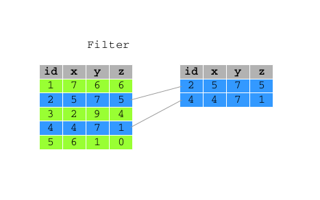

```{r options, include=FALSE, purl=FALSE}
options(width = 108)
```

```{r first, include=TRUE, purl=TRUE, message=FALSE}
# load packages and data
require(tidyverse)  
require(lubridate)
require(qdata)
data(bank)
```


# `filter()`

`filter()` allows you to select a subset of the rows of a data frame.

 

The first argument is the name of the data frame, and the second and subsequent are filtering expressions evaluated in the context of that data frame.

For example, you can select all calls made to students with balance above 20,000:

```{r}
filter(bank, job == "student", balance > 20000)
```

or all calls made on 2008-05-05 to students:

```{r}
bank %>% filter(job == "student", as.character(date) == "2008-05-05")
bank %>% filter(job == "student", date == ymd("2008-05-05"))
```


Note that you will have to either convert variable `date` to character or the string "2008-05-05" to an object of class `POSIX` as `dplyr` allows comparison between same class objects only.

`filter()` works similarly to `subset()` except that you can give it any number of filtering conditions which are joined together with `&` (not `&&` which is easy to do accidentally!). 

You can use other boolean operators explicitly:

```{r}
# Select all calls made to people of 18 or 95 years
bank %>% filter(age == 18 | age == 95)
```

`filter()` can be used also with `%in%` to establish conditions under which filter: 

```{r}
# Select all calls made to people of 18 or 95 years
bank %>% filter(age %in% c(18,95))
```

An other example is:

```{r}
# Select all calls made to people whose job is admin. or technician 
bank %>% filter(job %in% c("admin.","technician"))
# Select all calls made to people whose job is admin. or technician 
bank %>% filter(job == "admin." | job == "technician")
```


# `slice()`
To select rows by position, use `slice()`:

You can select the first 5 calls of the bank dataset as follow:

```{r}
slice(bank, 1:5)
```

Or the last row by:


```{r}
# select last row of the dataset
bank %>% slice(n()) 
```

<!--
This function is implemented special for each data source and can only be used from within summarise, mutate and filter 
-->

where function `n()` returns the number of element of a vector in the current group. This function is implemented special for each data source and can only be used from within `summarise()`, `mutate()` and `filter()`

<!--
?n

or the last call
-->


# `sample_n()` and `sample_frac()`

You can use `sample_n()` and `sample_frac()` to take a random sample of rows, either a fixed number for `sample_n()` or a fixed fraction for `sample_frac()`.

```{r}
sample_n(bank, 3)
```

```{r}
sample_frac(bank, 0.0001)
sample_frac(bank, 1.5, replace = TRUE)
```

Use `replace = TRUE` to perform a bootstrap sample, and optionally weight the sample with the weight argument.

