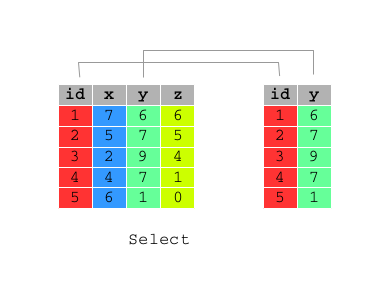

```{r options, include=FALSE, purl=FALSE}
options(width = 108)
```


```{r first, include=TRUE, purl=TRUE, message=FALSE}
require(dplyr)
require(qdata)
data(bank) 
bank <- tbl_df(bank)
```


# `select()`

Often you work with large datasets with many columns where only a few are actually of interest to you. 

`select()` allows you to rapidly zoom in on a useful subset of columns by using a set of useful helper functions.

 

```{r bank}
# Select columns: year, month and day of bank data frame
select(bank, year, month, day)
# Select columns: year, month and day of bank data frame
select(bank, year:day)
# Select all columns of bank data frame apart from: year, month and day
select(bank, -(year:day))
```

This function works similarly to the select argument to the `base::subset()`. It has its own function in `dplyr`, because the `dplyr` philosophy is to have small functions that each do one thing well.

You can rename variables with `select()` by using named arguments:

```{r}
# Rename id variable as ID
select(bank, ID = id)
```


## Helper Functions for `select()`

`select()` offer a wide set of helper functions:

* `contains(x)` selects all variables whose name contains `x`
* `ends_with(x)` selects all variables whose name ends in `x`
* `starts_with(x)` selects all variables whose name starts with `x`
* `everything()` selects all variables:
* `matches`: selects all variables whose name matches the regular expression `.x`:
* `num_range(x)` selects all variables starting with `x` and ending with a number:
* `one_of(x)` selects variables provided in a character vector `x`:
* `x:y` allows you to select a subset of adiacent variables from `x` to `y`:
* `-x` allows you to exclude variable `x` from the dataset

* `contains` selects all variables whose name contains "at":

```{r}
select(bank, contains("at"))
```
 
* `ends_with` selects all variables whose name ends in "tion":

```{r}
select(bank, ends_with("tion"))
```

* `starts_with` selects all variables whose name starts with "d":

```{r}
select(bank, starts_with("d"))
```

* `everything()` selects all variables:

```{r}
select(bank, everything())
# change the order of columns
select(bank, ends_with("tion"), everything() ) 
```

* `matches()` selects all variables whose name matches the regular expression ".r":

```{r}
# match all variables containing "r", but not at the first place
select(bank, matches(".r")) 
```


* `num_range` selects all variables starting with "x" and ending with a number:

```{r}
data(tennis)
wimbledon
select(wimbledon, num_range("s", c(1:3, 5)))
```


* `one_of` selects variables provided in a character vector:

```{r}
select(bank, one_of(c("marital","education")))
vars <- c("marital","education")
select(bank, one_of(vars))
```

* `:` allows you to select a subset of variables from `job` to `balance`:

```{r}
select(bank, job:balance)
```

* `-` allows you to specify which variables exclude from the dataset:

```{r}
select(bank, -job)
select(bank, -starts_with("d"))
```


# `distinct()`

A common use of `select()` is to find out which values a set of variables takes. This is particularly useful in conjunction with the `distinct()` verb which only returns the unique values in a table.

```{r}
# find out unique values of housing variable of bank data frame
distinct(select(bank, housing))
# find out combinations of unique values of housing and loan variables of bank data frame
distinct(select(bank, housing, loan))
```

This is very similar to `base::unique()` but should be much faster.


# `rename()`

As seen previously, you can rename the variables using `select()`, however it drops all the variables not explicitly mentioned so it’s not that useful. 
Instead, use `rename()`:

```{r}
# Rename id variable as ID
rename(bank, ID = id)
```
