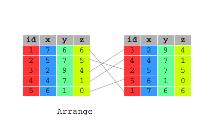

```{r options, include=FALSE, purl=FALSE}
options(width = 108)
```

```{r first, include=TRUE, purl=TRUE, message=FALSE}
require(dplyr)
require(qdata)
data(bank)
bank <- tbl_df(bank)
```


# `arrange()`

`arrange()` works similarly to `filter()` except that instead of filtering or selecting rows, it reorders them. It takes a data frame, and a set of column names (or more complicated expressions) to order by. If you provide more than one column name, each additional column will be used to break ties in the values of preceding columns:



```{r}
arrange(bank, date, age)
```

Use `desc()` to order a column in descending order:

```{r}
arrange(bank, desc(age))
```

The previous code is equivalent to:

```{r}
bank[order(bank$date, bank$age), ]
bank[order(desc(bank$age)), ]
```

