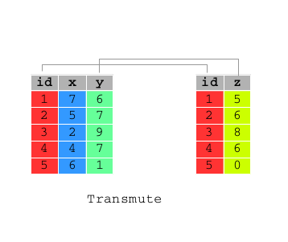

```{r options, include=FALSE, purl=FALSE}
options(width = 108)
```

```{r first, include=TRUE, purl=TRUE, message=FALSE}
require(dplyr)
require(qdata)
data(bank)
```


# `mutate()`

As well as selecting from the set of existing columns, it’s often useful to add new columns that are functions of existing columns. This is the job of `mutate()`:

 

<!--- AS explain example add or replace columns -->

```{r}
df <- data.frame(x = 1:3, y = 3:1)

df %>% mutate(x1 = x+1)

df %>% mutate(x = x+1)

df %>% mutate(x = x+1, y = x+1)

df %>% mutate(y = x+1, x = x+1)

df %>% mutate(x1 = x+1, y1 = x1+1)

df %>% mutate(xx = x)
```


```{r}
bank <- tbl_df(bank)
bank %>% 
  select (year, age, balance) %>%
  mutate(balance_by_age = balance / age, year_of_birth = year - age)
```

`dplyr::mutate()` works similarly to `base::transform()`. The key difference between `mutate()` and `transform()` is that `mutate()` allows you to refer to columns that you just created:

```{r}
mutate(bank, year_of_birth = year - age, year_of_birth_no_century = year_of_birth - 1900)
```

while `transform()` returns an error:

```{r, error=TRUE}
transform(bank, year_of_birth = year - age, year_of_birth_no_century = year_of_birth - 1900)
```


# `transmute()`

 

If you only want to keep the new variables, use `transmute()`:

```{r} 
transmute(bank, year_of_birth = year - age, year_of_birth_no_century = year_of_birth - 1900)
```


## Helper Functions for `mutate()`/`transmute()`

* `lead` copies a vector with values shifted by 1:

```{r}
time <- select(bank, duration)
mutate(time, lead_duration = lead(duration), delta_duration = lead_duration - duration)
```

* `lag` copies a vector with values lagged by 1:

```{r}
mutate(time, lag_duration = lag(duration), delta_duration = duration - lag_duration)
```


<!--- exlpain ties in details --->

The following functions represents six variations on ranking functions, mimizing the ranking functions described in SQL2003. They are currently implemented using the built in rank function, and are provided mainly as a convenience when converting between `R` and SQL. All ranking functions map smallest inputs to smallest outputs. Use `desc` to reverse the direction.

* `min_rank` is equivalent to `rank(ties.method = "min")` and returns the min rank of each observation:

```{r}
mutate(time, duration_rank = min_rank(duration))
```

* `dense_rank` is like `min_rank`, but with no gaps between ranks:

```{r}
mutate(time, duration_rank = dense_rank(duration))
```

* `percent_rank` returns a number between 0 and 1 computed by rescaling `min_rank` to [0, 1]:

```{r}
mutate(time, duration_rank = percent_rank(duration))
```

* `row_number` is equivalent to `rank(ties.method = "first")`, which results in a permutation with increasing values at each index set of ties:

```{r}
mutate(time, duration_rank = row_number(duration))
```

* `ntile()` divides the data up into n evenly sized buckets. It’s a coarse ranking, and it can be used in with `mutate()` to divide the data into buckets for further `summary`:

```{r}
mutate(time, duration_rank = ntile(duration, 10))
```

* `cume_dist` is a cumulative distribution function. It creates a proportion of all values less than or equal to the current rank:

```{r}
mutate(time, duration_rank = cume_dist(duration))
```

* `between` is a shortcut for x >= left & x <= right, implemented efficiently in C++ for local values, and translated to the appropriate SQL for remote tables:

```{r}
mutate(time, duration_rank = between(duration, 0, 90))
```

`dplyr` adds `cumall`, `cumany`, and `cummean` to complete `R`'s set of cumulate functions to match the aggregation functions available in most databases.

* `cumany()` and `cumall()` are useful for selecting all rows up to, or all rows after, a condition is true for the first (or last) time:

```{r}
mutate(time, long_duration = cumall(duration > 100))
```

```{r}
mutate(time, short_duration = cumany(duration < 100))
```

* `cummean` returns a cumulative mean of a vector:

```{r}
mutate(time, mean_duration = cummean(duration))
```

