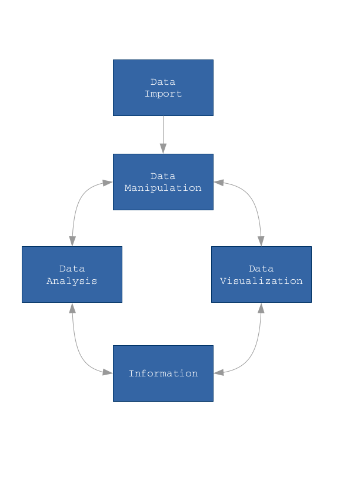

 

Data manipulation is the process of changing data in an effort to make it more organized and suitable for further steps of the data analysis process: visualizing, modelling, ..., etc

The `R` package `tidyverse` offers a suit of integrated and organized tools for easily accomplish common data manipulation tasks and basic data analysis tasks

`dplyr` has been developed by _Hadley Wickam_. The main source is available at [https://github.com/hadley/dplyr](https://github.com/hadley/dplyr)

