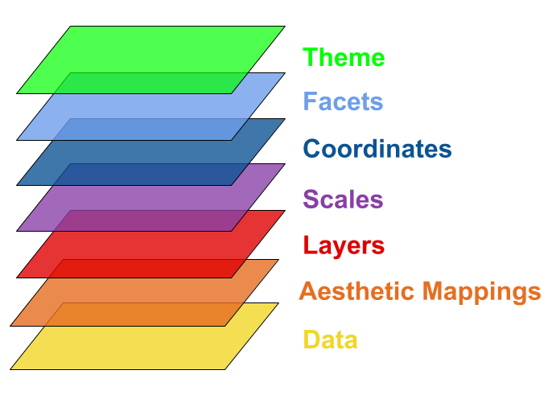

```{r options, include=FALSE, purl=FALSE}
options(width = 108)
```

Visualizing data is crucial in today's world. Without powerful visualizations, it is almost impossible to create and narrate stories on data. These stories help us build strategies and make intelligent business decisions. 

<!--
grafico export versus explanatory
-->

R is well supported to make data visualization. It provides at least three main graphical systems: `graphics` that comes with base R, `lattice` that is an R implementation of William Cleveland's trellis graphics and `ggplot2` that is an R implementation of Leland Wilkinson's Grammar of Graphics. The Grammar of Graphics is a formal and structured perspective on how to describe data graphics. CRAN provides a [Task View on Graphics](https://cran.r-project.org/web/views/Graphics.html), that is an organized list of all R packages about graphics, that includes not only the three main graphical systems but also packages to produce specialized plots.

In the following chapters, `ggplot2` graphics are shown. `ggplot2` package has become a synonym for data visualization in R and there are at least two main reasons to prefer it that other graphic systems:

 - `ggplot2` is newer than other graphic systems;
 - `ggplot2` is built on the idea of a semantics for graphics and there is much more emphasis on reshaping data, transformation, and assembling the elements of a plot.

`ggplot2` was written by Hadley Wickham and Winston Chang. If you are wondering, Wickham wrote also a `ggplot` package (without any number) that was archived by CRAN in 2008.

The starting point for more information about `ggplot2` is the [official website](http://ggplot2.org/) providing documentation, the official mailing list and other resources.

Supposing the package is already installed, first of all `ggplot2` must be loaded.  

```{r intro_require_ggplot, message=FALSE}
require(ggplot2)
```

## An overview on grammar of graphics

In order to unlock the full power of `ggplot2`, you need to have an overview of its undelying grammar. 
By understanding the grammar and how its components fit together, you can create a wider range of visualization, combine miltiple source of data,
and customize to your heart's content.

`ggplot2` grammar is called layered as it is structured in building blocks. Its basic idea is to independently specify plot building blocks and combine them to create just about any kind of graphical display you want. 

Let us see an example:

```{r}
require(ggplot2)
data(iris)
levels(iris$Species) <- c("Setosa", "Versicolor", "Virginica")
ggplot(iris, aes(x = Sepal.Length, y = Sepal.Width, colour = Species)) +
  geom_point(alpha = 0.8) +
  facet_grid(. ~ Species) +
  stat_smooth(method = "lm", se = F, col = "darkslateblue") +
  scale_y_continuous(name = "Sepal Width (cm)", limits = c(2,5), expand = c(0,0)) +
scale_x_continuous(name = "Sepal Length (cm)", limits = c(4,8), expand = c(0,0)) +
coord_equal() + ggtitle("Scatterplot of lenght and width of iris sepal by species") +

  theme(plot.background = element_blank(),
axis.text = element_text(colour = "black"),
axis.ticks = element_line(colour = "black"),
axis.line.x = element_line(colour = "black"),
axis.line.y = element_line(colour = "black"),
axis.title = element_text(colour = "black", size = 14, face = "bold.italic"),
strip.background = element_rect(colour = "black"),
strip.text = element_text(colour = "black", face = "bold.italic", size = 12),
plot.title = element_text(colour = "black", size = 20, face = "bold.italic"),
panel.margin = unit(1, "lines"),
legend.position="none"
)
```

This plot is composed by building blocks that are added to the plot one after the other as displayed in the following scheme:




1. data: the dataset being plotted


```{r}
head(iris)
```

<!--
immagine data
-->


2. aestethics: the scales onto which we map our data


| Sepal.Length | Sepal.Width | Petal.Length | Petal.Width | Species|  
|--------------|-------------|--------------|-------------|--------|
| x | y |   |  | colour |

<!--
immagine aestethics
-->


3. geometries: the visual elements used for our data


```{r}
ggplot(iris, aes(x = Sepal.Length, y = Sepal.Width, colour = Species)) +
  geom_point(alpha = 0.8) 
```


<!--
immagine geometries
-->

4. statistics: representations of our data to aid understanding

```{r}
ggplot(iris, aes(x = Sepal.Length, y = Sepal.Width, colour = Species)) +
  geom_point(alpha = 0.8) +
  stat_smooth(method = "lm", se = F, col = "darkslateblue")
```

<!--
immagine statistics
-->

5. scales: control the mapping from data to aestethic attributes

```{r}
ggplot(iris, aes(x = Sepal.Length, y = Sepal.Width, colour = Species)) +
  geom_point(alpha = 0.8) +
  stat_smooth(method = "lm", se = F, col = "darkslateblue") +
  scale_y_continuous(name = "Sepal Width (cm)", limits = c(2,5), expand = c(0,0)) +
  scale_x_continuous(name = "Sepal Length (cm)", limits = c(4,8), expand = c(0,0)) 
```


6. facets: plotting small multiples

```{r}
ggplot(iris, aes(x = Sepal.Length, y = Sepal.Width, colour = Species)) +
  geom_point(alpha = 0.8) +
  stat_smooth(method = "lm", se = F, col = "darkslateblue") +
  scale_y_continuous(name = "Sepal Width (cm)", limits = c(2,5), expand = c(0,0)) +
  scale_x_continuous(name = "Sepal Length (cm)", limits = c(4,8), expand = c(0,0)) +
  facet_grid(. ~ Species)
```

<!--
immagine facets
-->

7. coordinates: the space on which the data will be plo!ed

```{r}
ggplot(iris, aes(x = Sepal.Length, y = Sepal.Width, colour = Species)) +
  geom_point(alpha = 0.8) +
  stat_smooth(method = "lm", se = F, col = "darkslateblue") +
  scale_y_continuous(name = "Sepal Width (cm)", limits = c(2,5), expand = c(0,0)) +
  scale_x_continuous(name = "Sepal Length (cm)", limits = c(4,8), expand = c(0,0)) +
  stat_smooth(method = "lm", se = F, col = "darkslateblue") + 
  facet_grid(. ~ Species) +
  coord_equal()
```


8. theme: all non-data elements

```{r}
ggplot(iris, aes(x = Sepal.Length, y = Sepal.Width, colour = Species)) +
  geom_point(alpha = 0.8) +
  stat_smooth(method = "lm", se = F, col = "darkslateblue") +
  scale_y_continuous(name = "Sepal Width (cm)", limits = c(2,5), expand = c(0,0)) +
  scale_x_continuous(name = "Sepal Length (cm)", limits = c(4,8), expand = c(0,0)) +
  facet_grid(. ~ Species) +
  coord_equal() + 
  ggtitle("Scatterplot of lenght and width of iris sepal by species") +
  theme(plot.background = element_blank(),
    axis.text = element_text(colour = "black"),
    axis.ticks = element_line(colour = "black"),
    axis.line.x = element_line(colour = "black"),
    axis.line.y = element_line(colour = "black"),
    axis.title = element_text(colour = "black", size = 14, face = "bold.italic"),
    strip.background = element_rect(colour = "black"),
    strip.text = element_text(colour = "black", face = "bold.italic", size = 12),
    plot.title = element_text(colour = "black", size = 20, face = "bold.italic"),
    panel.margin = unit(1, "lines"),
    legend.position="none"
)
```


<!--
positioning?
non l'ho inserito al momento
-->

Each of the following chapters introduces a different plot with one or more related geometric object (`geom`). Moreover, each chapter introduces some basic concept about `ggplot2`, according to the following table.

| Plot          | Geoms | `ggplot2` key concepts introduced in the chapter                                                    |  
|---------------|-------|-----------------------------------------------------------------------------------------------------|
| Scatter plots | `geom_point` `geom_smooth`                         | aesthetics, _setting_ or _mapping_, geoms, assignment  |
| Line plots   | `geom_line` `geom_point` `geom_hline` `geom_vline` | `group` aesthetic, manual scales                       |
| Bar plots    | `geom_bar` `geom_text`                             | `stat`, hide legend, swapping axes                     |
| Histograms    | `geom_histogram` `geom_density`                    | faceting                                               |
| Box plots     | `geom_boxplot`                                     | titles and theme (plot title and axes ticks/titles)    |

The last chapter of the section shows how to prepare plots for presentations, and save them to files.


# Datasets

The following data sets are used in the examples of this section.

## `bands`

`bands` provides data about process delays known as cylinder banding in rotogravure printing.

`bands` data is included in the `qdata` package.

```{r intro_data_bands, message=FALSE}
require(qdata)
data(bands)
head(bands)
```

For a complete description of data, refer to the help (`?bands`).


## `ChickWeight`

`ChickWeight` provides weight versus age of chicks on different diets.

`ChickWeight` data is included in `datasets` package, that comes with base R: you just need to type `ChickWeight` to access data.

For a description of data, refer to the help (`?ChickWeight`).


## `ToothGrowth`

`ToothGrowth` provides the effect of Vitamin C on Tooth Growth in Guinea Pigs.

`ToothGrowth` data is included in `datasets` package, that comes with base R: you just need to type `ToothGrowth` to access data.

For a description of data, refer to the help (`?ToothGrowth`).


# Bibliography and References

To take a deeper look about `ggplot2` you can refer to:

 - [Chang W., _R Graphics Cookbook_, O'Reilly, 2012](http://www.cookbook-r.com/Graphs/) that provides a practical approach to `ggplot` and other R plots;
 - [Wickham H., _ggplot2: Elegant Graphics for Data Analysis_, Springer, 2009](http://ggplot2.org/book/) that provides technical details about Grammar of Graphics implemented in `ggplot2`.
 
