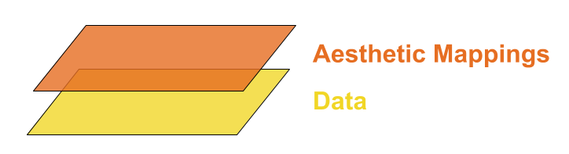
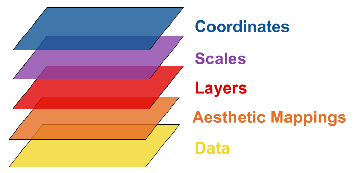
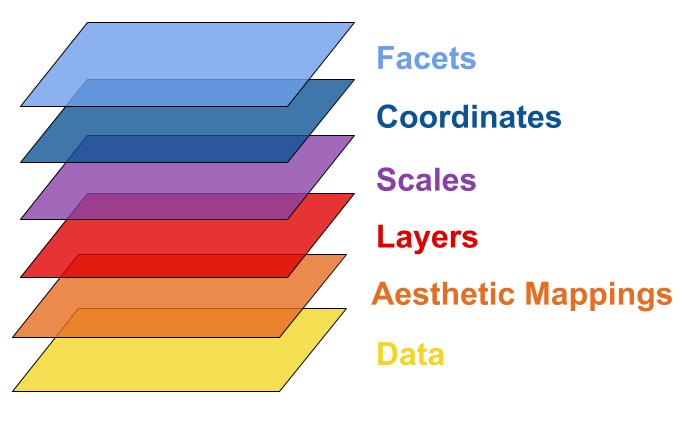

```{r options, include=FALSE, purl=FALSE}
options(width = 108)
```

Visualizing data is crucial in today's world. Without powerful visualizations, it is almost impossible to create and narrate stories on data. These stories help us build strategies and make intelligent business decisions. 

<!--
grafico export versus explanatory
-->

R is well supported to make data visualization. It provides at least three main graphical systems: `graphics` that comes with base R, `lattice` that is an R implementation of William Cleveland's trellis graphics and `ggplot2` that is an R implementation of Leland Wilkinson's Grammar of Graphics. CRAN provides a [Task View on Graphics](https://cran.r-project.org/web/views/Graphics.html), that is an organized list of all R packages about graphics, that includes not only the three main graphical systems but also packages to produce specialized plots.

In the following chapters, `ggplot2` graphics are shown. `ggplot2` package has become a synonym for data visualization in R and there are at least two main reasons to prefer it than other graphic systems:

 - `ggplot2` is newer than other graphic systems;
 - `ggplot2` is built on the idea of a semantics for graphics and there is much more emphasis on reshaping data, transformation, and assembling the elements of a plot.

`ggplot2` was written by Hadley Wickham and Winston Chang. If you are wondering, Wickham wrote also a `ggplot` package (without any number) that was archived by CRAN in 2008.

The starting point for more information about `ggplot2` is the [official website](http://ggplot2.org/) providing documentation, the official mailing list and other resources.

Supposing the package is already installed, first of all `ggplot2` must be loaded.  

```{r intro_require_ggplot, message=FALSE}
require(ggplot2)
```

## An overview of ggplot2 grammar

In order to unlock the full power of `ggplot2`, you need an overview of its undelying grammar. 
By understanding the grammar and how its components fit together, you can create a wider range of visualization, combine miltiple source of data, and customize to your heart's content.

As we said, `ggplot2` is an R implementation of Leland Wilkinson's Grammar of Graphics, which is a formal and structured perspective on how to describe data graphics. `ggplot2` grammar is called layered as it is structured in building blocks. Its basic idea is to independently specify plot building blocks and combine them to create just about any kind of graphical display you want. 

<!--
cambiare iris
-->

Let us see an example.   

Let us consider `iris` dataset. `iris` dataset gives the measurements in centimeters of the variables sepal length and width and petal length and width, respectively, for 50 flowers from each of 3 species of iris. Suppose we want to visualize the relationship between the length and the width of iris sepals according to the different species: 

```{r, fig.width= 8, echo=FALSE}
# Load iris dataset
data(iris)

# Generate plot
ggplot(iris, aes(x = Sepal.Width, y = Sepal.Length, colour = Species)) +
  geom_point() +
  stat_smooth(method = "lm", se = F) +
  coord_equal() +
  facet_grid(. ~ Species) +
  ggtitle("Scatterplot of lenght and width of iris sepal by species") + 
    xlab("Sepal Length (cm)") +
    ylab("Sepal Width (cm)") +
  theme(plot.background = element_blank(),
    axis.text = element_text(colour = "black"),
    axis.ticks = element_line(colour = "black"),
    axis.line.x = element_line(colour = "black"),
    axis.line.y = element_line(colour = "black"),
    axis.title = element_text(colour = "black", size = 14, face = "bold.italic"),
    strip.background = element_rect(colour = "black"),
    strip.text = element_text(colour = "black", face = "bold.italic", size = 12),
    plot.title = element_text(colour = "black", size = 20, face = "bold.italic"),
    panel.margin = unit(1, "lines"),
    legend.position="none"
)
```

The previous plot is composed of building blocks that are added to the plot one after the other.   
The complete scheme of the most important building blocks of `ggplot2` grammar is displayed in the following scheme:


The scheme must be read from down to top. Starting from down, the first three building blocks (Data, Aestethic Mappings and Layers) are essential to build a simple plot, they are called "key" building blocks, meanwhile the remaining (Scales, Coordinates, Facet and Theme) allows us to build a complex plot and to customize it. The scheme order is recommended but it is not compulsory. 

<!--
dire che non è obbligatorio utilizzare tutti i layer
-->

Let us briefly describe the task of each element of the scheme and how it helps build the previous plot: 

1. <b> <span style="color:#FFBF00">Data</span> </b>: the dataset that you want to visualize


```{r, eval=FALSE}
data(iris)
```

```{r}
# iris dataset
head(iris)
```


2. <b> <span style="color:#FF8000">Aestethic Mappings</span> </b>: describes how variables in the data are mapped to aestethic attributes that you can perceive 




| Sepal.Length | Sepal.Width | Petal.Length | Petal.Width | Species|  
|--------------|-------------|--------------|-------------|--------|
| y | x |   |  |


```{r}
ggplot(iris, aes(x = Sepal.Width, y = Sepal.Length))
```

3. <b> <span style="color:#FF0000">Layers</span> </b>: are made up by geometric elements and statistical transformations. In details, geometric objects (`geom`s) represent what you actually see on the plot: points, lines, polygons, etc. Statistical transformations (`stat`s) summarise data in many useful ways. For example, binning and counting observations to create an histogram, or summarising a 2d relationship with a linear model.       


```{r}
# Scatterplot of the relationship between sepal length and sepal width with regression line
ggplot(iris, aes(x = Sepal.Width, y = Sepal.Length)) +
  geom_point() + # layer 1 
  stat_smooth(method = "lm", se = FALSE) # layer 2 
```

<!--

già detto prima 

<b> <span style="color:#FFBF00">Data</span> </b>, <b> <span style="color:#FF8000">aestethic mappings</span> </b> and <b> <span style="color:#FF0000">layers</span> </b> (at least one) are the three key components of each `ggplot2` plot. The adding and the order od adding of the following components is not compulsory, it depends from the kind of plot you want to build.  
-->
4. <b> <span style="color:#9A2EFE">Scales</span> </b>: map values in the data space to values in an aesthetics space, whether it be colour, or size or shape. Scales draw a legend on axes, which provide an inverse mapping to make it possible to read the original data values from the graph. 


```{r}
# Add a scale scale (map Species to colour scale)
ggplot(iris, aes(x = Sepal.Width, y = Sepal.Length, colour = Species)) +
  geom_point() +
  geom_smooth(method = "lm", se = FALSE) 
```


5. <b> <span style="color:#08298A">Coordinates</span> </b> or coordinate system (`coord`) describes how data coordinates are mapped to the plane of the graphic. It also provides axes and gridlines to make it possible to read the graph. We normally use Cartesian coordinate system, but a number of others are available. 



```{r fig.height= 4}
# Change coordinate system 
ggplot(iris, aes(x = Sepal.Width, y = Sepal.Length, colour = Species)) +
  geom_point() +
  stat_smooth(method = "lm", se = FALSE) +
  coord_equal()
```


6. <b> <span style="color:#2E9AFE">Facets</span> </b>: describes how to break up the data into subset and how to display those subsets as small multiples. 



```{r}
# Generate a plot for each iris species
ggplot(iris, aes(x = Sepal.Width, y = Sepal.Length, colour = Species)) +
  geom_point() +
  stat_smooth(method = "lm", se = FALSE) +
  coord_equal() +
  facet_grid(. ~ Species)
```

8. <b> <span style="color:#01DF01">Theme</span> </b>: controls all non-data elements of the plot, like the font size and background colour.


```{r, fig.width= 8}
# Customize the appearance of the plot
ggplot(iris, aes(x = Sepal.Width, y = Sepal.Length, colour = Species)) +
  geom_point() +
  stat_smooth(method = "lm", se = FALSE) +
  coord_equal() +
  facet_grid(. ~ Species) +
  ggtitle("Scatterplot of lenght and width of iris sepal by species") + 
    xlab("Sepal Length (cm)") +
    ylab("Sepal Width (cm)") +
  theme(plot.background = element_blank(),
    axis.text = element_text(colour = "black"),
    axis.ticks = element_line(colour = "black"),
    axis.line.x = element_line(colour = "black"),
    axis.line.y = element_line(colour = "black"),
    axis.title = element_text(colour = "black", size = 14, face = "bold.italic"),
    strip.background = element_rect(colour = "black"),
    strip.text = element_text(colour = "black", face = "bold.italic", size = 12),
    plot.title = element_text(colour = "black", size = 20, face = "bold.italic"),
    panel.margin = unit(1, "lines"),
    legend.position="none"
)
```


## Manual index

This manual is divided in three sections.  

The first section, "Base ggplot2", explains how building the most important kinds of plot. It deepens the use and the functionalities of the three key components of `ggplot2` grammar (data, aesthetic mapping and layers). It introduces also some basic concepts about the other components. 

The second section, "Advanced ggplot2" explains how dealing with the most common questions about plot customization and deepens the remaining components of `ggplot2` grammar.  

The third section, "Other Topics", shows how to prepare plots for presentations, and save them to files and talk about the `ggplot2` community and the packages built starting from it.  


<!--

Each of the following chapters introduces a different plot with one or more related geometric object (`geom`). Moreover, each chapter introduces some basic concept about `ggplot2`, according to the following table.

| Plot          | Geoms | `ggplot2` key concepts introduced in the chapter                                                    |  
|---------------|-------|-----------------------------------------------------------------------------------------------------|
| Scatter plots | `geom_point` `geom_smooth`                         | aesthetics, _setting_ or _mapping_, geoms, assignment  |
| Line plots   | `geom_line` `geom_point` `geom_hline` `geom_vline` | `group` aesthetic, manual scales                       |
| Bar plots    | `geom_bar` `geom_text`                             | `stat`, hide legend, swapping axes                     |
| Histograms    | `geom_histogram` `geom_density`                    | faceting                                               |
| Box plots     | `geom_boxplot`                                     | titles and theme (plot title and axes ticks/titles)    |

The last chapter of the section shows how to prepare plots for presentations, and save them to files.
-->

## Datasets

The following datasets are used in the examples of this section.

### `bands`

`bands` provides data about process delays known as cylinder banding in rotogravure printing.

`bands` data is included in the `qdata` package.

```{r intro_data_bands, message=FALSE}
require(qdata)
data(bands)
head(bands)
```

For a complete description of data, refer to the help (`?bands`).


### `ChickWeight`

`ChickWeight` provides weight versus age of chicks on different diets.

`ChickWeight` data is included in `datasets` package, that comes with base R: you just need to type `ChickWeight` to access data.

For a description of data, refer to the help (`?ChickWeight`).


### `ToothGrowth`

`ToothGrowth` provides the effect of Vitamin C on Tooth Growth in Guinea Pigs.

`ToothGrowth` data is included in `datasets` package, that comes with base R: you just need to type `ToothGrowth` to access data.

For a description of data, refer to the help (`?ToothGrowth`).


### istat

`istat` provides the measures of weight, height, gender and geographical area ("Nord", "Centro", "Sud" and "Isole") from 1806 Italian people.

`istat` is included in `qdata` package.

For a complete description of data, refer to the help (`?istat`).

### italy

`italy` provides information about longitude, latitude and region of the most important italian cities. 

`italy` is included in `qdata` package.

For a complete description of data, refer to the help (`?italy`).

### lung

`lung` provides information about survival in patients with advanced lung cancer from the North Central Cancer Treatment Group. 

`lung` is included in `survival` package. 

<!--
metterlo in qdata
-->

## brainbod

`brainbod` provides information about the weight of body and brain of different species of animals.

`brainbod` is included in `qdata` package.

For a complete description of data, refer to the help (`?brainbod`).


## Bibliography and References

To take a deeper look about `ggplot2` you can refer to:

 - [Chang W., _R Graphics Cookbook_, O'Reilly, 2012](http://www.cookbook-r.com/Graphs/) that provides a practical approach to `ggplot` and other R plots;
 - [Wickham H., _ggplot2: Elegant Graphics for Data Analysis_, Springer, 2009](http://ggplot2.org/book/) that provides technical details about Grammar of Graphics implemented in `ggplot2`.
 
