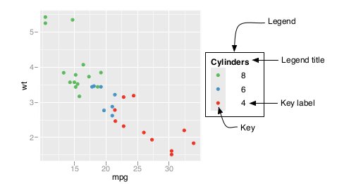

```{r options, include=FALSE, purl=FALSE}
knitr::opts_chunk$set(echo = TRUE, warning =FALSE, message = FALSE)
options(width = 108)
```


```{r first, include=TRUE, purl=TRUE, message=FALSE}
require(ggplot2)
require(qdata)
require(grid)
data(bands)
```

A legend is a guide which tells us how to map visual (aesthetic) properties back to original data values. 
`ggplot2` automatically generates the legend according to the aesthetics mapped.

Let us see an example.  
Considering the `bands` data. Supposing you are interested in the relationship between humidity and viscosity by band type, you can build four box plots to compare distributions:

```{r pl_1}
pl_1 <- ggplot(data=bands, aes(x=press_type, y=ink_pct, fill=press_type)) + 
  geom_boxplot()
pl_1
```

As you can see from the plot, the legend is automatically built showing `press_type` variable levels. In this case, `press_type` variable is mapped to `fill` aesthetic. When a variable is mapped to an aesthetic it is automatically set to a scale. The default scale in this case is `scale_fill_discrete()`, but there are also other scales according to aesthetics mapped, such as `colour` (for lines and points) or `shape` (for points).

Scales, `theme()` and `guides()` functions are the tools of `ggplot2` used to customize the appearance of the legend components.

<!--
frase di collegamento con il disegno 
-->



In the following paragraphs we will see how to handle with the most common questions on legend customization.

## Removing the legend

Sometimes a legend is redundant, or it is supplied in another graph that will be displayed with the current one. In these cases, it can be useful to remove the legend from a graph.  
You can remove the legend in three ways:  

* using `guides()` function and specify the scale that should have its legend removed
* setting `guide` argument of the `scale_xxx_xxx()` function where the aestethic is mapped to `FALSE` 
* use the theming system specifying `legend.position` argument to `"none"`

In the previous example, the colors provide the same information that is on the x-axis, so the legend is unnecessary:

```{r pl_1_remove_legend, eval = FALSE}
pl_1 + 
  guides(fill=FALSE)
pl_1 + 
  scale_fill_discrete(guide=FALSE)
pl_1 + 
  theme(legend.position="none")
```

In this case, the previous three command lines produce the same result:

```{r, echo=FALSE, purl=FALSE}
pl_1 + 
  guides(fill=FALSE)
```

If you have more than one aesthetic mapped with a legend (color and shape, for example), the third is the better option because this will remove legends for all of them.

Notice that with the legend removed, the area used for graphing the data is larger.

## Changing the position of a legend

If you want to move the legend from its default place, on the right side, you have to use `theme()` function. The legend can be put on the top, left, right, or bottom by using one of those strings as value of `legend.position` argument.

Suppose we want to place the position on top:

```{r pl_1_change_legend_position_1}
pl_1 + 
  theme(legend.position="top")
```

The allowed values for the argument `legend.position` are : `"left"`, `"top"`, `"right"`, `"bottom"`.

<!--
già detto?
-->

Let us consider a plot with multiple legends in plot.  
Suppose we want to analyze the relationship between humidity, viscosity, ink percentage and band type in `bands` dataset: 

```{r pl_2}
pl_2 <- ggplot(data=bands, mapping=aes(x=humidity, y=viscosity, size=ink_pct, colour=band_type)) +
  geom_point()
```

Suppose that we want also to move the legend to bottom:

```{r pl_2_change_multiple_legend_position_1}
pl_2 + 
  theme(legend.position="bottom")
```

Looking at the plot we see that legends are represented in different lines. If you want to set legends in the same line set `legend.box` argument of `theme()` function as `"horizontal"`:

```{r pl_2_change_multiple_legend_position_2}
pl_2 + 
  theme(legend.position="bottom", legend.box = "horizontal")
```

The legend can also be placed inside the graphing area by specifying a coordinate position. In this case, the argument `legend.position` has to be set to a numeric vector c(x,y), whose values should be between 0 and 1. In particular, the coordinate space starts at (0, 0) in the bottom left and goes to (1, 1) in the top right.

Let us see an example, considering the differences of ink percentage accordingly to the type of press in bands dataset: 

```{r pl_1_change_legend_position_2}
pl_1 + 
  theme(legend.position=c(0.15,0.80))
```

<!--
mettere tutto il testo dell'esempio?
-->

In the previous plot, the justification of the legend positon is centered. This means that the center of the legend (.5, .5) is placed at the coordinates set to `legend.position` argument. However, it is often useful to specify a different point. You can use `legend.justification` argument to set which part of the legend box is set to the position specified in `legend.position` argument. Let us set left-top justification for `legend.justification`:

```{r pl_1_change_legend_position_3}
pl_1 + 
  theme(legend.position=c(0,1), legend.justification=c(0,1))
```

## Change the order of items in a legend

To change the order of the items in a legend set the limits in the scale to the desired order:

```{r pl_1_change_legend_order}
pl_1 + 
  scale_fill_discrete(limits=c("MOTTER94", "MOTTER70", "WOODHEADE70", "ALBERT70"))
```

Note that the order of the items on the x-axis did not change. To do that, you would have to set the limits of `scale_x_discrete()` or change the data to have a different factor level order. For more details see _Change axis order_ paragraph in _Axes Customization_ chapter.

### Reversing the order of items in a legend

Add `guides(fill=guide_legend(reverse=TRUE))` to reverse the order of the legend (for other aesthetics, replace fill with the name of the aesthetic, such as colour or size):

```{r pl_1_reverse_legend_order}
pl_1 + 
  guides(fill=guide_legend(reverse=TRUE))
```

<!--
decidere se lasciarlo un paragrafo o metterlo insieme a "Change the order of items in a legend"
-->

### Change the order for multiple guides

Let us consider the example about the relationship between humidity, viscosity, ink percentage and band type in `bands` dataset.

In this case, you have multiple guides. Suppose you want to change the guides order, use `guides()` function in this way:

```{r pl_2_change_multiple_legends_order}
pl_2 + 
  guides(color = guide_legend(order=2),
    size = guide_legend(order=1))
```


## Change a legend title

The title of a legend can be changed in three ways:

* using `labs()` function and set the value of `fill`, `colour`, `shape`, or whatever aesthetic is appropriate for the legend
* in the scale specification setting `name` argument
* using `guides()` function

```{r pl_1_change_legend_title, eval=FALSE}
pl_1 + 
  labs(fill="Pressure Type")
pl_1 + 
  scale_fill_discrete(name="Pressure Type")
pl_1 + 
  guides(fill=guide_legend(title="Pressure Type"))
```

The previous three command lines proceduce the same result:

```{r, echo = FALSE, purl=FALSE}
pl_1 + 
  labs(fill="Pressure Type")
```

The controlling of the legend title by using the `guides()` function is a little more verbose, but it can be useful when you’re already using it to control other properties.

If there are multiple variables mapped to aesthetics with a legend (those other than x and y), you can set the title of each individually.

<!--
Let us consider the example about the relationship between humidity, viscosity, ink percentage and band type in the `bands` dataset. 

Change the legends title:

```{r, warning=FALSE, purl=FALSE}
pl_2 + labs(colour="Band Type", size="Ink \n Percentage")
pl_2 + guides(colour=guide_legend(title="Band Type"), size=guide_legend(title="Ink \n Percentage"))
```
-->

If you have one variable mapped to two separate aesthetics, the default is to have a single legend that combines both.

Let us analyze the relationship between humidity, viscosity and band_type in `bands` dataset:

```{r pl_3}
pl_3 <- ggplot(data=bands, mapping=aes(x=humidity, y=viscosity, shape=band_type, colour=band_type)) +
  geom_point()
pl_3
```

To change the title, you need to set the name for both of them. If you change the name for just one, it will result in two separate legends:

```{r pl_3_change_multiple_legends_title}
pl_3 + 
  labs(shape = "Band Type") # two separate legend
pl_3 + 
  labs(shape = "Band Type", colour = "Band Type") # one legend
```

## Changing the appearance of a legend 

### Changing the appearance of a legend title

The appearance of the legend title, like size, style and the font family can be changed by setting `element_text()` function to `legend.title` argument of `theme()` function in this way:

```{r pl_1_change_legend_title_appearance}
pl_1 + 
  theme(legend.title=element_text(face="bold", family="Times", colour="darkgreen", size=14))
```


### Removing a legend title

You can remove legend title by using `scale_xxx_xxx()` or `guides()` functions:

```{r pl_1_remove_legend_title, eval=FALSE}
pl_1 + 
  guides(fill=guide_legend(title=NULL))
pl_1 + 
  scale_fill_discrete(guide = guide_legend(title=NULL))
```

The previous command lines produce the same result:

```{r, echo=FALSE, purl=FALSE}
pl_1 + 
  guides(fill=guide_legend(title=NULL))
```


### Change the labels text in a legend

You can change the labels text in a legend by setting `labels` argument in the `scale_xxx_xxx()` function:

```{r pl_1_change_legend_labels_1}
pl_1 + 
  scale_fill_discrete(labels=c("Albert 70", "Motter 70", "Motter 94", "Woodhoe 70"))
```

Note that the labels on the x-axis did not change. To do that, you would have to set the labels of `scale_x_discrete()` (see chapter _Axes Customization_, paragraph _Changing the Text of Tick Labels_), or change the data to have different factor level names.

If you are also changing the order of items in the legend, the labels are matched to the items by position. In this example we change the item order, and make sure to set the labels in the same order:

```{r pl_1_change_legend_labels_2}
pl_1 + 
  scale_fill_discrete(limits=c("MOTTER70", "WOODHOE70", "ALBERT70", "MOTTER94"),
    labels=c("Motter 70", "Woodhoe 70", "Albert 70", "Motter 94"))
```

If you have one variable mapped to two separate aesthetics, the default is to have a single legend that combines both. If you want to change the legend labels, you must change them for both scales; otherwise you will end up with two separate legends:

```{r pl_3_change_multiple_legends_labels}
# Change the labels for one scale
pl_3 + 
  scale_shape_discrete(labels=c("Band", "No Band"))
# Change the labels for both scales
pl_3 + 
  scale_shape_discrete(labels=c("Band", "No Band")) +
  scale_colour_discrete(labels=c("Band", "No Band"))
```

<!--
inserire anche grafico originale?
-->

### Changing the appearance of a legend label

The appearance of the legend labels, like size, style and the font family can be changed by setting `element_text()` function to `legend.text` argument of `theme()` function in this way:

```{r pl_1_change_legend_labels_appearance}
pl_1 + 
  theme(legend.text=element_text(face="italic", family="Times", colour="red", size=14))
```

### Using labels with a multiple lines of text

If you want to use legend labels that have more than one line of text, set the labels in the scale, using `"\n"` to represent a newline. In this example, we’ll use `scale_fill_discrete()` to control the legend for the fill scale:

```{r pl_1_legend_labels_break_lines}
pl_1 + 
  scale_fill_discrete(labels=c("Albert 70 \n type", "Motter 70 \n type", "Motter 94 \n type", "Woodhoe 70 \n type"))
```

As you can see in the previous plot, with the default settings the lines of text will run into each other when you use labels that have more than one line. To deal with this problem, you can increase the height of the legend keys and decrease the spacing between lines, using `theme()`. To do this, you will need to specify the height using the `unit()` function:

```{r pl_1_customize_legend_keys}
pl_1 + 
  scale_fill_discrete(labels=c("Albert 70 \n type", "Motter 70 \n type", "Motter 94 \n type", "Woodhoe 70 \n type")) +
  theme(legend.text=element_text(lineheight=.8),
    legend.key.height=unit(1, "cm"))
```

<!--
dire cos'è unit()
-->

### Customize legend background 

When placing the legend inside of the graphing area, as seen in _Changing the position of a legend_  paragraph, it may be helpful to add an opaque border to set it apart by setting `legend.background` argument of `theme` function:

```{r pl_1_customize_legend_background_1}
pl_1 + 
  theme(legend.position=c(0,1), legend.justification=c(0,1),
    legend.background=element_rect(fill="white", colour="black"))
```

`element_rect()` function allows us to customize backgrounds and borders.

You can also remove the border around its elements so that it blends in by using `element_blank()` function:

```{r pl_1_remove_legend_border}
pl_1 + 
  theme(legend.position=c(0,1), 
        legend.justification=c(0,1),
        legend.background=element_blank(),  # Remove overall border
        legend.key=element_blank()) # Remove border around each item
```

`legend.key` argument of `theme()` function refers to the customization of the border around each item.

Legend background can be customized also if legend is out of the plotting area:

```{r pl_1_customize_legend_background_2}
pl_1 + theme(
  legend.background = element_rect(fill="lightblue", size=0.5, linetype="solid", colour ="darkblue"),
  legend.key  = element_rect(fill="lightblue", size=0.5, linetype="solid", colour ="lightblue"))
```


