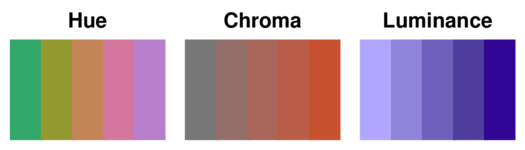
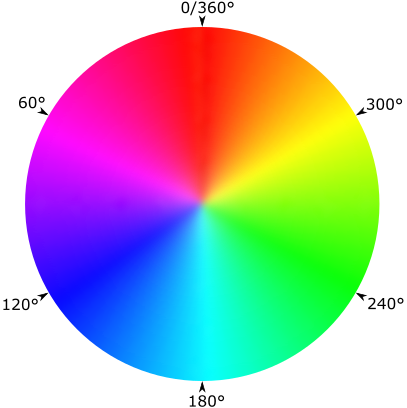
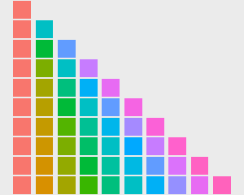
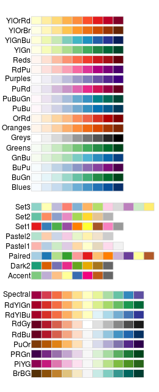

```{r setup, include=FALSE}
knitr::opts_chunk$set(echo = TRUE, warning =FALSE, message =FALSE)
```

```{r first, include=TRUE, purl=TRUE, message=FALSE}
require(dplyr)
require(ggplot2)
require(qdata)
data(bands)
```

You can change the appearance of mapped aesthetics by using scales.  
Scales control the mapping from data to aestethics. They take your data and turn into something that you can see like colour, shape, position or size. Scales provide also the tools that allow you to read the plot: legends and axes. 

In this chapter we will discuss how customize the appearance of mapped aesthetics by exploring scales functionalities. Legends and axes will not discussed here but in _Axes Customization_ and _Legend Customization_ chapters, respectively. 

But firstly, let us introduce some concepts about scales structure.

## Scales Structure

A scale is required for every aestethic used on a plot. 
For example, when you write:

```{r}
ggplot(data=bands, mapping=aes(x=humidity, y=viscosity)) +
  geom_point(mapping = aes(colour=band_type))
```

What actually happens is:

```{r}
ggplot(data=bands, mapping=aes(x=humidity, y=viscosity)) +
  geom_point(mapping = aes(colour=band_type)) +
  scale_x_continuous() +
  scale_y_continuous() +
  scale_color_discrete()
```

The previous two specifications are equal.

Default scales are named according to the aesthetic and the variable type. It would be tedious to manually add a scale every time a new aestethic is added, so `ggplot2` does it for you.

Each scale has default values for its argument, this means that if you want to modify one or more features of this scale you have to overwrite it/s default value. To overwrite its default value/s you have to manually add that scale.

For example, let us suppose that you want to reduce the luminance of the points colours in the plot. Colour aesthetic mapping is controlled by `scale_color_discrete()` and the argument of `scale_color_discrete()` that control the luminance is `l`. `l` can assume values from 0 to 100 and its default value is 65. We want to decrease the luminance and set it to 40 in this way:

```{r}
ggplot(data=bands, mapping=aes(x=humidity, y=viscosity)) +
  geom_point(mapping = aes(colour=band_type)) +
  scale_color_discrete(l = 45)
```

The use of `+` to "add" a scale is a little misleading. Remember that when you `+` a scale you are not adding it but ovverwriting it.

<!--
However, if you want to modify a feature linked to a scale you have to manually add the scale that you want to modify, oveeriding its default
-->

### Scales naming scheme and scales types

The name for scaling scheme is made up by three pieces separated by `_`:

1. `scale`
2. the name of the aestethic (e.g., `colour`, `shape`, ...)
3. the name of the scale (e.g., `continuous`, `discrete`, `brewer`, ...)


There are more scale types. They can be grouped into:

* Continuous position scales, used to map data into `x` and `y` position
* Mapped aestethics scales, like colour, linetype, shape and size.

In the following paragraphs we will answer to the most frequently asked questions about mapped aesthetics scales customization for: colours, linetype, shape and size. The use and the features of continuous position scales will be discussed in _Axes Customization_ chapter.


<!--

## Scales family

Scales can be divided roughtly in four families:

1. Continuous position scales, used to map data into `x` and `y` position
2. Colour scales, used to map continuous and discrete data to colours
3. Manual scales, used to map discrete variables to your choice of size, linetype, shape or colour
4. Identity scale, used to plot variables without scaling them

-->


## Customizing colours

Do you know something about colour theory? If the answer is no, you should read this paragraph.

At the physical level, colour is produced by a mixture of wavelenghts of lights. To characterise a colour completely we need to know the complete mixture of wavelenghts. Human eye has only three different colour receptors, so the perception of any colour can be summarised with just three numbers. 
You may be familiar with the RGB encoding of colour space, which defines a colour by the intensities of red, green and blue light needed to produce it.
One problem with this space is that it is not percentually uniform and this make it difficult to create a mapping from a continuous variable to a set of colours. 
There have been many attemps to come up with colours spaces that are more percentually uniform. 

We use a modern attemp called hcl colour space, which has three components of __h__ (hue), __c__ (chroma) and __l__ (luminance):

* hue is a number between 0 and 360 (an angle) which gives the "colour" of the colour: like blue, red, orange, etc. 
* chroma is the purity of a coloyr. A chroma of 0 is grey, and the maximum value of chroma varies with luminance
* luminance is the lightness of the colour. A luminance of 0 produces black, and a lumimance of 1 produces white

Hues are not perceived as being ordered, but chroma and luminance are ordered.   




<!--
nozioni generiche sui colori
-->

### Change the colors for a discrete mapped variable

Suppose we are interested in the relationship between `humidity` and `viscosity` by `press_type` in `bands` dataset:

```{r}
ggplot(data = bands, mapping = aes(x = humidity, y = viscosity, colour = press_type)) +
  geom_point()
```

You want to use different colour for `press_type` levels so you want to change the default palette. A palette is a range of colours; so changing a palette means to modify the `colour` (or `fill`) scale: it involves a change in the mapping from numeric or categorical values to aesthetic attributes.

There are two types of scales that use colors: fill scales and color scales.  
You can change the default colours used in the graph by choosing a function from the following table:   

Fill scale | Colour scale | Description                                                     
-----------|--------------|-------------------------------------------------------------
`scale_fill_discrete()` | `scale_colour_discrete()` | Colors evenly spaced around the color wheel (same as hue)
`scale_fill_hue()` | `scale_colour_hue()` | Colors evenly spaced around the color wheel (same as discrete)
`scale_fill_grey()` | `scale_colour_grey()` | Greyscale palette
`scale_fill_brewer()` | `scale_colour_grey()` | ColorBrewer palettes
`scale_fill_manual()` | `scale_colour_manual()` | Manually specified colors


By default, the colors for discrete scales are evenly spaced around a HSL color circle. 



For example, if there are two colors, then they will be selected from opposite points on the circle; if there are three colors, they will be 120° apart on the color circle; and so on. 
The default colors used for different numbers of levels are shown here:

  


The default color selection uses `scale_fill_hue()` and `scale_colour_hue()`:

```{r}
ggplot(data = bands, mapping = aes(x = humidity, y = viscosity, colour = press_type)) +
  geom_point() +
  scale_color_hue()
```

The previous two graph are equal and in the second graph definition `scale_color_hue()` is redundant.

With `scale_colour_hue()`, the colors are taken from around the color wheel in the HCL (hue-chroma-lightness) color space. 
In "Scales structure" we learn that the default lightness value is 65 on a scale from 0–100. This is good for filled areas, but it’s a bit light for points and lines. To make the colors darker for points and lines, set the value of `l` (luminance/ lightness):

```{r}
ggplot(data = bands, mapping = aes(x = humidity, y = viscosity, colour = press_type)) +
  geom_point() +
  scale_colour_hue(l=45)
```

You can also use other color scales, such as ones taken from the `RColorBrewer` package:




The `ColorBrewer` palettes can be selected by name:

```{r}
ggplot(data = bands, mapping = aes(x = humidity, y = viscosity, colour = press_type)) +
  geom_point() +
  scale_colour_brewer(palette="Set1")
```


You can also use a palette of greys. This is useful for print when the output is in black and white. 


```{r}
ggplot(data = bands, mapping = aes(x = humidity, y = viscosity, colour = press_type)) +
  geom_point() +
  scale_colour_grey()
```

The default is to start at 0.2 and end at 0.8, on a scale from 0 (black) to 1 (white), but you can change the range:

```{r}
ggplot(data = bands, mapping = aes(x = humidity, y = viscosity, colour = press_type)) +
  geom_point() +
  scale_colour_grey(start=0.7, end=0)
```

### Using a Manually Defined Palette for a Discrete Variable 

Colour can be also manually specified by using `scale_colour_manual()` function. The colors can be named, or they can be specified with RGB values:

```{r}
# named colours
ggplot(data = bands, mapping = aes(x = humidity, y = viscosity, colour = press_type)) +
  geom_point() +
  scale_colour_manual(values = c("magenta", "dark turquoise", "dodger blue", "lime green"))

# RGB colour code
ggplot(data = bands, mapping = aes(x = humidity, y = viscosity, colour = press_type)) +
  geom_point() +
  scale_colour_manual(values = c("#FF00FF", "#00CED1", "#1E90FF", "#32CD32"))
```

The order of the items in the values vector matches the order of the factor levels for the discrete scale. 

<!--
#bands %>% do(data.frame(levels(.$press_type)))
-->

```{r}
levels(bands$press_type)
```

In the preceding example, the order of `press_type` is "ALBERT70", then  "MOTTER70", then "MOTTER94" and "WOODHOE70", so the first in `values` argument goes with 
"ALBERT70", the second goes with "MOTTER70", the third with "MOTTER94" and the fourth with "WOODHOE70".
If the variable is a character vector, not a factor, it will automatically be converted to a factor, and by default the levels will appear in alphabetical order.

It’s possible to specify the colors in a different order by using a named vector:

```{r}
ggplot(data = bands, mapping = aes(x = humidity, y = viscosity, colour = press_type)) +
  geom_point() +
  scale_colour_manual(values = c(ALBERT70 = "lime green", MOTTER70 = "dark turquoise", MOTTER94 = "magenta", WOODHOE70 = "dodger blue"))
```

There is a large set of named colors in R, which you can see by running `colors()`. Some basic color names are useful: `"white"`, `"black"`, `"grey80"`, `"red"`,
`"blue"`, `"darkred"`, and so on. There are many other named colors, but their names are generally not very informative, for example `"thistle3"` and `"seashell"`, 
so it is often easier to use numeric RGB values for specifying colors.  
RGB colors are specified as six-digit hexadecimal (base-16) numbers of the form
`"#RRGGBB"`. In hexadecimal, the digits go from 0 to 9, and then continue with A (10 in base 10) to F (15 in base 10). Each color is represented by two digits 
and can range from 00 to FF (255 in base 10). So, for example, the color `"#FF0099"` has a value of 255 for red, 0 for green, and 153 for blue, resulting in a shade of magenta. The hexadecimal numbers for each color channel often repeat the same digit because it makes them a little easier to read, and because the precise value of 
the second digit has a relatively insignificant effect on appearance.

Here are some rules of thumb for specifying and adjusting RGB colors:

* higher numbers are brighter and lower numbers are darker
* to get a shade of grey, set all the channels to the same value

<!--
* the opposites of RGB are CMY: Cyan, Magenta, and Yellow. Higher values for the red channel make it more red, and lower values make it more cyan. The same is
true for the pairs green and magenta, and blue and yellow.
-->


### Using a Manually Defined Palette for a Continuous Variable

You want to use different colors for a continuous variable.

Mapping continuous values to a color scale requires a continuously changing palette of colors.   
The following table lists the continuous color and fill scales:

Fill scale | Colour scale | Description                               
-----------|--------------|-------------------------------------------
`scale_fill_gradient()`  | `scale_colour_gradient()`  | Two-color gradient 
`scale_fill_gradient2()` | `scale_colour_gradient2()` | Gradient with a middle color and two colors that diverge from it
`scale_fill_gradientn()` | `scale_colour_gradientn()` | Gradient with n colors, equally spaced


Supposing we are interested in the relationship between `humidity`, `viscosity` and `solvent_pct` in `bands` dataset:   

```{r}
ggplot(data = bands, mapping = aes(x = humidity, y = viscosity, colour = solvent_pct)) +
  geom_point()
```

Let us see how the previous fuctions work. 
We will specify the colours for a continuous variable using various gradient scales. 
The colors can be named, or they can be specified with RGB values:

```{r}
# scale_colour_gradient()
ggplot(data = bands, mapping = aes(x = humidity, y = viscosity, colour = solvent_pct)) +
  geom_point() + 
  scale_colour_gradient(low="black", high="white")
```

```{r}
# scale_colour_gradient2()
ggplot(data = bands, mapping = aes(x = humidity, y = viscosity, colour = solvent_pct)) +
  geom_point() + 
  scale_colour_gradient2(low="red", mid="white", high="blue")
```

<!--
midpoint? Non lo capisco
-->

<!--
less satured colours 

```{r}
require(scales)
ggplot(data = bands, mapping = aes(x = humidity, y = viscosity, colour = solvent_pct)) +
  geom_point() + scale_colour_gradient2(low=muted("red"), mid="white", high=muted("blue"))

```

-->

```{r}
# scale_colour_gradientn()
ggplot(data = bands, mapping = aes(x = humidity, y = viscosity, colour = solvent_pct)) +
  geom_point() + 
  scale_colour_gradientn(colours = c("darkred", "orange", "yellow", "white"))
```


You can also use palettes produced by another package:
```{r}
ggplot(data = bands, mapping = aes(x = humidity, y = viscosity, colour = solvent_pct)) +
  geom_point() + 
  scale_colour_gradientn(colours = terrain.colors(n=8))
```

In this case we use `terrain.colors` palette with 8 colours. `terrain.colors` is a palette of `grDevices` package.

<!--
si potrebbero fare gli esempi con le superfici, oppure fare fill prima.
-->

## Customizing linetype

R provides the following line types:

```{r plot_linetypes, echo=FALSE, fig=TRUE, purl=FALSE}
par(mar=rep(0,4))
# Make an empty chart
plot(1, 1, xlim = c(0.5, 5.5), ylim=c(0.5, 7.5), type = "n", axes = FALSE, ann = FALSE, frame.plot = TRUE, mar=0)
# Default values
x0 = 0.5 # Text x coordinate
xs = 1.8 # Line start point
xe = 5.2 # Line end point
cex0 = 1 # Default text size (cex)
pos0 = 4 # Default text position (pos): right
lwd0 = 2 # Default line width (lwd)
# Line 0
text(x = x0, y = 7, labels = '0. "blank"', cex = cex0, pos = pos0)
lines(x = c(xs, xe), y = c(7, 7), lty = 0, lwd = lwd0)
# Line 1
text(x = x0, y = 6, labels = '1. "solid"', cex = cex0, pos = pos0)
lines(x = c(xs, xe), y = c(6, 6), lty = 1, lwd = lwd0)
# Line 2
text(x = x0, y = 5, labels = '2. "dashed"', cex = cex0, pos = pos0)
lines(x = c(xs, xe), y = c(5, 5), lty = 2, lwd = lwd0)
# Line 3
text(x = x0, y = 4, labels = '3. "dotted"', cex = cex0, pos = pos0)
lines(x = c(xs, xe), y = c(4, 4), lty = 3, lwd = lwd0)
# Line 4
text(x = x0, y = 3, labels = '4. "dotdash"', cex = cex0, pos = pos0)
lines(x = c(xs, xe), y = c(3, 3), lty = 4, lwd = lwd0)
# Line 5
text(x = x0, y = 2, labels = '5. "longdash"', cex = cex0, pos = pos0)
lines(x = c(xs, xe), y = c(2, 2), lty = 5, lwd = lwd0)
# Line 6
text(x = x0, y = 1, labels = '6. "twodash"', cex = cex0, pos = pos0)
lines(x = c(xs, xe), y = c(1, 1), lty = 6, lwd = lwd0)
```

`linetype` aesthetic has to be mapped to discrete variables.

### Changing line types 

Let us consider the average growth of chicks for the different diets by using `ChickWeights` dataset, as seen in _Creating a Line Plot_:

```{r}
# data
ChickWeightMean <- ChickWeight %>% 
  group_by(Time, Diet) %>% 
  summarize(weight=mean(weight)) %>%
  mutate(Diet = factor(Diet, levels=1:4, labels=c("A","B","C","D")))
```

We want to se the difference in the average growth of chicks for the different diets, by mapping `Diet` variable to `linetype` aestethics:   

```{r}
ggplot(data=ChickWeightMean, mapping=aes(x=Time, y=weight)) +
  geom_line(mapping=aes(linetype=Diet)) 
```

To change linetypes we have to set `values` argument of `scale_linetype_manual()` function:

```{r}
ggplot(data=ChickWeightMean, mapping=aes(x=Time, y=weight)) +
  geom_line(mapping=aes(linetype=Diet)) +  
  scale_linetype_manual(values=c(3,4,5,6))
```

Line type values can be passed as numbers or strings.

## Customizing Shape

R provides the following shapes symbols:

```{r plot_shape, echo=FALSE, fig=TRUE, purl=FALSE}
 par(mar=rep(0,4))
 # Make an empty chart
 plot(1, 1, xlim = c(1, 5.5), ylim=c(0.5, 9.5), type = "n", axes = FALSE, ann = FALSE, frame.plot = TRUE, mar=0)
 # Plot symbols 0-4 with increasing size
 points(1:5, rep(9, 5), cex = 2, pch = 0:4, col="red", bg="green")
 text((1:5) + 0.4, rep(9, 5), cex = 1, (0:4))
 # Plot symbols 5-9 with labels
 points(1:5, rep(7, 5), cex = 2, pch = (5:9), col="red", bg="green")
 text((1:5) + 0.4, rep(7, 5), cex = 1, (5:9))
 # Plot symbols 10-14 with labels
 points(1:5, rep(5, 5), cex = 2, pch = (10:14), col="red", bg="green")
 text((1:5) + 0.4, rep(5, 5), cex = 1, (10:14))
 # Plot symbols 15-19 with labels
 points(1:6 * 0.8 + 0.2, rep(3, 6), cex = 2, pch = (15:20), col="red", bg="green")
 text((1:6) * 0.8 + 0.6, rep(3, 6), cex = 1, (15:20))
 # Plot symbols 20-25 with labels
 points((1:5), rep(1, 5), cex = 2, pch = (21:25), col="red", bg="green")
 text((1:5) + 0.4, rep(1, 5), cex = 1, (21:25))
```

`shape` aesthetic has to be mapped to discrete variables.

### Changing shape types

If you want to customize shape scale you have to set `values` argument of `scale_shape_manual()` function:

```{r}
ggplot(data=bands, mapping=aes(x=humidity, y=viscosity, shape=press_type)) +
  geom_point() +
  scale_shape_manual(values = c(12, 13, 8, 3))
```


## Customizing Size

The size aesthetic is most commonly used for points and text, and humans perceive the area of points (not their radius), so this provides for optimal perception. `size` can be mapped only to continuous variables.

### Change the size of plotting symbols

```{r}
ggplot(data=bands, mapping=aes(x=humidity, y=viscosity, size=ink_pct)) +
  geom_point()
```

When a variable is mapped to size, the results can be perceptually misleading. If it is important for the sizes to proportionally represent the quantities, you can change the range of sizes. By default the sizes of points go from 1 to 6 mm. You could reduce the range to, say, 2 to 4 mm, with `scale_size_continuous(range=c(2, 4))`.

If you want to customize the minimum and the maximum size of the plotting symbol you have :

```{r}
ggplot(data=bands, mapping=aes(x=humidity, y=viscosity, size=ink_pct)) +
  geom_point() +
  scale_size(range=c(2, 4))
```

So you have to set the to `range` argument the minimum and the maximum size of the plotting symbol.

However, the point size numbers don’t map linearly to diameter or area, so this still won’t give a very accurate representation of the values.

If you want that a value of zero is always mapped to size 0, use `scale_size_area()` instead of `scale_size()`:  

```{r}
ggplot(data=bands, mapping=aes(x=humidity, y=viscosity, size=ink_pct)) +
  geom_point() +
  scale_size_area()
```

However with `scale_size_area()` you can not control the size of plotting symbols by using `range` argument. You can set only the size of largest points by setting `max_size` argument:

```{r}
ggplot(data=bands, mapping=aes(x=humidity, y=viscosity, size=ink_pct)) +
  geom_point() +
  scale_size_area(max_size = 3)
```

You can also use radiuos to control the size of plotting symbols by setting `scale_radius()` function:

```{r}
ggplot(data=bands, mapping=aes(x=humidity, y=viscosity, size=ink_pct)) +
  geom_point() +
  scale_radius()
```

This choice is always not recommended.
