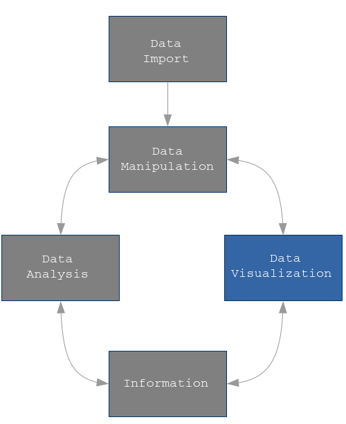

 

Data Visualization is the art of communicate information about data in a clearly and efficiently way in order to help users analyze and reason about data and evidence.

This course offers the most advanced R features for data visualization. In particular, it explores `ggplot2()` package, developed by _Hadley Wickam_ and _Winston Chang_.