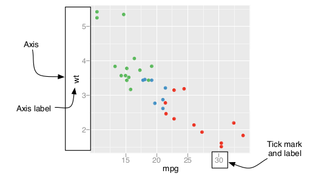

```{r options, include=FALSE, purl=FALSE}
knitr::opts_chunk$set(echo = TRUE, warning =FALSE, message = FALSE, fig.pos = 'H', fig.width = 4, fig.height = 3)
options(width = 108)
```

<!--
# Axes Customization
-->

```{r first, include=TRUE, purl=TRUE, message=FALSE}
require(ggplot2)
require(qdata)
require(scales)
data(bands)
data(brainbod)
```

Gli assi sono più importanti di quanto uno può pensare poichè forniscono il contesto dove vengono rappresentati e interpretati i dati. `ggplot2` ha dei defaults per gli assi che si adattano bene nella maggior parte dei casi. In certi casi, può risultare necessario controllare, ad esempio, la scala, le labels degli assi, il numero, la posizione e i labels dei tick marks, e così via.

<!--
Axes are more important than one thinks as they provide context for interpreting the displayed data. `ggplot2` displays the axes with defaults that look good in most cases, but you might want to control, for example, the axis scales, the axis labels, the number and placement of tick marks, the tick mark labels and so on. 
-->



`ggplot2` permette di personalizzare l'aspetto degli assi utilizzando tre importanti componenti della sua gramamtica:

* le scale (`scales`), che controllano il processo di mappatura dai dati agli attributi estetici 
* le coordinate (`coordinates`), che descrivono come le coordinate dei dati siano mappate sullo spazio del grafico
* i temi (`themes`), che controllano gli tutti gli elementi del grafico non legati ai dati

Nei paragrafi seguenti vedremo come risolvere i problemi più comuni in merito alla personalizzazione degli assi.

<!--
`ggplot2` allows one to handle with the appearance of the axes by using three important elements of its grammar: 

* `scales`, which controls the mapping from data to aestethics attributes 
* `coordinates`, which describes how data coordinates are mapped to the plane of the graphic
* `themes`, which controls the non-data elements of the plot 

In the following paragraphs we will see how to handle with the most common questions about axes customization. 
-->

## Scambiare gli assi x e y

Scambiare x e y è semplice se si parla di scatterplot dato che `geom_point()` tratta `x` e `y` allo stesso modo. Infatti se si vuole cambiare ciò che va sull'asse verticale e ciò che va su quello orizzontale basta scambiare le variabili mappate sulle estetiche `x` e `y`. Tuttavia, non è così semplice quando si parla di Box Plot poichè questo tipo di grafico fa un summary dei dati lungo l'asse delle y, oppure quando si parla di Line Plot, che traccia le linee in una sola direzione lungo l'asse delle x. Per scambiare gli assi di questi o di altri geom, che non trattano gli assi delle x e delle y allo stesso modo, è necessario utilizzare la funzione `coord_flip()`, come visto nel capitolo _Creare un Bar Plot_.

Vediamo un esempio.
Consideriamo il dataset `bands`. Supponiamo di essere interessati a studiare le differenze nella distribuzione della variabile `ink_pct` per ogni livello della variabile `press_type`. Possiamo studiare la cosa, costruendo quattro Box Plot per confrontare le distribuzioni.

<!--
## Swapping x and y axis

Swapping x and y axis is simple if you are generating a scatterplot. If you want to change what goes on the vertical axis and what goes on the horizontal axis you just have to exchange the variables mapped to `x` and `y` aesthetics, as `geom_point()` treats the x- and y-axes equally. However, the same cannot be said for Box Plot which summarize the data along the y-axis or for Line Plots, which move the lines in only one direction along the x-axis. To swap the axis of these and more others geoms which not treats the x- and y-axes equally, you have to use `coord_flip()` function as we learn in _Creating a Bar Plot_ chapter.

Let us see an example.   
Consider `bands` dataset. Supposing you are interested in the differences of ink percentage accordingly to the type of press, you can build four box plots to compare distributions.
-->

```{r pl_1}
pl_1 <- ggplot(data=bands, aes(x=press_type, y=ink_pct)) + 
  geom_boxplot(fill="#74a9cf", colour="#034e7b")
pl_1
```

Scambiando gli assi, il risultato è:

<!--
Swapping the axes the result is:
-->

```{r pl_1_swapped_axes}
pl_1 + 
  coord_flip()
```


## cambaire l'ordine degli assi

Consideriamo un asse categoriale (o discreto) con un fattore mappato su di esso.
Spesso, quando gli assi sono scambiati, come nell'esempio precedente, l'ordine degli items sarà l'opposto di quello che ci si aspetta. In un grafico con assi x e y standard, infatti, gli items sull'asse delle x partono da sinistra e finiscono a destra, il che corrisponde al modo standard di leggere, da sinistra a destra. Quando si scambiano gli assi, la disposizione degli items parte ancora dall'origine, quindi significa cha va letta dal basso verso l'alto, il che va contro il classico modo di leggere gli assi. Spesso ciò costituisce un problema, quindi è necessario capovolgere l'ordine degli items nell'asse.     

Tale risultato può essere raggiunto impostando l'argomento `limits` della funzione `scale_x_discrete()` a `rev(levels(...))`, in questo modo:

<!--
## Change axis order

Let us consider a categorical (or discrete) axis with a factor mapped to it.

Sometimes when the axes are swapped, as in the previous example, the order of items will be the reverse of what you want.  
On a graph with standard x- and y-axes, the x items start at the left and go to the right, which corresponds to the normal way of reading, from left to right. When you swap the axes, the items still go from the origin outward, which in this case will be from bottom to top but this conflicts with the normal way of reading, from top to bottom. Sometimes this can be a problem, so it is necessary to reverse the axis order. 

This can be done by using `scale_x_discrete()` with `limits` argument set as `rev(levels(...))` in this way:
-->
```{r pl_1_reverse_discrete_axis_order}
pl_1 + 
  coord_flip() + 
  scale_x_discrete(limits=rev(levels(bands$press_type)))
```

In generale, per cambiare manualmente l'ordine degli item in un asse categoriale (o discreto) nei quai è mappato un fattore, è necessario specificare l'argomento `limits` delle funzioni `scale_x_discrete()` o `scale_y_discrete()` con un vettore contenente i livelli del fattore nell'ordine desiderato: 

<!--
In general, to manually change the order of items in a categorical (or discrete) axis with a factor mapped to it, you have to specify `limits` argument in `scale_x_discrete()` or `scale_y_discrete()` functions with a vector of the levels in the desired order:
-->

```{r pl_1_change_discrete_axis_order}
pl_1 + 
  coord_flip() + 
  scale_x_discrete(limits=c("MOTTER70","WOODHOE70","ALBERT70", "MOTTER94"))
```

E' possibile anche omettere degli items nel grafico, specificando solo quelli che sid esiderano rappresentare:

<!--
You can also omit items with this vector, specifying only the items you want to keep:
-->

```{r pl_1_remove_discrete_axis_level}
pl_1 + 
  coord_flip() + 
  scale_x_discrete(limits=c("MOTTER70","WOODHOE70"))
```

Dal grafico si può vedere come ci sia dello spazio vuoto al posto dei livelli omessi di `press_type` ("ALBERT70", "MOTTER94"). Molto probabilemnte si tratta di un bug della versione 2.1.0 di `ggplot2`, utilizzata per realizare questo libro.

_Nota_: i cambiamenti nell'ordine degli items negli assi funzionano anche senza l'impostazione della funzione `coord_flip()`.

<!--
There is empty space instead of not displayed `press_type` levels ("ALBERT70", "MOTTER94"). Maybe it is a bug of 2.1.0 version of `ggplot2`, used to realize this manual.

_Note:_ the changes on axis order works also without `coord_flip()` function.
-->

## Impostare il range di un asse continuo

`ggplot2` calcola automaticamente i limiti per gli assi dal range dei dati. Ma spesso abbiamo bisogno di personalizzare tali limiti, rimpicciolendoli per focalizzarci su un'area interessante del grafico o ampliandoli per confrontarli ad altei grafici.
`ggplot2` fornisce due modi per impostare il range degli assi. Il primo modo consiste nel modificare la scala del grafico, mentre il secondo nel tarsformare le coordinate. Il primo modo è quello più utilizzato, vediamolo nel dettaglio.

Per modificare i limiti negli assi delle x o delle y, possiamo utilizzare la funzione `scale_y_continuous()` e/o `scale_x_continuous()`, impostando l'argomento `limits` uguale ad un vettore di due elementi, il minimo e il massimo.  

<!--
## Setting the Range of a Continuous Axis

`ggplot2` computes the limits of an axes from the range of the data. But sometimes you could be interested in making the limits smaller that the range of the data to focus on an interesting area of the plot or to make the limits larger because you want multiple plots to match up.  
`ggplot2` provides two ways of setting the range of the axes. The first way is to modify the scale, and the second is to apply a coordinate transformation. The first way is the most used. Let us analyze it.

To change the limits in x and/or y axes you could use `scale_y_continuous()` and/or `scale_x_continuous()`, setting the `limits` argument. `limits` argument has to be set equal to a vector of lenght two:   
-->

```{r pl_1_change_continuous_axis_limits_1}
pl_1 + 
  scale_y_continuous(limits=c(0, max(bands$ink_pct)))
```

Dato che la modificazione dei limiti è una funzionalità molto utilizzata, `ggplot2` fornisce tre shorthand: `ylim()`, `xlim()` e `lims()`.

I due blocchi di codice seguenti producono gli stessi risultati prodotti dall'esempio precedente:

<!--
Because modifying limits is such a common task, `ggplot2` provides three shorthand: `ylim()`, `xlim()` and `lims()`.

The following two code lines produce equal results than the previous example:
-->
```{r pl_1_change_continuous_axis_limits_2, eval = FALSE}
pl_1 + 
  ylim(0, max(bands$ink_pct))

pl_1 + 
  lims(y = c(0, max(bands$ink_pct)))
```

Se si desidera impostare solamente un limite, l'altro deve essere espresso come `NA`. `ggplot2` calcola automaticamente i limiti non impostati dal range dei dati:

<!--
If you want to set only one limit, the other has to be set equal to `NA`. `ggplot2` computes automatically the not setted limit from the range of data:
-->
```{r pl_1_change_continuous_axis_limits_3}
pl_1 + 
  ylim(limits=c(NA, 100))
```

Spesso utilizzando entrambe le funzioni `ylim()` e `scale_y_continuous()` per impostare anche altre caratteristiche dell'asse si possono creare problemi (lo stesso vale per `scale_x_continuous()` e `xlim`), perchè solamente l'ultima delle impostazioni avrà effetto sul grafico. Nei prossimi due esempi, `ylim(0, 100)` dovrebbe fissare il range dell'asse delle y da 0 a 100, e `scale_y_continuous(breaks=c(0, 50, 100))` dovrebbe mettere i tick marks a 0, 50 e 100. Tuttavia, in entrambi i casi, solamente la seconda impostazione ha effetto:

<!--
Sometimes using `ylim()` and `scale_y_continuous()` to set other properties can create problems (the same goes for `scale_x_continuous()` and `xlim`), because only the last of the directives will have an effect. In the following two examples, `ylim(0, 100)` should set the y range from 0 to 100, and `scale_y_continuous(breaks=c(0, 50, 100))` should put tick marks at 0, 50, and 100. However, in both cases, only the second directive has any effect:
-->

```{r pl_1_limits_setting_conflict}
pl_1 + 
  ylim(0, 100) + 
  scale_y_continuous(breaks=c(0, 50, 100))
pl_1 + 
  scale_y_continuous(breaks=c(0, 50, 100)) + 
  ylim(0, 100)
```

Per far funzionare entrambe le impostazioni, vi suggeriamo di impostare sia i limiti che i breaks nella funzione `scale_y_continuous()`:

<!--
To make both changes work, we suggest you to set both limits and breaks in `scale_y_continuous()`:
-->

```{r pl_1_limits_setting_conflict_solve}
pl_1 + 
  scale_y_continuous(limits=c(0, 100), breaks=c(0, 50, 100))
```

Abbiamo visto come modificare le scale sia un'ottima soluzione per cambaire il range degli assi. Tuttavia, quando si modificano le scale degli assi per cambiare i limiti, ogni dato fuori dai limiti impostati viene rimosso, quindi non solo non viene mostrato, ma non verrà proprio più considerato. Considerando i Box Plot rappresentati in questi esempi, una volta ridotto il range degli assi, le statistiche del Box Plot saranno calcolate sui dati troncati e la forma del Box Plot cambierà. 
Applicando invece, una trasformazione alle coordinate del grafico per cam biare i limiti, i dati non vengono troncati; nella pratica, viene fatto uno zoom dentro o fuori al range specificato. 

Vediamo le differenze tra questi due metodi:

<!--
We saw that modifying the scale for changing axes limits works well. However, when you modify the limits of the x or y scale, any data outside of the limits is removed that is, the out-of-range data is not only not displayed, it is removed from consideration entirely.   
With the Box Plots in these examples, if you restrict the y range so that some of the original data is clipped, the box plot statistics will be computed based on clipped data, and the shape of the box plots will change.  
With a coordinate transformation for changing limits, the data is not clipped; in essence, it zooms in or out to the specified range.   
Let us see the difference between these two methods:
-->
```{r pl_1_limits_setting_coord}
# scale transformation method
pl_1 + 
  scale_y_continuous(limits = c(50, 60))
# coordinate transformation method
pl_1 + 
  coord_cartesian(ylim = c(50, 60))
```

## Reverse a continuous axis order

To reverse a continuous axes the function to use are: `scale_y_reverse()` or `scale_x_reverse()`:

```{r pl_1_reverse_continuous_axis_order_1}
pl_1 + 
  scale_y_reverse()
```

You can use also `ylim()` in this way:

```{r pl_1_reverse_continuous_axis_order_2}
pl_1 + 
  ylim(70, 34)
```

Like `scale_y_continuous()`, `scale_y_reverse()` does not work with `ylim()`. (The same is true for the x-axis properties.) If you want to reverse an axis and set its range, you must do it within the `scale_y_reverse()` statement, by setting the limits in reversed order:

```{r pl_1_reverse_continuous_axis_order_3}
pl_1 + 
  scale_y_reverse(limits=c(100, 0))
```

## Resize axis scale

Suppose you are interested in the relationship between ink and solvent percentage in `bands` dataset:

```{r pl_2}
pl_2 <- ggplot(data = bands, mapping = aes(y=ink_pct, x=solvent_pct)) +
  geom_point()
```

If you want the same scale for your axes, you have to use `coord_equal()` function.

```{r pl_2_same_scale}
pl_2  +
  coord_equal()
```

By default `ratio` argument is set to 1, which ensures that one unit on the x-axis is the same length as one unit on the y-axis.

You can change it as you want to resize the scales:

```{r pl_2_resize_scale}
pl_2  +
  coord_equal(ratio=1/2)
```

Ratio is expressed as  `y / x`, so in the previous example, two unit on the x-axis correspond to one unit on the y-axis.

You can use also `coord_fixed()` to achieve the same results.

## Axis scale transformations

`brainbod` dataset contains information about the weight of body and brain of different species of animals. We wants to visualize the relationship between body weight and brain weight of 15 animals species: 

```{r pl_3}
pl_3 <- ggplot(brainbod, aes(x=Body, y=Brain, label=Species)) +
geom_text(size=3)
pl_3
```

With the default linearly scaled axes, it’s hard to make much sense of this graph. Because of the presence of elephant, the rest of the animals get squished into the lower-left corner of the graph. This is a case where the data is distributed exponentially on both axes, so a logarithmic transformations is the best solution. `scale_x_log10()` and `scale_y_log10()` functions are continuous position scales which transform x and y axis scales respectively.

```{r pl_3_log_scale_1}
pl_3 + 
  scale_x_log10() + 
  scale_y_log10()
```

Now the plot results are intrepretable, we clearly see a linear relationship between brain weight and body weight of the analyzed animal species.  

The previous example used a $log_{10}$ transformation, but it is possible to use other transformations, such as $log_{2}$ and natural log. `scale_x_log10()` (and similarly for y) is a shortcut as it is one of the most common trasformations. A wide variety of transformations can be applied to scales of continuous axes, by setting `trans` argument of `scale_x_continuous()` and/or `scale_y_continuous()`. 

Let us apply natural logarithmic transformation to x axis and $log_{2}$ transformation to y axis:

```{r pl_3_log_scale_2}
pl_3 + 
  scale_x_continuous(trans = log_trans()) +
  scale_y_continuous(trans = log2_trans())
```

## Modifying axis appearance: tick labels, tick marks, and the grid lines

There are actually three related items that can be controlled: tick labels, tick marks, and the grid lines. For continuous axes, `ggplot()` normally places a tick label, tick mark, and major grid line at each value of breaks. For categorical axes, these things go at each value of limits.

### Change Tick marks position

Usually `ggplot()` does a good job of deciding where to put the tick marks, but if you want to change them, set breaks in the scale in this way:

```{r pl_1_change_tick_marks_position_continuous}
pl_1 + 
  scale_y_continuous(breaks=c(41, 45, 51, 55, 60, 71, 77))
```

The location of the tick marks defines where major grid lines are drawn. If the axis represents a continuous variable, minor grid lines, which are fainter and unlabeled, will by default be drawn halfway between each major grid line. If the axis is discrete instead of continuous, then there is by default a tick mark for each item.  


For discrete axes, you can change the order of items or remove them by specifying the limits as learn in _Change axis order_
 paragraph. Setting breaks will change which of the levels are labeled, but will not remove them or change their order.

```{r, pl_1_change_tick_marks_position_discrete}
pl_1 + 
  scale_x_discrete(limits=c("MOTTER70","WOODHOE70", "MOTTER94", "ALBERT70"), 
                   breaks="WOODHOE70")
```

### Removing Tick Marks and Labels

The theme function for the removal of both tick marks and labels is `element_blank()`.

`axis.text.x`, `axis.text.y` and `axis.text` arguments of `theme()` function controls the text of x, y or both axis ticks.

To remove just the tick labels of both axes use `theme(axis.text = element_blank())`, and to remove the tick labels of y axes use `theme(axis.text.y = element_blank())` (or do the same for `axis.text.x`). This will work for both continuous and categorical axes:

```{r pl_1_remove_tick_labels}
pl_1 + 
  theme(axis.text.y = element_blank())
pl_1 + 
  theme(axis.text = element_blank())
```

`axis.ticks.x`, `axis.ticks.y` and `axis.ticks` controls the marks of x, y or both axis ticks.

To remove the tick marks on both axes, use `theme(axis.ticks=element_blank())`, and to remove the tick marks of y axes use `theme(axis.ticks.y=element_blank())`. This will remove the tick marks.

```{r pl_1_remove_tick_marks_labels_1}
pl_1 + 
  theme(axis.ticks.y = element_blank(), axis.text.y = element_blank())
pl_1 + 
  theme(axis.ticks = element_blank(), axis.text = element_blank())
```

To remove the tick marks, the labels, and the grid lines for continuous axis, set `breaks` to `NULL` in `scale_y_continuous` (the same for `scale_x_continuous`).

```{r pl_1_remove_tick_marks_labels_2}
pl_1 + 
  scale_y_continuous(breaks=NULL)
```

### Changing the Text of Tick Labels

Let us consider the scatterplot showing the relationship between ink and solvent percentage in cylinder banding process in rotogravure printing, stored in `pl_2` object:

```{r pl_2_show}
pl_2
```

To change the text of ticks marks in continuous axes, set `breaks` and `labels` in `scale_y_continuous` function:

```{r pl_2_change_tick_labels_text}
pl_2 +  
  scale_y_continuous(breaks=c(40, 50, 60, 70), 
                     labels=c("Less", "Medium-\nLess", "Medium-\nHigh", "High"))
```

Pay attention to `"\n"` character, which tells `ggplot()` to put a line break.


Let us consider the example described in _Axis scale transformations_ paragraph, which analyze the relationship between body  and brain weight of 15 species of animals, stored in `pl_3` object:   

```{r pl_3_show}
pl_3
```

We applied a logarithmic transformation to the axis: 
```{r pl_3_log_scale_show}
pl_3 +
  scale_x_log10()+
  scale_y_log10()
```

With a log axis, a given visual distance represents a constant proportional change; for example, each centimeter on the y-axis might represent a multiplication of the quantity by 10. In contrast, with a linear axis, a given visual distance represents a constant quantity change; each centimeter might represent adding 10 to the quantity.

`ggplot2 ` will try to make good decisions about where to place the tick marks, but if you don’t like them, you can change them by specifying breaks and, optionally, labels . In the example here, the automatically generated tick marks are spaced farther apart than is ideal. For the y-axis tick marks, we can get a vector of every power of 10 from $10^{0}$ to
$10^{3}$ like this:

`10^(0:3)`

```{r pl_3_change_tick_labels_text}
pl_3 + 
  scale_x_log10(breaks=10^(-1:5)) + 
  scale_y_log10(breaks=10^(0:3))
```

To instead use exponential notation for the break labels, use the `trans_format()` function, from the `scales` package:.

Supposing `scales` is already installed, it must be loaded:

```{r load_scales, eval=FALSE}
require(scales)
```

```{r pl_3_change_tick_labels_text_math_format_1}
pl_3 + 
  scale_x_log10(breaks=10^(-1:5), labels=trans_format("log10", math_format(10^.x))) +
  scale_y_log10(breaks=10^(0:3), labels=trans_format("log10", math_format(10^.x)))
```

`trans_format()` function set a format to labels after a transformation. The transformation is "log10" and the format is specified by the function `math_format()` (of `scales` package), which define the arbitrary expression to use for the label.


Talking about the plot in which scales have been transformed by natural log and $log_{2}$:

```{r pl_3_transformed_scales}
pl_3 + 
  scale_x_continuous(trans = log_trans()) +
  scale_y_continuous(trans = log2_trans())
```

The labels can be modified in this way:

```{r pl_3_change_tick_labels_text_math_format_2}
pl_3 + 
  scale_x_continuous(trans = log_trans(), breaks = trans_breaks("log", function(x) exp(x)),
    labels = trans_format("log", math_format(e^.x))) + 
  scale_y_continuous(trans = log2_trans(), breaks = trans_breaks("log2", function(x) 2^x),
    labels = trans_format("log2", math_format(2^.x)))
```

`trans_breaks()` function of `scales` package define the breaks according to the transformation applied.

Let us go back to boxplot showing the distribution of `ink_pct` by `press_type` in `bands` dataset.   
To change the text of ticks marks in discrete axes, set the `labels` argument in `scale_x_discrete()` function.

```{r pl_1_change_tick_labels_text_discrete}
pl_1 + 
  scale_x_discrete(labels=c("Albert70", "Motter70", "Motter94", "Woodhoe70"))
```


### Changing the Appearance of Tick Labels

Text properties like rotation, size, style (bold/italic/normal), and the font family (such as Times or Helvetica) can be set with `element_text()` theme function: 

```{r pl_1_change_tick_labels_appearance_1}
# To rotate the text 90 degrees counterclockwise
pl_1 + 
  theme(axis.text.x = element_text(angle=90, hjust=1, vjust=0.5))
# Rotating the text 30 degrees
pl_1 + 
  theme(axis.text.x = element_text(angle=30, hjust=1, vjust=1))
```

The `angle` setting specifies the text rotation and the `hjust` and `vjust` settings specify the horizontal alignment (left/center/right) and vertical alignment (top/middle/bottom).

```{r pl_1_change_tick_labels_appearance_2}
pl_1 + 
  theme(axis.text.x = element_text(family="Times", face="bold", colour="darkgreen", size=rel(0.8)))
```

The `family` setting specifies the font family, `face` the font face, `colour` the text colour and `size` the text size.
In this example, the size is set to `rel(0.8)`, which means that it is 0.8 times the size of the base font size for the theme.

### Changing the Appearance of Tick marks

The appearance of tick marks can be changed by `element_line()` theme function.

```{r pl_1_change_tick_marks_appearance}
pl_1 + 
  theme(axis.ticks.x = element_line(colour="green", size=4), axis.ticks.y=element_line(colour="red"))
```

In particular, `colour` setting specifies the line colour and `size` the line size.

<!--
aggiungere esempio sul log?
-->

### Changing the Text of Axis Labels

By default the graphs will just use the column names from the data frame as axis labels. This might be fine for exploring data, but for presenting it, you may want more descriptive axis labels.

`ggplot2` provides these three equivalent ways to change the axis labels:

```{r pl_1_change_axis_labels, eval=FALSE}
pl_1 + 
  xlab("Pressure type") + 
  ylab("Ink percentage")
pl_1 + 
  labs(x = "Pressure type", y = "Ink percentage")
pl_1 + 
  scale_y_continuous(name="Ink percentage") + 
  scale_x_discrete(name="Pressure type")
```

Which produces the same results:

```{r, echo=FALSE, purl=FALSE}
pl_1 + 
  labs(x = "Pressure type", y = "Ink percentage")
```

Using `scale_y_continuous()` may look a bit awkward, but it can be useful if you’re also setting other properties of the scale, such as the tick mark placement, range, and so on.

### Removing Axis Labels

Sometimes axis labels are redundant or obvious from the context, and don’t need to be displayed.

You can set x label to an empty string:
```{r pl_1_remove_axis_labels_1}
pl_1 + 
  xlab("")
```

or you can use `theme()` function to set `axis.title.x=element_blank()`:
```{r pl_1_remove_axis_labels_2}
pl_1 + 
  theme(axis.title.x=element_blank())
```

The difference between the two ways is that `theme()` function doesn't change axis name. The text is not displayed and no space is reserved for it. When you set the label to "" in `xlab()` function, the name of the scale is changed and the (empty) text is displayed.

### Changing the appearance of axis labels

`axis.title.x`, `axis.title.y` and `axis.title` arguments of `theme()` function controls the label of x, y or both axis.

The reference function is `element_text()` and works at the same way as we saw in _Changing the Appearance of Tick Labels_ paragraph.

```{r pl_1_change_axis_labels_appearance}
pl_1 + 
  theme(axis.title.y=element_text(angle=0, face="italic", size=14, colour = "green"))
```

## Using Dates on an Axis

`ggplot2` handles two kinds of time-related objects: dates (objects of class Date ) and date-times (objects of class POSIXt). The difference between these is that Date objects represent dates and have a resolution of one day, while POSIXt objects represent moments in time and have a resolution of a fraction of a second.  
Specifying the breaks is similar to with a numeric axis, the main difference is in specifying the sequence of dates to use.  
We use a subset of the `economics` data, provided in `ggplot2` package which ranges from may 1992 to june 1993. 

```{r economics_sample}
econ <- subset(economics, date >= as.Date("1992-05-01") & date < as.Date("1993-06-01"))
```

Suppose we want to generate the time series plot of personal savings rate:

```{r pl_4}
pl_4 <- ggplot(econ, aes(x=date, y=psavert)) + 
  geom_line(colour = "orangered")
pl_4
```

`scale_x_date()` function handle with date scales, the argument `date_breaks` specifies the distance between breaks.

```{r pl_4_change_axis_labels_1}
# Use breaks, and rotate text labels
pl_4 + 
  scale_x_date(date_breaks= "2 month") + 
  theme(axis.text.x = element_text(angle=30, hjust=1))
```

Notice that the formatting of the breaks changed. You can specify the formatting by using the `date_format()` function from the `scales` package as `label` value: 

```{r pl_4_change_axis_labels_2}
pl_4 + 
  scale_x_date(date_breaks= "2 month", labels=date_format("%Y %b")) +
  theme(axis.text.x = element_text(angle=30, hjust=1))
```

The format specified is `"%Y %b"`, which results like `"1992 Jun"`.

The format specified is to be put in a string that is passed to `date_format()`, and the format specifiers will be replaced with the appropriate values. For example, if you use `"%B %d, %Y"`, it will result in labels like `"June 01, 1992"`.

The following table lists the most important date-time format:


Option    | Description 
--------- | ------------------------------------------------------------------------------------- 
%Y        |  Year with century (2012)
%y        |  Year without century (12)
%m        |  Month as a decimal number (08)
%b        |  Abbreviated month name in current locale (Aug)
%B        |  Full month name in current locale (August)
%d        |  Day of month as a decimal number (04)
%U        |  Week of the year as a decimal number, with Sunday as the first day of the week (00–53)
%W        |  Week of the year as a decimal number, with Monday as the first day of the week (00–53)
%w        |  Day of week (0–6, Sunday is 0)
%a        |  Abbreviated weekday name (Thu)
%A        |  Full weekday name (Thursday)


