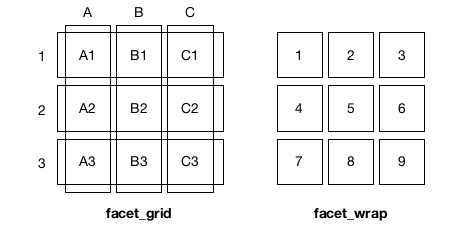

```{r options, include=FALSE, purl=FALSE}
knitr::opts_chunk$set(echo = TRUE, warning =FALSE, message = FALSE, fig.pos = 'H', fig.width = 4, fig.height = 3)
options(width = 108)
```

<!--
# Facets Customization
-->

```{r first, message=FALSE}
require(ggplot2)
require(dplyr)
require(qdata)
data(bands)
```

Faceting is one of the most useful techniques in data visualization for rendering groups of data alongside each other,  and making it easy to compare them. In particular, faceting is a mechanism for automatically laying out multiple plots in a page, splitting the data into subsets and then plots each subset in a different panel. It is an alternative to the use of aesthetics (like colour, shape or size) to differentiate groups and it is the right choice when groups overlap a lot. 

In `ggplot2` there are three functions for faceting:

* `facet_null()`, which is the default and produces a single plot
* `facet_grid()`, which produces a 2d grid of panels defined by variables which form the rows and columns
* `facet_wrap()`, which "wraps" a 1d ribbon of panels into 2d

We mentioned faceting in _Creating a Histogram_ chapter. In the following paragraphs we will examine in depth how to handle with the most common questions on faceting customization.

## Splitting data into subplots

Let us review the basic use of `facet_grid()` and `facet_wrap()` faceting functions. Both functions plot subsets of data in separate panels. The difference between them is schematized in the following figure:



Suppose you are interested in analysing the distribution of `ink_pct` by categorical variables like `press_type` or `band_type` in `bands` dataset:

```{r pl}
# ink_pct by presss_type
ggplot(data=bands, mapping=aes(x=ink_pct, fill=press_type)) +
  geom_histogram() 
```

The previous plot is difficult to interpret. It is better to split data in four different histograms by using faceting.

With `facet_grid()`, you can use faceting with one or two variables. A variable to split the data into vertical subpanels and another variable to split it into horizontal subpanels are specified in formula style: `rows ~ columns`. If you want to specify only one dimension (either row or column), you have to indicate with a dot the dimension for which there should be no faceting.

In particular:

* `. ~ press_type`: spreads the values of `press_type` across the columns. The direction facilitates the comparison of y position because the vertical scales are aligned:

    ```{r pl_facet_grid_horizontal}
# base plot
pl <- ggplot(data=bands, mapping=aes(x=ink_pct)) +
  geom_histogram(fill="#2B4C6F")    
    
# Faceted by press_type, in horizontally arranged subpanels
pl + 
  facet_grid(. ~ press_type)
    ```

* `band_type ~ .` spreads the values of `band_type` down the rows. The direction facilitates comparison of x position because the horizontal scales are aligned. It is particularly useful for comparing distributions: 

    ```{r pl_facet_grid_vertical}
# Faceted by press_type, in vertically arranged subpanels
pl + 
  facet_grid(band_type ~ .)
    ```

* `band_type ~ press_type` spreads `press_type` across the columns and `band_type` down the rows. Usually we put the variable with the greatest number of levels in the columns, to take advantage of the aspect ratio of the screen:  

    ```{r pl_facet_grid_horizontal_vertical}
# Faceted by press_type and band_type
pl + 
  facet_grid(band_type ~ press_type)
    ```

With `facet_wrap()`, you can use faceting only with one variable. The subplots are laid out horizontally and wrap around:

```{r pl_facet_wrap}
pl + 
  facet_wrap(~ press_type)
```

`facet_wrap()` is useful if you have a single variable with many levels and you want to arrange the plots in a more space efficient manner.

The choice of faceting direction depends on the kind of comparison you would like to encourage. For example, if you want to compare heights of bars, it's useful to make the facets go horizontally. If, on the other hand, you want to compare the horizontal distribution of histograms, it makes sense to make the facets go vertically. Sometimes both kinds of comparisons are important, there may not be a clear answer as to which faceting direction is best. It may turn out that displaying the groups in a single plot by mapping the grouping variable to an aesthetic like color works better than using facets. In these situations, you'll have to rely on your judgment.

## Multiple combinations

You can add multiple variables in the rows or columns, by "adding" them together in this way:

```{r pl_multiple_combinations_facet_grid, fig.height=8, fig.width=8}
# by usign facet_grid()
pl + 
  facet_grid(band_type + ink_type ~ press_type)
```

Variables appearing together on the rows or on columns are nested in the sense that only combinations that appear in the data will appear in the plot. Variables which are specified on rows and columns will be crossed: all combinations will be shown, inclusing that those doesn't appear in the original dataset: this may result in empty panels.

Multiple combinations are possible also by using `facet_wrap()`:

```{r pl_multiple_combinations_facet_wrap, fig.height=9, fig.width=9}
# by using facet_wrap()
pl + 
  facet_wrap(~ band_type + ink_type + press_type)
```

Also with `facet_wrap()` only combinations of variables that appear in the data will appear in the plot. 

## Change the order of plot in faceting

With `facet_wrap()`, the default is to use the same number of rows and columns. To change this, you can pass a value for `nrow` or `ncol` arguments:

```{r pl_change_plot_order_1}
pl + 
  facet_wrap(~ press_type, nrow = 1)
pl + 
  facet_wrap(~ press_type, ncol = 1)
```

Moreover, the default wrapping direction is horizontal, but you can change it by setting `dir` argument:

```{r pl_change_plot_order_2}
pl + 
  facet_wrap(~ press_type, dir = "v")
```


## Using facets with different axes

If you want subplots with different ranges or items on their axes, set `scales` argument. It is available for both `facet_wrap()` and `facet_grid()`.    
It can be set as:

* `"fixed"`: default, x and y scales are fixed across all panels 
* `"free_x"`: x scale is free and y scale is fixed
* `"free_y"`: y scale is free and x scale is fixed
* `"free"`: x and y scales vary across panels

Let us see how `scales` argument works with `facet_grid()`:

```{r pl_change_axis_scales_1}
# free x scale
pl + 
  facet_grid(band_type ~ press_type, scales = "free_x")
# free y scale
pl + 
  facet_grid(band_type ~ press_type, scales = "free_y")
# free x and y scales
pl + 
  facet_grid(band_type ~ press_type, scales = "free")
```

It's not possible to directly set the range of each row or column, but you can control the ranges by dropping unwanted data (to reduce the ranges), or by adding `geom_blank()` (to expand the ranges).


Let us see how `scales` argument works with `facet_wrap()`:

```{r pl_change_axis_scales_2}
# free x scale
pl + 
  facet_wrap( ~ press_type, scales = "free_x")
# free y scale
pl + 
  facet_wrap( ~ press_type, scales = "free_y")
# free x and y scales
pl + 
  facet_wrap( ~ press_type, scales = "free")
```

As you can see from the previous examples, fixed scales make it easier to see pattern across panels and free scales make it easier to see patterns within panels.


## Controlling the space of each panel

The reserved space for each panel (width) is fixed by default but it can vary according to the range of scale for that column (or row), setting `space` argument of `facet_grid()` to `"free"`:

```{r pl_change_axis_space, fig.height=7.5, fig.width=7.5}
pl + 
  facet_grid(press_type ~ ., space  = "free", scales = "free")
```

Remember that also `scales` argument must be set to `"free"`. 

In this way, the scales are equal across the plot: 1 cm on each panel maps to the same range of data. 

## Faceting with continuous variables

Until now, we have seen how faceting categorical variables, but it is possible to facet also continuous variables, once discretised.  
`ggplot2` provides three helper functions to discretise continuous variables:

* `cut_interval(x,n)`, which divides the data into `n` bins of the same length (equal range)
* `cut_width(x, width)`, which divides the data into bins of width `width`
* `cut_number(x, n)`, which divides data into `n` bins each containing (approximately) the same number of observations

Let us consider the relationship between humidity and viscosity in `bands` dataset:

```{r faceting_with_continuous_vars_1}
# Make a copy of the original data
bands2 <- bands
pl1 <- ggplot(data = bands2, mapping = aes(x = humidity, y = viscosity)) +
  geom_point()
pl1
```


We want to verify the influence of pressure in this relationship. Firstly let us discretize `press`:

```{r faceting_with_continuous_vars_2}
bands2 <- bands2 %>% mutate(
  # 4 interval with "equal" range
  press_i = cut_interval(x = press, n = 4),
  # intervals of width 10
  press_w = cut_width(x = press, width = 10),
  # 5 intervals with the "same" number of points
  press_n = cut_number(x = press, n = 5)
)
```

```{r faceting_with_continuous_vars_3}
# 4 interval with "equal" range
ggplot(data = bands2, mapping = aes(x = humidity, y = viscosity)) +
  geom_point() + 
  facet_wrap(~ press_i)
# intervals of width 10
ggplot(data = bands2, mapping = aes(x = humidity, y = viscosity)) +
  geom_point() + 
  facet_wrap(~ press_w)
# 5 intervals with the "same" number of points
ggplot(data = bands2, mapping = aes(x = humidity, y = viscosity)) +
  geom_point() + 
  facet_wrap(~ press_n)
```

## Changing the text of facets labels

Unlike with scales where you can set the labels, to set facet labels you must change the data values.

```{r change_facets_text_1}
# Make a copy of the original data
bands3 <- bands

# Rename "BAND" to "Band", "NOBAND" to "No Band"
levels(bands3$press_type)[levels(bands3$press_type)=="ALBERT70"] <- "Albert 70"
levels(bands3$press_type)[levels(bands3$press_type)=="MOTTER70"] <- "Motter 70"
levels(bands3$press_type)[levels(bands3$press_type)=="MOTTER94"] <- "Motter 94"
levels(bands3$press_type)[levels(bands3$press_type)=="WOODHOE70"] <- "Woodhoe 70"
```

```{r change_facets_text_2}
ggplot(data=bands3, mapping=aes(x=ink_pct)) +
  geom_histogram(fill="#2B4C6F") +
  facet_grid(. ~ press_type)
```

The appearance of the labels can be controlled also setting a function to `labeller` argument of `facet_grid()` or `facet_wrap()`.

The most important labeller functions are:

* `label_value`, the default

    ```{r change_facets_text_3}
pl + 
  facet_grid(band_type ~ press_type, labeller = label_value)
    ```

* `label_both`, which prints out both the name of the variable and the value of the variable in each facet

    ```{r change_facets_text_4, fig.width=7.5}
pl + 
  facet_grid(band_type ~ press_type, labeller = label_both)
    ```

Now instead of the facet labels at the top being `"ALBERT70"`, `"MOTTER70"`, `"MOTTER94"` and `"WOODHOE70"`they are `"press_type: ALBERT70"`, `"press_type:  MOTTER70"`, `"press_type:  MOTTER94"` and `"press_type:  WOODHOE70"`. Similarly, the vertical labels are `"band_type: BAND"`, `"band_type:  NOBAND"`. There is not a way to set the labels for the horizontal and vertical separately.

* `label_parsed`, which takes strings and treats them as R math expressions 

    ```{r change_facets_text_5}
# modify the dataset
bands4 <- bands
levels(bands4$press_type)[levels(bands4$press_type)=="ALBERT70"] <- "alpha"
levels(bands4$press_type)[levels(bands4$press_type)=="MOTTER70"] <- "sum(x[i], i==1, n)"
levels(bands4$press_type)[levels(bands4$press_type)=="MOTTER94"] <- "sqrt(x)"
levels(bands4$press_type)[levels(bands4$press_type)=="WOODHOE70"] <- "pi"

ggplot(data=bands4, mapping=aes(x=ink_pct)) +
  geom_histogram(fill="#2B4C6F")  + 
  facet_grid(. ~ press_type, labeller = label_parsed)
    ```

It is also possible to write labeller functions and pass them to `labeller` argument.

The following is an example of a labeller which wraps long labels at a fixed character count so that they take up less space. This can be useful since the space for facets is not expanded to guarantee that the entire label is visible.

```{r change_facets_text_6}
label_wrap <- function(variable, value) {
  lapply(strwrap(as.character(value), width=25, simplify=FALSE), 
        paste, collapse="\n")
}  
```

The structure of a labeller is a function that takes two arguments: `variable` and `value`. `variable` is a length 1 character vector with the name of the variable which is being faceted on. `value` is the ordered (not necessarily unique) values of the facets.

```{r change_facets_text_7}
# modify the dataset
bands5 <- bands
levels(bands5$press_type)[levels(bands5$press_type)=="ALBERT70"] <- "The pressure 
type for these obs is ALBERT70"
levels(bands5$press_type)[levels(bands5$press_type)=="MOTTER70"] <- "The pressure 
type for these obs is MOTTER70"
levels(bands5$press_type)[levels(bands5$press_type)=="MOTTER94"] <- "The pressure 
type for these obs is MOTTER94"
levels(bands5$press_type)[levels(bands5$press_type)=="WOODHOE70"] <- "The pressure
type for these obs is WOODHOE70"

ggplot(data=bands5, mapping=aes(x=ink_pct)) +
  geom_histogram(fill="#2B4C6F") + 
  facet_grid(. ~ press_type, labeller = label_wrap)
```


## Changing the appearance of facet labels and headers 

If you want to change the appearance of facet labels (like size, style and the font family), and headers (like colour, border colour and size), you have to use the theming system, setting `strip.text` argument, which control the text appearance, equal to `element_text()` function and `strip.background` argument, which control the background appearance, equal to `element_rect()` function:

```{r pl_change_facets_appearance_1}
pl + 
  facet_grid(. ~ press_type) + 
  theme(strip.text = element_text(face="bold",family = "Times", size=rel(1.2)), 
        strip.background = element_rect(fill="lightblue", colour="black", size=1))
```

Using `rel(1.2)` makes the label text 1.2 times the size of the base text size for the theme and using `size=1` for the background makes the outline of the facets 1 mm thick.


## Modify the margin between panels

If you want to modify the margin between panels you have to set `panel.margin` argument of `theme()` function by using `unit()` function in this way:  

```{r pl_change_facets_appearance_2}
pl + 
  facet_grid(band_type ~ press_type) + 
  theme(panel.margin = unit(2, "cm"))
```

`unit()` is a function that creates a unit object of the correct length to use for setting margins. You have to specify the margin length and its units (of measure).

It works both for `facet_grid()` and `facet_wrap()`.


