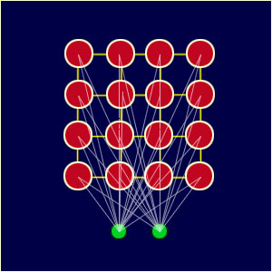

```{r options, include=FALSE, purl=FALSE}
source("../input/options.R")
#source("options.R")
```

```{r first, include=FALSE, purl=TRUE, message=FALSE}
# This code chunk contains R code already described in the previous chapters
# that is required by following examples

## Datasets from packages
require(qdata)
data(wines)

## Other datasets used
# none

######################################
## packages needed: kohonen, GGally ##
######################################
```


# Introduction

SOMs (sometimes also called Kohonen maps) have their root in artificial
neural networks. Its primary use is in reducing high-dimensional data to a
lower-dimensional nonlinear manifold, usually two or three dimensions, and
in displaying graphically the results of such data reduction. More
specifically, the aim of a SOM is to map the projected data to discrete
interconnected nodes, where each node represents a grouping or cluster of
relatively homogeneous points.

SOMs can be compared to multi-dimensional scaling, but instead of
trying to reproduce distances between the items, they aim at reproducing
topology, that is, they try to keep the same neighbors. Rather than mapping
objects in a continuous space, SOMs use a regular grid of "nodes" onto which
objects are mapped. The outcome of a SOM is a graphical representation (the
so-called SOM plot) that consists of a grid of interconnected nodes (also
called neurons). In two dimensions, the nodes are arranged as a square,
rectangular, or hexagonal grid. As a consequence, while in an MDS plot a
distance can be directly interpreted as an "estimate" of the true distance,
in a SOM plot this is not the case: one can only say that objects mapped to
the same, or neighboring, nodes are very similar.

There are basically two versions of the algorithm: an "on-line" version,
where the items are presented sequentially to the algorithm (typically in
random order), and a "batch" version, in which the data are fed into the
algorithm all at once. In the following we will focus only on the former
version.

Every node in a SOM may correspond to a "cluster", and the number of clusters
is defined by the size of the grid, which typically is arranged in a
rectangular or hexagonal fashion. The algorithm starts by assigning a so-called
"codebook vector" to every node, that will play the role of a typical
pattern, i.e., a prototype, associated with that node. Usually, one randomly
assigns a subset of the data to the nodes. During training, objects are
repeatedly presented (in random order) to the map. The "winning node", i.e.,
the one most similar to the current training object, will be updated to
become even more similar. In the updating, a weighted average is used, where
the weight of the new object, the so-called "learning rate", is one of the
training parameters of the SOM. Typically the learning rate is a small value
in the order of 0.05. During training, this value decreases so that the map
converges. SOMs include a spatial constraint, in the sense that they require
neighboring nodes in network to have similar codebook vectors. This is achieved by not
only updating the winning node, but also the nodes in the immediate
neighborhood of SOM lattice of the winning node, in the same way. The size of the
neighborhood decreases during training as well, so that eventually only the
winning nodes are adapted. The algorithm terminates after a pre-defined
number of iterations.

Different functions are available in `R` to get a SOM, but the most common ones
are available in the `kohonen` and `som` packages. We focus here on the first one
because it provides a more complete suite of commands for visualizing the
results. The main function in that package is `som()`.  
As an example we consider the `wines` data (see the section *Introduction and datasets used* for further information). This dataset contains information on a set of 177 Italian wine samples from three different grape cultivators; thirteen variables have been measured:

```{r message=FALSE}
require(kohonen)
```

```{r 02f-loadwi, fig.height=plot_with_legend_fig_width_big, fig.width=plot_with_legend_fig_width_big}
str(wines)
summary(wines)
pairs(wines[,-c(14,15)], pch = ".", cex.labels = .6)
```

or:

```{r message=FALSE}
require(GGally)
```

```{r 02f-ggpairs, fig.height=plot_with_legend_fig_width_big, fig.width=plot_with_legend_fig_width_big, message=FALSE}
ggpairs(data = wines[,-15])
```

There is a fourteenth variable (wine.classes), which provides the grapes
type used for each wine sample (either Nebbiolo, Barbera or Grignolino). This
is not used in the mapping, but it will be used later for visualization
purposes.

After scaling the variables because of the widely different ranges
(especially the proline concentration variable), we train a five-by-four
hexagonally oriented nodes SOM:

```{r 02f-somandplotwi}
wines.sc <- scale(wines[,-c(14,15)])
set.seed(7)
wines.som <- som(data = wines.sc, grid = somgrid(5, 4, "hexagonal"))
summary(wines.som)
plot(wines.som, main = "Wines data", palette.name = rainbow)
```

The code vector can alternatively be represented using lines instead of
segments:

```{r 02f-plotlineswi}
plot(wines.som, main = "Wines data", palette.name = rainbow,
     codeRendering = "lines")
```

The codebook vectors are visualized in a segments plot, which is the default
plotting type. High alcohol levels, for example, are associated with wine
samples projected in the bottom right corner of the map, while color
intensity is largest in the bottom left corner.

By changing the 'type' argument of the plot function we can visualize further
information about the map. For example, to visualize the number of objects
assigned to every node, we can use 'type = "counts"':

```{r 02f-plotcountwi}
plot(wines.som, type = "counts", main = "Wines data (# objects in each node)")
```

The node (i.e. cluster) membership is returned by the 'unit.classif' element
of the returned object:

```{r 02f-tablewi}
table(wines.som$unit.classif)
```

The counts are reasonably spread out over the map and none of the nodes is
empty.

Using the 'type = "quality"' argument we can get a plot showing the mean
distance of objects, mapped to a particular node, to the codebook vector of
that node. A good mapping should show small distances everywhere in the map:

```{r 02f-plotqualitywi}
plot(wines.som, type = "quality",
     main = "Wines data (mean distance from node codebook vector)")
```

Some other visualization are available through the 'type' argument, such as:

- "changes" ==> shows the mean distance to the closest codebook vector during
   		  training; this is useful to assess the convergence of the
				  algorithm;
- "dist.neighbours" ==> shows the sum of the distances to all immediate
						  neighbors. This visualization is also known as a
						  U-matrix plot: a small value in a U-matrix indicates
						  that the SOM nodes are close together in input space,
						  whereas a large value indicates that the SOM nodes,
						  even though they are neighbors in output space, are
						  quite far apart in input space;
- "mapping" ==> shows where objects are mapped; it needs the "classif"
				  argument, and a "labels" or "pchs" argument;
- "property" ==> properties of each unit can be calculated and shown in
				   color code. It can be used to visualize the similarity of
				   one particular object to all units in the map, to show the
				   mean similarity of all units and the objects mapped to
				   them, etc. The argument 'property' contains the numerical
				   values.

These plots for the wines data are obtained with the following code:

```{r 02f-plotmanywi}
plot(wines.som, type = "changes", main = "Wines data (changes plot)")
plot(wines.som, type = "dist.neighbours", main = "Wines data (U-matrix)")
plot(wines.som, type = "mapping", labels = wines$wine.classes,
     col = wines$wine.classes + 1, main = "Wines data (mapping plot)")
op <- par(mfrow = c(4, 4))
for (i in 1:ncol(wines[,-c(14,15)])) {
  plot(wines.som, type = "property", property = wines.som$codes[, i],
       main = colnames(wines.som$codes)[i], palette.name = terrain.colors,
       heatkeywidth = .5)
}
par(op)
```

The function add.cluster.boundaries() adds to an existing plot of a map thick
lines visualizing which units would be clustered together:

```{r 02f-clusterwi}
plot(wines.som, type = "mapping", labels = wines$wine.classes,
     col = wines$wine.classes + 1, main = "Wines data (mapping plot)")
# use hierarchical clustering to cluster the codebook vectors
wines.hc <- cutree(hclust(dist(wines.som$codes), method = "complete"), 3)
add.cluster.boundaries(wines.som, wines.hc)
```

(note that the nodes in the SOM are numbered starting from the bottom left and
proceeding by row).

Now let's try the same data analysis but using a larger network:

```{r 02f-clusterwi1}
set.seed(7)
wines.som <- som(data = wines.sc, grid = somgrid(10, 8, "hexagonal"))
summary(wines.som)
plot(wines.som, main = "Wines data", palette.name = rainbow)
```

The code vector can alternatively be represented using lines instead of segments:

```{r 02f-clusterwi2}
plot(wines.som, main = "Wines data", palette.name = rainbow,
     codeRendering = "lines")
```

```{r 02f-clusterwi3}
plot(wines.som, type = "counts", main = "Wines data (# objects in each node)")
```

The node (i.e. cluster) membership is returned by the 'unit.classif' element of the returned object:

```{r 02f-clusterwi4}
table(wines.som$unit.classif)
```

The counts are reasonably spread out over the map and some nodes are empty.  

Using the 'type = "quality"' argument we can get a plot showing the mean
distance of objects, mapped to a particular node, to the codebook vector of
that node. A good mapping should show small distances everywhere in the map:

```{r 02f-clusterwi5}
plot(wines.som, type = "quality",
     main = "Wines data (mean distance from node codebook vector)")
```

Other visualization are available through the 'type' argument:

```{r 02f-clusterwi6}
plot(wines.som, type = "changes", main = "Wines data (changes plot)")
plot(wines.som, type = "dist.neighbours", main = "Wines data (U-matrix)")
plot(wines.som, type = "mapping", labels = wines$wine.classes,
     col = wines$wine.classes + 1, main = "Wines data (mapping plot)")
op <- par(mfrow = c(4, 4))
for (i in 1:ncol(wines[,-c(14,15)])) {
  plot(wines.som, type = "property", property = wines.som$codes[, i],
       main = colnames(wines.som$codes)[i], palette.name = terrain.colors,
       heatkeywidth = .5)
}
par(op)
```

The function `add.cluster.boundaries()` adds to an existing plot of a map thick
lines visualizing which units would be clustered together: (let us use hierarchical clustering to cluster the codebook vectors)

```{r 02f-clusterwi7}
plot(wines.som, type = "mapping", labels = wines$wine.classes,
     col = wines$wine.classes + 1, main = "Wines data (mapping plot)")
wines.hc <- cutree(hclust(dist(wines.som$codes), method = "complete"), 3)
add.cluster.boundaries(wines.som, wines.hc)
```

```{r 02f-clusterwi8}
set.seed(7)
iris.som <- som(data = as.matrix(iris[,1:4]), grid = somgrid(10, 8, "hexagonal"))
summary(iris.som)
plot(iris.som, main = "Iris data", palette.name = rainbow)
plot(iris.som, type = "dist.neighbours", main = "iris data (U-matrix)")
plot(iris.som, type = "mapping", labels = as.numeric(as.factor(iris[,5])),
     col = as.numeric(as.factor(iris[,5])), main = "Iris data (mapping plot)")
```


# Some Overview on SOM Algorithm
<!--- http://www.ai-junkie.com/ann/som/som1.html 
http://en.wikipedia.org/wiki/Self-organizing_map
--->
The goal of learning in the self-organizing map is to cause different parts of the network to respond similarly to certain input patterns. This is partly motivated by how visual, auditory or other sensory information is handled in separate parts of the cerebral cortex in the human brain.

The structure of a Kohonen network (at the basis of SOMs) is made by a "lattice" of nodes, each of them is connected to the input layer:



In above figure, the red circles are the network units, while the green circles are the input units.

Given the following quantities (vectors are underlined):

- $s$: the current iteration
- $\lambda$: the iteration limit
- $t$: the index of the target input data vector in the input dataset $\underline{D}$
- $\underline{D}(t)$: a target input data vector (element)
- $v$: the index of the node in the map
- $\underline{W}_v$: the current weight vector of node $v$
- $u$: the index of the best matching unit (BMU) in the map
- $\Theta(u, v, s)$: a restraint due to distance from BMU, usually called the neighborhood function, and
- $\alpha (s)$: a learning restraint due to iteration progress.

The algorithm follows these steps:

1. Randomize the map's nodes' weight vectors
2. Traverse each input vector in the input dataset
    1. Traverse each node in the map
        1. Use the Euclidean distance formula to find the similarity between the input vector and the map's node's weight vector
        2. Track the node that produces the smallest distance (this node is the best matching unit, BMU)
    2. Update the nodes in the neighborhood of the BMU (including the BMU itself) by pulling them closer to the input vector
        1. $\underline{W}_v(s + 1) = \underline{W}_v(s) + \Theta(u, v, s) \alpha(s)(\underline{D}(t) - \underline{W}_v(s))$
3. Increase s and repeat from step 2 while $s < \lambda$
