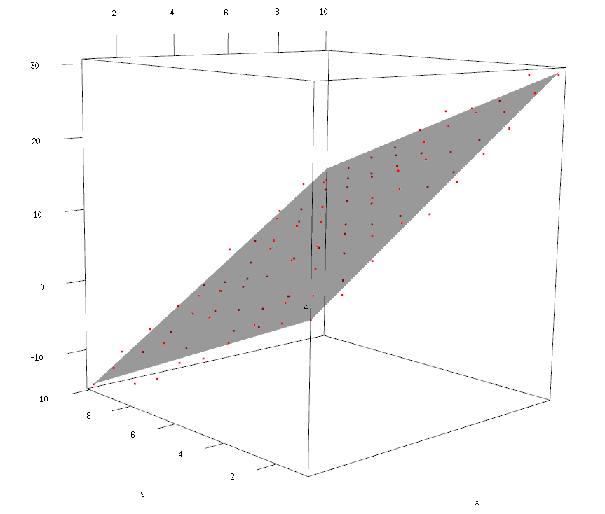
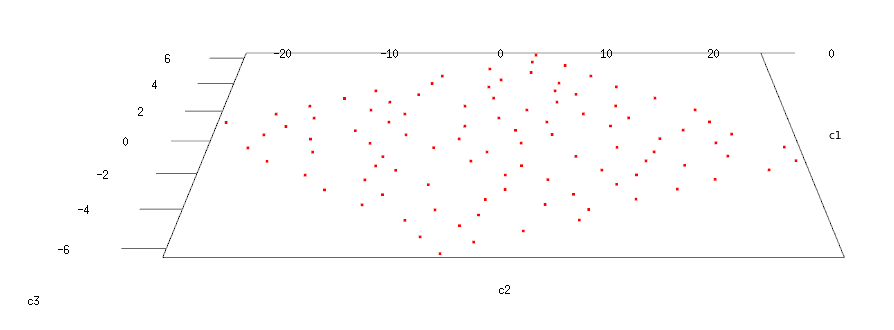

```{r options, include=FALSE, purl=FALSE}
source("options.R")
```

```{r first, include=FALSE, purl=TRUE, message=FALSE}
# This code chunk contains R code already described in the previous chapters
# that is required by following examples

## Datasets from packages
require(qdata)
data(wwiileaders, mds, life)
data(bread, package = "smacof")
data(skulls, package = "HSAUR2")

## Other datasets used
# none

################################################################################
## packages needed: GGally, ggplot2, MCMCpack, reshape2, MASS, smacof, HSAUR2 ##
################################################################################
```


# Introduction

Multidimensional Scaling (MDS) is a set of techniques for projecting points from a highly-dimensional
space onto a smaller space, usually involving just 2 or 3 dimensions, with
the aim of matching the distances between points in the reduced space as
well as possible with those in the original space. The inputs for MDS are
"proximity data", that is the observed similarities or dissimilarities among
all pairs of observations. The proximity matrix is usually displayed as a
lower-triangular array of nonnegative entries, with the understanding that
the diagonal entries are all zeros and that the upper-triangular array is a
mirror image of the given lower-triangle (i.e., the matrix is symmetric).

The general problem of MDS essentially can be stated as follows: given only a
table of proximities between objects (i.e., either observations or
variables), we wish to reconstruct the original map as closely as possible.
A further wrinkle in the problem is that we also do not know the number of
dimensions in which the given entities are located. So, determining the
number of dimensions is another major problem to be solved.

In its basic flavor, MDS is mainly used for visualization purposes for
identifying "clusters" of points, but many variants have been developed to
deal with more specific objectives such as uncovering latent dimensions of
judgment.


# Metric MDS

The `R` function that implements the so-called classical (or metric) MDS is
`cmdscale()`.

## Example: `mds` Fake Data

As a first example, we consider the `mds` fake dataset (see the section *Introduction and datasets used* for further information):

```{r 02a-loadfk}
mds
pairs(x = mds, pch = rownames(mds))
```

or:

```{r require_GGally, message=FALSE}
require(GGally)
```

```{r 02a-alternative_pairs}
ggpairs(data = mds)
```

We create the proximity matrix by calculating the corresponding Euclidean
distances via the `dist()` function (other distance measures available through
the `method` argument are `"maximum"`, `"manhattan"`, `"canberra"`, `"binary"` or
`"minkowski"`; see the help page of the `dist()` function for more details).

```{r 02a-distancefk}
D <- dist(mds, method = "euclidean")
```

Then we apply classical scaling to this matrix using the `cmdscale()`
function and saving also the corresponding eigenvalues:

```{r 02a-cmdscalefk}
X_mds <- cmdscale(D, k = 9, eig = TRUE)
```

Some notes:

1. when dissimilarities are defined as Euclidean inter-point distances,
       this type of classical MDS is equivalent to PCA (see the chapter on PCA and EFA) in that the MDS
       coordinates are identical to the scores of the corresponding principal
       components;
2. if any of the eigenvalues are negative, a suitable constant can be
       added to the dissimilarities, or the negative eigenvalues can be simply
       ignored.

One way of determining the dimensionality of the resulting configuration is
to look at the eigenvalues. The usual strategy is to plot the ordered eigenvalues against dimension and then identify a dimension at which the eigenvalues become "stable" (i.e., do not change perceptively). At that dimension,
we may observe an "elbow" that shows where stability occurs. For easier
graphical interpretation of a classical scaling solution, we hope that the
dimension at we reach stability is small, usually of the order 2 or 3. The
plot of the eigenvalues for our example is obtained as

```{r require_ggplot2, message=FALSE}
require(ggplot2)
```

```{r 02a-screefk}
eig <- X_mds$eig
dims <- 1:attr(D, "Size")
eig <- data.frame(Dimensions = dims, Eigenvalue = eig)
ggp <- ggplot(eig, aes(x = Dimensions, y = Eigenvalue)) +
  geom_point() +
  geom_line() +
  scale_x_continuous("Dimensions", breaks = dims) +
  geom_hline(yintercept = 0, linetype = "dashed")
print(ggp)
```

Note that as there are 5 variables in the `mds` data frame, eigenvalues 6 to 7
are essentially zero and only the first five columns of points represent the
Euclidean distances. First, the five-dimensional solution achieves complete
recovery of the observed distances. We can check this by comparing the
original distances with those calculated from the five-dimensional scaling
solution coordinates using the following code:

```{r 02a-coordsfk_alternative_plot}
ggp <- ggplot(data = data.frame(x = as.numeric(D), y = as.numeric(dist(cmdscale(D, k = 5)))),
            mapping = aes(x = x, y = y)) +
  geom_point() +
  geom_abline(intercept = 0, slope = 1) +
  xlab("Original distances") +
  ylab("Fitted distances")
print(ggp)
max(abs(dist(mds) - dist(cmdscale(D, k = 5))))
```

We can also compute some fitting criteria. The most popular ones are those
introduced by Mardia:

```{r 02a-fittingfk, fig.width=plot_with_legend_fig_width_short}
X_eig <- X_mds$eig
P1 <- cumsum(abs(X_eig))/sum(abs(X_eig))
P2 <- cumsum(X_eig^2)/sum(X_eig^2)

mardia <- data.frame(Dimensions = rep(dims,2), P = c(P1, P2), 
                     Criterion=rep(c("P1", "P2"),each=attr(D, "Size")))
ggp <- ggplot(data = mardia, aes(x = Dimensions, y = P, colour=Criterion)) +
  geom_point() +
  geom_line() +
  scale_x_continuous("Dimensions", breaks = dims) +
  scale_y_continuous("Value", breaks = seq(0, 1, by = .1)) +
  geom_hline(yintercept = .8, linetype = "dashed", color = "darkgray")
print(ggp)

```

We should look for values above 0.8 to claim a good fit. In our example both
criteria suggest that a 3-dimensional solution seems to fit well. This is
confirmed by the following plot that compares the observed distances with
those returned by the solution with 3 dimensions:

```{r 02a-fittingfinalfk}
X_final <- X_mds$points[, 1:3]
D_hat <- dist(X_final, method = "euclidean")
D_all <- data.frame(Observed = as.numeric(D), Fitted = as.numeric(D_hat))
ggplot(data = D_all, mapping = aes(x = Observed, y = Fitted)) +
  geom_point() +
  scale_y_continuous(limits = c(0, 10)) + 
  scale_x_continuous(limits = c(0, 10)) +
  geom_abline(linetype = "dashed", color = "gray")
```

And finally we plot the MDS coordinates for the 3-dimensional solution:

```{r 02a-plotfinalfk}
pairs(x = X_final, pch = rownames(mds))
```

or: (this is a 3D plot: try it in your `R`)

```{r 02a-plotfinalfk_alternative_plot, echo=TRUE, eval=FALSE}
require(rgl)
open3d()
with(data.frame(X_final),
     plot3d(x = X1, y = X2, z = X3,
            xlab = "X1", ylab = "X2", zlab = "X3", type = "p")
     )
```

Note that MDS aims at preserving the distances, so the fitted coordinates
may be very different from the original ones. In particular, the Euclidean
distance is invariant under rigid transformations (translations, rotations
and reflections), therefore to practically interpret the coordinates it is
usually better to post-process the solution by applying some transformations.

## Example: Graphical illustration on fake data

To show better the behavor of metric MDS, we prouce a set of fake data:
```{r 02a-fakedata1}
x <- 1:10
y <- 1:10

comb <- expand.grid(x,y)
names(comb) <-c("x","y")
comb$z= 2 + 3 * comb$x - 2 * comb$y + runif(n = 100,min = -2, max = 2)
```

The data points of variables just created are almost perfectly linear dependent:
```{r 02a-fakedata_plot, echo=TRUE, eval=FALSE}
open3d()
with(comb,
     plot3d(x = x, y = y, z = z,
            xlab = "x", ylab = "y", zlab = "z", type = "p"
     ))
```

We can then produce an MDS analysis:

```{r 02a-fakedataanalysis1}
D <- dist(x = comb,method = "euclidean")
mds_1 <- cmdscale(d = D,k = 3,eig = TRUE)
mds_1
```

And thus the plot of eigenvalues and the plot of totally reproduced distances:
```{r 02a-fakedataanalysis2}
eig <- mds_1$eig
dims <- 1:attr(D, "Size")
eig <- data.frame(Dimensions = dims, Eigenvalue = eig)
ggp <- ggplot(eig, aes(x = Dimensions, y = Eigenvalue)) +
  geom_point() +
  geom_line() +
  scale_x_continuous("Dimensions", breaks = 1:attr(D, "Size")) +
  geom_hline(yintercept = 0, linetype = "dashed")
print(ggp)

ggp <- ggplot(data = data.frame(x = as.numeric(D), y = as.numeric(dist(cmdscale(D, k = 3)))),
              mapping = aes(x = x, y = y)) +
  geom_point() +
  geom_abline(intercept = 0, slope = 1) +
  xlab("Original distances") +
  ylab("Fitted distances")
print(ggp)
max(abs(D - dist(cmdscale(D, k = 3))))
```

As expected, from the first graph we see that the first two components explain almost all the distances between points in dataset.  

The following graph can be obviously edited only at screen, and show how a 2D MDS surface is projected on the datapoints cloud.
```{r 02a-fakedata_plot_1, echo=TRUE, eval=FALSE}
my_surface <- function(f, n=10, ...) { 
  ranges <- rgl:::.getRanges()
  x <- seq(ranges$xlim[1], ranges$xlim[2], length=n)
  y <- seq(ranges$ylim[1], ranges$ylim[2], length=n)
  z <- outer(x,y,f)
  surface3d(x, y, z, ...)
}

f <- function(x, y){
  return(2 + 3 * x - 2*y)
}

open3d()
with(comb,
     plot3d(x = x, y = y, z = z,
            xlab = "x", ylab = "y", zlab = "z", type = "p", col="red")
     )
my_surface(f, alpha=.7 )
```


If we want to analyze the 2D solution, we have simpy to set to 0 (or to exclude) the third component in mds solution.  
This is the projection of 2D points on the linear surface:
```{r 02a-fakedataanalysis4}
# 2-dims reproduced solution
comb_3 <- setNames(data.frame(mds_1$points), c("x","y","z"))
comb_3$z <- 0
```
```{r graph_3d_final, eval=FALSE}
open3d()
with(comb_3,
     plot3d(x = x, y = y, z = z,
            xlab = "x", ylab = "y", zlab = "z", type = "p", col="red")
     )
```


As we can see, the points are projected into the mainfold built on the first two components.
The graph below shows the observed vs. reproduced distances plot:
```{r 02a-fakedataanalysis5}
ggp <- ggplot(data = data.frame(x = as.numeric(D), y = as.numeric(dist(cmdscale(D, k = 2)))),
              mapping = aes(x = x, y = y)) +
  geom_point() +
  geom_abline(intercept = 0, slope = 1) +
  xlab("Original distances") +
  ylab("Fitted distances")
print(ggp)
max(abs(D - dist(cmdscale(D, k = 2))))
```

## Example: Egyptian Skulls

As a further (somehow complex) example, let's consider the `skulls` data, which is about four measurements on male Egyptian skulls from five epochs (see the section *Introduction and datasets used* for further information). The measurements are:

- mb --> maximum breadth of the skull,
- bh --> height of the skull,
- bl --> length of the skull,
- nh --> nasal height of the skull.

The question is whether the measurements change over time. Non-constant
measurements of the skulls over time would indicate interbreeding with
immigrant populations.

```{r 02a-loades, fig.width=plot_with_legend_fig_width_large}
# Summarize the data
by(data = skulls[, -1], INDICES = skulls$epoch, FUN = summary)
ggscatmat(data = skulls, columns = 2:5, color = "epoch")
```

We calculate the distances between each pair of epochs using the
`mahalanobis()` function and apply classical scaling to the resulting
distance matrix.

```{r 02a-mahales}
skulls_var <- tapply(X = 1:nrow(skulls), INDEX = skulls$epoch,
                     FUN = function(i) var(skulls[i, -1]))

S <- 0
for (v in skulls_var) {
  S <- S + 29 * v
}
S <- S / 145  # estimate of the common covariance matrix in the different epochs

skulls_cen <- tapply(X = 1:nrow(skulls), INDEX = skulls$epoch,
                     FUN = function(i) apply(skulls[i, -1], 2, mean))
skulls_cen <- matrix(data = unlist(skulls_cen),
                     nrow = length(skulls_cen), byrow = TRUE)
skulls_mah <- as.dist(m = apply(X = skulls_cen, MARGIN = 1,
                                FUN = function(cen) mahalanobis(skulls_cen, cen, S)))
skulls_mah   # Mahalanobis distance between each pair of epochs
```

We then use the first two coordinate values to provide a map of the data
showing the relationships between epochs.

```{r 02a-screees}
eig <- cmdscale(skulls_mah, k = attr(skulls_mah, "Size") - 1, eig = TRUE)$eig
eig <- data.frame(Dimensions = 1:attr(skulls_mah, "Size"), Eigenvalue = eig)
ggp <- ggplot(data = eig, mapping = aes(x = Dimensions, y = Eigenvalue)) +
  geom_point() +
  geom_line() +
  geom_hline(yintercept = 0, linetype = "dashed")
print(ggp)

skulls_mds <- cmdscale(skulls_mah)
```

The plot of the MDS coordinates shows that the scaling solution is 
essentially unidimensional, with this single dimension providing a time
ordering of the five epochs:

```{r 02a-plotmdses}
ds <- data.frame(V1=skulls_mds[,1],V2= skulls_mds[,2], label = levels(skulls[, 1]))
ggp <- ggplot(data = ds, mapping = aes(x=V1, y = V2, label=label)) + 
  geom_point() +
  geom_text(hjust = 0.5, vjust = -0.5) +
  xlab("1st dimension") + ylab("2nd dimension") +
  coord_fixed(ratio = 1, xlim = c(-2, 2), ylim = c(-2, 2)) 
print(ggp)
rm(ds)
```


# Non-Metric MDS

In some situations, such as psychology and market research, proximity
matrices arise from asking human subjects to make judgments about the
similarity or dissimilarity of objects. Most typically, such judgments
provide only an ordering of the objects. Such type of data led to the
development of MDS methods that use only the rank order of the proximities
to produce a spatial representation of them. One of these methods, called
the non-metric MDS, uses monotonic regression to find quantities known as
"disparities", and then the required coordinates in the spatial
representation of the observed dissimilarities are found by minimizing a
criterion introduced by Kruskal, called Stress. Loosely speaking, the Stress
represents the extent to which the rank order of the fitted distances
disagrees with the rank order of the observed dissimilarities.

For each value of the number of dimensions, $m$, in the spatial configuration,
the configuration that has the smallest Stress is called the best-fitting
configuration in $m$ dimensions, $S_m$, and a rule of thumb for judging the fit
is:

- $S_m \ge 20\%$ ==> poor,
- $S_m = 10\%$ ==> fair,
- $S_m \le 5\%$ ==> good.

## Example: Political Ideology

As an example of non-metric MDS, let's consider the `wwiileaders` dataset. We get a spatial representation of the judgments of the dissimilarities in ideology of a number of world leaders and politicians prominent at the time of the Second World War. The subjects made judgments on a nine-point scale, with the extreme points of the scale, 1 and 9, being described as indicating "very similar" and "very dissimilar", respectively (see the section *Introduction and datasets used* for further information).

One function that implements non-metric MDS is `isoMDS()` in the `MASS` package.

```{r, message=FALSE}
require(MASS)
```

```{r 02a-requirepi}
WWII_mds <- isoMDS(wwiileaders)
WWII_mds$stress
```

Using the default value for the number of dimensions (`k` = 2), we get a Stress
value equal to 15.21, which corresponds to a relatively poor fit:

By representing graphically the 2-dimensional solution, we see that the three
fascists group together as do the three British prime ministers. Stalin and
Mao Tse-Tung are more isolated compared with the other leaders. Eisenhower
seems more related to the British government than to his own President
Truman. Interestingly, de Gaulle is placed in the center of the MDS solution:

```{r 02a-plotpi}
ds <- data.frame(V1=WWII_mds$points[, 1],V2= WWII_mds$points[, 2], label = attr(wwiileaders, "Labels"))
ggp <- ggplot(data = ds, mapping = aes(x=V1, y = V2, label=label)) + 
  geom_point() +
  geom_text(hjust = 0.5, vjust = -0.5) +
  xlab("1st dimension") + ylab("2nd dimension") +
  coord_fixed(ratio = 1, xlim = c(-6, 6), ylim = c(-6, 6)) 
print(ggp)
rm(ds)

```

The quality of an MDS can be assessed informally by plotting the original
dissimilarities and the distances obtained from an MDS in a scatterplot, a so-called Shepard diagram. In an ideal situation, the points fall on the
bisecting line. In our case, some deviations are observable:

```{r 02a-shepardpi}
WWII_shep <- as.data.frame(Shepard(wwiileaders, WWII_mds$points))
ggp <- ggplot(WWII_shep, aes(x = WWII_shep[, 1], y = WWII_shep[, 2])) +
  geom_point(size = 1) + 
  geom_step(aes(y = WWII_shep[, 3])) +
  xlab("Observed") + ylab("Fitted") +
  ggtitle("Shepard diagram") 
print(ggp)
```

To improve the model, we compute the Stress value for different MDS
solutions:

```{r 02a-shepartrydpi}
ndim <- 1:7
stress_mds <- sapply(ndim, function(i) isoMDS(wwiileaders, k = i,
                     trace = FALSE)$stress/100)
WWII_stress <- data.frame(Dimensions = ndim, Stress = stress_mds)
ggp <- ggplot(WWII_stress, aes(x = Dimensions, y = Stress)) +
  geom_point() +
  geom_line() +
  scale_y_continuous(limits = c(0, max(stress_mds)),
		                    breaks = seq(0, max(stress_mds), by = .05)) +
  scale_x_continuous(limits = c(0, max(ndim)), breaks = ndim)
print(ggp)
```

Therefore, a fairly good solution could use 3 dimensions:

```{r 02a-finaldpi}
WWII_final <- as.data.frame(isoMDS(wwiileaders, k = 3)$points)
panel.txt <- function(x, y, ...) {
  points(x, y, ...)
  text(x, y, labels = rownames(WWII_final), pos = 1, cex = .8, offset = .5)
}
pairs(x = WWII_final, panel = panel.txt, xlim = c(-5, 5), ylim = c(-5, 5))
```

The code to represent the 3D graph for the 3 dimensions follows:

```{r 3dplot, eval=FALSE}
WWII_final$Leader <- row.names(WWII_final)
open3d()
with(WWII_final,
     plot3d(x = V1, y = V2, z = V3,
            xlab = "1st dimension", ylab = "2nd dimension", zlab = "3rd dimension", type = "p",
            col = "blue")
     )
with(WWII_final,
     text3d(x = V1, y = V2, z = V3,texts = Leader)
     )
```

# Other MDS Algorithms

## Sammon Mapping

Another popular approach, especially used in machine learning for pattern
recognition purposes, is the Sammon nonlinear mapping. It is considered a
nonlinear approach as the mapping cannot be represented as a linear
combination of the original variables, as done for example by principal
component analysis (PCA). This is achieved in Sammon mapping by weighting the
squared differences between fitted and observed distances through the inverse
of the observed distances. As a result, Sammon mapping preserves the small
observed distances, giving them a greater degree of importance in the fitting
procedure than for larger distances.

Sammon nonlinear mapping can be used for both metric and non-metric data. The
`sammon()` function available in the `MASS` package implements only the
non-metric variant of the Sammon algorithm. 
 
<!--- 
As an example, we re-analyze the
data on the world leaders judgments:
** RIMUOVERE **
```{r 02a-sammonpi}
WWII_sammon <- sammon(wwiileaders)
WWII_sammon$stress
qplot(x = WWII_sammon$points[, 1], y = WWII_sammon$points[, 2], geom = "point",
      xlab = "1st dimension", ylab = "2nd dimension",
      label = attr(wwiileaders, "Labels")) +
  coord_fixed(ratio = 1, xlim = c(-6, 6), ylim = c(-6, 6)) +
  geom_text(hjust = 0.5, vjust = -0.5)
```
  
The results are practically identical to those obtained with `isoMDS()` (just
note that the stress values for the two algorithms cannot be compared since
they are defined slightly differently). However, the plot of the stress now
shows that a 2-dimensional solution is fairly good:

```{r 02a-sammonstresspi}
ndim <- 1:7
stress.sammon <- sapply(ndim, function(i) sammon(wwiileaders, k = i,
                                                 trace = FALSE)$stress)
WWII_stress_sammon <- data.frame(Dimensions = ndim, Stress = stress.sammon)
p <- ggplot(WWII_stress_sammon, aes(x = Dimensions, y = Stress))
p <- p + geom_point() + geom_line() +
  scale_y_continuous(limits = c(0, max(stress.sammon)),
                     breaks = seq(0, max(stress.sammon), by = .05)) +
  scale_x_continuous(limits = c(0, max(ndim)), breaks = ndim)
p
```
--->

## The `smacof` Package

Many other variants of MDS are available in the `smacof` package available on
CRAN (see de Leeuw, J. and Mair, P. (2009), Multidimensional Scaling Using
Majorization: SMACOF in `R`, Journal of Statistical Software, 31, 3, 1-30). The
package provides the following MDS methods:

- `smacofSym()`: simple MDS on a symmetric dissimilarity matrix,
- `smacofIndDiff()`: MDS for individual differences scaling (3-way MDS),
- `smacofRect()`: unfolding models,
- `smacofConstraint()`: confirmatory MDS,
- `smacofSphere.primal()` and `smacofSphere.dual()`: spherical MDS.


# Some Theoretical Backgrounds

An MDS algorithm aims to place each object in $K$-dimensional space such that the between-object distances are preserved as well as possible.

The data to be analyzed is a collection of $N$ objects, on a $P$-dimensional space (an $X_{N \times P}$ matrix), on which a _distance_ (or _dissimilarity_) _function_ is defined:

$\delta_{i,j}$= distance between object $i$ and object $j$.

These distances (or dissimilarities) are the entries of the _dissimilarity matrix_:

$$
\Delta=\begin{bmatrix}
 \delta_{1,1}& \delta_{1,2} & \cdots & \delta_{1,N} \\ 
 \delta_{2,1}& \delta_{2,2} & \cdots & \delta_{2,N} \\ 
 \cdots & \cdots & \cdots & \cdots \\ 
 \delta_{N,1}& \delta_{N,2} & \cdots & \delta_{N,N}
\end{bmatrix}
$$

The goal of MDS is, given $\Delta$, to find $N$ vectors $\underline{x}_1,\ldots,\underline{x}_N \in \mathbb{R}^K$, where $K<P$, and usually $K=2$ or $K=3$, such that

$\|\underline{x}_i - \underline{x}_j\| \approx \delta_{i,j}$ for all $i,j\in {1,\dots,N}$,
where $\|\cdot\|$ is a vector norm. In classical MDS, this norm is the Euclidean distance, but, in a broader sense, it may be a metric or arbitrary distance or similarity function.

In other words, MDS attempts to find an embedding from the $N$ objects into $\mathbb{R}^K$ such that distances are preserved. If the dimension $K$ is chosen to be 2 or 3, we may plot the vectors $x_i$ to obtain a visualization of the similarities between the $N$ objects. Note that the vectors $x_i$ are generally not unique: with the Euclidean distance, they may be arbitrarily translated, rotated, and reflected, since these transformations do not change the pairwise distances $\|\underline{x}_i - \underline{x}_j\|$.

There are various approaches to determining the vectors $x_i$. Usually, MDS is formulated as an optimization problem, where $(\underline{x}_1,\ldots,\underline{x}_N)$ is found as a minimizer of some cost function, for example:

$\min_{\underline{x}_1,\ldots,\underline{x}_N} \sum_{i<j} ( \|\underline{x}_i - \underline{x}_j\| - \delta_{i,j} )^2. \,$ 

A solution may then be found by numerical optimization techniques. 


## Metric MDS

For some particularly chosen cost and distance functions (e.g., when using metric MDS with Euclidean distances), the squared distance matrix may be calculated as:
$$
 \Delta = D(X) = diag(X X^T) \underline{1}^T + \underline{1} diag(XX^T)^T − 2XX^T
$$

and if we apply a centering on $X$ data via $L \cdot D$, where $L=(I − \underline{1} \underline{1}^T )$, it may be shown that:
$$
D(X)=D(LX)
$$
In other words, the distances are invariant to translation. Also, given a $\Delta$ distance matrix deriving from a data matrix $X$, it may be shown that:
$$
- L \Delta L = 2 L  X X^T L
$$

In this case, minimizers can be stated analytically in terms of matrix eigendecomposition of: 
$$
-1/2 \cdot L \Delta L = \Gamma \Lambda \Gamma^T
$$
where $\Gamma$ is a $(P \times K)$ orthonormal matrix, and $\Lambda$ is a $(K \times K)$ diagonal matrix of first $K$ biggest eigenvalues in decreasing order.

The data points (rows) of $(N \times K)$ $Z$ matrix:
$$
Z = \Gamma \Lambda^{1/2}
$$
represent a projection of rows of $LX$ into a lower dimensional subpace that preserves a big part of distances, and then is a solution of above optimization problem.


## Non-Metric MDS
In contrast to metric MDS, non-metric MDS (`isoMDS`) finds both a non-parametric monotonic relationship between the dissimilarities in the item-item matrix and the Euclidean distances between items, and the location of each item in the low-dimensional space. 

MDS is not so much an exact procedure as rather a way to "rearrange" objects in an efficient manner, via an iterative algorithm, so as to arrive at a configuration that best approximates the observed distances. 

It actually moves objects around in the $R^K$, where $K<P$, and checks how well the distances between objects can be reproduced by the new configuration. In more technical terms, it uses a function minimization algorithm that evaluates different configurations with the goal of minimizing "lack of fit".

The measure of lack of fit is called _Stress_.  
The stress value used in `isoMDS()` for a configuration is defined by:

$$
Stress = \dfrac{\sum_{i,j}{\left(d_{i,j} - \delta_{i,j} \right)^2}}{\sum_{i,j} d_{i,j}^2}
$$

In above formula, $d_{i,j}$ stands for the reproduced distances, given the respective number of dimensions, and $\delta_{i,j}$ stands for the observed distances. However, the input distances are allowed a monotonic transformation.


<!---
# Exercises with life, bread or iris data
--->