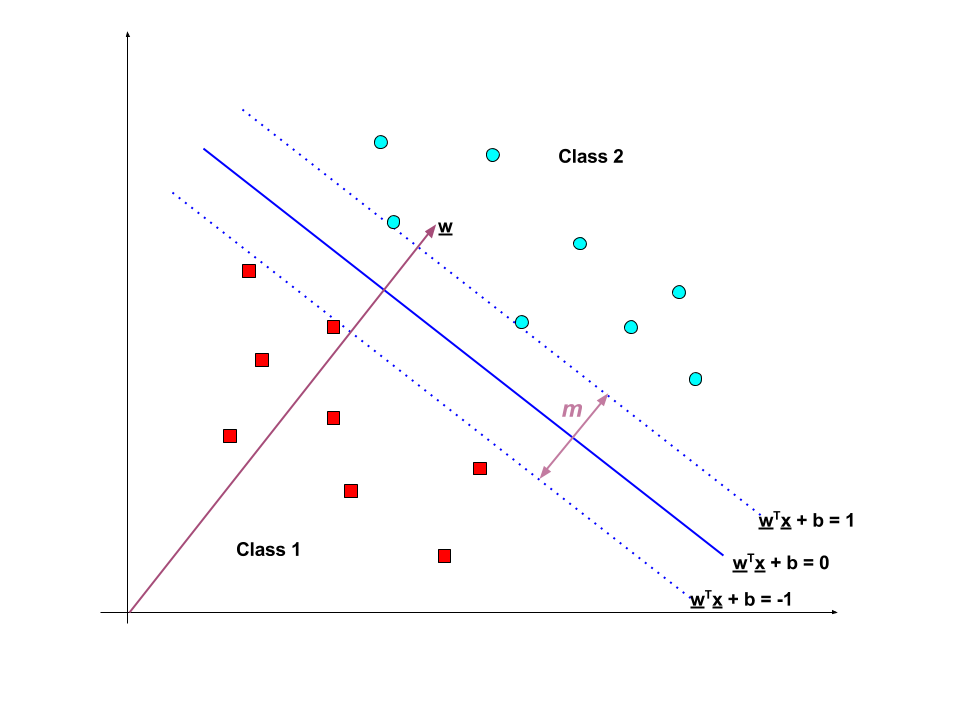

```{r options, include=FALSE, purl=FALSE}
source("options.R")
```

```{r first, include=FALSE, purl=TRUE, message=FALSE}
# This code chunk contains R code already described in the previous chapters
# that is required by following examples

## Datasets from packages
# none

## Other datasets used
# none

###################################
## packages needed: e1071, caret ##
###################################
```


# Introduction

Support Vector Machines (SVM) is an approach for classification developed in the computer science
community, which has recently grown in popularity because they have shown to
perform well in many different contexts. We now briefly present the main
ideas without delving too much into the complicated technical details (for a
more complete presentation see for example Hastie, T., Tibshirani, R., and
Friedman, J., The Elements of Statistical Learning, 2nd edition, Springer,
2009).

The main idea of SVM is to enlarge the feature space using quadratic, cubic
or higher-order polynomial functions of the predictors, interaction terms, or
even more complicated functions of the predictors, to accommodate non-linear
boundaries between the classes. The building blocks of SVM are the "inner
products" of the observations (rather than the observations themselves),
which enter in the classifier after they have been transformed through a
kernel. There are many possible choices of kernels, with the most popular
ones being polynomial and radial kernels.


## An Example with Simulated Data

There are many packages in `R` that implement SVM. We focus here on the `svm()`
function in the `e1071` package. Other options are the `kernlab` package and the
`LiblineaR` package, which is useful for very large linear problems. We now
apply SVM to some simulated data to show the ability of SVM to generate non-
linear boundaries:

```{r 02i-svmsd}
set.seed(123)
sim.data <- function(n = 200) {
	if (n < 100) {
		stop("sample size has to be at least 100.")
	}
	n <- ifelse(n %% 4 == 0, n, n - (n %% 4))
	x <- matrix(rnorm(n*2), ncol = 2)
	x[1:(n/2), ] <- x[1:(n/2), ] + 2
	x[(n/2 + 1):(3*n/4), ] <- x[(n/2 + 1):(3*n/4), ] - 2
	y <- c(rep(1, 3*n/4), rep(2, n/4))
	return(data.frame(x1 = x[, 1], x2 = x[, 2], y = as.factor(y)))
}
n <- 200
dat <- sim.data(n)
plot(x2 ~ x1, col = y, data = dat)
```

We then randomly split the data into training and testing groups and fit the
training data using the `svm()` function using a radial kernel with parameter
gamma set to 1:

```{r message=FALSE}
require(e1071)
```

```{r 02i-plotsvmsd, fig.width=plot_with_legend_fig_width_short}
train <- sample(n, 100)
svm.fit <- svm(y ~ ., data = dat[train, ], kernel = "radial", gamma = 1,
			   cost = 1)
plot(svm.fit, dat[train, ],svSymbol = "x", dataSymbol = "o")
```

The figure shows that there are some training errors in this SVM fit. By
increasing the value of the cost, we can reduce the number of training
errors at the cost of more irregular boundaries:

```{r 02i-plot2svmsd, fig.width=plot_with_legend_fig_width_short}
svm.fit <- svm(y ~., data = dat[train, ], kernel = "radial", gamma = 1,
			   cost = 1e5)
plot(svm.fit, dat[train, ],svSymbol = "x", dataSymbol = "o")
```

It is possible to perform cross-validation using the `tune()` function to
select the best choice of gamma and cost for an SVM with a radial kernel:

```{r 02i-svmcvsd}
set.seed(123)
tune.out <- tune(svm, y~ ., data = dat[train, ], kernel = "radial",
				 ranges = list(cost = c(0.1, 1, 10, 100, 1000),
				 gamma = c(0.5, 1, 2, 3, 4)))
summary(tune.out)
```

The best choice of parameters involves `cost = 10` and `gamma = 3`. 

```{r 02i-svmplot3sd, fig.width=plot_with_legend_fig_width_short}
svm.fit <- svm(y ~., data = dat[train, ], kernel = "radial", gamma = 3,
    	   cost = 10)
plot(svm.fit, dat[train, ],svSymbol = "x", dataSymbol = "o")
```

We can get the test set predictions for this model through the `prediction()` function:

```{r require_caret, message=FALSE}
require(caret) # loaded to use confusionMatrix()
```

```{r 02i-svmcmsd}
svm.pred <- predict(tune.out$best.model, newx = dat[-train, ])
confusionMatrix(data = svm.pred, reference = dat[-train, "y"], positive = "1")
```

36% of test observations are misclassified by this SVM.

## Some theory about SVM
The following plot shows an example of SVM with two perfect separable classes in $\mathbb{R}^2$.



When the classes are perfectly separated (__hard margin__), then SVM searches for the
"line" that maximally separates the data points of the two classes.  
SVM then maximizes the margin $m$.  
Since the distance between the origin and the line $w^Tx = k$ is $\frac{k}{\left \| w \right \|}$, the size of $m$ margin is $m=\frac{2}{\left \| w \right \|}$.

Let $\{ x_1 , \dots , x_n \}$ be our data set and let $y_i \in \{1,-1\}$ be
the class label of $x_i$ (where $x_i$ are points in $\mathbb{R}^p$):

* The decision boundary should classify all points correctly  
  $y_i \left(w^Tx_i + b \right) \ge 1 ,     \forall i \in 1, \dots, n$
  
* Thus the decision boundary can be found by solving the  
  following constrained optimization problem (Lagrnge multipliers):  
  $\min \left\{ \|w\| \right \}  \text{ s.t. } y_i \left(w^Tx_i + b \right) \ge 1 \forall i \in 1, \dots, n$

When the classes are not perfectly separated (__soft margin__), then SVM is extendend
by introducing the _hinge loss_ function.:

$max\left\{ 0, 1- y_i \left(w^Tx_i + b \right) \right\}$

This function is zero if $x_i$ lies on the correct side of the margin. For data on the
wrong side of the margin, the function's value is proportional to the distance from the
margin. We then wish to obtain:

$\min \left\{\left[\frac 1 n \sum_{i=1}^n \max\left(0, 1 - y_i(w \cdot x_i - b)\right) \right] + \lambda\| w \|^2 \right\}$

where the parameter $\lambda$ determines the tradeoff between increasing the margin-size
and ensuring that the $x_i$ lie on the correct side of the margin. Thus, for sufficiently
small values of $\lambda$, the soft-margin SVM will behave identically to the hard-margin
SVM if the input data are linearly classifiable, but will still learn a viable
classification rule if not.

<!---
# Exerccises?
--->