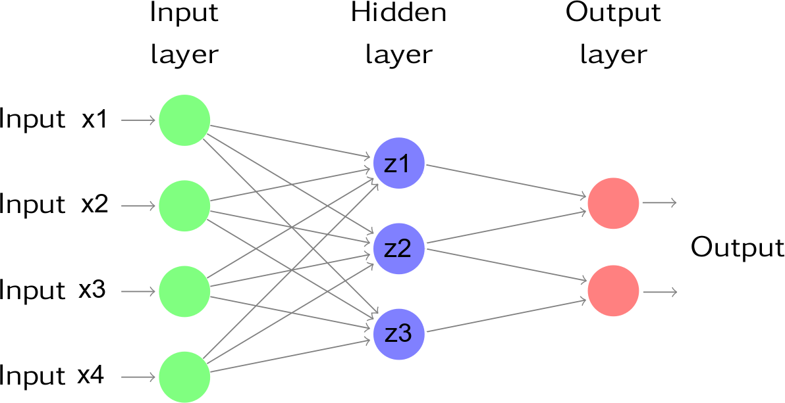

## Introduction
Statistical literature on prediction/modeling techniques is growing very quickly. New techniques applied to data-mining and to business intelligence projects appear every day, and new developments allow the researcher to obtain even more precise predictions.  
In this chapter we want to introduce very briefly the basis of Neural Network analysis for classification problems.


## Example: Titanic data

This example uses the true data from surviving to Titanic wreck.  
The aim of study is to find a prediction model to assess the probability of death for each passenger based on its `Age`, `Gender`, and `Class` of accomodation.

Here we show some summaries on dataset:

```r
head(titanic)
```

```
##   Class Gender Age   Status
## 1 Coach Female  20 Survived
## 2 Coach Female  21 Survived
## 3 Coach Female  26 Survived
## 4 Coach Female  26     Died
## 5 Coach Female  36 Survived
## 6 Coach Female  41 Survived
```

```r
summary(titanic)
```

```
##    Class         Gender          Age             Status    
##  Coach:1876   Female: 470   Min.   : 1.00   Died    :1490  
##  First: 325   Male  :1731   1st Qu.:31.00   Survived: 711  
##                             Median :48.00                  
##                             Mean   :47.12                  
##                             3rd Qu.:64.00                  
##                             Max.   :80.00
```
And here we load the library used for analysis

```r
require(nnet)
```

```
## Loading required package: nnet
```

Some tables could help in describing the relations between die probability and explicative variables

```r
(tb1 <- table(titanic$Status,titanic$Class))
```

```
##           
##            Coach First
##   Died      1368   122
##   Survived   508   203
```

```r
round(prop.table(tb1,margin=2)*100,2)
```

```
##           
##            Coach First
##   Died     72.92 37.54
##   Survived 27.08 62.46
```

```r
(tb2 <- table(titanic$Status,titanic$Gender))
```

```
##           
##            Female Male
##   Died        126 1364
##   Survived    344  367
```

```r
round(prop.table(tb2,margin=2)*100,2)
```

```
##           
##            Female  Male
##   Died      26.81 78.80
##   Survived  73.19 21.20
```

```r
(tb3 <- table(titanic$Status,titanic$Class,titanic$Gender))
```

```
## , ,  = Female
## 
##           
##            Coach First
##   Died       122     4
##   Survived   203   141
## 
## , ,  = Male
## 
##           
##            Coach First
##   Died      1246   118
##   Survived   305    62
```

```r
round(prop.table(tb3,margin=c(2,3))*100,2)
```

```
## , ,  = Female
## 
##           
##            Coach First
##   Died     37.54  2.76
##   Survived 62.46 97.24
## 
## , ,  = Male
## 
##           
##            Coach First
##   Died     80.34 65.56
##   Survived 19.66 34.44
```

The above tables show counts and percentages of died and survived for each combination of Sex and Class factors. Some relations clearly appear, but their general interpretation is not really simple. One can think that the relation between independent variables and dependent variable is complex and, maybe, non linear.

The following graph shows if some relations exist between `Status` and `Age`:

```r
require(ggplot2)
```

```
## Loading required package: ggplot2
```

```r
ggp <- ggplot(data=titanic, mapping = aes(y=Age, x=Status)) +
  geom_boxplot() +
  ggtitle("Boxplot of Age Vs. Status")
print(ggp)
```


Apparently, a slightly lower age is in survived passengers.

Now we can try a model to predict the probability of death Vs. the independent variables.  
The R `nnet` library gives a `nnet()` function to fit a single-hidden-layer neural network to data. `nnet()` produces in output an object of class `nnet.formula` and `nnet`.

The syntax used to build a `nnet` object is very similar to the one used for (generalized) linear models:

```r
set.seed(100)
nn0 <- nnet(Status ~ Class+Gender+Age,data=titanic,size=3)
```

```
## # weights:  16
## initial  value 1500.344084 
## iter  10 value 1371.984175
## iter  20 value 1203.212858
## iter  30 value 1146.752674
## iter  40 value 1118.436406
## final  value 1117.513762 
## converged
```
The `size` parameter of above `nnet()` call specifies the number of units (neurons) in hidden layer. 

The next table shows the confusion matrix for fitted model

```r
titanic$pred <- as.vector(predict(nn0, type="raw"))

titanic$pred_class <- factor(ifelse(titanic$pred < 0.5, "Died", "Survived"))

require(caret)
```

```
## Loading required package: caret
```

```
## Loading required package: lattice
```

```r
confusionMatrix(titanic$pred_class, reference = titanic$Status)
```

```
## Confusion Matrix and Statistics
## 
##           Reference
## Prediction Died Survived
##   Died     1364      367
##   Survived  126      344
##                                          
##                Accuracy : 0.776          
##                  95% CI : (0.758, 0.7933)
##     No Information Rate : 0.677          
##     P-Value [Acc > NIR] : < 2.2e-16      
##                                          
##                   Kappa : 0.4381         
##  Mcnemar's Test P-Value : < 2.2e-16      
##                                          
##             Sensitivity : 0.9154         
##             Specificity : 0.4838         
##          Pos Pred Value : 0.7880         
##          Neg Pred Value : 0.7319         
##              Prevalence : 0.6770         
##          Detection Rate : 0.6197         
##    Detection Prevalence : 0.7865         
##       Balanced Accuracy : 0.6996         
##                                          
##        'Positive' Class : Died           
## 
```

If we want to get a prediction of probability of death for several levels of independet variables, we can calculate a table of independent variable values and then predict the probabilities.  
In following example, the mean values of probability for each combination of `Class` and `Gender` factors, and the mean age for each combination of factor levels is produced:

```r
require(dplyr)
```

```
## Loading required package: dplyr
```

```
## 
## Attaching package: 'dplyr'
```

```
## The following objects are masked from 'package:stats':
## 
##     filter, lag
```

```
## The following objects are masked from 'package:base':
## 
##     intersect, setdiff, setequal, union
```

```r
ds_pred <- titanic %>%
  group_by(Class, Gender) %>%
  summarise(Age = mean(Age, na.rm=TRUE))

ds_pred$prob <- predict(nn0, newdata = ds_pred, type="raw")

ds_pred
```

```
## # A tibble: 4 x 4
## # Groups:   Class [?]
##    Class Gender      Age      prob
##   <fctr> <fctr>    <dbl>     <dbl>
## 1  Coach Female 43.80000 0.6259983
## 2  Coach   Male 47.46357 0.1959980
## 3  First Female 50.21379 0.9755196
## 4  First   Male 47.72222 0.3425818
```

## Some theory about Neural networks
Neural networks can be considered a type of nonlinear regression that takes a set of 
inputs (explanatory variables), transforms and weights these within a set of hidden units
and hidden layers to produce a set of outputs or predictions (that are also transformed).

Next figure is an example of a feed forward neural network consisting of four inputs, a
hidden layer that contains three units and an output layer that contains two outputs.



The outputs of nodes in one layer are inputs to the next layer. The inputs to each node are combined using a weighted linear combination. The result is then usually modified by a nonlinear function before being output. For example, the inputs into hidden neuron $j$ in above figure are combined to give

$z_j=b_j+\sum_{i=1}^4 w_{i,j} x_i$.

In the hidden layer, this is then modified using a nonlinear function such as a sigmoid,

$\phi(z)=\dfrac{1}{1+e^{-z}}$,

to give the input for the next layer. This allows the formula to reduce the effect of extreme input values, thus making the network more robust to outliers.

The parameters $b_1$,$b_2$,$b_3$ and $w_{1,1}, \cdots ,w_{4,3}$ are "learned" from the data. 

The weights usually take random values to begin with, and are then updated using the observed data. Consequently, there is an element of randomness in the predictions produced by a neural network. Therefore, the network is usually trained several times using different random starting points, and the results are averaged.

The number of hidden layers, and the number of nodes in each hidden layer, must be specified in advance. 


