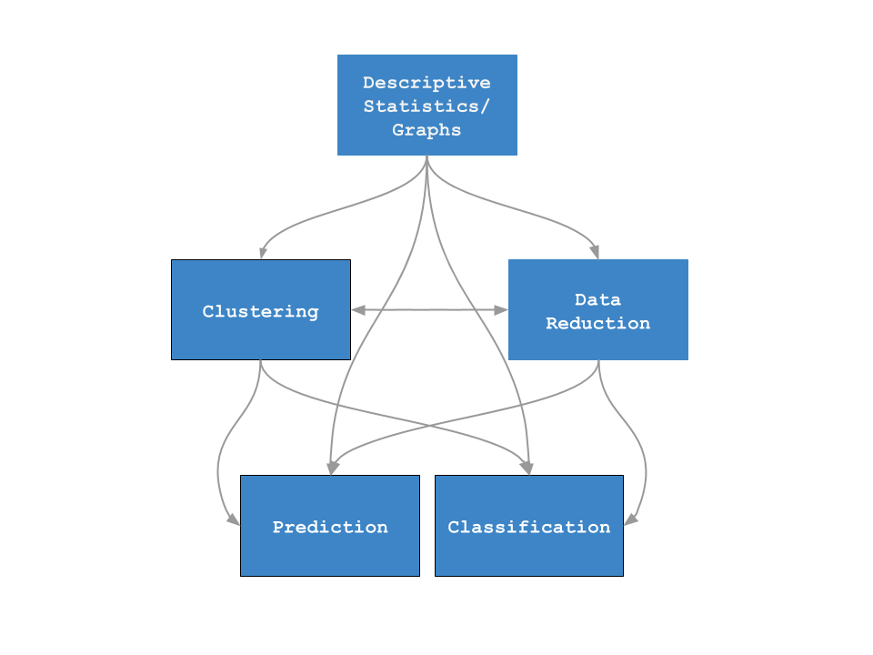

 

## Syllabus:

1. Basic data mining techniques

2. Dimensionality reduction

    - Multidimensional Scaling (MDS)
    - Principal Components Analysis (PCA) and Explorative Factor Analysis (EFA)
    - Outlines on Correspondence Analysis (CA)

3. Clustering

    - Hierarchical (Agglomerative) Clustering (HC)
    - Non-Hierarchical Clustering (K-Means) (NHC)
    - Outlines on Gaussian Mixture Models (GMM)
  
4. Classification

    - Recalls about Logistic regression
    - Linear and Quadratic Discriminant Analyses (LDA and QDA)
    - K-Nearest Neighbors (KNN)
    - Classification Trees (CTREE)
    - Support Vector Machines (SVM)
    - Introduction to Random Forests (RF)
    - Introduction to Neural Networks (NN)
  
5. Prediction

    - Linear Model Variations (LM)
    - Regression Trees (RTREE)
    - An Introduction to Bootstrap Techniques
    - Introduction to Random Forests (RF)
