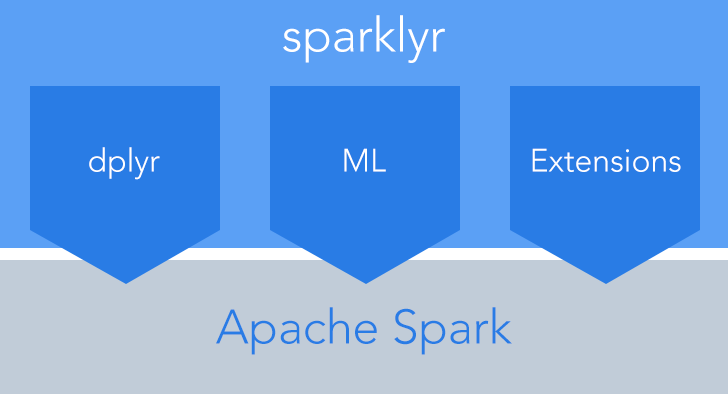

# What is Big Data?

Big data are a quantity of data not processable by a single normal computer. The typical scale of big data is Terabytes or petabytes of data. 

The price of a single super computer scales exponentially to its performance. This means that is preferable scale horizontally, using more server as a distributed architecture. In this way, the price will scale more or less lineary with the performance, but there are differencies in the computational model.  

<!-- ## ODG -->

# Distributed Architecture

## Kinds of computations

Different types of architectures requires different computation paradigms. Clusers use distributed computing to perform their calculation. 

1. In single thread computation one process performs the code istructions each at a time on a sole processor, if more processors are available their will not be used. It is the case of base R.
2. (In pitctures: (c)) In parallel computing, all processors have random access to a shared memory.
3. (In pitctures: (a)(b)) In distributed computing, each processor has its own private memory. 


# Apache Hadoop

Hadoop is a software framework for distributed processing of large datesets across large clusters of computers.

- Large datasets -> Terabytes or petabytes of data
- Large clusters -> hundreds or thousands of nodes

Hadoop is an open-source implementation for Google MapReduce and it is based on a simple programming model called MapReduce.

Hadoop Goals:

- Store big data
- Parallelize the computation in order to process big data
- Avoid the lose of data

Hadoop features:

- Scalability: it is the capability of handling a growing amount of work. This means increasing the numerosity of the cluster running the same code.
- Flexibility: hadoop can ingest, store and manipulate any kind of data of any size.
- Efficient and simple fault tolerant mechanism.
- Inexpensive hardware: no supercomputer are used, each node is a top of the line of commercial computers. 

Cluster architecture:


What is the cluster abstraction to the end user?

1. One single unit: the cluster is presented as a single unit and the distribution and parallelization of tasks is performed automatically.

2. Fault tolerance and automatic recovery: Hadoop takes care of task and node failiures automatically. Failure is considered the norm rather than exeption.

3. Simple Programming interface (API): using MapReduce Paradigm. For each step the programmer has to provide a map and a reduce function to operate on data.

## Layers

Hadoop is composed by 2 layers:

1. HDFS: Hadoop distributed File System

2. Yarn: Yet Another Resource Negotiator

## HDFS

Hadoop Distributed File System is a distributed file storage capable to store petabytes of data on thousands of nodes. It manages backup and recovery automatically in order to face the permanent and the temporary failures of some nodes. 

Features:

1. One single folder: each file is splitted in blocks which are distributed across the cluster. The end user sees only one filesystem with all files inside.

2. Replication: each file block is replicated many times on different nodes.

3. Data is accessed with the "hdfs" protocol from any application: "hdfs://folder/file.csv"


Each file is splitted in blocks, here represented by numbers. Each block is usually around 100 Mb of size. Each block is replicated three times, by default, and on different nodes: this prevents the data loss in case of failure and makes that portion of data available on different nodes for different computations.


## Architecture:

Also the HDFS layer follows the one master with serveral slaves model. Here the master is the Datanode and slaves are the namenodes.

- Datanode: it stores a portion of the Hadoop File System data.
- Namenode: it is the centerpiece of an HDFS file system. It keeps track of the directory tree of all files and tracks where across the cluster each file block is kept.
- Secondary namenode: it is the namenode recovery.

The Datanode is a single server. This fact makes it a single point of failure: if it goes down the entire cluster is compromised. In order to avoid this, the Secondary Namenode constantly backups the Namenode data, and ,in case of failure, it becames the working Namenode.


## MapReduce Paradigm

Map Reduce is a programming model that allows any kind of data processing on a distributed architecture. It is composed by three main steps:

1. map step: mapping means apply the same function to a list of objects. This is a fully parallelizable operation. The end-user have to provide a function to process the data. This computation is performed on each single slave involved.


2. shuffle step: it happends at the end of the "map step" when the algorithm requires that the data is exchanged by nodes. It is a network operation, which is automatically done, no end user programming is required.

3. reduce step: reducing takes as input a list and output a different kind of object. 


Here an example of a Map Reduce implementation of a Word Count algorithm:


Here a join implementation:


# Apache Spark

## Why Spark?

Apache Spark is an open-source cluster-computing framework. 

Advantages over hadoop:

1. Speed: 10~100 times faster than Hadoop thanks to the In-memory computation.
2. better API (Application Programming interface) abstraction which results a shorter and clearer code for the same operations.
3. Combine SQL, streaming, machine-learning and Graph libraries.


## In-memory computation

Hadoop Map Reduce in order to guarantee its recovery capabilities writes everything on disk (input and output on each worker). So when the computation is performed locally (mapping and reducing operations) the bottleneck of the performance is on the speed of the Hard drive. On the contrary in the shuffling operation the bottleneck is the speed of the network.

On the other hand, Spark perform the shuffling over the network, but the map and reducing operations are performed in RAM. 

Before trying to understand why Spark is quicker than Hadoop Map Reduce, here are some read timing about different kind of memories:

Cache Latency:

https://gist.github.com/jboner/2841832

<!-- Se questo non si visualizza bene usiamo una tabella markdown o del testo semplice in un blocco di codice -->

Latency Comparison Numbers

L1 cache reference                           0.5 ns
Branch mispredict                            5   ns
L2 cache reference                           7   ns                      14x L1 cache
Mutex lock/unlock                           25   ns
Main memory reference                      100   ns                      20x L2 cache, 200x L1 cache
Compress 1K bytes with Zippy             3,000   ns        3 us
Send 1K bytes over 1 Gbps network       10,000   ns       10 us
Read 4K randomly from SSD*             150,000   ns      150 us          ~1GB/sec SSD
Read 1 MB sequentially from memory     250,000   ns      250 us
Round trip within same datacenter      500,000   ns      500 us
Read 1 MB sequentially from SSD*     1,000,000   ns    1,000 us    1 ms  ~1GB/sec SSD, 4X memory
Disk seek                           10,000,000   ns   10,000 us   10 ms  20x datacenter roundtrip
Read 1 MB sequentially from disk    20,000,000   ns   20,000 us   20 ms  80x memory, 20X SSD
Send packet CA->Netherlands->CA    150,000,000   ns  150,000 us  150 ms

Notes

1 ns = 10^-9 seconds
1 us = 10^-6 seconds = 1,000 ns
1 ms = 10^-3 seconds = 1,000 us = 1,000,000 ns

Credit

By Jeff Dean:               http://research.google.com/people/jeff/
Originally by Peter Norvig: http://norvig.com/21-days.html#answers


Observing the order of magnitude it is clear that reading/writing operation are faster on RAM than on disk, which is faster then Network. This way Spark can achive its superiority in performance.

## Distributed computation on top of YARN

YARN is a Cluster manager which allows any software with the right API to access to the distributed computing of Hadoop. By default Apache Hadoop use its own Map Reduce on top of YARN. In this course, Apache Spark will connect to YARN in order to gain the control of the computational resources of the cluster. 


[Glossary:](https://spark.apache.org/docs/latest/cluster-overview.html#glossary)

Driver program

- Cluster manager: An external service for acquiring resources on the cluster (e.g. standalone manager, Mesos, YARN)

- Driver program: The process running the main() function of the application and creating the SparkContext

- Worker node: Any node that can run application code in the cluster

- Executor: A process launched for an application on a worker node, that runs tasks and keeps data in memory or disk storage across them. Each application has its own executors.

- Task: A unit of work that will be sent to one executor


# Sparklyr

## Introduction Sparklyr

Spark is a fast and general engine for large-scale data processing.
`sparklyr` provides an interface between R and Apache Spark. It enables to connect to Spark and:


1. Connect to Spark from R. It creates the SparkContext.
2. Provides a complete dplyr backend: filter and aggregate Spark datasets then bring them into R for analysis and visualization.
3. It allows to use Spark’s distributed machine learning library from R.
4. allows to create extensions that call the full Spark API and provide interfaces to Spark packages (Source: http://spark.rstudio.com/index.html).



For a full documentation on Spark, please visit the spark website http://spark.apache.org/

For further details on `sparklyr` visit the `sparklyr` website http://spark.rstudio.com/index.html


## Getting started with Spark and sparklyr

You can easily install the `sparklyr` package from CRAN:

```{r, eval = FALSE}
install.packages("sparklyr")
```

and then load it at the beginning of your R session:

```{r}
require(sparklyr)
```

You also need to install a version of Spark. You can do this directly from R:

```{r, eval = FALSE}
# this may take a while
spark_install(version = "1.6.2")
```


