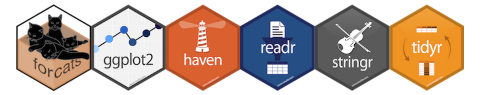

```{r options, include=FALSE, purl=FALSE}
options(width = 108)
```

# Introduction to tidyverse

This chapter of the course provides an overview of data management with R.

Most of the packages used in these sections are part of the so-called "tidyverse". __Packages in the tidyverse are packages that share a common philosophy of data management and that are designed to work well together.__ (source: www.tidyverse.org) 





Please check out the manifesto for further details on the philosophy underlining tidyiverse:  [the tidy tools manifesto](https://cran.r-project.org/web/packages/tidyverse/vignettes/manifesto.html). 

The whole tidyverse can be installed with a single (but long runnning!) line command:

```{r tidyverse, message=FALSE, eval = FALSE}
install.packages("tidyverse")
```

In order to start working with the tidyverse, you need to load it:

```{r}
require(tidyverse)
```

The above command loads the core packages (as listed) that are a set of packages used in basically any analysis. 

`dplyr` is a modern `R` package which provides functions to manage data in a more intuitive and efficient way than base `R`.  
The starting point for more information about `dplyr` is the official website providing documentation: [dplyr: A Grammar of Data Manipulation](https://cran.r-project.org/web/packages/dplyr/index.html).  

`tidyr` is a modern `R` package which provides a standard way to organise data values within a dataset.  
The starting point for more information about `tidyr` is the official website providing documentation: [tidyr: Easily Tidy Data with 'spread()' and 'gather()' Functions](https://cran.r-project.org/web/packages/tidyr/index.html).  

`readr` allows you to import flat data files into R and it is well harmonized with the rest of the tidyverse.  
The starting point for more information about `readr` is the official website providing documentation: [readr: Read tabular data](https://cran.r-project.org/web/packages/readr/index.html)

`tibble` provides a `tbl_df` class that offers better checking and printing capabilities than traditional data frames.  
The starting point for more information about `tibble` is the official website providing documentation: [tibble: Simple data frames](https://cran.r-project.org/web/packages/tibble/index.html)

In addition to the core packages, `tidyverse` installs other tidyverse packages. For instance, there are packages useful for working with non-numeric variables (such as `stringr` and `forcats`), or for importing data from external sources (such as `haven`). For more details about packages in the tidyverse please check out the following link https://github.com/tidyverse/tidyverse. 

In order to list all packages in tidyverse you can use the following command:


```{r}
tidyverse_packages()
```


If you want to load packages that are not in the tidyverse core, you have to load them explicitely.

Tidyverse as well as the packages that compose it are fairly new, thus we should expect the composition of tidyverse to change as well as the releases of the packages that compose it. You can check that all tidyverse packages are up-to-date with the following line command:

```{r tidyverse_update, eval = FALSE}
tidyverse_update()
```


# Datasets Used in the Examples of This Chapter

The following data sets are used in the examples of this chapter.

## The `bank` Dataset

Most of the examples of this chapter require the dataset `bank` which is included in the `qdata` package.

```{r bank, message=FALSE}
require(qdata)
data(bank)
head(bank)
str(bank)
```

This dataset contains information on phone calls related with direct marketing campaigns of a Portuguese banking institution. The data frame has 20 variables and 45211 observations. The marketing campaigns were based on phone calls. The data are ordered by call id (and also by date, from May 2008 to November 2010). The full dataset was described and analyzed in:

S. Moro, R. Laureano and P. Cortez. Using Data Mining for Bank Direct Marketing: An Application of the CRISP-DM Methodology. In P. Novais et al. (Eds.), Proceedings of the European Simulation and Modelling Conference - ESM'2011, pp. 117-121, Guimarães, Portugal, October, 2011. EUROSIS.


## Other Datasets

Some single sections of this chapter contain examples also refered to other datasets included in the `qdata` package:

* `mtcars`, which was extracted from the analogous data frame of package `datasets`; it contains information on 32 cars:

```{r mtcars, message=FALSE}
data(mtcars)
head(mtcars)
str(mtcars)
```

* `comuni`, `province`, `regioni` and `ripartizioni`, which contain information on the Italian districts (8003 "comuni", 110 "province", 20 "regioni" and 5 "ripartizioni"). They were all obtained as subsets or by summarizing the `italia` data frame:

```{r italia, message=FALSE}
data(italia)
head(italia)
str(italia)
```

* `usopen` and `wimbledon`, which contain information about the gentlemen U.S. Open nd Wimbledon finals from 1968 to 2015:

```{r tennis, message=FALSE}
data(usopen)
head(usopen)
str(usopen)
data(wimbledon)
head(wimbledon)
str(wimbledon)
```

For a complete description of these datasets please refer to the help:

```{r help, eval=FALSE}
?bank
?people
?mtcars
?italia
?comuni
?province
?regioni
?ripartizioni
?usopen
?wimbledon
```
