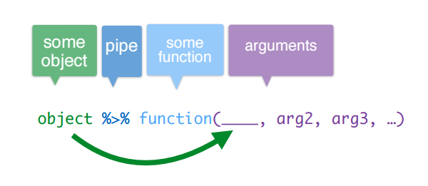

```{r options, include=FALSE, purl=FALSE}
options(width = 108)
```


This chapter provides an overview of data management in the `tidyverse` through the `dplyr` package, which is part of the `tidyverse` core.

The `dplyr` package for `R` is very powerful for data management since:

* it simplifies how you can think about common data manipulation tasks;
* it provides simple "verbs", functions that correspond to the most common data manipulation tasks;
* it uses efficient data storage backends, so you spend less time waiting for the computer.

```{r message=FALSE}
require(tidyverse)
```

In the following chapters, we will explore the innovations introduced in the tidyverse to make our lifes easier when dealing with dataframes manipulation tasks.     
In particular:

* pipe operator (`%>%`) 
* `tbl_df` data frame class
* `dplyr` verbs for data manipulation 
* Group data and chain verbs

In the following two paragraphs we will explore the pipe operator (`%>%`) and `tbl_df` data frame class which are uniffying features of the tidyverse.


## Pipe operator  

`dplyr` pipe operator (`%>%`) allows us to pipe the output from one function to the input of another function. The idea of piping is to read the functions from left to right. It is particularly useful with nested functions (reading from the inside to the outside) or with multiple operations.



Pipes can work with nearly any functions (`tidyverse` and not-`tidyverse` functions), let us see an example.

Let us consider `bank` data set, included in `qdata` package, which contains information about a direct marketing campaigns of a Portuguese banking institution based on phone calls. 

```{r bank_tbl_df, message=FALSE}
require(qdata)
data(bank) 
```

Suppose we want to visualize the first rows of `bank` dataframe, by using `head()` function.   

Usually we write:

```{r pipe1}
head(bank)
```

By using `%>%`, the code becomes:

```{r pipe2}
bank %>% head()
```

Pipe takes the argument on the left (`bank`) and passes it to the function on the right (`head()`). So you don't need to write the first argument of the function. 

Other arguments of the function must be added to the function itself, as usually done. By default `head()` prints the first 6 rows of the dataframe. Suppose we want to print 10 rows, by setting `n` argument to 10:

```{r pipe3}
bank %>% head(n=10)
```


Instead of the traditional R's data frames, throughout this course you will work mainly with "tibbles". "Tibbles" are similar to data frames but offer better checking and printing capabilities than traditional data frames. Almost all of the functions that you will use in this course produce, and take as input, tibbles. In fact tibbles are one of the unifying features of the tidyverse. 

In this chapter you will work with the `tibble` package which provides functions for tibbles coercion and creation.

You can load `tibble` by loading `tidyverse`:

```{r}
require(tidyverse)
```

or you can load it explicitely, together with `dplyr` that will be used throughout this chapter:

```{r}
require(tibble)
require(dplyr)
```


## `tbl_df`: the `tidyverse` Data Frame Class

`dplyr`, as well as other packages that you will work with in this course, can work with data frames as is but it is worthwhile to convert them to a tibble (`tbl_df`), especially if frames have large dimensions. `tbl_df` is a wrapper around a data frame that, as mentioned, will not accidentally print a lot of data to the screen, indeed tbl objects only print a few rows and all the columns that fit in one screen, describing the rest of it as text.

Almost all of the functions that you will use in this course produce, and take as input, tibbles. In fact tibbles are one of the unifying features of the tidyverse. 


When the class of data object is not tibble, you can convert it to a tibble with the function `as_tibble()`.  
Let us consider `mtcars`, a dataset included in `datasets` package (automatically loaded at the start of an R session): 

```{r data frame, message=FALSE}
# Example of data frame
class(mtcars)

# If we do not convert it as a tbl_df, all mtcars rows and columns will be printed when calling mtcars 
dim(mtcars)
mtcars
```

Now, using the package `tibble`, you can convert mtcars into a `tbl_df` object:

```{r tibble, message=FALSE}
# tibble version of the same data frame 
mtcars_tbl <- as_tibble(mtcars)
mtcars_tbl
```

Alternatively, you may use the function `tbl_df()`  in the package `dplyr`.

```{r tbl_df, message=FALSE}
# tibble version of the data frame mtcars with the function tbl_df()
mtcars_tbl2 <- tbl_df(mtcars)
class(mtcars_tbl)
mtcars_tbl
```

Moreover you may want to create a tibble from individual vectors. This can be easily done with the function `tibble()`.

```{r tibble2, message=FALSE}
# tibble version of the data frame mtcars with the function tbl_df()
tb <- tibble(
  id = 1:5,
  height = c(1.7, 1.65, 1.6, 1.75, 1.73),
  weight = c(80, 46, 52, 82, 75),
  bmi = weight/ (height) ^2
)
tb
```

Notice that it is possibile for a tibble to have column names that are not valid as `R` variables names, for instance they may be numbers or may contain unsual characters such as spaces.

```{r tibble3, message=FALSE}
# tibble version of the data frame mtcars with the function tbl_df()
tb <- tibble(
  ":)" = "happy",
  "1" = "one",
  "/" = "slash",
  " " = "space"
)
tb
```
