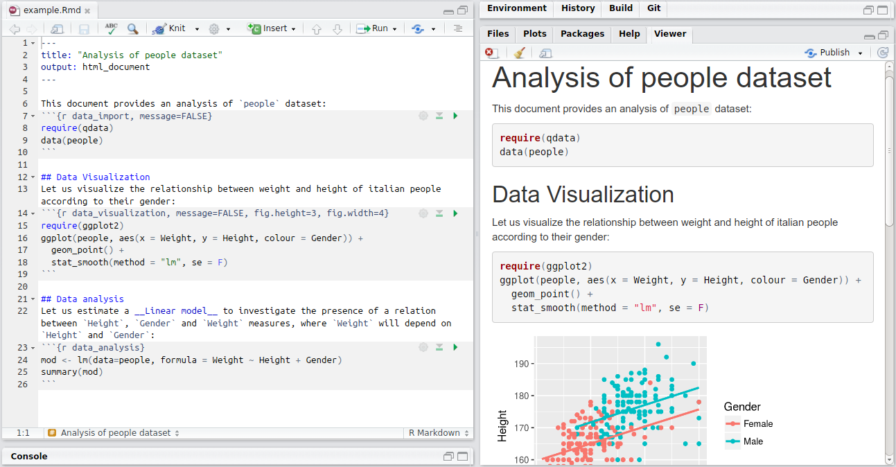

```{r, echo=FALSE, message=FALSE, include=FALSE, purl=FALSE}  
options(width = 108)
show_chunk <- function(x){
  cat(x)
}
require(knitr)
```  


## Introduction

R Markdown provides an authoring framework for data science. R Markdown allows us to turn our analysis into high quality documents, reports, presentations and dashboards. We can use a single R Markdown file to both:

* save and execute code
* generate high quality reports that can be shared with an audience

R Markdown documents are fully reproducible and support multiple programming languages like: R, Python, and SQL. It support also dozens of static and dynamic output formats, including HTML, PDF, MS Word, Beamer, HTML5 slides, Tufte-style handouts, books, dashboards, shiny applications, scientific articles, websites, and more. 

## Installation

You can install the R Markdown package from CRAN as follows:

```{r, eval=FALSE}
install.packages("rmarkdown")
```

## Markdown Basics

This is an R Markdown file, a plain text file that has the extension `.Rmd`:


Notice that the file contains three types of content:

* An (optional) YAML header surrounded by `---`
* R code chunks surrounded by ` ``` `
* text mixed with simple text formatting

Markdown is a simple formatting language designed to make authoring content easy for everyone. Rather than writing complex markup code (e.g. HTML or LaTeX), Markdown enables the use of a syntax much more like plain-text email.

### Basic rules for text 

This section provides quick references to the most commonly used R Markdown syntax.

#### Emphasis

If you want to write words in bold or italic, you have to follow the syntax:

`*italic*`  `**bold**`  
*italic*   **bold**

`_italic_`   `__bold__ `  
_italic_   __bold__ 

You may also add colourful text:

`This is <span style="color:red"> coloured </span>`

This is <span style="color:red"> coloured </span>

However, if you are compiling a pdf, the above sintax will not produce a coloured text. You will need to use a slightly different syntax.

******************
#### Headers

To indicate titles of sections according to their hierarchy:

`# Header 1`       

# Header

`## Header 2`      

## Header

`### Header 3`     

### Header

******************

#### Lists

To create a list of items:

* Unordered List:
  
`* Item 1`  
`* Item 2`  
    `+ Item 2a`  
    `+ Item 2b`    
  
  
* Item 1
* Item 2
    + Item 2a
    + Item 2b  

******************
      
* Ordered List:

`1. Item 1`  
`2. Item 2`  
`3. Item 3`  
    `+ Item 3a`  
    `+ Item 3b`  

1. Item 1
2. Item 2
3. Item 3
    + Item 3a
    + Item 3b   
    
******************

#### Links

To add an http address or a link to a phrase:

`http://example.com`  
http://example.com  

`[linked phrase](http://example.com)`  
[linked phrase](http://example.com)  

******************

#### Images

To add an images on the web or local files in the same directory:

``

``

`[alt text]` specifies the text to be inserted if the image is not displayed.

******************

#### Inline Code

To include code out of the chunk, you have to enclose it in back-ticks:  

We defined the \` add \` function to  compute the sum of two numbers.  

We defined the ` add ` function to  compute the sum of two numbers. 

******************

#### Tables
If you want to create a table, you have to follow the the syntax:

`First Header  | Second Header`    
`------------- | -------------`    
`Content Cell  | Content Cell`    
`Content Cell  | Content Cell`    
    

First Header  | Second Header  
------------- | -------------  
Content Cell  | Content Cell  
Content Cell  | Content Cell

******************

#### Manual Line Breaks

To create a line breaks, you have to end a line with two or more spaces:

Roses are red,  
Violets are blue.


## Rendering Output

To generate a report from the file, run the `render` command:

```{r eval=FALSE}
require(rmarkdown)
render("example.Rmd")
```

Otherwise, use the "Knit" button in the RStudio IDE to render the file and preview the output with a single click or the keyboard shortcut _Ctrl + Shift + K_.



R Markdown generates a new file that contains selected text, code, and results from the .Rmd file. The new file can be a finished web page, PDF, MS Word document, slide show, notebook, handout, book, dashboard, package vignette or other format.


### Rendering tables with `knitr`

The `knitr` package provides a general-purpose tool for dynamic report generation in `R`.

Among its many functions, it can also help you to nicely render outputs. If you wish to show a table you may simply print the table as you commonly do in `R`:

```{r print table}
data(mtcars)
head(mtcars)
```

However, you may want your table to look nicer. The `knitr` package allows you to easily do so with the function `kable`:


```{r kable}
knitr::kable(head(mtcars))
```


### Code chunk options

If you are taking notes or you are writing a manual for other R users, you may sometimes want to show the code along with the output and some other times you may want to show just the output or the code. For example if you are creating a report, you may want to hide the code and only show the output. This can be achieved by modifying the chunk options. Below is a list of useful chunk options:

* _Hide code_: for hiding code, you just need to add to your code chunk ``{r, echo = FALSE}``

* _Hide output_: if you want to show the outuput but not the code, add the option ``{r, echo = FALSE}``

* _Hide messages_: messages, for example packages loading meessages, may be hidden by using the option ``{r, message = FALSE}``

* _Hide warnings_: the printing of warnings can be hidden by using the option ``{r, warning = FALSE}``

* _Hide code and results_: if you want to hide both code and results, you may use ``{r, include = FALSE}``


## Building presentations with R Markdown

To create a slides presentation from R Markdown, either ioslides or pdf slides, you specify the `ioslides_presentation` output format or `beamer_presentation` in the `yaml` of your document. 

You can create sections with the heading tag # followed by the section name. The beginning of a new slide is marked by ## heading tag followed by a title or using `----` without a header. 

Here is a simple slide show:


All chunk options still hold, although for presentations additional more advanced visualisation options may be necessary to make your presentation as appealing as possible. 

### Visual Appearance

There is a number of options that you can modify to custmise your presentation. We will see here just some of them to give you an idea of R Markdown potentials. Please see http://rmarkdown.rstudio.com/ioslides_presentation_format.html and http://rmarkdown.rstudio.com/beamer_presentation_format.html for more details.

#### Transition Speed

For example, you can customize the speed of slide transitions using transition option. This can be for example “slower”, “faster” (than default), or a numeric value with a number of seconds (for instance 2) . For example:

```
---
output:
  ioslides_presentation:
    transition: 2
---
```

#### Build Slides

Slides can also have a .build attribute that indicate that their content should be displayed incrementally. For example:

```
## Getting up {.build}
```

#### Custom CSS
You can add your own CSS to an ioslides presentation using the css option:

---
output:
  ioslides_presentation:
    css: styles.css
---

So for example you may choose you own slide headers style.


#### Code Highlighting

When you choose to build a presentation with RMarkdown, according to the audience you are speaking to, you may want to just show results or to also show the code. For those who want the audience to focus on the code, R Markdown offers an intersting feature. It is possible to select subsets of the code you are for additional emphasis by adding a special “highlight” comment around the code. For exan fact it is possible to highligh part of the code:

```
### <b>
x <- 10
### </b>

y <- x * 2
```

The highlighted lines ( here `x <- 10`) will be displayed with a bold font. When you press the 'h' key, the non highlighted regions will fade away.

# Gererate a report from bigdata

RMarkdown is no more than an RScript. Copy to a rmarkdown buffer and uncomment it to see the resulting html.


```{r}
# ---
# 	title: "Big data report"
# ---
# 	
# 	```{r, echo=FALSE, message=FALSE, include=FALSE, purl=FALSE}  
# options(width = 108)
# show_chunk <- function(x){
# 	cat(x)
# }
# require(knitr)
# ```  
# 
# ```{r init, echo = FALSE}
# 
# # global --------
# library(shiny)
# library(shinydashboard)
# library(sparklyr) 
# library(ggplot2)
# library(dplyr)
# 
# sc <- spark_connect( master = "local", version = "2.0.0" )
# 
# csv_file <- "/data/2008.csv"
# 
# ## read data
# spark_table <- spark_read_csv(
# 	sc = sc,
# 	name = "year2008",
# 	path = csv_file
# )
# 
# ```
# 
# ```{r aggregation}
# ## Collect some data
# delay <-
# 	spark_table %>% 
# 	group_by(TailNum) %>%
# 	summarise(count = n(), dist = mean(Distance), delay = mean(ArrDelay)) %>%
# 	filter(count > 20, dist < 2000, !is.na(delay)) %>%
# 	collect()
# 
# delay
# ```
# 
# ```{r plot}
# ## Plot delays
# ggplot(delay, aes(dist, delay)) +
# 	geom_point(aes(size = count), alpha = 1/2) 
# 
# ```
```

