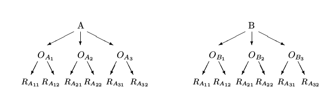

```{r setup, include=FALSE, purl=FALSE}
require(knitr)

opts_chunk$set(list(dev = 'png',fig.cap='',fig.show='hold',dpi=100,fig.width=7, fig.height=7,fig.pos='H!',fig.path="images/app-"))
```


The analysis of variance, as it has been presented up to now, assumes that, during the experiment, each level of each factor crosses with all levels of all other factors.

If the number of times that a level of a factor crosses all levels of all other factors is constant for all the combinations of levels, then the experiment is called *balanced crossed*.

If, instead, the same number is not equal for all the combinations, then the experiment is said *unbalanced crossed*.

Another type of experiment is the one defined as **nested**.

Consider a plant where two different machines, A and B, produces the same type of output.

Since the plant runs 24 hours a day, there are three shifts for each machine. Each shift has its hown operator. 
Then:

In machine A three operators $O_{A1}$, $O_{A2}$ and $O_{A3}$ are working.

In machine B three other operators $O_{B1}$, $O_{B2}$ and $O_{B3}$ are working.

With the aim to compare production levels, two sample surveys for each operator within machine have been measured.

The situation can be summed up by the following diagram:




For the analysis of this type of experiment a nested or hierarchical classification for factors has to be used, commonly known as **nested anova**.

The main interest is usually on the difference between operators inside (nested) the machines (but this is not an "axiom").  
In other words, we want to verify if there exists a statistically significant difference between operators, without the effect of the machine, and also to check if a difference exists between machines.

A case like this corresponds to the statistical model
  $$
  X_{ijk}=\mu+\alpha_k+\beta_{j(k)}+\varepsilon_{i(jk)}
  $$

where:

* $\mu$ is the general mean;
* $\alpha_{k}$ is the effect of $k$-th level of machine factor ($\alpha$);
* $\beta_{j(k)}$ is the effect of $j$-th level of operator factor ($\beta$) nested in the $k$-th level of machine factor ($\alpha$); 
* $\varepsilon_{i(jk)}$ is the $i$-th error nested in the $j$-th level of the operator factor ($\beta$) nested in turn in the $k$-th level of the machine factor ($\alpha$).

Two main concepts are implicit:

* __the choice of an upper level influences its lower levels__;
* __a lower level has meaning only if analyzed within the upper one__.

Even in nested experiments, the effects may be fixed or random (the formulation of the hypotheses is different according as the effects are fixed or random).

As a consequence, also the analysis of variance for nested experiments may be split into:

* NESTED ANOVA I, where all factors are fixed;
* NESTED ANOVA II, where all factors are random;
* NESTED ANOVA III, where some factors are fixed and some are random, in general those which belong to lower levels.

The choice of the type of ANOVA and of the type of hypotheses to be tested depends on the formulation of the problem.

The calculation of $F$ ratios varies in function of the type of the considered NESTED ANOVA.

